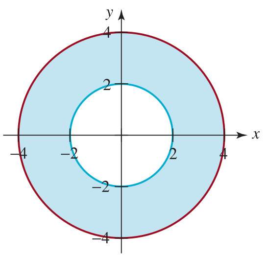
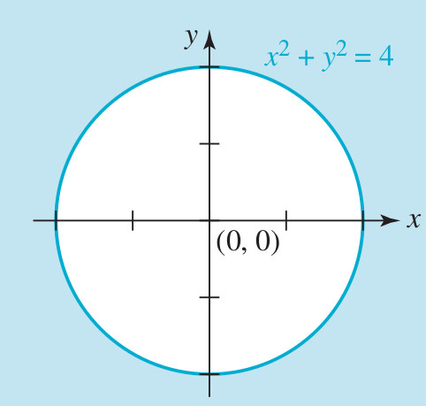
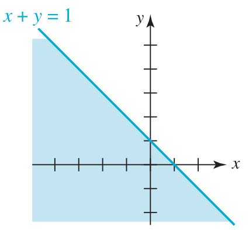
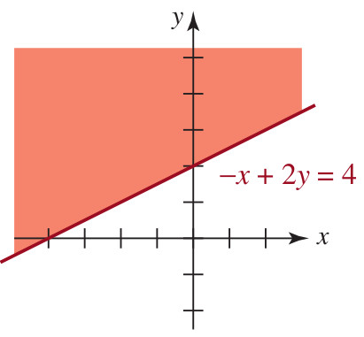
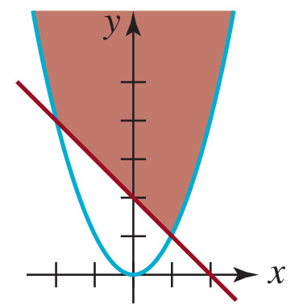
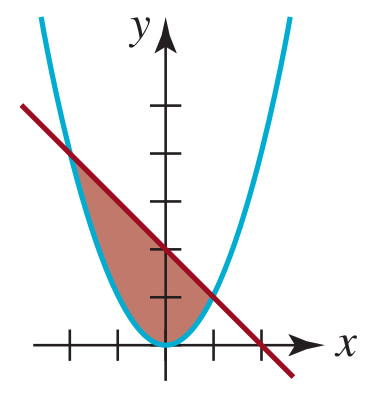

# Evaluación de Desigualdades (Caso 3)

## Introducción

Bienvenido a la **Evaluación de Desigualdades (Caso 3)**. Este examen interactivo consta de **15 preguntas** diseñadas para evaluar tu comprensión sobre problemas aplicados y de contexto real usando desigualdades matemáticas.

> **Instrucciones:**
> * Presta mucha atención al contexto del problema y a las restricciones físicas implícitas (por ejemplo, dimensiones o ganancias que deben ser estrictamente positivas).
> * El **67% de las preguntas (10 preguntas)** te pedirá seleccionar las **afirmaciones verdaderas**.
> * El **33% de las preguntas (5 preguntas)** te pedirá seleccionar **únicamente las afirmaciones falsas**.
> * Al final de la prueba, podrás visualizar un reporte detallado con tus respuestas y una recomendación de estudio personalizada.
> * ¡Mucho éxito!

---

## Bloque 1: Desigualdades del 1 al 8

En esta primera sección resolveremos inecuaciones lineales y cuadráticas aplicadas a escalas de temperatura, coeficientes intelectuales y dimensiones rectangulares básicas.

### Pregunta 1 (Seleccionar Verdaderas)

✓ Seleccionar VERDADERAS

La temperatura en escala Fahrenheit ($F$) y Celsius ($C$) están relacionados por la fórmula $C=\frac{5}{9}(F-32)$. ¿A qué temperatura Fahrenheit corresponde una temperatura en escala centígrada que satisface $40 \le C \le 50$?:

<label><input type="checkbox" name="q17796617296934298" value="1" data-correct="true" > $104 \le F \le 122$</label>

<label><input type="checkbox" name="q17796617296934298" value="2" data-correct="true" > La temperatura Fahrenheit correspondiente está entre $104^\circ\text{F}$ y $122^\circ\text{F}$, inclusive.</label>

<label><input type="checkbox" name="q17796617296934298" value="3" data-correct="true" > El límite inferior en escala Fahrenheit es $104^\circ\text{F}$.</label>

<label><input type="checkbox" name="q17796617296934298" value="4" data-correct="false" > $40 \le F \le 50$</label>

<label><input type="checkbox" name="q17796617296934298" value="5" data-correct="false" > $72 \le F \le 90$</label>

<label><input type="checkbox" name="q17796617296934298" value="6" data-correct="false" > La temperatura Fahrenheit correspondiente está estrictamente fuera del rango $[104, 122]$.</label>

<button type="button" class="learnr-submit-btn" onclick="checkLearnrQuestion('q17796617296934298')">Enviar Respuesta</button>

¡Excelente! Has resuelto la inecuación de conversión de temperatura correctamente.

Incorrecto. Repasa la resolución de la inecuación lineal doble multiplicando por $9/5$ y sumando $32$.

Intentar de nuevo

true

### Pregunta 2 (Seleccionar Falsas)

✗ Seleccionar FALSAS

En general, se considera que una persona tiene fiebre si tiene una temperatura oral mayor que $98.6^\circ\text{F}$. ¿Qué temperatura en la escala Celsius indica fiebre? [Pista: recuerde que $T_{F}=\frac{9}{5}T_{c}+32$, donde $T_{C}$ es grados Celsius y $T_{F}$ es grados Fahrenheit]. Identifica únicamente cuáles de las siguientes afirmaciones son **falsas**:

<label><input type="checkbox" name="q17796617297054294" value="1" data-correct="true" > $T_C \le 37^\circ\text{C}$</label>

<label><input type="checkbox" name="q17796617297054294" value="2" data-correct="true" > Cualquier temperatura Celsius estrictamente menor o igual a $37^\circ\text{C}$ indica que la persona tiene fiebre.</label>

<label><input type="checkbox" name="q17796617297054294" value="3" data-correct="true" > $T_C > 98.6^\circ\text{C}$</label>

<label><input type="checkbox" name="q17796617297054294" value="4" data-correct="false" > $T_C > 37^\circ\text{C}$</label>

<label><input type="checkbox" name="q17796617297054294" value="5" data-correct="false" > Una temperatura oral en escala Celsius de $38^\circ\text{C}$ indica fiebre.</label>

<label><input type="checkbox" name="q17796617297054294" value="6" data-correct="false" > El límite inferior a partir del cual se considera fiebre es $37^\circ\text{C}$.</label>

<button type="button" class="learnr-submit-btn" onclick="checkLearnrQuestion('q17796617297054294')">Enviar Respuesta</button>

¡Excelente! Has identificado todas las afirmaciones incorrectas.

Incorrecto. Debes marcar únicamente las afirmaciones falsas sobre la conversión del umbral de fiebre.

Intentar de nuevo

true

### Pregunta 3 (Seleccionar Verdaderas)

✓ Seleccionar VERDADERAS

Para determinar el coeficiente intelectual ($I$) de una persona se usa la fórmula: $I=\frac{100M}{C}$, donde $I$ es el coeficiente intelectual, $M$ es la edad mental (determinada mediante un test) y $C$ es la edad cronológica. Si la variación de $I$ de un grupo de niños de $11$ años está dada por $80 \le I \le 140$, encuentre el intervalo de edad mental de este grupo. Identifica cuáles de las siguientes afirmaciones son **verdaderas**:

<label><input type="checkbox" name="q17796617297132979" value="1" data-correct="true" > $8.8 \le M \le 15.4$</label>

<label><input type="checkbox" name="q17796617297132979" value="2" data-correct="true" > El intervalo de edad mental para este grupo de niños es de $[8.8, 15.4]$ años.</label>

<label><input type="checkbox" name="q17796617297132979" value="3" data-correct="true" > La edad mental mínima en el grupo es de $8.8$ años y la máxima es de $15.4$ años.</label>

<label><input type="checkbox" name="q17796617297132979" value="4" data-correct="false" > $80 \le M \le 140$</label>

<label><input type="checkbox" name="q17796617297132979" value="5" data-correct="false" > $8.8 < M < 15.4$</label>

<label><input type="checkbox" name="q17796617297132979" value="6" data-correct="false" > La edad mental de un niño del grupo puede ser de $16$ años.</label>

<button type="button" class="learnr-submit-btn" onclick="checkLearnrQuestion('q17796617297132979')">Enviar Respuesta</button>

¡Excelente! Has hallado el intervalo correcto de la edad mental.

Incorrecto. Sustituye $C = 11$ en la fórmula y despeja la edad mental $M$ en la desigualdad.

Intentar de nuevo

true

### Pregunta 4 (Seleccionar Falsas)

✗ Seleccionar FALSAS

La necesidad diaria de agua calculada para cierta ciudad está dada por $|c-3725|<100$ donde $c$ es el número de galones de agua utilizados por día. Determinar la mayor y menor necesidad diaria de agua. Identifica únicamente cuáles de las siguientes afirmaciones son **falsas**:

<label><input type="checkbox" name="q17796617297234607" value="1" data-correct="true" > La menor necesidad diaria de agua es exactamente de $3725$ galones.</label>

<label><input type="checkbox" name="q17796617297234607" value="2" data-correct="true" > El rango de consumo diario está dado por la desigualdad débil $3625 \le c \le 3825$.</label>

<label><input type="checkbox" name="q17796617297234607" value="3" data-correct="true" > La mayor necesidad diaria de agua puede alcanzar los $3900$ galones.</label>

<label><input type="checkbox" name="q17796617297234607" value="4" data-correct="false" > El consumo de agua por día satisface la desigualdad $3625 < c < 3825$.</label>

<label><input type="checkbox" name="q17796617297234607" value="5" data-correct="false" > La menor necesidad diaria estimada es de $3625$ galones y la mayor es de $3825$ galones.</label>

<label><input type="checkbox" name="q17796617297234607" value="6" data-correct="false" > El intervalo de consumo diario es abierto y se representa como $(3625, 3825)$.</label>

<button type="button" class="learnr-submit-btn" onclick="checkLearnrQuestion('q17796617297234607')">Enviar Respuesta</button>

¡Excelente! Has identificado correctamente los enunciados falsos.

Incorrecto. Resuelve el valor absoluto $|c-3725|&lt;100$ para identificar las afirmaciones falsas.

Intentar de nuevo

true

### Pregunta 5 (Seleccionar Verdaderas)

✓ Seleccionar VERDADERAS

Los lados de un cuadrado se extienden para formar un rectángulo: un lado se alarga $2\text{ cm}$ y el otro $6\text{ cm}$. El área del rectángulo resultante debe ser menor que $130\text{ cm}^2$. ¿Cuáles son las posibles longitudes del lado del cuadrado original? Identifica cuáles de las siguientes afirmaciones son **verdaderas**:

<label><input type="checkbox" name="q17796617297331986" value="1" data-correct="true" > $0 < x < \sqrt{134} - 4$</label>

<label><input type="checkbox" name="q17796617297331986" value="2" data-correct="true" > El lado del cuadrado original debe ser estrictamente menor que aproximadamente $7.58\text{ cm}$ y estrictamente mayor que $0\text{ cm}$.</label>

<label><input type="checkbox" name="q17796617297331986" value="3" data-correct="true" > La desigualdad cuadrática planteada para $x > 0$ es $x^2 + 8x - 118 < 0$.</label>

<label><input type="checkbox" name="q17796617297331986" value="4" data-correct="false" > $x < 7.58$ (omitiendo la restricción física de que la longitud de un lado debe ser estrictamente mayor a 0)</label>

<label><input type="checkbox" name="q17796617297331986" value="5" data-correct="false" > $x > 7.58$</label>

<label><input type="checkbox" name="q17796617297331986" value="6" data-correct="false" > El conjunto de soluciones válidas incluye al valor $x = 8\text{ cm}$.</label>

<button type="button" class="learnr-submit-btn" onclick="checkLearnrQuestion('q17796617297331986')">Enviar Respuesta</button>

¡Excelente! Has resuelto el problema del área del rectángulo considerando las restricciones físicas.

Incorrecto. Recuerda que los lados del cuadrado original $x$ deben ser estrictamente positivos ($x &gt; 0$). Plantea $(x+2)(x+6) &lt; 130$ y resuelve.

Intentar de nuevo

true

### Pregunta 6 (Seleccionar Verdaderas)

✓ Seleccionar VERDADERAS

Si $x \ge 2$, entonces $x^2 \ge 4$. ¿Es esta implicación VERDADERA? Identifica cuáles de las siguientes justificaciones son **verdaderas**:

<label><input type="checkbox" name="q17796617297433762" value="1" data-correct="true" > La proposición es **VERDADERA**.</label>

<label><input type="checkbox" name="q17796617297433762" value="2" data-correct="true" > Dado que $x \ge 2$, tanto la variable como el extremo son números no negativos, por lo que elevar al cuadrado conserva el sentido de la desigualdad.</label>

<label><input type="checkbox" name="q17796617297433762" value="3" data-correct="true" > En el intervalo $[2, \infty)$, la función cuadrática $f(x) = x^2$ es estrictamente creciente, lo que garantiza que si $a \ge b \ge 2$ entonces $a^2 \ge b^2$.</label>

<label><input type="checkbox" name="q17796617297433762" value="4" data-correct="false" > La proposición es **FALSA**.</label>

<label><input type="checkbox" name="q17796617297433762" value="5" data-correct="false" > Es falsa porque si tomamos $x = -3$, entonces $x^2 = 9 \ge 4$, lo cual invalida la afirmación.</label>

<label><input type="checkbox" name="q17796617297433762" value="6" data-correct="false" > La proposición solo se cumple si $x$ es un número entero.</label>

<button type="button" class="learnr-submit-btn" onclick="checkLearnrQuestion('q17796617297433762')">Enviar Respuesta</button>

¡Excelente! Has comprendido por qué la implicación es verdadera en este dominio.

Incorrecto. Repasa la lógica de las implicaciones y el comportamiento creciente de la función cuadrática en números positivos.

Intentar de nuevo

true

### Pregunta 7 (Seleccionar Falsas)

✗ Seleccionar FALSAS

¿En qué rango de valores cae la ganancia $P > 0$, si $(2P - 100)^2 < 250000$? Identifica únicamente cuáles de las siguientes afirmaciones son **falsas**:

<label><input type="checkbox" name="q17796617297525900" value="1" data-correct="true" > El rango de la ganancia es $-200 < P < 300$ (sin aplicar la restricción $P > 0$).</label>

<label><input type="checkbox" name="q17796617297525900" value="2" data-correct="true" > El límite superior de la ganancia es $600$.</label>

<label><input type="checkbox" name="q17796617297525900" value="3" data-correct="true" > La ganancia $P$ puede ser igual o mayor a $300$.</label>

<label><input type="checkbox" name="q17796617297525900" value="4" data-correct="false" > El rango de valores óptimo para la ganancia es $0 < P < 300$.</label>

<label><input type="checkbox" name="q17796617297525900" value="5" data-correct="false" > La ganancia $P$ debe ser estrictamente menor que $300$ y estrictamente mayor que $0$.</label>

<label><input type="checkbox" name="q17796617297525900" value="6" data-correct="false" > Una ganancia de $P = 150$ se encuentra dentro de las soluciones válidas de la desigualdad.</label>

<button type="button" class="learnr-submit-btn" onclick="checkLearnrQuestion('q17796617297525900')">Enviar Respuesta</button>

¡Excelente! Has descartado todas las afirmaciones incorrectas.

Incorrecto. Resuelve sacando la raíz cuadrada y aplicando las condiciones $P &gt; 0$ para encontrar los enunciados falsos.

Intentar de nuevo

true

### Pregunta 8 (Seleccionar Verdaderas)

✓ Seleccionar VERDADERAS

¿Qué rango de valores toma la ganancia $P > 0$, cuando $(2P + 10)^2 < 6400$? Identifica cuáles de las siguientes afirmaciones son **verdaderas**:

<label><input type="checkbox" name="q17796617297612528" value="1" data-correct="true" > $0 < P < 35$</label>

<label><input type="checkbox" name="q17796617297612528" value="2" data-correct="true" > La ganancia $P$ debe encontrarse en el intervalo abierto $(0, 35)$.</label>

<label><input type="checkbox" name="q17796617297612528" value="3" data-correct="true" > El valor máximo que puede aproximar la ganancia es de $35$ unidades, sin incluir este extremo.</label>

<label><input type="checkbox" name="q17796617297612528" value="4" data-correct="false" > $-45 < P < 35$ (se ignora la condición $P > 0$)</label>

<label><input type="checkbox" name="q17796617297612528" value="5" data-correct="false" > $P > 35$</label>

<label><input type="checkbox" name="q17796617297612528" value="6" data-correct="false" > La ganancia puede tomar valores negativos de acuerdo a la restricción del problema.</label>

<button type="button" class="learnr-submit-btn" onclick="checkLearnrQuestion('q17796617297612528')">Enviar Respuesta</button>

¡Excelente! Has aplicado la restricción de ganancia positiva de forma correcta.

Incorrecto. Obtén la raíz cuadrada, resuelve la inecuación lineal doble y aplica la restricción de ganancia real y positiva.

Intentar de nuevo

true

---

## Bloque 2: Desigualdades del 9 al 15

En esta sección resolveremos problemas aplicados a costos colectivos, planes de negocio competitivos, geometría de triángulos rectángulos e interpretación de intervalos gráficos.

### Pregunta 9 (Seleccionar Verdaderas)

✓ Seleccionar VERDADERAS

Un grupo de estudiantes decide asistir a un concierto. El costo de contratar a un autobús para que los lleve al concierto es de $450$ dólares, lo cual se debe repartir en forma uniforme entre los estudiantes. Los boletos cuestan normalmente $50$ dólares cada uno, pero se reducen $10$ centavos de dólar del precio del boleto por cada persona que vaya en el grupo (hasta la capacidad máxima). ¿Cuántos estudiantes ($x$) deben ir en el grupo para que el costo total por estudiante sea menor a $54$ dólares? Identifica cuáles de las siguientes afirmaciones son **verdaderas**:

<label><input type="checkbox" name="q17796617297759248" value="1" data-correct="true" > $x > 50$ (el grupo debe tener más de 50 estudiantes)</label>

<label><input type="checkbox" name="q17796617297759248" value="2" data-correct="true" > La inecuación cuadrática resultante al multiplicar por $x$ y simplificar es $x^2 + 40x - 4500 > 0$.</label>

<label><input type="checkbox" name="q17796617297759248" value="3" data-correct="true" > Para lograr que el costo total por estudiante sea menor a $54$ dólares, se requieren al menos $51$ estudiantes.</label>

<label><input type="checkbox" name="q17796617297759248" value="4" data-correct="false" > $x < 50$</label>

<label><input type="checkbox" name="q17796617297759248" value="5" data-correct="false" > Un grupo de $45$ estudiantes es suficiente para cumplir con la meta de costo.</label>

<label><input type="checkbox" name="q17796617297759248" value="6" data-correct="false" > El costo de autobús por estudiante es constante e independiente del tamaño del grupo.</label>

<button type="button" class="learnr-submit-btn" onclick="checkLearnrQuestion('q17796617297759248')">Enviar Respuesta</button>

¡Excelente! Has calculado correctamente el número mínimo de estudiantes necesarios.

Incorrecto. El costo total por estudiante es 450/x + 50 - 0.10x &lt; 54. Resuelve y recuerda que multiplicar por un número negativo invierte la desigualdad.

Intentar de nuevo

true

### Pregunta 10 (Seleccionar Falsas)

✗ Seleccionar FALSAS

Una compañía que renta vehículos ofrece dos planes para rentar un automóvil. Plan A: $30$ dólares por día y $10$ centavos por milla. Plan B: $50$ dólares por día y millas recorridas ilimitadas gratis. ¿Para qué cantidad de millas ($x$) el plan B le hará ahorrar dinero? Identifica únicamente cuáles de las siguientes afirmaciones son **falsas**:

<label><input type="checkbox" name="q17796617297855361" value="1" data-correct="true" > El plan B es más económico si se recorren menos de 200 millas por día.</label>

<label><input type="checkbox" name="q17796617297855361" value="2" data-correct="true" > El punto de equilibrio donde ambos planes cuestan exactamente lo mismo ocurre a las 100 millas.</label>

<label><input type="checkbox" name="q17796617297855361" value="3" data-correct="true" > La desigualdad correspondiente para que el plan B sea más barato es $50 > 30 + 0.10x$.</label>

<label><input type="checkbox" name="q17796617297855361" value="4" data-correct="false" > El plan B ahorra dinero para cualquier recorrido de más de 200 millas.</label>

<label><input type="checkbox" name="q17796617297855361" value="5" data-correct="false" > La inecuación a resolver es $50 < 30 + 0.10x$.</label>

<label><input type="checkbox" name="q17796617297855361" value="6" data-correct="false" > Si una persona planea recorrer 250 millas, el plan B representa un ahorro financiero.</label>

<button type="button" class="learnr-submit-btn" onclick="checkLearnrQuestion('q17796617297855361')">Enviar Respuesta</button>

¡Excelente! Has identificado los errores de interpretación y despeje de los planes de renta.

Incorrecto. Plantea la desigualdad de costos: Costo B &lt; Costo A y despeja las millas para detectar los enunciados falsos.

Intentar de nuevo

true

### Pregunta 11 (Seleccionar Verdaderas)

✓ Seleccionar VERDADERAS

Una compañía telefónica ofrece dos planes de larga distancia. Plan A: $25$ dólares por mes y $5$ centavos por minuto. Plan B: $5$ dólares por mes y $12$ centavos por minuto. ¿Para cuántos minutos ($x$) de llamadas de larga distancia el plan B sería ventajoso desde el punto de vista financiero? Identifica cuáles de las siguientes afirmaciones son **verdaderas**:

<label><input type="checkbox" name="q17796617297935159" value="1" data-correct="true" > $x < \frac{2000}{7}$ minutos (aproximadamente $x < 285.7$ minutos)</label>

<label><input type="checkbox" name="q17796617297935159" value="2" data-correct="true" > El plan B resulta económicamente ventajoso si se habla un número de minutos menor a 285.</label>

<label><input type="checkbox" name="q17796617297935159" value="3" data-correct="true" > La desigualdad lineal planteada es $5 + 0.12x < 25 + 0.05x$.</label>

<label><input type="checkbox" name="q17796617297935159" value="4" data-correct="false" > $x > 285.7$ minutos</label>

<label><input type="checkbox" name="q17796617297935159" value="5" data-correct="false" > El plan B es ventajoso si se hablan 300 minutos al mes.</label>

<label><input type="checkbox" name="q17796617297935159" value="6" data-correct="false" > El plan A es siempre más barato sin importar los minutos hablados.</label>

<button type="button" class="learnr-submit-btn" onclick="checkLearnrQuestion('q17796617297935159')">Enviar Respuesta</button>

¡Excelente! Has encontrado correctamente el límite de minutos para el Plan B.

Incorrecto. Resuelve Costo B &lt; Costo A sabiendo que los centavos de dólar representan fracciones de 100 en la ecuación.

Intentar de nuevo

true

### Pregunta 12 (Seleccionar Verdaderas)

✓ Seleccionar VERDADERAS

La hipotenusa de un triángulo rectángulo mide $20\text{ cm}$. Obtenga la longitud de los dos lados restantes si el más corto mide la mitad del lado más largo. Identifica cuáles de las siguientes afirmaciones son **verdaderas**:

<label><input type="checkbox" name="q17796617298037422" value="1" data-correct="true" > El lado más corto mide $4\sqrt{5}\text{ cm} \approx 8.94\text{ cm}$.</label>

<label><input type="checkbox" name="q17796617298037422" value="2" data-correct="true" > El lado más largo mide $8\sqrt{5}\text{ cm} \approx 17.89\text{ cm}$.</label>

<label><input type="checkbox" name="q17796617298037422" value="3" data-correct="true" > La relación pitagórica planteada es $x^2 + (2x)^2 = 400$.</label>

<label><input type="checkbox" name="q17796617298037422" value="4" data-correct="true" > La suma de los lados restantes es mayor que la hipotenusa, lo cual se cumple ya que $8.94 + 17.89 = 26.83 > 20$.</label>

<label><input type="checkbox" name="q17796617298037422" value="5" data-correct="false" > El lado más corto mide $10\text{ cm}$ y el más largo mide $20\text{ cm}$.</label>

<label><input type="checkbox" name="q17796617298037422" value="6" data-correct="false" > El lado más corto mide $5\text{ cm}$.</label>

<button type="button" class="learnr-submit-btn" onclick="checkLearnrQuestion('q17796617298037422')">Enviar Respuesta</button>

¡Excelente! Has obtenido los catetos correctos del triángulo rectángulo.

Incorrecto. Si el cateto largo es $2x$ y el corto es $x$, plantea el teorema de Pitágoras $x^2 + (2x)^2 = 20^2$ y despeja.

Intentar de nuevo

true

### Pregunta 13 (Seleccionar Falsas)

✗ Seleccionar FALSAS

Si $x \le 1$, entonces $x^2 \le 1$. ¿Es esta proposición VERDADERA? Identifica únicamente cuáles de las siguientes afirmaciones son **falsas**:

<label><input type="checkbox" name="q17796617298122482" value="1" data-correct="true" > La proposición es **VERDADERA**.</label>

<label><input type="checkbox" name="q17796617298122482" value="2" data-correct="true" > Para cualquier número real $x$, si $x \le 1$ entonces se garantiza plenamente que $x^2 \le 1$.</label>

<label><input type="checkbox" name="q17796617298122482" value="3" data-correct="true" > La afirmación se cumple porque elevar al cuadrado siempre mantiene o disminuye el valor absoluto del número real.</label>

<label><input type="checkbox" name="q17796617298122482" value="4" data-correct="false" > La proposición es **FALSA**.</label>

<label><input type="checkbox" name="q17796617298122482" value="5" data-correct="false" > Un contraejemplo válido que demuestra la falsedad de la afirmación es $x = -2$, ya que $-2 \le 1$ pero $(-2)^2 = 4 > 1$.</label>

<label><input type="checkbox" name="q17796617298122482" value="6" data-correct="false" > La implicación solo es cierta en el intervalo $[0, 1]$, pero falla para números reales negativos menores que $-1$.</label>

<button type="button" class="learnr-submit-btn" onclick="checkLearnrQuestion('q17796617298122482')">Enviar Respuesta</button>

¡Excelente! Has detectado la falsedad de la proposición y sus justificaciones erróneas.

Incorrecto. Considera qué ocurre al elevar al cuadrado un número negativo como $-2$ para encontrar los enunciados falsos.

Intentar de nuevo

true

### Pregunta 14 (Seleccionar Verdaderas)

A partir de las gráficas de intervalos mostradas a continuación, responde a la pregunta de análisis:

<strong style="color: #6d28d9;">Gráfica 1</strong> 

<strong style="color: #6d28d9;">Gráfica 2</strong> 

<strong style="color: #6d28d9;">Gráfica 3</strong> 

<strong style="color: #6d28d9;">Gráfica 4</strong> 

<strong style="color: #6d28d9;">Gráfica 5</strong> 

<strong style="color: #6d28d9;">Gráfica 6</strong> 

✓ Seleccionar VERDADERAS

Analiza con detalle los intervalos y los extremos (corchetes vs paréntesis, círculos llenos vs vacíos) y determina cuáles de las siguientes afirmaciones son **verdaderas**:

<label><input type="checkbox" name="q17796617298225218" value="1" data-correct="true" > La **Gráfica 1** representa el intervalo $[-1, 5)$, que equivale a la desigualdad $-1 \le x < 5$.</label>

<label><input type="checkbox" name="q17796617298225218" value="2" data-correct="true" > La **Gráfica 3** representa el intervalo $[-2, \infty)$, que equivale a la desigualdad $x \ge -2$.</label>

<label><input type="checkbox" name="q17796617298225218" value="3" data-correct="true" > La **Gráfica 6** representa el conjunto $(-\infty, -2] \cup [2, \infty)$, que equivale a la desigualdad con valor absoluto $|x| \ge 2$.</label>

<label><input type="checkbox" name="q17796617298225218" value="4" data-correct="false" > La **Gráfica 2** representa el intervalo $(3, \infty)$, que equivale a la desigualdad $x > 3$.</label>

<label><input type="checkbox" name="q17796617298225218" value="5" data-correct="false" > La **Gráfica 4** representa el intervalo $[-3, 4]$, que equivale a la desigualdad $-3 \le x \le 4$.</label>

<label><input type="checkbox" name="q17796617298225218" value="6" data-correct="false" > La **Gráfica 5** representa el intervalo abierto $(1, 6)$.</label>

<button type="button" class="learnr-submit-btn" onclick="checkLearnrQuestion('q17796617298225218')">Enviar Respuesta</button>

¡Excelente! Has relacionado perfectamente cada gráfica con su desigualdad e intervalo correspondiente.

Incorrecto. Observa los extremos de cada gráfica: el paréntesis/círculo vacío excluye el punto y el corchete/círculo lleno lo incluye.

Intentar de nuevo

true

### Pregunta 15 (Seleccionar Verdaderas)

✓ Seleccionar VERDADERAS

Los lados de un cuadrado se extienden para formar un rectángulo. Un lado se extiende $2\text{ cm}$ y el otro $6\text{ cm}$. Si el área del rectángulo resultante es menor de $130\text{ cm}^2$ y mayor que $80\text{ cm}^2$, ¿cuáles son las posibles longitudes de un lado ($x$) del cuadrado original? Identifica cuáles de las siguientes afirmaciones son **verdaderas**:

<label><input type="checkbox" name="q17796617298324439" value="1" data-correct="true" > $-4 + 2\sqrt{21} < x < \sqrt{134} - 4$</label>

<label><input type="checkbox" name="q17796617298324439" value="2" data-correct="true" > El lado del cuadrado original debe ser estrictamente mayor que aproximadamente $5.16\text{ cm}$ y estrictamente menor que aproximadamente $7.58\text{ cm}$.</label>

<label><input type="checkbox" name="q17796617298324439" value="3" data-correct="true" > Las desigualdades cuadráticas a resolver son $x^2 + 8x - 68 > 0$ y $x^2 + 8x - 118 < 0$ para $x > 0$.</label>

<label><input type="checkbox" name="q17796617298324439" value="4" data-correct="false" > $x < 5.16$ o $x > 7.58$</label>

<label><input type="checkbox" name="q17796617298324439" value="5" data-correct="false" > $5.16 \le x \le 7.58$ (marcando de forma errónea los extremos del intervalo como cerrados)</label>

<label><input type="checkbox" name="q17796617298324439" value="6" data-correct="false" > Cualquier longitud de lado mayor a $8\text{ cm}$ es una solución válida.</label>

<button type="button" class="learnr-submit-btn" onclick="checkLearnrQuestion('q17796617298324439')">Enviar Respuesta</button>

¡Excelente! Has resuelto correctamente el sistema de inecuaciones cuadráticas aplicadas.

Incorrecto. Plantea el sistema doble de inecuaciones: $80 &lt; (x+2)(x+6) &lt; 130$. Encuentra las raíces correspondientes y selecciona los intervalos comunes.

Intentar de nuevo

true

---

## Resultados de la Evaluación

Para ver el análisis de tu desempeño en esta prueba, haz clic en el siguiente botón. El sistema evaluará tus respuestas y te proporcionará recomendaciones personalizadas.

<button type="button" class="learnr-submit-btn" style="margin-bottom:1rem;" onclick="showScoreReport('sr17796617298536777', 15, '<strong>¡Espectacular!</strong> Tienes un dominio sobresaliente en la resolución de problemas aplicados con desigualdades matemáticas. Has alcanzado un nivel de análisis excelente y comprendes con total claridad el planteamiento de intervalos físicos y lógicos. ¡Sigue así, estás listo para desafíos mayores!', '<strong>¡Buen intento!</strong> Has aprobado la evaluación, pero aún hay conceptos de inecuaciones cuadráticas y sistemas de desigualdades que puedes pulir. Te sugerimos repasar con detenimiento la formulación del área física del rectángulo y los contraejemplos matemáticos (como la proposición si $x \\le 1 \\implies x^2 \\le 1$). ¡Con un poco más de repaso lograrás la excelencia!', '<strong>Se recomienda más práctica.</strong> Has tenido varias respuestas incorrectas o preguntas sin responder. Te sugerimos repasar a fondo la traducción de problemas de temperatura, la formulación pitagórica y la interpretación de gráficas de intervalos. ¡No te desanimes, con la práctica y la atención al detalle dominarás las desigualdades!')">Calcular Mis Resultados</button>

