# Planteamiento y Solución de Problemas: Álgebra y Geometría Analítica

## Introducción

Bienvenido a la **Evaluación Interactiva: Planteamiento y Solución de Problemas (Ev_PlanteoYSolProblemas_v1)**.

Este cuestionario interactivo consta de **69 preguntas** autoevaluables en formato de **afirmaciones verdaderas y falsas (50% y 50%)**.

> **Instrucciones Generales:**
> * Trabaja cada problema con lápiz y papel.
> * Cada pregunta tiene exactamente **6 opciones (3 afirmaciones verdaderas y 3 afirmaciones falsas)**. Debes seleccionar **únicamente las 3 afirmaciones verdaderas** para obtener el puntaje completo.
> * Puedes reintentar las preguntas las veces que lo requieras.
> * Al completar tu prueba, dirígete a la última sección para obtener tu **Reporte Final de Calificación**.
> * ¡Mucho éxito en tu evaluación!

---

## Bloque 1: Reglas de Tres

### Preguntas 1 a 6 (Regla de Tres Simple)

A un adulto de 65 kg de peso se le coloca una dosis de cierto medicamento equivalente a 650 mg por día. ¿Cuánto deberá aplicársele a un niño cuyo peso es de 20 kg? (Regla de tres simple directa). Seleccione las afirmaciones que son **verdaderas**:

<label><input type="checkbox" name="q17796553099744564" value="1" data-correct="true" > La dosis diaria que debe aplicarse al niño es de $200\text{ mg}$.</label>

<label><input type="checkbox" name="q17796553099744564" value="2" data-correct="true" > La relación entre el peso del paciente y la dosis diaria recomendada es directamente proporcional.</label>

<label><input type="checkbox" name="q17796553099744564" value="3" data-correct="true" > La constante de proporcionalidad (dosis por kilogramo de peso) es de $10\text{ mg/kg}$ por día.</label>

<label><input type="checkbox" name="q17796553099744564" value="4" data-correct="false" > La dosis diaria para el niño de 20 kg es de $150\text{ mg}$.</label>

<label><input type="checkbox" name="q17796553099744564" value="5" data-correct="false" > Este problema se modela matemáticamente a través de una regla de tres simple inversa.</label>

<label><input type="checkbox" name="q17796553099744564" value="6" data-correct="false" > Un niño que pesa 30 kg requeriría una dosis diaria de $400\text{ mg}$ según este factor.</label>

<button type="button" class="learnr-submit-btn" onclick="checkLearnrQuestion('q17796553099744564')">Enviar Respuestas</button>

¡Excelente! Has identificado correctamente todas las afirmaciones verdaderas.

Incorrecto. Se trata de una relación de proporcionalidad directa: a mayor peso, mayor dosis diaria. La relación es $\frac{65}{650} = \frac{20}{x}$.

Intentar de nuevo

true

Un carro lleva una velocidad constante. En 6 horas ha recorrido 360 km. ¿Cuántas horas tardará en recorrer 270 km? Identifique cuáles de las siguientes afirmaciones son **verdaderas**:

<label><input type="checkbox" name="q17796553099867932" value="1" data-correct="true" > El automóvil tardará exactamente $4.5\text{ horas}$ ($4\text{ horas y } 30\text{ minutos}$) en recorrer los 270 km.</label>

<label><input type="checkbox" name="q17796553099867932" value="2" data-correct="true" > La rapidez constante a la que viaja el carro es de $60\text{ km/h}$.</label>

<label><input type="checkbox" name="q17796553099867932" value="3" data-correct="true" > La distancia recorrida y el tiempo transcurrido son magnitudes directamente proporcionales.</label>

<label><input type="checkbox" name="q17796553099867932" value="4" data-correct="false" > El carro tardará 5 horas en recorrer la distancia de 270 km.</label>

<label><input type="checkbox" name="q17796553099867932" value="5" data-correct="false" > La velocidad promedio del carro durante todo el recorrido es de $50\text{ km/h}$.</label>

<label><input type="checkbox" name="q17796553099867932" value="6" data-correct="false" > El problema se resuelve utilizando una regla de tres simple inversa.</label>

<button type="button" class="learnr-submit-btn" onclick="checkLearnrQuestion('q17796553099867932')">Enviar Respuestas</button>

¡Excelente! La velocidad es $60\text{ km/h}$ y el tiempo es $4.5\text{ horas}$.

Incorrecto. Como la velocidad es constante, a menor distancia se requiere menor tiempo de forma proporcional: $\frac{360}{6} = \frac{270}{t}$.

Intentar de nuevo

true

Si un poste proyecta una sombra de 190.5 cm de largo y al mismo tiempo un hombre de 1.54 m de estatura proyecta una sombra de 1.06 m de largo, determine cuáles de las siguientes afirmaciones son **verdaderas**:

<label><input type="checkbox" name="q17796553099932306" value="1" data-correct="true" > La altura del poste es de aproximadamente $2.77\text{ metros}$ (o $276.79\text{ cm}$).</label>

<label><input type="checkbox" name="q17796553099932306" value="2" data-correct="true" > El modelo del problema se basa en la semejanza de triángulos que proyectan proporciones directas: $\frac{h}{190.5} = \frac{1.54}{1.06}$.</label>

<label><input type="checkbox" name="q17796553099932306" value="3" data-correct="true" > La razón entre la estatura del hombre y la longitud de su sombra es aproximadamente $1.45$.</label>

<label><input type="checkbox" name="q17796553099932306" value="4" data-correct="false" > La altura del poste calculada es exactamente $2.50\text{ metros}$.</label>

<label><input type="checkbox" name="q17796553099932306" value="5" data-correct="false" > El problema se debe plantear como una relación de proporcionalidad inversa entre las sombras.</label>

<label><input type="checkbox" name="q17796553099932306" value="6" data-correct="false" > Si la sombra del poste aumentara al doble manteniendo el mismo ángulo solar, su altura se reduciría a la mitad.</label>

<button type="button" class="learnr-submit-btn" onclick="checkLearnrQuestion('q17796553099932306')">Enviar Respuestas</button>

¡Excelente! Has resuelto correctamente la semejanza de triángulos.

Incorrecto. Asegúrate de unificar las unidades (ej. metros) al plantear la proporción: $\frac{h}{1.905} = \frac{1.54}{1.06}$.

Intentar de nuevo

true

Los $\frac{3}{7}$ de la capacidad de un tanque son 8136 litros. Hallar la capacidad del tanque. Seleccione cuáles de las siguientes afirmaciones son **verdaderas**:

<label><input type="checkbox" name="q17796553100012067" value="1" data-correct="true" > La capacidad total del tanque lleno es de $18984\text{ litros}$.</label>

<label><input type="checkbox" name="q17796553100012067" value="2" data-correct="true" > La cantidad de litros correspondientes a los $\frac{4}{7}$ restantes de capacidad es de $10848\text{ litros}$.</label>

<label><input type="checkbox" name="q17796553100012067" value="3" data-correct="true" > La mitad de la capacidad total del tanque equivale a $9492\text{ litros}$.</label>

<label><input type="checkbox" name="q17796553100012067" value="4" data-correct="false" > La capacidad total del tanque es de $16272\text{ litros}$.</label>

<label><input type="checkbox" name="q17796553100012067" value="5" data-correct="false" > El tanque lleno tiene una capacidad menor a los $18000\text{ litros}$.</label>

<label><input type="checkbox" name="q17796553100012067" value="6" data-correct="false" > Para solucionar este problema se requiere plantear una regla de tres simple de tipo inverso.</label>

<button type="button" class="learnr-submit-btn" onclick="checkLearnrQuestion('q17796553100012067')">Enviar Respuestas</button>

¡Excelente! La capacidad es $18984\text{ litros}$ y los restantes son $10848\text{ L}$.

Incorrecto. Si $\frac{3}{7} C = 8136$, entonces despejamos la capacidad total como $C = 8136 \times \frac{7}{3}$.

Intentar de nuevo

true

Para cercar un lote se necesitan 15 rollos de alambre de 0.45 m de largo. ¿Cuántos rollos se necesitan si el largo fuera de 0.75 m? Identifique cuáles de las siguientes afirmaciones son **verdaderas**:

<label><input type="checkbox" name="q17796553100091750" value="1" data-correct="true" > Se necesitan exactamente $9\text{ rollos}$ de alambre si el largo de cada uno fuera de $0.75\text{ m}$.</label>

<label><input type="checkbox" name="q17796553100091750" value="2" data-correct="true" > La relación entre la longitud individual de los rollos y la cantidad total de rollos necesarios es inversamente proporcional.</label>

<label><input type="checkbox" name="q17796553100091750" value="3" data-correct="true" > La longitud total de alambre requerida para realizar el cercado completo del lote es de $6.75\text{ metros}$.</label>

<label><input type="checkbox" name="q17796553100091750" value="4" data-correct="false" > Se necesitarían 10 rollos si el largo de cada rollo fuera de $0.75\text{ m}$.</label>

<label><input type="checkbox" name="q17796553100091750" value="5" data-correct="false" > Las magnitudes de este problema son directamente proporcionales.</label>

<label><input type="checkbox" name="q17796553100091750" value="6" data-correct="false" > La longitud total de alambre necesaria para realizar la cerca es de $11.25\text{ metros}$.</label>

<button type="button" class="learnr-submit-btn" onclick="checkLearnrQuestion('q17796553100091750')">Enviar Respuestas</button>

¡Excelente! Se requieren $9$ rollos y el total de cable es $6.75\text{ m}$.

Incorrecto. Al ser rollos más largos, se necesitarán menos rollos. Proporción inversa: $15 \times 0.45 = x \times 0.75$.

Intentar de nuevo

true

A razón de 70 km por hora un automovilista emplea 2 horas, 30 minutos para recorrer cierta distancia. ¿Qué tiempo empleará para recorrer la misma distancia a razón de 50 km por hora? Seleccione las afirmaciones que son **verdaderas**:

<label><input type="checkbox" name="q17796553100178048" value="1" data-correct="true" > El automovilista tardará exactamente $3.5\text{ horas}$ ($3\text{ horas y } 30\text{ minutos}$) viajando a la velocidad menor.</label>

<label><input type="checkbox" name="q17796553100178048" value="2" data-correct="true" > La distancia total recorrida en el viaje es de $175\text{ kilómetros}$.</label>

<label><input type="checkbox" name="q17796553100178048" value="3" data-correct="true" > El tiempo de viaje y la velocidad promedio del vehículo son magnitudes inversamente proporcionales.</label>

<label><input type="checkbox" name="q17796553100178048" value="4" data-correct="false" > El tiempo de viaje a 50 km/h es de $3\text{ horas y } 15\text{ minutos}$.</label>

<label><input type="checkbox" name="q17796553100178048" value="5" data-correct="false" > El viaje a la velocidad menor se completará en exactamente $3\text{ horas}$.</label>

<label><input type="checkbox" name="q17796553100178048" value="6" data-correct="false" > Las magnitudes son directamente proporcionales porque a menor velocidad se requiere menor tiempo.</label>

<button type="button" class="learnr-submit-btn" onclick="checkLearnrQuestion('q17796553100178048')">Enviar Respuestas</button>

¡Excelente! La distancia es $175\text{ km}$ y el tiempo es $3.5\text{ horas}$.

Incorrecto. A menor velocidad, se empleará mayor tiempo de viaje. Relación inversa: $70 \times 2.5 = 50 \times t$.

Intentar de nuevo

true

### Preguntas 7 a 9 (Regla de Tres Simple Inversa)

Cuatro enfermeros realizan turnos de urgencias en 12 días. ¿En cuántos días podrían hacer los mismos turnos siete enfermeros? Determine cuáles de las siguientes afirmaciones son **verdaderas**:

<label><input type="checkbox" name="q17796553100245783" value="1" data-correct="true" > Siete enfermeros tardarían exactamente $\frac{48}{7}\text{ días}$ (aproximadamente $6.86\text{ días}$) en realizar los turnos.</label>

<label><input type="checkbox" name="q17796553100245783" value="2" data-correct="true" > La relación entre el número de enfermeros y el número de días requeridos para los turnos es inversamente proporcional.</label>

<label><input type="checkbox" name="q17796553100245783" value="3" data-correct="true" > El trabajo total acumulado necesario equivale a $48\text{ enfermero-días}$.</label>

<label><input type="checkbox" name="q17796553100245783" value="4" data-correct="false" > Siete enfermeros completarían los mismos turnos en exactamente 7 días.</label>

<label><input type="checkbox" name="q17796553100245783" value="5" data-correct="false" > Los siete enfermeros realizarían el trabajo en exactamente 6 días.</label>

<label><input type="checkbox" name="q17796553100245783" value="6" data-correct="false" > Este problema se modela a través de una regla de tres simple de tipo directo.</label>

<button type="button" class="learnr-submit-btn" onclick="checkLearnrQuestion('q17796553100245783')">Enviar Respuestas</button>

¡Excelente! El total es $48$ enfermero-días y tardan $48/7$ días.

Incorrecto. A mayor cantidad de enfermeros, menor tiempo. Relación inversa: $4 \times 12 = 7 \times d$.

Intentar de nuevo

true

Un terapeuta respiratorio tiene 36 pacientes y medicamentos para nebulización por un término de 28 días. Con veinte pacientes más, sin disminuir la ración diaria de medicamentos y sin agregar más medicamento, ¿durante cuántos días podrá aplicar la terapia respiratoria? Identifique cuáles de las siguientes afirmaciones son **verdaderas**:

<label><input type="checkbox" name="q17796553100324064" value="1" data-correct="true" > El medicamento alcanzará para exactamente $18\text{ días}$ con la nueva cantidad de pacientes.</label>

<label><input type="checkbox" name="q17796553100324064" value="2" data-correct="true" > El número de pacientes tras la llegada de los nuevos ingresados asciende a $56$ personas.</label>

<label><input type="checkbox" name="q17796553100324064" value="3" data-correct="true" > La cantidad de pacientes y la duración en días de los insumos médicos son magnitudes inversamente proporcionales.</label>

<label><input type="checkbox" name="q17796553100324064" value="4" data-correct="false" > La terapia podrá aplicarse durante exactamente $20\text{ días}$.</label>

<label><input type="checkbox" name="q17796553100324064" value="5" data-correct="false" > Los medicamentos se agotarán por completo al cabo de exactamente $15\text{ días}$.</label>

<label><input type="checkbox" name="q17796553100324064" value="6" data-correct="false" > Dado que hay más pacientes, el número de días aumentará proporcionalmente mediante una regla directa.</label>

<button type="button" class="learnr-submit-btn" onclick="checkLearnrQuestion('q17796553100324064')">Enviar Respuestas</button>

¡Excelente! Habrá $56$ pacientes y el medicamento dura $18$ días.

Incorrecto. Más pacientes significa menos días de duración. Proporción inversa: $36 \times 28 = 56 \times d$.

Intentar de nuevo

true

Una lente para anteojos puede ser hecha por dos trabajadores en 15 días. Si el plazo para entregarla es solo de 10 días, ¿cuántos trabajadores deberán aumentarse? Seleccione cuáles de las siguientes afirmaciones son **verdaderas**:

<label><input type="checkbox" name="q17796553100407489" value="1" data-correct="true" > Se debe aumentar exactamente $1\text{ trabajador}$ a la plantilla original.</label>

<label><input type="checkbox" name="q17796553100407489" value="2" data-correct="true" > Se requiere un total de $3\text{ trabajadores}$ laborando a la misma velocidad para cumplir el plazo de 10 días.</label>

<label><input type="checkbox" name="q17796553100407489" value="3" data-correct="true" > El tiempo para fabricar la lente y la cantidad de trabajadores asignados son magnitudes inversamente proporcionales.</label>

<label><input type="checkbox" name="q17796553100407489" value="4" data-correct="false" > Deberán aumentarse exactamente 2 trabajadores a los iniciales.</label>

<label><input type="checkbox" name="q17796553100407489" value="5" data-correct="false" > Se requeriría un total de 4 trabajadores laborando para entregar la obra.</label>

<label><input type="checkbox" name="q17796553100407489" value="6" data-correct="false" > El problema se resuelve planteando una proporcionalidad directa simple.</label>

<button type="button" class="learnr-submit-btn" onclick="checkLearnrQuestion('q17796553100407489')">Enviar Respuestas</button>

¡Excelente! El total de trabajadores necesarios es $3$, por lo que se aumenta $1$.

Incorrecto. Calcula el total de trabajadores necesarios: $2 \times 15 = 10 \times x \Rightarrow x=3$. Luego resta los iniciales: $3 - 2 = 1$.

Intentar de nuevo

true

### Preguntas 10 a 13 (Regla de Tres Compuesta)

Un terapeuta respiratorio ha comprado para el consumo de 15 pacientes durante 45 días, 21 litros de cierto medicamento para pruebas de respiración. Al cabo de 20 días llegan 6 pacientes más. ¿Cuántos litros más tendrá que comprar para terminar el periodo de tiempo estipulado? Determine cuáles de las siguientes afirmaciones son **verdaderas**:

<label><input type="checkbox" name="q17796553100484295" value="1" data-correct="true" > El terapeuta tendrá que comprar exactamente $\frac{14}{3}\text{ litros}$ adicionales (aproximadamente $4.67\text{ litros}$).</label>

<label><input type="checkbox" name="q17796553100484295" value="2" data-correct="true" > Al cabo de los 20 días, la cantidad proporcional de medicamento remanente de los 21 litros iniciales es de $\frac{35}{3}\text{ litros}$ (aprox. $11.67\text{ L}$).</label>

<label><input type="checkbox" name="q17796553100484295" value="3" data-correct="true" > El consumo total estimado para los 21 pacientes durante los 25 días restantes es de exactamente $\frac{49}{3}\text{ litros}$ (aprox. $16.33\text{ L}$).</label>

<label><input type="checkbox" name="q17796553100484295" value="4" data-correct="false" > El terapeuta respiratorio tendrá que comprar exactamente 5.00 litros adicionales.</label>

<label><input type="checkbox" name="q17796553100484295" value="5" data-correct="false" > El medicamento remanente al cabo de 20 días es de exactamente 15.00 litros.</label>

<label><input type="checkbox" name="q17796553100484295" value="6" data-correct="false" > El volumen de medicamento necesario para los pacientes es inversamente proporcional al número de días de consumo.</label>

<button type="button" class="learnr-submit-btn" onclick="checkLearnrQuestion('q17796553100484295')">Enviar Respuestas</button>

¡Excelente! El volumen extra es $\frac{14}{3}\text{ L}$ y el remanente es $\frac{35}{3}\text{ L}$.

Incorrecto. Quedan 25 días de consumo. La tasa de consumo inicial es de $\frac{21}{15 \times 45}$ litros por paciente-día. Calcula el consumo necesario para 21 pacientes durante los 25 días y resta el remanente.

Intentar de nuevo

true

Tres radiólogos trabajando 8 horas diarias han practicado exámenes a 80 trabajadores de una empresa Pereirana en 10 días. ¿Cuántos días necesitarán 5 radiólogos, trabajando 6 horas diarias para atender 60 personas de la misma empresa? Identifique cuáles de las siguientes afirmaciones son **verdaderas**:

<label><input type="checkbox" name="q17796553100574925" value="1" data-correct="true" > Los 5 radiólogos necesitarán exactamente $6\text{ días}$ de trabajo.</label>

<label><input type="checkbox" name="q17796553100574925" value="2" data-correct="true" > La cantidad de días requerida es directamente proporcional a la cantidad de personas atendidas.</label>

<label><input type="checkbox" name="q17796553100574925" value="3" data-correct="true" > El número de días es inversamente proporcional tanto al número de radiólogos contratados como a las horas de la jornada diaria.</label>

<label><input type="checkbox" name="q17796553100574925" value="4" data-correct="false" > Los radiólogos necesitarán exactamente 8 días de trabajo.</label>

<label><input type="checkbox" name="q17796553100574925" value="5" data-correct="false" > La cantidad de días necesarios calculada es de exactamente 5 días.</label>

<label><input type="checkbox" name="q17796553100574925" value="6" data-correct="false" > El número de radiólogos y las horas diarias son magnitudes directamente proporcionales al número de días.</label>

<button type="button" class="learnr-submit-btn" onclick="checkLearnrQuestion('q17796553100574925')">Enviar Respuestas</button>

¡Excelente! Se requieren $6$ días y las relaciones de proporcionalidad son exactas.

Incorrecto. Plantea la relación compuesta para hallar el número de días: $x = 10 \times \left(\frac{3}{5}\right) \times \left(\frac{8}{6}\right) \times \left(\frac{60}{80}\right)$.

Intentar de nuevo

true

Un atleta marchando a 12 km por hora recorre en varias etapas un camino, empleando 9 días a razón de 7 horas por día. ¿A qué velocidad tendrá que ir si desea emplear sólo 6 días a razón de 9 horas? Seleccione cuáles de las siguientes afirmaciones son **verdaderas**:

<label><input type="checkbox" name="q17796553100672257" value="1" data-correct="true" > El atleta tendrá que marchar a una rapidez constante de exactamente $14\text{ km/h}$.</label>

<label><input type="checkbox" name="q17796553100672257" value="2" data-correct="true" > El tiempo total acumulado de marcha en el viaje proyectado es de $54\text{ horas}$ de caminata.</label>

<label><input type="checkbox" name="q17796553100672257" value="3" data-correct="true" > La rapidez de marcha requerida es inversamente proporcional al número de días de duración y a las horas diarias de caminata.</label>

<label><input type="checkbox" name="q17796553100672257" value="4" data-correct="false" > La velocidad calculada necesaria para el atleta es de exactamente $13\text{ km/h}$.</label>

<label><input type="checkbox" name="q17796553100672257" value="5" data-correct="false" > La velocidad calculada necesaria para el atleta es de exactamente $15\text{ km/h}$.</label>

<label><input type="checkbox" name="q17796553100672257" value="6" data-correct="false" > La velocidad y los días de viaje son magnitudes directamente proporcionales.</label>

<button type="button" class="learnr-submit-btn" onclick="checkLearnrQuestion('q17796553100672257')">Enviar Respuestas</button>

¡Excelente! La velocidad necesaria es $14\text{ km/h}$ y el tiempo es $54\text{ h}$.

Incorrecto. Como la distancia recorrida es constante, la velocidad es inversamente proporcional al producto de días por horas diarias: $12 \times 9 \times 7 = v \times 6 \times 9$.

Intentar de nuevo

true

Una torre de 25.05 m da una sombra de 33.40 m. ¿Cuál será a la misma hora, la sombra de una persona cuya estatura es 1.80 m? Determine cuáles de las siguientes afirmaciones son **verdaderas**:

<label><input type="checkbox" name="q17796553100807842" value="1" data-correct="true" > La sombra de la persona medirá exactamente $2.40\text{ metros}$ de longitud.</label>

<label><input type="checkbox" name="q17796553100807842" value="2" data-correct="true" > La razón geométrica entre la altura del objeto y la longitud de su sombra proyectada es de $0.75$.</label>

<label><input type="checkbox" name="q17796553100807842" value="3" data-correct="true" > La altura del objeto y la longitud de su sombra son magnitudes directamente proporcionales a una misma hora.</label>

<label><input type="checkbox" name="q17796553100807842" value="4" data-correct="false" > La sombra de la persona medirá exactamente $2.20\text{ metros}$ de longitud.</label>

<label><input type="checkbox" name="q17796553100807842" value="5" data-correct="false" > La sombra de la persona medirá exactamente $2.50\text{ metros}$ de longitud.</label>

<label><input type="checkbox" name="q17796553100807842" value="6" data-correct="false" > La relación entre la altura del objeto y su sombra es de tipo inversamente proporcional.</label>

<button type="button" class="learnr-submit-btn" onclick="checkLearnrQuestion('q17796553100807842')">Enviar Respuestas</button>

¡Excelente! La longitud de la sombra es de $2.40$ metros y la constante es $0.75$.

Incorrecto. Se modela mediante semejanza de triángulos directos: $\frac{25.05}{33.40} = \frac{1.80}{s}$.

Intentar de nuevo

true

---

## Bloque 2: Problemas Algebraicos, Mezclas y Trabajo

### Preguntas 14 a 19 (Geometría Básica y Números)

La hipotenusa de un triángulo rectángulo mide 20 cm. Obtenga la longitud de los dos lados restantes si el más corto mide la mitad del lado más largo. Seleccione cuáles de las siguientes afirmaciones son **verdaderas**:

<label><input type="checkbox" name="q17796553100889469" value="1" data-correct="true" > La longitud del cateto más largo es $8\sqrt{5}\text{ cm}$ ($\approx 17.89\text{ cm}$).</label>

<label><input type="checkbox" name="q17796553100889469" value="2" data-correct="true" > La longitud del cateto más corto es $4\sqrt{5}\text{ cm}$ ($\approx 8.94\text{ cm}$).</label>

<label><input type="checkbox" name="q17796553100889469" value="3" data-correct="true" > El área de este triángulo rectángulo equivale a exactamente $40\text{ cm}^2$.</label>

<label><input type="checkbox" name="q17796553100889469" value="4" data-correct="false" > Las longitudes exactas de los dos catetos son $10\text{ cm}$ y $5\text{ cm}$.</label>

<label><input type="checkbox" name="q17796553100889469" value="5" data-correct="false" > El perímetro de este triángulo rectángulo es exactamente $45\text{ cm}$.</label>

<label><input type="checkbox" name="q17796553100889469" value="6" data-correct="false" > La suma de las longitudes de ambos catetos es inferior a $25\text{ cm}$.</label>

<button type="button" class="learnr-submit-btn" onclick="checkLearnrQuestion('q17796553100889469')">Enviar Respuestas</button>

¡Excelente! Los catetos son $8\sqrt{5}$ y $4\sqrt{5}$ y el área es $40\text{ cm}^2$.

Incorrecto. Utiliza el Teorema de Pitágoras con las variables $x$ y $2x$: $x^2 + (2x)^2 = 20^2 \Rightarrow 5x^2 = 400$.

Intentar de nuevo

true

### Proporción Áurea

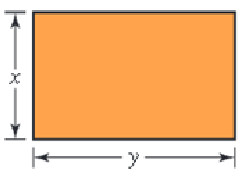{width=25%}

La proporción áurea del rectángulo ilustrado arriba se define por: $\frac{x}{y}=\frac{y}{x+y}$. Obtenga las dimensiones aproximadas de la hoja de papel rectangular que contiene 100 $pulg^2$ de área y que satisface la proporción áurea. Seleccione cuáles de las siguientes afirmaciones son **verdaderas**:

<label><input type="checkbox" name="q17796553100951868" value="1" data-correct="true" > El ancho de la hoja es aproximadamente $x \approx 7.86\text{ pulg}$.</label>

<label><input type="checkbox" name="q17796553100951868" value="2" data-correct="true" > El largo de la hoja es aproximadamente $y \approx 12.72\text{ pulg}$.</label>

<label><input type="checkbox" name="q17796553100951868" value="3" data-correct="true" > La razón entre el largo y el ancho de la hoja de papel rectangular es exactamente la constante áurea $\\phi \approx 1.618$.</label>

<label><input type="checkbox" name="q17796553100951868" value="4" data-correct="false" > Las dimensiones exactas de la hoja rectangular de papel son $8.00\text{ pulg}$ y $12.50\text{ pulg}$.</label>

<label><input type="checkbox" name="q17796553100951868" value="5" data-correct="false" > El ancho de la hoja es aproximadamente $x \approx 6.18\text{ pulg}$.</label>

<label><input type="checkbox" name="q17796553100951868" value="6" data-correct="false" > La proporción áurea entre las dimensiones se modela mediante una relación de proporcionalidad inversa ordinaria.</label>

<button type="button" class="learnr-submit-btn" onclick="checkLearnrQuestion('q17796553100951868')">Enviar Respuestas</button>

¡Excelente! Las dimensiones de la hoja son $7.86 \times 12.72$ pulgadas.

Incorrecto. De la proporción se tiene $\frac{y}{x} = \\phi \approx 1.618$. Dado que el área es $x \times y = 100$, entonces $x^2 \\phi = 100 \Rightarrow x = \frac{10}{\sqrt{\\phi}}$.

Intentar de nuevo

true

El radiador de un automóvil contiene 10 cuartos de galón de una mezcla de agua y 20 % de anticongelante. ¿Qué cantidad de esta mezcla debe vaciarse y reemplazarse por anticongelante puro para obtener una mezcla de 50 % en el radiador? Identifique cuáles de las siguientes afirmaciones son **verdaderas**:

<label><input type="checkbox" name="q17796553101032537" value="1" data-correct="true" > La cantidad de mezcla original que debe drenarse y reemplazarse es de exactamente $3.75\text{ cuartos}$.</label>

<label><input type="checkbox" name="q17796553101032537" value="2" data-correct="true" > El volumen de anticongelante puro presente en la mezcla final de 50 % es de exactamente $5\text{ cuartos}$.</label>

<label><input type="checkbox" name="q17796553101032537" value="3" data-correct="true" > El volumen de agua en el radiador después del proceso de reemplazo es de exactamente $5\text{ cuartos}$.</label>

<label><input type="checkbox" name="q17796553101032537" value="4" data-correct="false" > La cantidad de mezcla original que debe drenarse y reemplazarse es de $4.00\text{ cuartos}$.</label>

<label><input type="checkbox" name="q17796553101032537" value="5" data-correct="false" > El volumen de anticongelante puro que se agrega al radiador es de $3.00\text{ cuartos}$.</label>

<label><input type="checkbox" name="q17796553101032537" value="6" data-correct="false" > Este problema de mezclas se modela matemáticamente a través de una proporción directa simple.</label>

<button type="button" class="learnr-submit-btn" onclick="checkLearnrQuestion('q17796553101032537')">Enviar Respuestas</button>

¡Excelente! Deben drenarse $3.75$ cuartos de galón de mezcla.

Incorrecto. Plantea la conservación del volumen de anticongelante: $10(0.20) - x(0.20) + x(1.00) = 10(0.50) \Rightarrow 2 + 0.80x = 5$.

Intentar de nuevo

true

Encuentre dos números enteros cuya suma sea 50 y cuya diferencia sea 26. Seleccione cuáles de las siguientes afirmaciones son **verdaderas**:

<label><input type="checkbox" name="q17796553101114530" value="1" data-correct="true" > El número entero mayor es $38$.</label>

<label><input type="checkbox" name="q17796553101114530" value="2" data-correct="true" > El número entero menor es $12$.</label>

<label><input type="checkbox" name="q17796553101114530" value="3" data-correct="true" > El producto de los dos números enteros encontrados es igual a $456$.</label>

<label><input type="checkbox" name="q17796553101114530" value="4" data-correct="false" > Los dos números enteros son $35$ y $15$.</label>

<label><input type="checkbox" name="q17796553101114530" value="5" data-correct="false" > El número entero mayor es $36$.</label>

<label><input type="checkbox" name="q17796553101114530" value="6" data-correct="false" > El cociente entre el número mayor y el menor es un número entero exacto.</label>

<button type="button" class="learnr-submit-btn" onclick="checkLearnrQuestion('q17796553101114530')">Enviar Respuestas</button>

¡Excelente! Los números son $38$ y $12$, y su producto es $456$.

Incorrecto. Resuelve el sistema lineal simple $2 \times 2$: $x+y=50$ y $x-y=26$. Suma las dos ecuaciones.

Intentar de nuevo

true

La diferencia de los cuadrados de dos números pares consecutivos es 92. Halle los dos números. Identifique cuáles de las siguientes afirmaciones son **verdaderas**:

<label><input type="checkbox" name="q17796553101199698" value="1" data-correct="true" > El menor de los números pares consecutivos es $22$.</label>

<label><input type="checkbox" name="q17796553101199698" value="2" data-correct="true" > El mayor de los números pares consecutivos es $24$.</label>

<label><input type="checkbox" name="q17796553101199698" value="3" data-correct="true" > La suma de los dos números pares consecutivos encontrados es igual a $46$.</label>

<label><input type="checkbox" name="q17796553101199698" value="4" data-correct="false" > Los dos números pares consecutivos son $20$ y $22$.</label>

<label><input type="checkbox" name="q17796553101199698" value="5" data-correct="false" > El número par mayor de los dos es $26$.</label>

<label><input type="checkbox" name="q17796553101199698" value="6" data-correct="false" > La diferencia entre los cuadrados de los dos números pares es inferior a 90.</label>

<button type="button" class="learnr-submit-btn" onclick="checkLearnrQuestion('q17796553101199698')">Enviar Respuestas</button>

¡Excelente! Los números pares consecutivos son $22$ y $24$.

Incorrecto. Si los números son $2n$ y $2n+2$: $(2n+2)^2 - (2n)^2 = 92 \Rightarrow 4n^2 + 8n + 4 - 4n^2 = 92 \Rightarrow 8n = 88$.

Intentar de nuevo

true

Encuentre tres números enteros consecutivos cuya suma sea 48. Seleccione cuáles de las siguientes afirmaciones son **verdaderas**:

<label><input type="checkbox" name="q17796553101271113" value="1" data-correct="true" > El menor de los tres números consecutivos es $15$.</label>

<label><input type="checkbox" name="q17796553101271113" value="2" data-correct="true" > El del medio de los tres números consecutivos es $16$.</label>

<label><input type="checkbox" name="q17796553101271113" value="3" data-correct="true" > El mayor de los tres números consecutivos es $17$.</label>

<label><input type="checkbox" name="q17796553101271113" value="4" data-correct="false" > Los tres números enteros consecutivos son $14, 15, 16$.</label>

<label><input type="checkbox" name="q17796553101271113" value="5" data-correct="false" > El mayor de los tres números enteros consecutivos es $18$.</label>

<label><input type="checkbox" name="q17796553101271113" value="6" data-correct="false" > El producto de los tres números consecutivos encontrados es igual a $3360$.</label>

<button type="button" class="learnr-submit-btn" onclick="checkLearnrQuestion('q17796553101271113')">Enviar Respuestas</button>

¡Excelente! Los tres números consecutivos son $15$, $16$ y $17$.

Incorrecto. Plantea la ecuación lineal: $n + (n+1) + (n+2) = 48 \Rightarrow 3n + 3 = 48$.

Intentar de nuevo

true

### Preguntas 20 a 22 (Velocidades y Tiempos de Viaje)

Un auto viaja de A a B a una velocidad promedio de 55 mph, y regresa a una velocidad de 50 mph. En todo el viaje se lleva 7 horas. Halle la distancia recorrida entre A y B. (enunciado29). Identifique cuáles de las siguientes afirmaciones son **verdaderas**:

<label><input type="checkbox" name="q17796553101347637" value="1" data-correct="true" > La distancia de ida entre la ciudad A y la ciudad B es de exactamente $\frac{550}{3}\text{ millas}$ (aproximadamente $183.33\text{ millas}$).</label>

<label><input type="checkbox" name="q17796553101347637" value="2" data-correct="true" > El tiempo que tarda el auto en completar el viaje de ida (a 55 mph) es de exactamente $\frac{10}{3}\text{ horas}$ ($3\text{ horas y } 20\text{ minutos}$).</label>

<label><input type="checkbox" name="q17796553101347637" value="3" data-correct="true" > El tiempo que tarda el auto en completar el viaje de regreso (a 50 mph) es de exactamente $\frac{11}{3}\text{ horas}$ ($3\text{ horas y } 40\text{ minutos}$).</label>

<label><input type="checkbox" name="q17796553101347637" value="4" data-correct="false" > La distancia de ida entre la ciudad A y la ciudad B es de $180\text{ millas}$.</label>

<label><input type="checkbox" name="q17796553101347637" value="5" data-correct="false" > La distancia de ida entre la ciudad A y la ciudad B es de $190\text{ millas}$.</label>

<label><input type="checkbox" name="q17796553101347637" value="6" data-correct="false" > El tiempo que tarda el auto en la ida es mayor al tiempo empleado en el viaje de regreso.</label>

<button type="button" class="learnr-submit-btn" onclick="checkLearnrQuestion('q17796553101347637')">Enviar Respuestas</button>

¡Excelente! La distancia es $\frac{550}{3}$ millas y los tiempos de ida y vuelta son correctos.

Incorrecto. Las distancias son iguales. La ecuación de la suma de tiempos es: $\frac{d}{55} + \frac{d}{50} = 7 \Rightarrow d \left(\frac{105}{2750}\right) = 7$.

Intentar de nuevo

true

Un jet vuela con el viento a favor entre Los Ángeles y Chicago en 3.5 h, y contra el viento de Chicago a Los Ángeles en 4 h. La velocidad del avión sin viento es de 600 mi/h. Calcule la velocidad del viento. ¿Qué distancia hay entre Los Ángeles y Chicago? Seleccione cuáles de las siguientes afirmaciones son **verdaderas**:

<label><input type="checkbox" name="q17796553101425066" value="1" data-correct="true" > La velocidad constante del viento es de exactamente $40\text{ mi/h}$.</label>

<label><input type="checkbox" name="q17796553101425066" value="2" data-correct="true" > La distancia entre Los Ángeles y Chicago es de exactamente $2240\text{ millas}$.</label>

<label><input type="checkbox" name="q17796553101425066" value="3" data-correct="true" > La rapidez del avión con viento a favor es de $640\text{ mi/h}$, y contra el viento es de $560\text{ mi/h}$.</label>

<label><input type="checkbox" name="q17796553101425066" value="4" data-correct="false" > La velocidad constante del viento es de $50\text{ mi/h}$.</label>

<label><input type="checkbox" name="q17796553101425066" value="5" data-correct="false" > La distancia entre Los Ángeles y Chicago es de $2200\text{ millas}$.</label>

<label><input type="checkbox" name="q17796553101425066" value="6" data-correct="false" > La rapidez del jet con el viento a favor es menor que la rapidez contra el viento.</label>

<button type="button" class="learnr-submit-btn" onclick="checkLearnrQuestion('q17796553101425066')">Enviar Respuestas</button>

¡Excelente! El viento es de $40\text{ mi/h}$ y la distancia es de $2240\text{ millas}$.

Incorrecto. Como la distancia es igual en ambos trayectos, igualamos: $(600 + v_w) \times 3.5 = (600 - v_w) \times 4$.

Intentar de nuevo

true

Una mujer puede caminar al trabajo a una velocidad de 3 mph, o ir en bicicleta a 12 mph. Demora una hora más caminando que yendo en bicicleta. Encuentre el tiempo que se tarda en llegar al trabajo caminando. Identifique cuáles de las siguientes afirmaciones son **verdaderas**:

<label><input type="checkbox" name="q17796553101501392" value="1" data-correct="true" > El tiempo que tarda la mujer caminando hacia su trabajo es de exactamente $1.33\text{ horas}$ ($1\text{ hora y } 20\text{ minutos}$).</label>

<label><input type="checkbox" name="q17796553101501392" value="2" data-correct="true" > La distancia total desde su hogar hasta su lugar de trabajo es de exactamente $4\text{ millas}$.</label>

<label><input type="checkbox" name="q17796553101501392" value="3" data-correct="true" > El tiempo que tarda yendo en bicicleta es de exactamente $0.33\text{ horas}$ ($20\text{ minutos}$).</label>

<label><input type="checkbox" name="q17796553101501392" value="4" data-correct="false" > El tiempo que tarda la mujer caminando es de exactamente $1.50\text{ horas}$.</label>

<label><input type="checkbox" name="q17796553101501392" value="5" data-correct="false" > La distancia total desde su hogar hasta el trabajo es de $5\text{ millas}$.</label>

<label><input type="checkbox" name="q17796553101501392" value="6" data-correct="false" > El viaje en bicicleta le toma a la mujer exactamente $30\text{ minutos}$.</label>

<button type="button" class="learnr-submit-btn" onclick="checkLearnrQuestion('q17796553101501392')">Enviar Respuestas</button>

¡Excelente! Caminando tarda $1.33\text{ horas}$ y la distancia es de $4\text{ millas}$.

Incorrecto. Sea $t$ el tiempo caminando. La distancia de ida es la misma: $3 \times t = 12 \times (t-1) \Rightarrow 9t = 12$.

Intentar de nuevo

true

### Preguntas 23 a 28 (Área Coordenada y Mezclas)

### Área del Triángulo

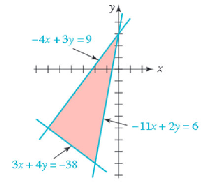{width=35%}

Obtenga el área del triángulo rectángulo que se ilustra arriba, el cual está delimitado por las rectas: $L_1: -4x + 3y = 9$, $L_2: 3x + 4y = -38$ y $L_3: -11x + 2y = 6$. Seleccione cuáles de las siguientes afirmaciones son **verdaderas**:

<label><input type="checkbox" name="q17796553101596401" value="1" data-correct="true" > El área del triángulo rectángulo sombreado es de exactamente $25\text{ UA}$.</label>

<label><input type="checkbox" name="q17796553101596401" value="2" data-correct="true" > La longitud del cateto 1 (distancia entre $(-6,-5)$ y $(0,3)$) es de exactamente $10\text{ UL}$.</label>

<label><input type="checkbox" name="q17796553101596401" value="3" data-correct="true" > La longitud del cateto 2 (distancia entre $(-6,-5)$ y $(-2,-8)$) es de exactamente $5\text{ UL}$.</label>

<label><input type="checkbox" name="q17796553101596401" value="4" data-correct="false" > El área del triángulo rectángulo sombreado es de $30\text{ UA}$.</label>

<label><input type="checkbox" name="q17796553101596401" value="5" data-correct="false" > Las coordenadas de los tres vértices que forman el triángulo son $(0,0)$, $(-6,-5)$ y $(-2,-8)$.</label>

<label><input type="checkbox" name="q17796553101596401" value="6" data-correct="false" > La longitud del cateto más largo del triángulo es de $12\text{ UL}$.</label>

<button type="button" class="learnr-submit-btn" onclick="checkLearnrQuestion('q17796553101596401')">Enviar Respuestas</button>

¡Excelente! Los catetos miden $10$ y $5$, por lo que el área es $25\text{ UA}$.

Incorrecto. Halla los tres vértices cruzando las rectas: $V_1(0,3)$, $V_2(-6,-5)$ y $V_3(-2,-8)$. Calcula la distancia de los catetos (10 y 5) y obtén el área.

Intentar de nuevo

true

Cierta marca de tierra para macetas contiene 10 % de humus y otra marca contiene 30 %. ¿Cuánto de cada tierra debe mezclarse para producir 2 pies cúbicos de tierra para macetas compuesta por 25 % de humus? Identifique cuáles de las siguientes afirmaciones son **verdaderas**:

<label><input type="checkbox" name="q17796553101688350" value="1" data-correct="true" > Se deben mezclar exactamente $0.5\text{ pies}^3$ de la tierra que contiene 10 % de humus.</label>

<label><input type="checkbox" name="q17796553101688350" value="2" data-correct="true" > Se deben mezclar exactamente $1.5\text{ pies}^3$ de la tierra que contiene 30 % de humus.</label>

<label><input type="checkbox" name="q17796553101688350" value="3" data-correct="true" > La cantidad de humus total presente en la mezcla final de 2 pies cúbicos es de $0.5\text{ pies}^3$.</label>

<label><input type="checkbox" name="q17796553101688350" value="4" data-correct="false" > Se deben mezclar exactamente $1.0\text{ pies}^3$ de cada una de las dos marcas de tierra.</label>

<label><input type="checkbox" name="q17796553101688350" value="5" data-correct="false" > Se deben mezclar exactamente $0.8\text{ pies}^3$ de la marca con 10 % de humus.</label>

<label><input type="checkbox" name="q17796553101688350" value="6" data-correct="false" > El volumen total necesario de humus es del 50 % respecto al volumen total final.</label>

<button type="button" class="learnr-submit-btn" onclick="checkLearnrQuestion('q17796553101688350')">Enviar Respuestas</button>

¡Excelente! Se requieren $0.5\text{ pies}^3$ de humus al $10\%$ y $1.5\text{ pies}^3$ al $30\%$.

Incorrecto. Plantea el sistema lineal: $x+y=2$ y $0.10x + 0.30y = 2(0.25) = 0.50$. Despeja $x$ e $y$.

Intentar de nuevo

true

Un carnicero vende carne molida de res de cierta calidad a $3.95 y de otra calidad a $4.20 la libra. Quiere mezclar las dos calidades para obtener una mezcla que se venda a $4.15 la libra. ¿Qué porcentaje de carne de cada calidad debe usar? Seleccione cuáles de las siguientes afirmaciones son **verdaderas**:

<label><input type="checkbox" name="q17796553101769061" value="1" data-correct="true" > Debe utilizarse exactamente un $20\%$ de la carne molida de res de cierta calidad (a $\$3.95$).</label>

<label><input type="checkbox" name="q17796553101769061" value="2" data-correct="true" > Debe utilizarse exactamente un $80\%$ de la carne molida de res de otra calidad (a $\$4.20$).</label>

<label><input type="checkbox" name="q17796553101769061" value="3" data-correct="true" > La razón entre la cantidad de carne costosa y carne económica empleada es de $4:1$.</label>

<label><input type="checkbox" name="q17796553101769061" value="4" data-correct="false" > Debe utilizarse un $30\%$ de la carne molida de res más económica.</label>

<label><input type="checkbox" name="q17796553101769061" value="5" data-correct="false" > Debe utilizarse un $25\%$ de la carne molida de res más económica.</label>

<label><input type="checkbox" name="q17796553101769061" value="6" data-correct="false" > La mezcla requiere utilizar una ración equitativa del 50 % de cada tipo de carne.</label>

<button type="button" class="learnr-submit-btn" onclick="checkLearnrQuestion('q17796553101769061')">Enviar Respuestas</button>

¡Excelente! Se debe utilizar un $20\%$ de la barata y un $80\%$ de la cara.

Incorrecto. Sea $p$ el porcentaje de la carne económica: $3.95p + 4.20(1-p) = 4.15 \Rightarrow -0.25p = -0.05$.

Intentar de nuevo

true

### Mezcla del Radiador V1

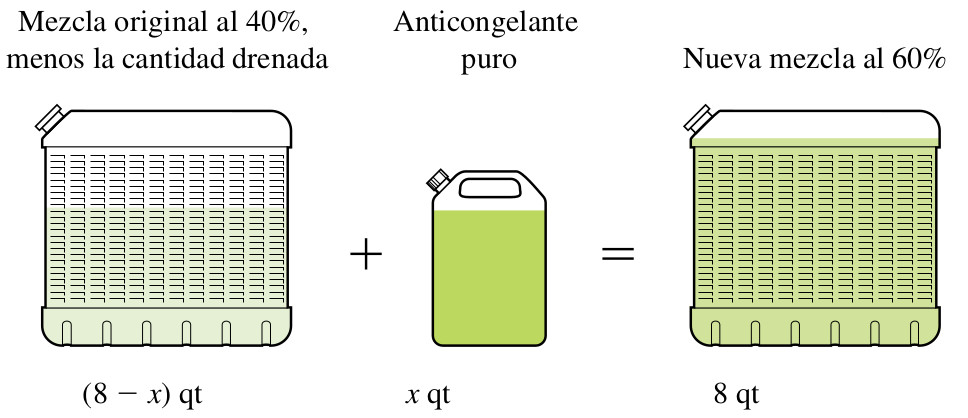{width=35%}

Un radiador contiene 8 cuartos de una mezcla de agua y anticongelante. Si 40% de la mezcla es anticongelante, ¿cuánto de la mezcla debe drenarse y cambiarse por anticongelante puro para que la mezcla resultante contenga 60% de anticongelante?. Ver la la Figura anterior. Identifique cuáles de las siguientes afirmaciones son **verdaderas**:

<label><input type="checkbox" name="q17796553101849991" value="1" data-correct="true" > Se debe vaciar y reemplazar exactamente $\frac{8}{3}\text{ cuartos}$ (aproximadamente $2.67\text{ cuartos}$) de la mezcla original.</label>

<label><input type="checkbox" name="q17796553101849991" value="2" data-correct="true" > La cantidad de anticongelante en los 8 cuartos finales de mezcla resultante al 60 % es de exactamente $4.8\text{ cuartos}$.</label>

<label><input type="checkbox" name="q17796553101849991" value="3" data-correct="true" > La cantidad de agua en el radiador tras el reemplazo final es de exactamente $3.2\text{ cuartos}$.</label>

<label><input type="checkbox" name="q17796553101849991" value="4" data-correct="false" > Se deben vaciar y reemplazar exactamente 3.00 cuartos de mezcla original.</label>

<label><input type="checkbox" name="q17796553101849991" value="5" data-correct="false" > El volumen de anticongelante puro agregado al radiador es de exactamente 3.33 cuartos.</label>

<label><input type="checkbox" name="q17796553101849991" value="6" data-correct="false" > Las proporciones de anticongelante y agua en este ejercicio son directamente proporcionales.</label>

<button type="button" class="learnr-submit-btn" onclick="checkLearnrQuestion('q17796553101849991')">Enviar Respuestas</button>

¡Excelente! Deben reemplazarse exactamente $\frac{8}{3}$ cuartos de mezcla.

Incorrecto. Plantea el balance del anticongelante: $8(0.40) - x(0.40) + x(1.00) = 8(0.60) \Rightarrow 3.2 + 0.60x = 4.8$.

Intentar de nuevo

true

### Mezcla Química de Ácido V1

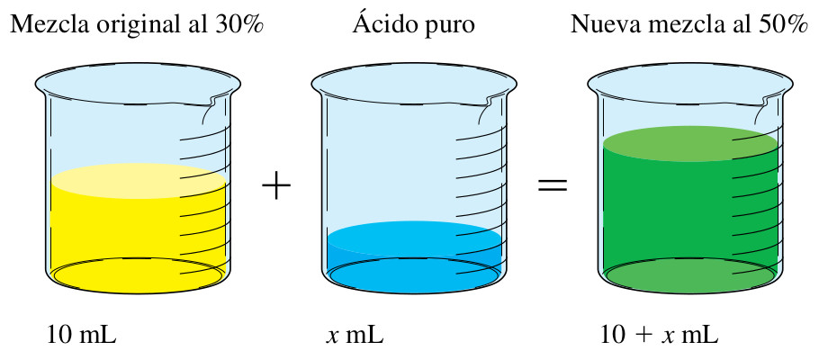{width=35%}

Un químico tiene 10 mililitros de una solución que contiene una concentración al 30% de ácido. ¿Cuántos mililitros de ácido puro deben agregarse para aumentar la concentración al 50%?. Ver la la Figura anterior. Seleccione cuáles de las siguientes afirmaciones son **verdaderas**:

<label><input type="checkbox" name="q17796553101922887" value="1" data-correct="true" > Se deben agregar exactamente $4\text{ mililitros}$ de ácido puro a la solución original.</label>

<label><input type="checkbox" name="q17796553101922887" value="2" data-correct="true" > El volumen total de la solución ácida resultante final es de exactamente $14\text{ mililitros}$.</label>

<label><input type="checkbox" name="q17796553101922887" value="3" data-correct="true" > La cantidad de ácido puro total presente en la mezcla final es de exactamente $7\text{ mililitros}$.</label>

<label><input type="checkbox" name="q17796553101922887" value="4" data-correct="false" > Se deben agregar exactamente 5 mililitros de ácido puro a la mezcla.</label>

<label><input type="checkbox" name="q17796553101922887" value="5" data-correct="false" > Se deben agregar exactamente 3 mililitros de ácido puro a la mezcla.</label>

<label><input type="checkbox" name="q17796553101922887" value="6" data-correct="false" > El volumen final de la solución es de exactamente 12 mililitros.</label>

<button type="button" class="learnr-submit-btn" onclick="checkLearnrQuestion('q17796553101922887')">Enviar Respuestas</button>

¡Excelente! Se requieren $4\text{ ml}$ de ácido puro, dando un total de $14\text{ ml}$ de solución.

Incorrecto. Conservación del ácido puro: $10(0.30) + x(1.00) = (10+x)(0.50) \Rightarrow 3 + x = 5 + 0.5x$.

Intentar de nuevo

true

El lado mayor de un triángulo es 2 cm más largo que el lado menor, el tercer lado tiene 5 cm menos que el doble de la longitud del lado menor. si el perímetro es 21 cm, ¿cuál es la longitud de cada lado? Identifique cuáles de las siguientes afirmaciones son **verdaderas**:

<label><input type="checkbox" name="q17796553102003611" value="1" data-correct="true" > El lado menor del triángulo mide exactamente $6\text{ cm}$.</label>

<label><input type="checkbox" name="q17796553102003611" value="2" data-correct="true" > El lado mayor del triángulo mide exactamente $8\text{ cm}$.</label>

<label><input type="checkbox" name="q17796553102003611" value="3" data-correct="true" > El tercer lado del triángulo mide exactamente $7\text{ cm}$.</label>

<label><input type="checkbox" name="q17796553102003611" value="4" data-correct="false" > Las dimensiones de los lados del triángulo son $5\text{ cm}, 7\text{ cm y } 9\text{ cm}$.</label>

<label><input type="checkbox" name="q17796553102003611" value="5" data-correct="false" > El tercer lado del triángulo mide exactamente $9\text{ cm}$.</label>

<label><input type="checkbox" name="q17796553102003611" value="6" data-correct="false" > El lado menor del triángulo mide exactamente $5\text{ cm}$.</label>

<button type="button" class="learnr-submit-btn" onclick="checkLearnrQuestion('q17796553102003611')">Enviar Respuestas</button>

¡Excelente! Los lados miden $6\text{ cm}, 7\text{ cm y } 8\text{ cm}$.

Incorrecto. Si $x$ es el lado menor: $x + (x+2) + (2x-5) = 21 \Rightarrow 4x - 3 = 21$.

Intentar de nuevo

true

### Preguntas 29 a 31 (Visualizaciones y Cercados)

### Medición del Árbol (Aserrador)

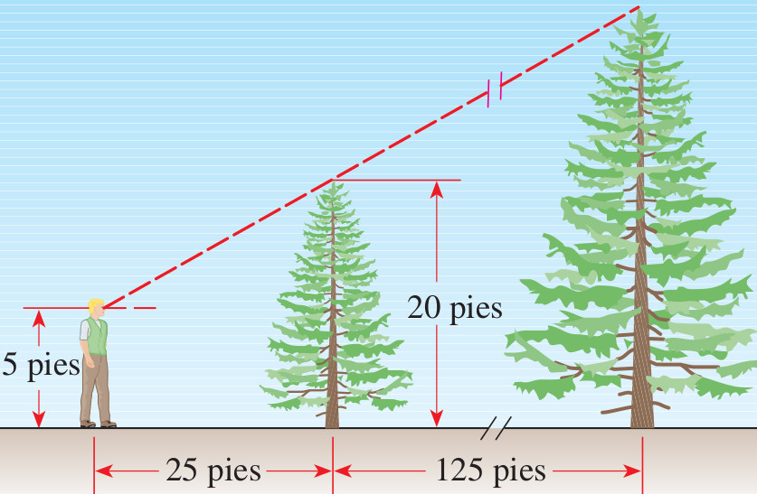{width=35%}

Un aserrador estima la altura de un árbol alto midiendo primero un árbol pequeño alejado 125 pies del árbol alto; luego se desplaza de tal manera que sus ojos estén en la visual de las copas de los árboles y mide después qué tan lejos está del árbol pequeño (véase la Figura anterior). Suponga que el árbol pequeño mide 20 pies de altura, el hombre está a 25 pies del árbol pequeño y sus ojos están a 5 pies por arriba del suelo. ¿Cuánto mide el árbol más alto? Seleccione cuáles de las siguientes afirmaciones son **verdaderas**:

<label><input type="checkbox" name="q17796553102082225" value="1" data-correct="true" > El árbol más alto mide exactamente $95\text{ pies}$ de altura total.</label>

<label><input type="checkbox" name="q17796553102082225" value="2" data-correct="true" > La altura del árbol más alto por encima de la línea visual del ojo del hombre es de exactamente $90\text{ pies}$.</label>

<label><input type="checkbox" name="q17796553102082225" value="3" data-correct="true" > La distancia horizontal desde los ojos del hombre hasta la base del árbol más alto es de exactamente $150\text{ pies}$.</label>

<label><input type="checkbox" name="q17796553102082225" value="4" data-correct="false" > El árbol más alto mide exactamente 90 pies de altura total.</label>

<label><input type="checkbox" name="q17796553102082225" value="5" data-correct="false" > La altura del árbol pequeño por encima de la línea visual es de 20 pies.</label>

<label><input type="checkbox" name="q17796553102082225" value="6" data-correct="false" > La distancia horizontal desde el hombre hasta el árbol más alto es de 125 pies.</label>

<button type="button" class="learnr-submit-btn" onclick="checkLearnrQuestion('q17796553102082225')">Enviar Respuestas</button>

¡Excelente! La altura es de $95$ pies y la distancia total es de $150$ pies.

Incorrecto. Resta la altura del ojo: $20 - 5 = 15\text{ pies}$ para el pequeño. Por semejanza: $\frac{h_a}{150} = \frac{15}{25} \Rightarrow h_a = 90$. Suma el ojo: $90+5=95\text{ pies}$.

Intentar de nuevo

true

El área de un trapecio es de $250\text{ pies}^2$ y la altura es de $10\text{ pies}$. ¿cuál es la longitud de la base mayor si la base menor mide $20\text{ pies}$? Identifique cuáles de las siguientes afirmaciones son **verdaderas**:

<label><input type="checkbox" name="q17796553102158501" value="1" data-correct="true" > La longitud de la base mayor del trapecio es de exactamente $30\text{ pies}$.</label>

<label><input type="checkbox" name="q17796553102158501" value="2" data-correct="true" > La longitud promedio de las dos bases del trapecio es de exactamente $25\text{ pies}$.</label>

<label><input type="checkbox" name="q17796553102158501" value="3" data-correct="true" > La diferencia de longitud entre la base mayor y la base menor es de exactamente $10\text{ pies}$.</label>

<label><input type="checkbox" name="q17796553102158501" value="4" data-correct="false" > La longitud de la base mayor del trapecio es de 35 pies.</label>

<label><input type="checkbox" name="q17796553102158501" value="5" data-correct="false" > La longitud de la base mayor del trapecio es de 40 pies.</label>

<label><input type="checkbox" name="q17796553102158501" value="6" data-correct="false" > La base mayor del trapecio mide exactamente 25 pies.</label>

<button type="button" class="learnr-submit-btn" onclick="checkLearnrQuestion('q17796553102158501')">Enviar Respuestas</button>

¡Excelente! La base mayor es $30\text{ pies}$ y el promedio de las bases es $25\text{ pies}$.

Incorrecto. Aplica la fórmula del área del trapecio: $250 = \frac{B+20}{2} \times 10 \Rightarrow 250 = 5(B+20)$.

Intentar de nuevo

true

### Campo de Cercado

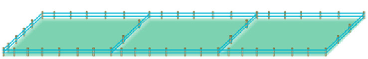{width=30%}

Un granjero desea encerrar un campo rectangular y dividirlo en tres partes iguales con cercado (ver la Figura anterior). Si la longitud del campo es tres veces el ancho y se requieren 1000 metros de cercado, ¿cuáles son las dimensiones del campo? Seleccione cuáles de las siguientes afirmaciones son **verdaderas**:

<label><input type="checkbox" name="q17796553102269485" value="1" data-correct="true" > El ancho del campo rectangular es de exactamente $100\text{ metros}$.</label>

<label><input type="checkbox" name="q17796553102269485" value="2" data-correct="true" > El largo del campo rectangular es de exactamente $300\text{ metros}$.</label>

<label><input type="checkbox" name="q17796553102269485" value="3" data-correct="true" > El área total del terreno rectangular encerrado es de $30000\text{ metros}^2$.</label>

<label><input type="checkbox" name="q17796553102269485" value="4" data-correct="false" > El ancho del campo rectangular es de 120 metros.</label>

<label><input type="checkbox" name="q17796553102269485" value="5" data-correct="false" > El largo del campo rectangular es de 360 metros.</label>

<label><input type="checkbox" name="q17796553102269485" value="6" data-correct="false" > La longitud de cercado interno divisorio necesaria es de 600 metros.</label>

<button type="button" class="learnr-submit-btn" onclick="checkLearnrQuestion('q17796553102269485')">Enviar Respuestas</button>

¡Excelente! El ancho es $100\text{ m}$, el largo es $300\text{ m}$ y el área es $30000\text{ m}^2$.

Incorrecto. Se cumple $L=3W$. El cercado total es $4W + 2L = 1000$ (fiel al diagrama de divisiones paralelas al ancho). Sustituyendo: $10W = 1000 \Rightarrow W=100$.

Intentar de nuevo

true

### Preguntas 32 a 36 (Tasas de Trabajo y Perímetro)

Si Megan puede completar una tarea en 50 minutos trabajando sola y Colleen puede hacerlo en 25 min, ¿cuánto tiempo tardarán trabajando juntas? Identifique cuáles de las siguientes afirmaciones son **verdaderas**:

<label><input type="checkbox" name="q17796553102341706" value="1" data-correct="true" > Megan y Colleen tardarán exactamente $\frac{50}{3}\text{ minutos}$ (aproximadamente $16.67\text{ minutos}$) trabajando juntas.</label>

<label><input type="checkbox" name="q17796553102341706" value="2" data-correct="true" > La tasa de trabajo conjunta es de $\frac{3}{50}$ de la tarea por cada minuto de labor conjunta.</label>

<label><input type="checkbox" name="q17796553102341706" value="3" data-correct="true" > Colleen realiza el trabajo con el doble de rapidez en comparación con Megan.</label>

<label><input type="checkbox" name="q17796553102341706" value="4" data-correct="false" > Tardarán exactamente 15.00 minutos trabajando juntas.</label>

<label><input type="checkbox" name="q17796553102341706" value="5" data-correct="false" > Tardarán exactamente 18.00 minutos trabajando juntas.</label>

<label><input type="checkbox" name="q17796553102341706" value="6" data-correct="false" > La tasa de trabajo individual de Megan es mayor que la tasa de trabajo individual de Colleen.</label>

<button type="button" class="learnr-submit-btn" onclick="checkLearnrQuestion('q17796553102341706')">Enviar Respuestas</button>

¡Excelente! El tiempo de trabajo juntas es de $\frac{50}{3}$ minutos.

Incorrecto. Suma las tasas de trabajo: $\frac{1}{50} + \frac{1}{25} = \frac{3}{50}$ tareas por minuto. El tiempo es la recíproca.

Intentar de nuevo

true

Si Karen puede recoger un sembradío de frambuesas en 6 horas y Stan puede hacerlo en 8 horas, ¿cuán rápido puede recoger el sembradío juntos? Seleccione cuáles de las siguientes afirmaciones son **verdaderas**:

<label><input type="checkbox" name="q17796553102429892" value="1" data-correct="true" > Juntos completarán la recolección del sembradío en exactamente $\frac{24}{7}\text{ horas}$ (aproximadamente $3.43\text{ horas}$).</label>

<label><input type="checkbox" name="q17796553102429892" value="2" data-correct="true" > La tasa de trabajo conjunta es de $\frac{7}{24}$ de la recolección del sembradío por hora.</label>

<label><input type="checkbox" name="q17796553102429892" value="3" data-correct="true" > El tiempo de recolección conjunto equivale a exactamente $3\text{ horas y } 25.7\text{ minutos}$.</label>

<label><input type="checkbox" name="q17796553102429892" value="4" data-correct="false" > Juntos completarán la recolección en exactamente 3.50 horas.</label>

<label><input type="checkbox" name="q17796553102429892" value="5" data-correct="false" > Juntos completarán la recolección en exactamente 3.00 horas.</label>

<label><input type="checkbox" name="q17796553102429892" value="6" data-correct="false" > La tasa de trabajo individual de Stan es mayor que la de Karen porque Stan tarda más horas.</label>

<button type="button" class="learnr-submit-btn" onclick="checkLearnrQuestion('q17796553102429892')">Enviar Respuestas</button>

¡Excelente! Juntos tardan exactamente $\frac{24}{7}$ horas.

Incorrecto. Suma las tasas: $\frac{1}{6} + \frac{1}{8} = \frac{7}{24}$ de sembradío por hora. El tiempo es $\frac{24}{7}$ horas.

Intentar de nuevo

true

Con dos mangueras de distinto diámetro se llena una tina en 40 minutos. Una manguera llena la tina en 90 minutos. Determine en cuánto tiempo la llenaría la otra manguera. Identifique cuáles de las siguientes afirmaciones son **verdaderas**:

<label><input type="checkbox" name="q17796553102517630" value="1" data-correct="true" > La manguera de mayor diámetro llenará la tina sola en exactamente $72\text{ minutos}$.</label>

<label><input type="checkbox" name="q17796553102517630" value="2" data-correct="true" > La tasa de llenado de la manguera más rápida sola es de $\frac{1}{72}$ de la tina por cada minuto.</label>

<label><input type="checkbox" name="q17796553102517630" value="3" data-correct="true" > La tasa de llenado conjunta es de $\frac{1}{40}$ de la tina por cada minuto.</label>

<label><input type="checkbox" name="q17796553102517630" value="4" data-correct="false" > La otra manguera tardará exactamente 80 minutos en llenar la tina sola.</label>

<label><input type="checkbox" name="q17796553102517630" value="5" data-correct="false" > La otra manguera tardará exactamente 60 minutos en llenar la tina sola.</label>

<label><input type="checkbox" name="q17796553102517630" value="6" data-correct="false" > La manguera de llenado más rápido es la que tarda 90 minutos sola.</label>

<button type="button" class="learnr-submit-btn" onclick="checkLearnrQuestion('q17796553102517630')">Enviar Respuestas</button>

¡Excelente! La manguera más rápida tarda $72$ minutos en llenarla sola.

Incorrecto. Plantea la ecuación de tasas: $\frac{1}{90} + \frac{1}{t} = \frac{1}{40} \Rightarrow \frac{1}{t} = \frac{1}{40} - \frac{1}{90} = \frac{5}{360}$.

Intentar de nuevo

true

Margot limpia su habitación en 50 minutos ella sola. Si Jeremy la ayuda, tarda 30 minutos.¿Cuánto tiempo tardará Jeremy en limpiar la habitación él sólo? Seleccione cuáles de las siguientes afirmaciones son **verdaderas**:

<label><input type="checkbox" name="q17796553102605965" value="1" data-correct="true" > Jeremy tardará exactamente $75\text{ minutos}$ en limpiar la habitación él solo.</label>

<label><input type="checkbox" name="q17796553102605965" value="2" data-correct="true" > La tasa de limpieza de Jeremy es de $\frac{1}{75}$ de la habitación por minuto de trabajo.</label>

<label><input type="checkbox" name="q17796553102605965" value="3" data-correct="true" > Margot limpia la habitación con mayor rapidez de forma individual que Jeremy.</label>

<label><input type="checkbox" name="q17796553102605965" value="4" data-correct="false" > Jeremy tardará exactamente 80 minutos en limpiar la habitación él solo.</label>

<label><input type="checkbox" name="q17796553102605965" value="5" data-correct="false" > Jeremy tardará exactamente 70 minutos en limpiar la habitación él solo.</label>

<label><input type="checkbox" name="q17796553102605965" value="6" data-correct="false" > La tasa de limpieza conjunta es de exactamente 1/40 de la habitación por minuto.</label>

<button type="button" class="learnr-submit-btn" onclick="checkLearnrQuestion('q17796553102605965')">Enviar Respuestas</button>

¡Excelente! Jeremy tarda $75$ minutos y Margot es la más rápida ($50$ min).

Incorrecto. Plantea la ecuación de tasas: $\frac{1}{50} + \frac{1}{t} = \frac{1}{30} \Rightarrow \frac{1}{t} = \frac{1}{30} - \frac{1}{50} = \frac{2}{150}$.

Intentar de nuevo

true

El perímetro de un rectángulo es de 50 cm y el ancho es $\frac{2}{3}$ de la longitud. Encuentre las dimensiones del rectángulo. Identifique cuáles de las siguientes afirmaciones son **verdaderas**:

<label><input type="checkbox" name="q17796553102695794" value="1" data-correct="true" > La longitud (lado mayor) del rectángulo es de exactamente $15\text{ cm}$.</label>

<label><input type="checkbox" name="q17796553102695794" value="2" data-correct="true" > El ancho (lado menor) del rectángulo es de exactamente $10\text{ cm}$.</label>

<label><input type="checkbox" name="q17796553102695794" value="3" data-correct="true" > El área total del rectángulo es de exactamente $150\text{ cm}^2$.</label>

<label><input type="checkbox" name="q17796553102695794" value="4" data-correct="false" > Las dimensiones del rectángulo son 12 cm de longitud y 8 cm de ancho.</label>

<label><input type="checkbox" name="q17796553102695794" value="5" data-correct="false" > Las dimensiones del rectángulo son 18 cm de longitud y 12 cm de ancho.</label>

<label><input type="checkbox" name="q17796553102695794" value="6" data-correct="false" > La longitud y el ancho del rectángulo son de igual medida (es un cuadrado).</label>

<button type="button" class="learnr-submit-btn" onclick="checkLearnrQuestion('q17796553102695794')">Enviar Respuestas</button>

¡Excelente! El largo es $15\text{ cm}$, el ancho es $10\text{ cm}$ y el área es $150\text{ cm}^2$.

Incorrecto. Perímetro: $2L + 2W = 50 \Rightarrow L + W = 25$. Como $W = \frac{2}{3}L$, entonces $L + \frac{2}{3}L = 25 \Rightarrow \frac{5}{3}L = 25$.

Intentar de nuevo

true

### Preguntas 37 a 41 (Enunciados Nuevos Avanzados)

Un jet voló de Nueva York a los Ángeles, una distancia de 4200 kilómetros. La rapidez del viaje de regreso fue de 100 kilómetros por hora mayor que la de ida. Si el total del viaje tomó 13 horas, ¿cuál fue la rapidez de Nueva York a los Ángeles? (ida) Seleccione cuáles de las siguientes afirmaciones son **verdaderas**:

<label><input type="checkbox" name="q17796553102772619" value="1" data-correct="true" > La rapidez de ida del jet de Nueva York a Los Ángeles es de exactamente $600\text{ km/h}$.</label>

<label><input type="checkbox" name="q17796553102772619" value="2" data-correct="true" > La rapidez de regreso del jet de Los Ángeles a Nueva York es de exactamente $700\text{ km/h}$.</label>

<label><input type="checkbox" name="q17796553102772619" value="3" data-correct="true" > El tiempo total invertido en el viaje de ida fue de exactamente $7\text{ horas}$.</label>

<label><input type="checkbox" name="q17796553102772619" value="4" data-correct="false" > La rapidez del jet en el viaje de ida es de exactamente $500\text{ km/h}$.</label>

<label><input type="checkbox" name="q17796553102772619" value="5" data-correct="false" > La rapidez de regreso del jet es de exactamente $650\text{ km/h}$.</label>

<label><input type="checkbox" name="q17796553102772619" value="6" data-correct="false" > El tiempo del trayecto de ida es inferior al tiempo del trayecto de regreso.</label>

<button type="button" class="learnr-submit-btn" onclick="checkLearnrQuestion('q17796553102772619')">Enviar Respuestas</button>

¡Excelente! La velocidad de ida es $600\text{ km/h}$ y la de vuelta es $700\text{ km/h}$.

Incorrecto. Tiempo total: $\frac{4200}{v} + \frac{4200}{v+100} = 13 \Rightarrow 4200(2v+100) = 13v(v+100) \Rightarrow 13v^2 - 7100v - 420000 = 0$.

Intentar de nuevo

true

### Mezcla del Fabricante de Refrescos

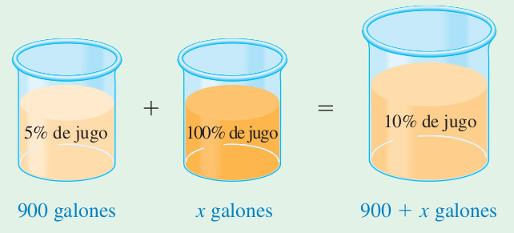{width=35%}

Un fabricante de refrescos produce uno de naranja que es anunciado como de sabor natural aunque sólo contiene el 5% de jugo. Una nueva reglamentación gubernamental estipula que para que una bebida se anuncie como natural deberá contener por lo menos 10% de jugo de fruta. ¿Cuánto jugo de naranja puro debe agregar el fabricante a 900 galones de refresco de naranja, para cumplir con la nueva reglamentación?. Ver la Figura anterior. Identifique cuáles de las siguientes afirmaciones son **verdaderas**:

<label><input type="checkbox" name="q17796553102851790" value="1" data-correct="true" > El fabricante debe agregar exactamente $50\text{ galones}$ de jugo de naranja puro.</label>

<label><input type="checkbox" name="q17796553102851790" value="2" data-correct="true" > El volumen total de la bebida de naranja resultante es de exactamente $950\text{ galones}$.</label>

<label><input type="checkbox" name="q17796553102851790" value="3" data-correct="true" > La cantidad total de jugo de naranja puro en la mezcla resultante final de 950 galones es de $95\text{ galones}$.</label>

<label><input type="checkbox" name="q17796553102851790" value="4" data-correct="false" > El fabricante debe agregar exactamente 45 galones de jugo puro a la mezcla.</label>

<label><input type="checkbox" name="q17796553102851790" value="5" data-correct="false" > El fabricante debe agregar exactamente 60 galones de jugo puro a la mezcla.</label>

<label><input type="checkbox" name="q17796553102851790" value="6" data-correct="false" > La mezcla resultante de refresco contendrá un volumen total de 925 galones.</label>

<button type="button" class="learnr-submit-btn" onclick="checkLearnrQuestion('q17796553102851790')">Enviar Respuestas</button>

¡Excelente! Se agregan $50$ galones de jugo de naranja puro.

Incorrecto. Conservación del jugo: $900(0.05) + x(1.00) = (900+x)(0.10) \Rightarrow 45 + x = 90 + 0.1x \Rightarrow 0.9x = 45$.

Intentar de nuevo

true

Un cartel tiene impresa un área rectangular de 100 por 140 centímetros, enmarcada con una banda de ancho constante. El perímetro del cartel es 1.5 veces el del área impresa. ¿Cuál es el ancho de banda, y cuáles son las dimensiones del cartel? Seleccione cuáles de las siguientes afirmaciones son **verdaderas**:

<label><input type="checkbox" name="q17796553102939703" value="1" data-correct="true" > El ancho de la banda constante que enmarca el cartel es de exactamente $30\text{ cm}$.</label>

<label><input type="checkbox" name="q17796553102939703" value="2" data-correct="true" > Las dimensiones totales del cartel (incluyendo la banda) son $160\text{ cm de ancho y } 200\text{ cm de largo}$.</label>

<label><input type="checkbox" name="q17796553102939703" value="3" data-correct="true" > El perímetro total del cartel completo es de exactamente $720\text{ cm}$.</label>

<label><input type="checkbox" name="q17796553102939703" value="4" data-correct="false" > El ancho constante de la banda del cartel es de exactamente 25 cm.</label>

<label><input type="checkbox" name="q17796553102939703" value="5" data-correct="false" > Las dimensiones del cartel son 150 cm de ancho y 190 cm de largo.</label>

<label><input type="checkbox" name="q17796553102939703" value="6" data-correct="false" > El perímetro total del área impresa en la hoja de papel es de 500 cm.</label>

<button type="button" class="learnr-submit-btn" onclick="checkLearnrQuestion('q17796553102939703')">Enviar Respuestas</button>

¡Excelente! La banda mide $30\text{ cm}$ y el cartel completo mide $160 \times 200\text{ cm}$.

Incorrecto. Perímetro impreso: $2(100+140) = 480\text{ cm}$. Perímetro con banda $x$: $2(100+2x + 140+2x) = 480+8x$. Ecuación: $480+8x = 1.5 \times 480 = 720$.

Intentar de nuevo

true

Mary hereda \$100.000 y los invierte en dos certificados de depósito. Un certificado paga 6% y el otro 4.5% anual de interés simple. Si el interés total es de \$5.025 al año, ¿cuánto dinero está invertido a cada una de las tasas? Identifique cuáles de las siguientes afirmaciones son **verdaderas**:

<label><input type="checkbox" name="q17796553103015897" value="1" data-correct="true" > Mary invirtió exactamente \$35.000 en el certificado de depósito que paga la tasa del 6 %.</label>

<label><input type="checkbox" name="q17796553103015897" value="2" data-correct="true" > Mary invirtió exactamente \$65.000 en el certificado de depósito que paga la tasa del 4.5 %.</label>

<label><input type="checkbox" name="q17796553103015897" value="3" data-correct="true" > La suma de los intereses generados por ambas inversiones en el primer año asciende a \$5.025.</label>

<label><input type="checkbox" name="q17796553103015897" value="4" data-correct="false" > Mary invirtió \$40.000 al 6 % y \$60.000 al 4.5 %.</label>

<label><input type="checkbox" name="q17796553103015897" value="5" data-correct="false" > Mary invirtió \$30.000 al 6 % y \$70.000 al 4.5 %.</label>

<label><input type="checkbox" name="q17796553103015897" value="6" data-correct="false" > Mary invirtió de forma equitativa un monto de \$50.000 en cada uno de los certificados de depósito.</label>

<button type="button" class="learnr-submit-btn" onclick="checkLearnrQuestion('q17796553103015897')">Enviar Respuestas</button>

¡Excelente! Mary invirtió \$35.000 al $6\%$ y \$65.000 al $4.5\%$.

Incorrecto. Plantea la ecuación del interés simple: $0.06x + 0.045(100000-x) = 5025 \Rightarrow 0.015x = 525$.

Intentar de nuevo

true

### Vuelo de Pájaros

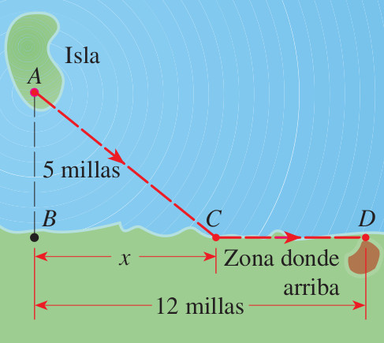{width=25%}

En una isla se libera un pájaro desde el punto A que se encuentra a 5 millas (en línea recta) del punto B más cercano de una costa. El ave vuela al punto C de la costa y luego a lo largo de la misma hasta su área de anidación en D. Suponga que el pájaro tiene una reserva de energía de 170 kilocalorías, y que utiliza 10 kilocalorías por milla al volar sobre la tierra y 14 kilocalorías por milla al hacerlo sobre el agua (ver la Figura anterior). Sabiendo que la distancia BD es de 12 millas, seleccione cuáles de las siguientes afirmaciones son **verdaderas**:

<label><input type="checkbox" name="q17796553103095459" value="1" data-correct="true" > El punto C puede estar localizado a exactamente $3.75\text{ millas}$ o $6.67\text{ millas}$ del punto B para consumir exactamente 170 kcal.</label>

<label><input type="checkbox" name="q17796553103095459" value="2" data-correct="true" > El ave NO tiene suficiente energía de reserva para realizar el trayecto de vuelo directo desde la isla A hasta su nido D.</label>

<label><input type="checkbox" name="q17796553103095459" value="3" data-correct="true" > El vuelo directo de A a D tiene una longitud de $13\text{ millas}$, lo que requeriría un gasto energético de $182\text{ kcal}$.</label>

<label><input type="checkbox" name="q17796553103095459" value="4" data-correct="false" > El punto C debe estar localizado a exactamente 4.00 millas del punto B en la costa.</label>

<label><input type="checkbox" name="q17796553103095459" value="5" data-correct="false" > El ave sí cuenta con la energía de reserva suficiente para emprender un vuelo directo desde la isla A hasta el nido D.</label>

<label><input type="checkbox" name="q17796553103095459" value="6" data-correct="false" > El vuelo directo de A a D requiere de exactamente 160 kcal, por lo que el ave puede realizar el viaje directo.</label>

<button type="button" class="learnr-submit-btn" onclick="checkLearnrQuestion('q17796553103095459')">Enviar Respuestas</button>

¡Excelente! Las distancias posibles a C son $3.75$ y $6.67$ millas y el vuelo directo requiere $182$ kcal.

Incorrecto. Costo de energía: $14\sqrt{x^2+25} + 10(12-x) = 170 \Rightarrow 14\sqrt{x^2+25} = 50 + 10x$. Resuelve la ecuación para obtener $x=3.75$ o $6.67$. Para el vuelo directo, $AD = \sqrt{12^2+5^2} = 13$ millas, lo que da $13 \times 14 = 182 &gt; 170$.

Intentar de nuevo

true

### Preguntas 42 a 44 (Fabricación de Recipiente y Demostraciones)

### Hoja de Estaño

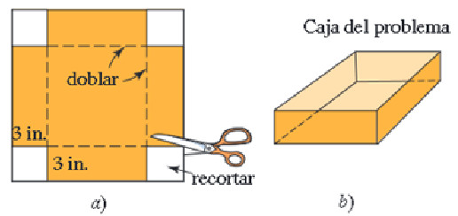{width=35%}

Se hace un recipiente con una pequeña hoja de estaño cuadrada cortando un cuadrado de 3 pulgadas de cada esquina y doblando los lados (ver la Figura anterior). La caja va a tener un volumen de 48 pulgadas cúbicas. Halle la longitud de uno de los lados de la hoja de estaño original. Identifique cuáles de las siguientes afirmaciones son **verdaderas**:

<label><input type="checkbox" name="q17796553103166844" value="1" data-correct="true" > La longitud de uno de los lados de la hoja cuadrada de estaño original es de exactamente $10\text{ pulgadas}$.</label>

<label><input type="checkbox" name="q17796553103166844" value="2" data-correct="true" > El volumen de la caja se puede modelar mediante la expresión $V(s) = 3(s - 6)^2 = 48$.</label>

<label><input type="checkbox" name="q17796553103166844" value="3" data-correct="true" > Las dimensiones de la caja doblada son de $3\text{ pulgadas de altura, y } 4\text{ por } 4\text{ pulgadas de base}$.</label>

<label><input type="checkbox" name="q17796553103166844" value="4" data-correct="false" > La longitud de uno de los lados de la hoja de estaño original es de 12 pulgadas.</label>

<label><input type="checkbox" name="q17796553103166844" value="5" data-correct="false" > La longitud de uno de los lados de la hoja de estaño original es de 8 pulgadas.</label>

<label><input type="checkbox" name="q17796553103166844" value="6" data-correct="false" > Las dimensiones de la base de la caja final son de 6 por 6 pulgadas.</label>

<button type="button" class="learnr-submit-btn" onclick="checkLearnrQuestion('q17796553103166844')">Enviar Respuestas</button>

¡Excelente! La longitud es de $10$ pulgadas y la base de la caja mide $4 \times 4$ pulgadas.

Incorrecto. Volumen: $V = h(s - 2h)^2 \Rightarrow 48 = 3(s - 6)^2 \Rightarrow (s - 6)^2 = 16$.

Intentar de nuevo

true

### Demostración Teorema de Pitágoras

{width=25%}

Una de las pruebas más concisas del teorema de Pitágoras la dio el erudito indio Bhaskara (alrededor de 1150 AC). Presentó el diagrama que muestra la Figura anterior. Suponga que un cuadrado de lado c puede dividirse en cuatro triángulos rectángulos congruentes y un cuadrado de longitud b-a como se muestra en la Figura anterior. Demuestre algebraicamente que $a^2+b^2=c^2$. Seleccione cuáles de las siguientes afirmaciones son **verdaderas**:

<label><input type="checkbox" name="q17796553103242396" value="1" data-correct="true" > El área del cuadrado mayor es $c^2$, la cual es igual a la suma de las áreas de los componentes: $4\left(\frac{1}{2}ab\right) + (b-a)^2$.</label>

<label><input type="checkbox" name="q17796553103242396" value="2" data-correct="true" > Al simplificar los términos algebraicos del área se obtiene la identidad exacta: $2ab + b^2 - 2ab + a^2 = a^2 + b^2$.</label>

<label><input type="checkbox" name="q17796553103242396" value="3" data-correct="true" > La igualación directa del área del cuadrado y la suma de sus componentes demuestra que $a^2+b^2=c^2$.</label>

<label><input type="checkbox" name="q17796553103242396" value="4" data-correct="false" > El área de los cuatro triángulos rectángulos combinados es exactamente igual a $4ab$.</label>

<label><input type="checkbox" name="q17796553103242396" value="5" data-correct="false" > El área del cuadrado central interior más pequeño está dada por la expresión $(a+b)^2$.</label>

<label><input type="checkbox" name="q17796553103242396" value="6" data-correct="false" > La igualación algebraica correcta para el área es $c^2 = 4\left(\frac{1}{2}ab\right) + (a+b)^2 = a^2+4ab+b^2$.</label>

<button type="button" class="learnr-submit-btn" onclick="checkLearnrQuestion('q17796553103242396')">Enviar Respuestas</button>

¡Excelente! La igualación $c^2 = 2ab + b^2 - 2ab + a^2 = a^2+b^2$ es correcta.

Incorrecto. El cuadrado grande de lado $c$ tiene área $c^2$. Los componentes son 4 triángulos rectángulos de base $a$ y altura $b$ (área $\frac{1}{2}ab$) y el cuadrado central de lado $b-a$ (área $(b-a)^2$).

Intentar de nuevo

true

### Pedazo de Tela Cortada

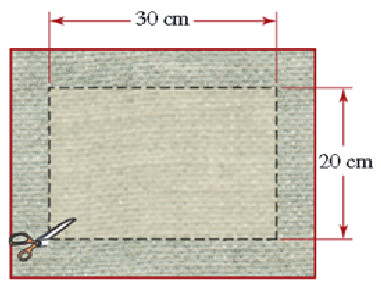{width=25%}

Se corta un borde uniforme de un pedazo de tela rectangular. El pedazo de tela resultante es de 20 por 30 cm ver la Figura anterior. Si el área original era el doble de la actual, halle el ancho del borde que se cortó. Identifique cuáles de las siguientes afirmaciones son **verdaderas**:

<label><input type="checkbox" name="q17796553103328840" value="1" data-correct="true" > El ancho del borde uniforme que se cortó a la tela rectangular es de exactamente $5\text{ cm}$.</label>

<label><input type="checkbox" name="q17796553103328840" value="2" data-correct="true" > Las dimensiones de la tela rectangular original (antes de realizar el corte) eran de $30\text{ por } 40\text{ cm}$.</label>

<label><input type="checkbox" name="q17796553103328840" value="3" data-correct="true" > El área de la tela rectangular original antes de realizar el corte era de exactamente $1200\text{ cm}^2$.</label>

<label><input type="checkbox" name="q17796553103328840" value="4" data-correct="false" > El ancho del borde constante que se cortó a la tela es de 4 cm.</label>

<label><input type="checkbox" name="q17796553103328840" value="5" data-correct="false" > Las dimensiones de la tela rectangular original eran de 25 por 35 cm.</label>

<label><input type="checkbox" name="q17796553103328840" value="6" data-correct="false" > El área de la tela rectangular original era de exactamente 1000 cm².</label>

<button type="button" class="learnr-submit-btn" onclick="checkLearnrQuestion('q17796553103328840')">Enviar Respuestas</button>

¡Excelente! El borde mide $5$ cm y las dimensiones originales son $30 \times 40$ cm.

Incorrecto. El área resultante es $20 \times 30 = 600\text{ cm}^2$. El área original es $1200\text{ cm}^2$. Ecuación: $(20+2x)(30+2x) = 1200 \Rightarrow 4x^2 + 100x - 600 = 0$.

Intentar de nuevo

true

---

## Bloque 3: Rectas Tangentes, Secantes, Curvas y Círculos

### Preguntas 45 a 47 (Líneas Curvas y Proyectiles)

### Recta Secante a Parábola

{width=25%}

Halle una ecuación de la recta L que es secante a la curva $y=x^2+1$ como se muestra en la Figura anterior. Seleccione cuáles de las siguientes afirmaciones son **verdaderas**:

<label><input type="checkbox" name="q17796553103401276" value="1" data-correct="true" > La ecuación de la recta secante L es exactamente $y = x + 3$.</label>

<label><input type="checkbox" name="q17796553103401276" value="2" data-correct="true" > Los puntos de intersección entre la recta secante y la parábola son $A(-1,2)$ y $B(2,5)$.</label>

<label><input type="checkbox" name="q17796553103401276" value="3" data-correct="true" > La pendiente de la recta secante L es igual a $1$.</label>

<label><input type="checkbox" name="q17796553103401276" value="4" data-correct="false" > La ecuación de la recta secante L es $y = 2x + 4$.</label>

<label><input type="checkbox" name="q17796553103401276" value="5" data-correct="false" > Los puntos comunes en la parábola se encuentran en $(-1,1)$ y $(2,4)$.</label>

<label><input type="checkbox" name="q17796553103401276" value="6" data-correct="false" > La pendiente de la recta secante es igual a 2.</label>

<button type="button" class="learnr-submit-btn" onclick="checkLearnrQuestion('q17796553103401276')">Enviar Respuestas</button>

¡Excelente! Los puntos de cruce son $(-1,2)$ y $(2,5)$, por lo que la secante es $y=x+3$.

Incorrecto. Deduce los puntos comunes de la figura en la parábola para $x=-1$ y $x=2$ ($A(-1,2)$ y $B(2,5)$). Aplica la fórmula de pendiente y la ecuación punto-pendiente.

Intentar de nuevo

true

### Recta Tangente a Círculo

Un círculo está centrado en $C(2,3)$ y tiene radio $R=2$, representado en su forma ordinaria como $(x-2)^2 + (y-3)^2 = 4$. Si la recta tangente $L$ toca al círculo en el punto $P$ del círculo con coordenada $x=3$ en la parte superior (ver el gráfico de la figura). Identifique cuáles de las siguientes afirmaciones son **verdaderas**:

<label><input type="checkbox" name="q17796553103482434" value="1" data-correct="true" > La ecuación de la recta tangente L es exactamente $y - (3+\sqrt{3}) = -\frac{\sqrt{3}}{3}(x-3)$.</label>

<label><input type="checkbox" name="q17796553103482434" value="2" data-correct="true" > El punto de tangencia P en la parte superior del círculo tiene coordenadas exactas $(3, 3+\sqrt{3})$.</label>

<label><input type="checkbox" name="q17796553103482434" value="3" data-correct="true" > La pendiente del radio que conecta el centro $C(2,3)$ y el punto de tangencia P es $m_r = \sqrt{3}$.</label>

<label><input type="checkbox" name="q17796553103482434" value="4" data-correct="false" > La ecuación de la recta tangente L es $y - (3+\sqrt{3}) = \sqrt{3}(x-3)$.</label>

<label><input type="checkbox" name="q17796553103482434" value="5" data-correct="false" > El punto de tangencia superior P tiene coordenadas exactas $(3, 3-\sqrt{3})$.</label>

<label><input type="checkbox" name="q17796553103482434" value="6" data-correct="false" > La pendiente de la recta tangente L perpendicular al radio es igual a $-\sqrt{3}$.</label>

<button type="button" class="learnr-submit-btn" onclick="checkLearnrQuestion('q17796553103482434')">Enviar Respuestas</button>

¡Excelente! El punto de tangencia es $(3, 3+\sqrt{3})$ y la recta es $y - (3+\sqrt{3}) = -\frac{\sqrt{3}}{3}(x-3)$.

Incorrecto. El punto superior P con $x=3$ es $(3, 3+\sqrt{3})$. El radio tiene pendiente $m_r = \frac{(3+\sqrt{3})-3}{3-2} = \sqrt{3}$. La tangente (perpendicular) tiene pendiente $m_t = -\frac{1}{\sqrt{3}} = -\frac{\sqrt{3}}{3}$.

Intentar de nuevo

true

### Tiro Parabólico del Proyectil

{width=35%}

Si se lanza desde el suelo un objeto hacia arriba con un ángulo de 45° y una velocidad inicial de $v_0$ metros por segundo, entonces la altura y en metros arriba del suelo a una distancia horizontal de x metros desde el punto del lanzamiento está dada por la fórmula (ver la Figura anterior). Si se lanza un proyectil con una velocidad inicial de 12 m/s, ¿a qué distancia del punto de lanzamiento aterrizará? Seleccione cuáles de las siguientes afirmaciones son **verdaderas**:

<label><input type="checkbox" name="q17796553103578628" value="1" data-correct="true" > El proyectil aterrizará a una distancia de exactamente $\frac{720}{49}\text{ metros}$ (aproximadamente $14.69\text{ metros}$) del punto de lanzamiento.</label>

<label><input type="checkbox" name="q17796553103578628" value="2" data-correct="true" > La ecuación de la trayectoria parabólica del proyectil lanzado es $y = x - \frac{9.8}{144}x^2$.</label>

<label><input type="checkbox" name="q17796553103578628" value="3" data-correct="true" > El punto de altura máxima del proyectil en su trayectoria se alcanza a una distancia horizontal de $\frac{360}{49}\text{ metros}$ (aprox. $7.35\text{ m}$).</label>

<label><input type="checkbox" name="q17796553103578628" value="4" data-correct="false" > El proyectil aterrizará a una distancia de exactamente 15.00 metros del punto de lanzamiento.</label>

<label><input type="checkbox" name="q17796553103578628" value="5" data-correct="false" > La distancia horizontal de aterrizaje calculada es de exactamente 14.00 metros.</label>

<label><input type="checkbox" name="q17796553103578628" value="6" data-correct="false" > La altura máxima del proyectil se alcanza exactamente en la distancia de aterrizaje.</label>

<button type="button" class="learnr-submit-btn" onclick="checkLearnrQuestion('q17796553103578628')">Enviar Respuestas</button>

¡Excelente! Aterriza a $\frac{720}{49}$ metros y la altura máxima se encuentra en su punto medio ($x \approx 7.35$ m).

Incorrecto. Aterriza en $y=0$. Sustituyendo $v_0=12$: $x - \frac{9.8}{144}x^2 = 0 \Rightarrow x(1 - \frac{9.8}{144}x) = 0 \Rightarrow x = \frac{144}{9.8} = \frac{720}{49}$.

Intentar de nuevo

true

### Preguntas 48 a 52 (Derivación y Tangentes de Elipses)

Demuestre que la ecuación de la recta tangente a la elipse $\frac{x^2}{a^2} + \frac{y^2}{b^2} = 1$ en el punto $(u,w)$, está dada por $\frac{xu}{a^2} + \frac{yw}{b^2} = 1$. Identifique cuáles de las siguientes afirmaciones son **verdaderas**:

<label><input type="checkbox" name="q17796553103666248" value="1" data-correct="true" > La derivada implícita en la elipse para encontrar la pendiente de la tangente está dada por $y' = -\frac{b^2 x}{a^2 y}$.</label>

<label><input type="checkbox" name="q17796553103666248" value="2" data-correct="true" > La pendiente de la recta tangente en el punto $(u,w)$ es $m = -\frac{b^2 u}{a^2 w}$.</label>

<label><input type="checkbox" name="q17796553103666248" value="3" data-correct="true" > La ecuación resultante se simplifica utilizando la propiedad de que $(u,w)$ pertenece a la elipse, de modo que $\frac{u^2}{a^2} + \frac{w^2}{b^2} = 1$.</label>

<label><input type="checkbox" name="q17796553103666248" value="4" data-correct="false" > La derivada implícita de la elipse está dada por la expresión $y' = -\frac{a^2 x}{b^2 y}$.</label>

<label><input type="checkbox" name="q17796553103666248" value="5" data-correct="false" > La pendiente de la recta tangente en el punto $(u,w)$ es $m = \frac{b^2 u}{a^2 w}$.</label>

<label><input type="checkbox" name="q17796553103666248" value="6" data-correct="false" > La ecuación final de la recta tangente en el punto $(u,w)$ es $\frac{x}{u} + \frac{y}{w} = 1$.</label>

<button type="button" class="learnr-submit-btn" onclick="checkLearnrQuestion('q17796553103666248')">Enviar Respuestas</button>

¡Excelente! La derivación mediante implícitas de la elipse en $(u,w)$ está bien formulada.

Incorrecto. Diferenciamos implícitamente respecto a $x$: $\frac{2x}{a^2} + \frac{2yy'}{b^2} = 0 \Rightarrow y' = -\frac{b^2x}{a^2y}$. Evalúa en $(u,w)$ para hallar la pendiente y reemplaza en la ecuación de la recta.

Intentar de nuevo

true

Encuentre la ecuación de la tangente a la elipse $\frac{x^2}{50} + \frac{y^2}{8} = 1$ en el punto $(5,-2)$. Seleccione cuáles de las siguientes afirmaciones son **verdaderas**:

<label><input type="checkbox" name="q17796553103746109" value="1" data-correct="true" > La ecuación de la recta tangente es exactamente $2x - 5y = 20$.</label>

<label><input type="checkbox" name="q17796553103746109" value="2" data-correct="true" > El intercepto con el eje Y de la recta tangente encontrada es $(0, -4)$.</label>

<label><input type="checkbox" name="q17796553103746109" value="3" data-correct="true" > La pendiente de la recta tangente a la elipse en el punto $(5,-2)$ es $m = 0.4$ (es decir, $2/5$).</label>

<label><input type="checkbox" name="q17796553103746109" value="4" data-correct="false" > La ecuación de la recta tangente es $2x + 5y = 20$.</label>

<label><input type="checkbox" name="q17796553103746109" value="5" data-correct="false" > La ecuación de la recta tangente es $x - 2y = 9$.</label>

<label><input type="checkbox" name="q17796553103746109" value="6" data-correct="false" > La recta tangente pasa por el origen de coordenadas $(0,0)$.</label>

<button type="button" class="learnr-submit-btn" onclick="checkLearnrQuestion('q17796553103746109')">Enviar Respuestas</button>

¡Excelente! La recta tangente es $2x-5y=20$ (o $y=\frac{2}{5}x-4$).

Incorrecto. Aplica la ecuación general del ejercicio anterior: $\frac{x \times 5}{50} + \frac{y \times (-2)}{8} = 1 \Rightarrow \frac{x}{10} - \frac{y}{4} = 1$. Multiplica por 20 para simplificar.

Intentar de nuevo

true

Demuestre que la pendiente de la recta tangente a la elipse $\frac{(x-h)^2}{a^2} + \frac{y^2}{b^2} = 1$ en el punto $(0,w)$ con $w>0$, está dada por $m=\frac{b^2h}{a^2w}$, y su ecuación es $y=\frac{b^2h}{a^2w}x + w$. Identifique cuáles de las siguientes afirmaciones son **verdaderas**:

<label><input type="checkbox" name="q17796553103868061" value="1" data-correct="true" > Al evaluar la derivada implícita en la abscisa $x=0$ se obtiene la pendiente exacta $m = \frac{b^2h}{a^2w}$.</label>

<label><input type="checkbox" name="q17796553103868061" value="2" data-correct="true" > La recta tangente corta al eje Y exactamente en el punto $(0, w)$, que corresponde a la ordenada del punto de tangencia.</label>

<label><input type="checkbox" name="q17796553103868061" value="3" data-correct="true" > La derivada implícita general de la elipse respecto a $x$ es $y' = -\frac{b^2(x-h)}{a^2y}$.</label>

<label><input type="checkbox" name="q17796553103868061" value="4" data-correct="false" > Al evaluar la derivada implícita en la abscisa $x=0$ se obtiene la pendiente $m = -\frac{b^2h}{a^2w}$.</label>

<label><input type="checkbox" name="q17796553103868061" value="5" data-correct="false" > La recta tangente corta al eje Y en el origen de coordenadas $(0,0)$.</label>

<label><input type="checkbox" name="q17796553103868061" value="6" data-correct="false" > La derivada implícita de la elipse respecto a $x$ es $y' = -\frac{a^2(x-h)}{b^2y}$.</label>

<button type="button" class="learnr-submit-btn" onclick="checkLearnrQuestion('q17796553103868061')">Enviar Respuestas</button>

¡Excelente! La pendiente en $x=0$ es $m = \frac{b^2h}{a^2w}$ y el intercepto es $w$.

Incorrecto. Derivada implícita respecto a $x$: $\frac{2(x-h)}{a^2} + \frac{2yy'}{b^2} = 0 \Rightarrow y' = -\frac{b^2(x-h)}{a^2y}$. Evalúa en $x=0$ e $y=w$.

Intentar de nuevo

true

Encuentre la ecuación de la recta tangente a la elipse $\frac{(x-3)^2}{15}+\frac{y^2}{10}=1$ en el punto $(0,2)$. Seleccione cuáles de las siguientes afirmaciones son **verdaderas**:

<label><input type="checkbox" name="q17796553103949652" value="1" data-correct="true" > La ecuación de la recta tangente a la elipse es exactamente $y = x + 2$.</label>

<label><input type="checkbox" name="q17796553103949652" value="2" data-correct="true" > La pendiente de la recta tangente en el punto $(0,2)$ es $m = 1$.</label>

<label><input type="checkbox" name="q17796553103949652" value="3" data-correct="true" > El punto de tangencia $(0,2)$ pertenece a la elipse, pues $\frac{(0-3)^2}{15} + \frac{2^2}{10} = 1$.</label>

<label><input type="checkbox" name="q17796553103949652" value="4" data-correct="false" > La ecuación de la recta tangente a la elipse es $y = -x + 2$.</label>

<label><input type="checkbox" name="q17796553103949652" value="5" data-correct="false" > La ecuación de la recta tangente a la elipse es $y = 2x + 2$.</label>

<label><input type="checkbox" name="q17796553103949652" value="6" data-correct="false" > El intercepto de la recta tangente con el eje Y es $(0, -2)$.</label>

<button type="button" class="learnr-submit-btn" onclick="checkLearnrQuestion('q17796553103949652')">Enviar Respuestas</button>

¡Excelente! La recta tangente es $y = x + 2$, la cual tiene una pendiente unitaria.

Incorrecto. Aplica la fórmula general deducida en el ejercicio anterior con $h=3, w=2, a^2=15$ y $b^2=10 \Rightarrow m = \frac{10 \times 3}{15 \times 2} = 1$.

Intentar de nuevo

true

Demuestre que la pendiente de la recta tangente a la elipse trasladada general $\frac{(x-h)^2}{a^2} + \frac{(y-k)^2}{b^2} = 1$ en el punto $(x_1,y_1)$, está dada por $m=-\frac{b^2(x_{1}-h)}{a^2(y_{1}-k)}$. Identifique cuáles de las siguientes afirmaciones son **verdaderas**:

<label><input type="checkbox" name="q17796553104019594" value="1" data-correct="true" > La derivada implícita general de la elipse respecto a $x$ es $y' = -\frac{b^2(x-h)}{a^2(y-k)}$.</label>

<label><input type="checkbox" name="q17796553104019594" value="2" data-correct="true" > La pendiente de la tangente en $(x_1, y_1)$ se obtiene evaluando la derivada: $m = -\frac{b^2(x_1-h)}{a^2(y_1-k)}$.</label>

<label><input type="checkbox" name="q17796553104019594" value="3" data-correct="true" > La ecuación de la recta tangente es $y - y_1 = -\frac{b^2(x_1-h)}{a^2(y_1-k)}(x - x_1)$.</label>

<label><input type="checkbox" name="q17796553104019594" value="4" data-correct="false" > La derivada implícita general de la elipse respecto a $x$ es $y' = -\frac{a^2(x-h)}{b^2(y-k)}$.</label>

<label><input type="checkbox" name="q17796553104019594" value="5" data-correct="false" > La pendiente de la tangente en $(x_1, y_1)$ es de signo contrario y recíproca al radio: $m = \frac{b^2(x_1-h)}{a^2(y_1-k)}$.</label>

<label><input type="checkbox" name="q17796553104019594" value="6" data-correct="false" > La ecuación de la recta tangente general en el punto $(x_1,y_1)$ es $y - y_1 = -\frac{a^2(x_1-h)}{b^2(y_1-k)}(x - x_1)$.</label>

<button type="button" class="learnr-submit-btn" onclick="checkLearnrQuestion('q17796553104019594')">Enviar Respuestas</button>

¡Excelente! La derivada y la pendiente de la recta tangente en $(x_1,y_1)$ son exactas.

Incorrecto. Al realizar la diferenciación implícita de la elipse respecto a $x$: $\frac{2(x-h)}{a^2} + \frac{2(y-k)y'}{b^2} = 0$. Despeja $y'$ y evalúa en $(x_1,y_1)$.

Intentar de nuevo

true

### Preguntas 53 a 58 (Cálculo de Tangentes Avanzadas)

Obtener la recta tangente a una elipse en el punto P indicado en la Figura anterior, la cual está centrada en $C(2,3)$ y tiene semi-ejes $a=3$ y $b=2$, representada como $\frac{(x-2)^2}{9} + \frac{(y-3)^2}{4} = 1$, con coordenada $x=3$ en la parte superior. Seleccione cuáles de las siguientes afirmaciones son **verdaderas**:

<label><input type="checkbox" name="q17796553104097425" value="1" data-correct="true" > La ecuación de la recta tangente L es exactamente $y - \left(3+\frac{4\sqrt{2}}{3}\right) = -\frac{\sqrt{2}}{6}(x-3)$.</label>

<label><input type="checkbox" name="q17796553104097425" value="2" data-correct="true" > Las coordenadas exactas del punto de tangencia P en el gráfico son $\left(3, 3+\frac{4\sqrt{2}}{3}\right)$ (aprox. $(3, 4.89)$).</label>

<label><input type="checkbox" name="q17796553104097425" value="3" data-correct="true" > La pendiente de la recta tangente L en este punto es $m_t = -\frac{\sqrt{2}}{6}$ (aprox. $-0.24$).</label>

<label><input type="checkbox" name="q17796553104097425" value="4" data-correct="false" > La ecuación de la recta tangente L es $y - \left(3+\frac{4\sqrt{2}}{3}\right) = \frac{\sqrt{2}}{6}(x-3)$.</label>

<label><input type="checkbox" name="q17796553104097425" value="5" data-correct="false" > Las coordenadas del punto de tangencia P son $\left(3, 3-\frac{4\sqrt{2}}{3}\right)$.</label>

<label><input type="checkbox" name="q17796553104097425" value="6" data-correct="false" > La pendiente de la recta tangente L en el punto P es igual a $-\frac{\sqrt{2}}{3}$.</label>

<button type="button" class="learnr-submit-btn" onclick="checkLearnrQuestion('q17796553104097425')">Enviar Respuestas</button>

¡Excelente! El punto es $\left(3, 3+\frac{4\sqrt{2}}{3}\right)$ y la tangente es $y - \left(3+\frac{4\sqrt{2}}{3}\right) = -\frac{\sqrt{2}}{6}(x-3)$.

Incorrecto. Evalúa $x=3$ en la elipse para hallar la ordenada superior: $\frac{1}{9} + \frac{(y-3)^2}{4} = 1 \Rightarrow y = 3 + \frac{4\sqrt{2}}{3}$. Aplica la fórmula general de pendiente: $m = -\frac{4(3-2)}{9(\frac{4\sqrt{2}}{3})} = -\frac{\sqrt{2}}{6}$.

Intentar de nuevo

true

Obtener la recta tangente a un círculo en el punto P indicado en la Figura anterior, la cual está centrada en $C(3,4)$ y tiene radio $R=2$, representado como $(x-3)^2 + (y-4)^2 = 4$, con coordenada $x=4$ en la parte inferior. Identifique cuáles de las siguientes afirmaciones son **verdaderas**:

<label><input type="checkbox" name="q17796553104178268" value="1" data-correct="true" > La ecuación de la recta tangente L es exactamente $y - (4-\sqrt{3}) = \frac{\sqrt{3}}{3}(x-4)$.</label>

<label><input type="checkbox" name="q17796553104178268" value="2" data-correct="true" > Las coordenadas exactas del punto de tangencia P en la parte inferior del círculo son $(4, 4-\sqrt{3})$ (aprox. $(4, 2.27)$).</label>

<label><input type="checkbox" name="q17796553104178268" value="3" data-correct="true" > La pendiente de la recta tangente L es $m_t = \frac{\sqrt{3}}{3}$ (aprox. $0.58$).</label>

<label><input type="checkbox" name="q17796553104178268" value="4" data-correct="false" > La ecuación de la recta tangente L es $y - (4-\sqrt{3}) = -\frac{\sqrt{3}}{3}(x-4)$.</label>

<label><input type="checkbox" name="q17796553104178268" value="5" data-correct="false" > Las coordenadas del punto de tangencia P son $(4, 4+\sqrt{3})$.</label>

<label><input type="checkbox" name="q17796553104178268" value="6" data-correct="false" > La pendiente de la recta tangente L en este punto es igual a $\sqrt{3}$.</label>

<button type="button" class="learnr-submit-btn" onclick="checkLearnrQuestion('q17796553104178268')">Enviar Respuestas</button>

¡Excelente! El punto es $(4, 4-\sqrt{3})$ y la recta tangente es $y - (4-\sqrt{3}) = \frac{\sqrt{3}}{3}(x-4)$.

Incorrecto. Halla la ordenada inferior en $x=4$: $(4-3)^2 + (y-4)^2 = 4 \Rightarrow (y-4)^2 = 3 \Rightarrow y = 4-\sqrt{3}$. El radio tiene pendiente $m_r = -\sqrt{3}$, por lo que la tangente perpendicular tiene pendiente $m_t = \frac{\sqrt{3}}{3}$.

Intentar de nuevo

true

Calcule una ecuación para la tangente a la circunferencia en el punto (13,-4). ¿En qué otro punto de la circunferencia una tangente será paralela a la tangente que del inciso anterior? (sabiendo que la circunferencia es $x^2+y^2=185$). Seleccione cuáles de las siguientes afirmaciones son **verdaderas**:

<label><input type="checkbox" name="q17796553104255069" value="1" data-correct="true" > La ecuación de la recta tangente a la circunferencia en el punto $(13,-4)$ es exactamente $13x - 4y = 185$.</label>

<label><input type="checkbox" name="q17796553104255069" value="2" data-correct="true" > El punto de la circunferencia donde la tangente es paralela a la anterior tiene coordenadas exactas $(-13,4)$.</label>

<label><input type="checkbox" name="q17796553104255069" value="3" data-correct="true" > La ecuación de la recta tangente paralela en el punto diametralmente opuesto es $13x - 4y = -185$.</label>

<label><input type="checkbox" name="q17796553104255069" value="4" data-correct="false" > La ecuación de la recta tangente a la circunferencia en $(13,-4)$ es $13x + 4y = 185$.</label>

<label><input type="checkbox" name="q17796553104255069" value="5" data-correct="false" > El punto paralelo en la circunferencia es $(-13,-4)$.</label>

<label><input type="checkbox" name="q17796553104255069" value="6" data-correct="false" > La pendiente de ambas rectas tangentes paralelas es igual a $-13/4$.</label>

<button type="button" class="learnr-submit-btn" onclick="checkLearnrQuestion('q17796553104255069')">Enviar Respuestas</button>

¡Excelente! La tangente es $13x-4y=185$ y la paralela se ubica en $(-13,4)$.

Incorrecto. La recta tangente en el punto $(x_1, y_1)$ para $x^2+y^2=r^2$ es $x x_1 + y y_1 = r^2$. El punto diametralmente opuesto tiene coordenadas de signos opuestos $(-x_1, -y_1) = (-13, 4)$.

Intentar de nuevo

true

### Circunferencia y Recta V4

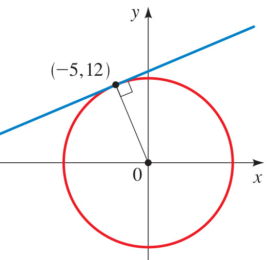{width=25%}

Calcule las ecuaciones de la circunferencia y de la recta para la Figura anterior, sabiendo que corresponden al Ejercicio 129 de la pág. 133 del libro de Stewart. Identifique cuáles de las siguientes afirmaciones son **verdaderas**:

<label><input type="checkbox" name="q17796553104331422" value="1" data-correct="true" > La ecuación de la circunferencia es exactamente $x^2 + y^2 = 25$.</label>

<label><input type="checkbox" name="q17796553104331422" value="2" data-correct="true" > La ecuación de la recta tangente es exactamente $3x + 4y = 25$.</label>

<label><input type="checkbox" name="q17796553104331422" value="3" data-correct="true" > El punto de tangencia ilustrado en el plano cartesiano tiene coordenadas exactas $(3,4)$.</label>

<label><input type="checkbox" name="q17796553104331422" value="4" data-correct="false" > La ecuación de la circunferencia es $x^2 + y^2 = 16$.</label>

<label><input type="checkbox" name="q17796553104331422" value="5" data-correct="false" > La ecuación de la recta tangente es $4x + 3y = 25$.</label>

<label><input type="checkbox" name="q17796553104331422" value="6" data-correct="false" > La recta es secante y corta a la circunferencia en los puntos $(5,0)$ y $(0,5)$.</label>

<button type="button" class="learnr-submit-btn" onclick="checkLearnrQuestion('q17796553104331422')">Enviar Respuestas</button>

¡Excelente! La circunferencia es $x^2+y^2=25$ y la recta es $3x+4y=25$.

Incorrecto. Se deduce de la figura que el círculo tiene centro en el origen y pasa por el punto $(3,4)$, dando la ecuación $x^2+y^2=3^2+4^2=25$. La recta es tangente en $(3,4)$, por lo que su ecuación es $3x+4y=25$.

Intentar de nuevo

true

Halle las ecuaciones de las rectas que pasan por (0,4) que son tangentes al círculo $x^{2}+y^{2}=4$. Seleccione cuáles de las siguientes afirmaciones son **verdaderas**:

<label><input type="checkbox" name="q17796553104408223" value="1" data-correct="true" > Las ecuaciones de las dos rectas tangentes que pasan por $(0,4)$ son exactamente $y = \sqrt{3}x + 4$ e $y = -\sqrt{3}x + 4$.</label>

<label><input type="checkbox" name="q17796553104408223" value="2" data-correct="true" > Los puntos de tangencia en el círculo tienen coordenadas exactas $(\sqrt{3}, 1)$ y $(-\sqrt{3}, 1)$.</label>

<label><input type="checkbox" name="q17796553104408223" value="3" data-correct="true" > Las pendientes de las dos rectas tangentes correspondientes son $m_1 = \sqrt{3}$ y $m_2 = -\sqrt{3}$.</label>

<label><input type="checkbox" name="q17796553104408223" value="4" data-correct="false" > Las ecuaciones de las rectas tangentes son $y = \sqrt{2}x + 4$ e $y = -\sqrt{2}x + 4$.</label>

<label><input type="checkbox" name="q17796553104408223" value="5" data-correct="false" > Los puntos de tangencia en el círculo se ubican exactamente en el eje X en $(2,0)$ y $(-2,0)$.</label>

<label><input type="checkbox" name="q17796553104408223" value="6" data-correct="false" > Las pendientes de las rectas tangentes son $m = \pm \frac{\sqrt{3}}{3}$.</label>

<button type="button" class="learnr-submit-btn" onclick="checkLearnrQuestion('q17796553104408223')">Enviar Respuestas</button>

¡Excelente! Las rectas tangentes son $y = \pm \sqrt{3}x + 4$ y los puntos de contacto son $(\pm\sqrt{3}, 1)$.

Incorrecto. Escribe la recta como $y = mx+4$. Reemplaza en el círculo y exige que el discriminante de la ecuación cuadrática resultante sea cero: $\Delta = 64m^2 - 48(1+m^2) = 0 \Rightarrow 16m^2 = 48 \Rightarrow m = \pm \sqrt{3}$.

Intentar de nuevo

true

### Circunferencia y Recta V5

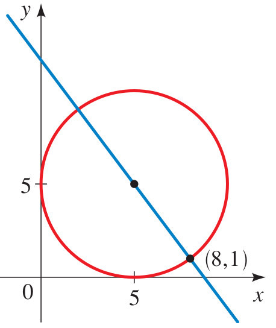{width=25%}

Calcule las ecuaciones de la circunferencia y de la recta para la Figura anterior, sabiendo que corresponden al Ejercicio 44 de la pág. 485 del libro de Stewart. Identifique cuáles de las siguientes afirmaciones son **verdaderas**:

<label><input type="checkbox" name="q17796553104485069" value="1" data-correct="true" > La ecuación de la circunferencia es exactamente $(x-3)^2 + y^2 = 9$.</label>

<label><input type="checkbox" name="q17796553104485069" value="2" data-correct="true" > La ecuación de la recta tangente que pasa por el origen es exactamente $y = \frac{\sqrt{3}}{3}x$.</label>

<label><input type="checkbox" name="q17796553104485069" value="3" data-correct="true" > El punto de tangencia entre la circunferencia y la recta en el primer cuadrante tiene coordenadas exactas $\left(\frac{9}{4}, \frac{3\sqrt{3}}{4}\right)$.</label>

<label><input type="checkbox" name="q17796553104485069" value="4" data-correct="false" > La ecuación de la circunferencia es $x^2 + y^2 = 9$.</label>

<label><input type="checkbox" name="q17796553104485069" value="5" data-correct="false" > La ecuación de la recta tangente es $y = \sqrt{3}x$.</label>

<label><input type="checkbox" name="q17796553104485069" value="6" data-correct="false" > La circunferencia tiene centro en el origen $(0,0)$ y tiene radio unitario.</label>

<button type="button" class="learnr-submit-btn" onclick="checkLearnrQuestion('q17796553104485069')">Enviar Respuestas</button>

¡Excelente! La circunferencia es $(x-3)^2+y^2=9$ y la recta es $y = \frac{\sqrt{3}}{3}x$.

Incorrecto. El círculo tiene centro en $(3,0)$ y radio $3$, dando la ecuación $(x-3)^2+y^2=9$. La recta pasa por $(0,0)$ y forma un ángulo de $30^o$ con el eje horizontal, dando la pendiente $\tan(30^o) = \frac{\sqrt{3}}{3}$.

Intentar de nuevo

true

---

## Bloque 4: Aplicaciones Varias de Funciones y Desigualdades

### Preguntas 59 a 64 (Aplicaciones en Ingeniería y Física)

### Avión Sónico (Número de Mach)

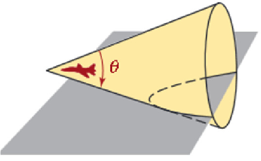{width=30%}

La relación de la velocidad de un avión con la velocidad del sonido se llama número de Mack, M, del avión. Si M>1, el avión produce ondas sonoras que forma un cono en movimiento, como se ve en la Figura anterior. Un estampido sónico se oye en la intersección del cono con el suelo. Si el ángulo del vértice del cono es θ, entonces $sen\left(\frac{\theta}{2}\right)=\frac{1}{M}$. Si $\theta=\frac{\pi}{6}$, calcule el valor exacto del número de Mach. Seleccione cuáles de las siguientes afirmaciones son **verdaderas**:

<label><input type="checkbox" name="q17796553104575248" value="1" data-correct="true" > El valor exacto del número de Mach M del avión es exactamente $\sqrt{6}+\sqrt{2}$ (aproximadamente $3.86$).</label>

<label><input type="checkbox" name="q17796553104575248" value="2" data-correct="true" > El valor de la razón trigonométrica es $sen\left(\frac{\pi}{12}\right) = \frac{\sqrt{6}-\sqrt{2}}{4}$ (aproximadamente $0.2588$).</label>

<label><input type="checkbox" name="q17796553104575248" value="3" data-correct="true" > El número de Mach indica que la velocidad del avión es aproximadamente 3.86 veces la rapidez del sonido en el aire.</label>

<label><input type="checkbox" name="q17796553104575248" value="4" data-correct="false" > El valor exacto del número de Mach M es de 2.00.</label>

<label><input type="checkbox" name="q17796553104575248" value="5" data-correct="false" > El valor de la razón trigonométrica calculada es exactamente 0.50.</label>

<label><input type="checkbox" name="q17796553104575248" value="6" data-correct="false" > El número de Mach M del avión es menor a 1, indicando que el avión viaja a una velocidad subsónica.</label>

<button type="button" class="learnr-submit-btn" onclick="checkLearnrQuestion('q17796553104575248')">Enviar Respuestas</button>

¡Excelente! El número de Mach exacto es $\sqrt{6}+\sqrt{2}$ (aproximadamente $3.86$).

Incorrecto. Si $\theta=\pi/6$, entonces $\theta/2 = \pi/12 = 15^o$. Calculamos $\sin(15^o) = \sin(45^o-30^o) = \frac{\sqrt{6}-\sqrt{2}}{4}$. El número de Mach es la recíproca: $M = \frac{4}{\sqrt{6}-\sqrt{2}} = \sqrt{6}+\sqrt{2}$.

Intentar de nuevo

true

Si 7 veces el cuadrado de un número positivo se reduce en 3, el resultado es mayor que 60.¿Qué puede determinarse sobre el número? Identifique cuáles de las siguientes afirmaciones son **verdaderas**:

<label><input type="checkbox" name="q17796553104665316" value="1" data-correct="true" > El número positivo buscado debe ser estrictamente mayor a $3$ (es decir, $x > 3$).</label>

<label><input type="checkbox" name="q17796553104665316" value="2" data-correct="true" > El conjunto solución de la desigualdad cuadrática para la variable real general es $x \in (-\infty, -3) \cup (3, \infty)$.</label>

<label><input type="checkbox" name="q17796553104665316" value="3" data-correct="true" > Al evaluar el límite inferior $x = 3$ en la expresión se obtiene exactamente $7(3)^2 - 3 = 60$, lo cual ratifica el valor frontera.</label>

<label><input type="checkbox" name="q17796553104665316" value="4" data-correct="false" > El número positivo buscado debe ser estrictamente mayor a 9.</label>

<label><input type="checkbox" name="q17796553104665316" value="5" data-correct="false" > El número positivo buscado se encuentra dentro del rango acotado de $0 < x < 3$.</label>

<label><input type="checkbox" name="q17796553104665316" value="6" data-correct="false" > La desigualdad cuadrática planteada se expresa matemáticamente como $7x^2 - 3 < 60$.</label>

<button type="button" class="learnr-submit-btn" onclick="checkLearnrQuestion('q17796553104665316')">Enviar Respuestas</button>

¡Excelente! El número positivo debe ser mayor que $3$ ($x &gt; 3$).

Incorrecto. Desigualdad: $7x^2 - 3 &gt; 60 \Rightarrow 7x^2 &gt; 63 \Rightarrow x^2 &gt; 9$. Al ser un número positivo, la solución única es $x &gt; 3$.

Intentar de nuevo

true

### Desigualdad del Rectángulo

{width=25%}

Los lados de un cuadrado se extienden para formar un rectángulo. como se muestra en la Figura anterior, un lado se extiende 2 cm y el otro 5 cm. Si el área del rectángulo resultante es menor de 130 cm², ¿cuáles son la posibles longitudes de un lado del cuadrado original? Seleccione cuáles de las siguientes afirmaciones son **verdaderas**:

<label><input type="checkbox" name="q17796553104745945" value="1" data-correct="true" > Las posibles longitudes del lado del cuadrado original están acotadas en el intervalo de $0 < x < 10\text{ cm}$.</label>

<label><input type="checkbox" name="q17796553104745945" value="2" data-correct="true" > La desigualdad cuadrática del área del rectángulo resultante es $(x+2)(x+5) < 130$.</label>

<label><input type="checkbox" name="q17796553104745945" value="3" data-correct="true" > La inecuación simplificada resultante es $x^2 + 7x - 120 < 0$, la cual se factoriza como $(x+15)(x-10) < 0$.</label>

<label><input type="checkbox" name="q17796553104745945" value="4" data-correct="false" > Las posibles longitudes del lado del cuadrado original están dadas por el intervalo $x < 10\text{ cm}$ sin límite inferior.</label>

<label><input type="checkbox" name="q17796553104745945" value="5" data-correct="false" > Las posibles longitudes del lado del cuadrado original están acotadas en el intervalo de $0 < x < 12\text{ cm}$.</label>

<label><input type="checkbox" name="q17796553104745945" value="6" data-correct="false" > La inecuación simplificada resultante es $x^2 + 7x - 130 < 0$.</label>

<button type="button" class="learnr-submit-btn" onclick="checkLearnrQuestion('q17796553104745945')">Enviar Respuestas</button>

¡Excelente! El intervalo es $0 &lt; x &lt; 10\text{ cm}$ y la factorización es correcta.

Incorrecto. El área del rectángulo es $(x+2)(x+5) &lt; 130 \Rightarrow x^2+7x-120 &lt; 0 \Rightarrow (x+15)(x-10) &lt; 0$. Dado que la longitud del lado debe ser mayor que cero, la solución es $0 &lt; x &lt; 10$.

Intentar de nuevo

true

La suma de dos números es 33 y su cociente es $\frac{5}{6}$. Halle los dos números. Identifique cuáles de las siguientes afirmaciones son **verdaderas**:

<label><input type="checkbox" name="q17796553104838306" value="1" data-correct="true" > El menor de los dos números buscados es $15$.</label>

<label><input type="checkbox" name="q17796553104838306" value="2" data-correct="true" > El mayor de los dos números buscados es $18$.</label>

<label><input type="checkbox" name="q17796553104838306" value="3" data-correct="true" > La diferencia absoluta entre ambos números es exactamente igual a $3$.</label>

<label><input type="checkbox" name="q17796553104838306" value="4" data-correct="false" > Los dos números buscados son $14$ y $19$.</label>

<label><input type="checkbox" name="q17796553104838306" value="5" data-correct="false" > Los dos números buscados son $12$ y $21$.</label>

<label><input type="checkbox" name="q17796553104838306" value="6" data-correct="false" > El producto de los dos números encontrados es igual a $250$.</label>

<button type="button" class="learnr-submit-btn" onclick="checkLearnrQuestion('q17796553104838306')">Enviar Respuestas</button>

¡Excelente! Los números son $15$ y $18$, y su diferencia es $3$.

Incorrecto. Plantea el sistema: $x+y=33$ y $\frac{x}{y}=\frac{5}{6} \Rightarrow 6x = 5y$. Reemplazando se obtiene $x=15$ e $y=18$.

Intentar de nuevo

true

### Cilindro Inscrito en Esfera

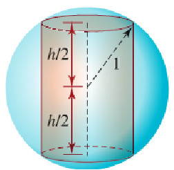{width=25%}

Un cilindro circular de altura h está inscrito en una esfera de radio 1 como se ilustra en la Figura anterior. Exprese el volumen del cilindro como una función de h. Seleccione cuáles de las siguientes afirmaciones son **verdaderas**:

<label><input type="checkbox" name="q17796553104917145" value="1" data-correct="true" > El volumen del cilindro inscrito expresado como función de la altura h es exactamente $V(h) = \pi\left(1 - \frac{h^2}{4}\right)h$.</label>

<label><input type="checkbox" name="q17796553104917145" value="2" data-correct="true" > El radio r de la base del cilindro inscrito expresado en términos de la altura h cumple la relación $r^2 = 1 - \frac{h^2}{4}$.</label>

<label><input type="checkbox" name="q17796553104917145" value="3" data-correct="true" > El dominio físico e históricamente válido de la altura h para este volumen inscrito es el intervalo acotado $0 < h < 2$.</label>

<label><input type="checkbox" name="q17796553104917145" value="4" data-correct="false" > El volumen del cilindro inscrito expresado como función de la altura h es $V(h) = \pi(1 - h^2)h$.</label>

<label><input type="checkbox" name="q17796553104917145" value="5" data-correct="false" > El radio r de la base del cilindro inscrito expresado cumple la relación $r^2 = 1 - \frac{h^2}{2}$.</label>

<label><input type="checkbox" name="q17796553104917145" value="6" data-correct="false" > El volumen del cilindro inscrito es de tipo inversamente proporcional al cuadrado de la altura h.</label>

<button type="button" class="learnr-submit-btn" onclick="checkLearnrQuestion('q17796553104917145')">Enviar Respuestas</button>

¡Excelente! El volumen es $V(h) = \pi\left(1 - \frac{h^2}{4}\right)h$ y el dominio físico es $0 &lt; h &lt; 2$.

Incorrecto. El volumen del cilindro es $V = \pi r^2 h$. Usando el Teorema de Pitágoras en el triángulo de la esfera: $r^2 + \left(\frac{h}{2}\right)^2 = 1^2 \Rightarrow r^2 = 1 - \frac{h^2}{4}$. Reemplazando da la función.

Intentar de nuevo

true

### Arco Parabólico del Puente

{width=30%}

Determine la función cuadrática que describe el arco parabólico que se ilustra en la Figura anterior. Identifique cuáles de las siguientes afirmaciones son **verdaderas**:

<label><input type="checkbox" name="q17796553104988576" value="1" data-correct="true" > La función cuadrática que describe el arco parabólico es exactamente $y = -\frac{1}{10}x^2 + 10$.</label>

<label><input type="checkbox" name="q17796553104988576" value="2" data-correct="true" > La altura máxima del arco de la parábola es de exactamente $10\text{ metros}$ y ocurre en el eje de simetría $x = 0$.</label>

<label><input type="checkbox" name="q17796553104988576" value="3" data-correct="true" > Los puntos de apoyo o corte con el suelo del arco están ubicados en las coordenadas $(-10,0)$ y $(10,0)$.</label>

<label><input type="checkbox" name="q17796553104988576" value="4" data-correct="false" > La función cuadrática que describe el arco parabólico es $y = -\frac{1}{20}x^2 + 10$.</label>

<label><input type="checkbox" name="q17796553104988576" value="5" data-correct="false" > La ecuación cuadrática que modela el arco está dada por $y = -x^2 + 10$.</label>

<label><input type="checkbox" name="q17796553104988576" value="6" data-correct="false" > El arco parabólico del puente tiene una luz total equivalente a exactamente 15 metros.</label>

<button type="button" class="learnr-submit-btn" onclick="checkLearnrQuestion('q17796553104988576')">Enviar Respuestas</button>

¡Excelente! La función es $y = -\frac{1}{10}x^2 + 10$, con apoyos en $\pm 10$.

Incorrecto. Ubicando el vértice en el origen superior $(0,10)$, la parábola es $y = ax^2 + 10$. Dado que corta al suelo a 10 metros del centro ($x=\pm 10$): $0 = a(10)^2+10 \Rightarrow 100a = -10 \Rightarrow a = -\frac{1}{10}$.

Intentar de nuevo

true

### Preguntas 65 a 69 (Geometría del Cubo, Círculos y Gas Ideal)

### Diagonal del Cubo

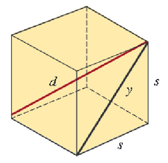{width=25%}

El diámetro d de un cubo es la distancia entre vértices opuestos como se muestra en la Figura anterior. Exprese el diámetro d como función de la longitud s de un lado del cubo. Seleccione cuáles de las siguientes afirmaciones son **verdaderas**:

<label><input type="checkbox" name="q17796553105062584" value="1" data-correct="true" > El diámetro tridimensional d de la diagonal del cubo expresado como función es exactamente $d(s) = s\sqrt{3}$.</label>

<label><input type="checkbox" name="q17796553105062584" value="2" data-correct="true" > La longitud de la diagonal bidimensional y de una de las caras del cubo en términos del lado es $y = s\sqrt{2}$.</label>

<label><input type="checkbox" name="q17796553105062584" value="3" data-correct="true" > La relación de la diagonal del cubo con sus lados se modela mediante el teorema tridimensional de Pitágoras: $d^2 = s^2 + s^2 + s^2 = 3s^2$.</label>

<label><input type="checkbox" name="q17796553105062584" value="4" data-correct="false" > El diámetro tridimensional d de la diagonal del cubo expresado como función es $d(s) = s\sqrt{2}$.</label>

<label><input type="checkbox" name="q17796553105062584" value="5" data-correct="false" > La longitud de la diagonal bidimensional y de una de las caras del cubo es de exactamente $y = 2s$.</label>

<label><input type="checkbox" name="q17796553105062584" value="6" data-correct="false" > La diagonal del cubo y la longitud de su lado s son magnitudes inversamente proporcionales.</label>

<button type="button" class="learnr-submit-btn" onclick="checkLearnrQuestion('q17796553105062584')">Enviar Respuestas</button>

¡Excelente! La diagonal del cubo es $d(s) = s\sqrt{3}$ y la de una de las caras es $s\sqrt{2}$.

Incorrecto. La diagonal de una de las caras cuadradas es $y = \sqrt{s^2+s^2} = s\sqrt{2}$. La diagonal tridimensional que corta al cubo es $d = \sqrt{y^2+s^2} = \sqrt{2s^2+s^2} = s\sqrt{3}$.

Intentar de nuevo

true

### Área del Círculo Sombreado

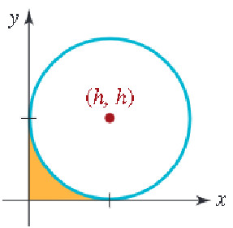{width=25%}

Exprese el área de la región sombreada de la Figura anterior como una función de h. (sabiendo que la figura representa un círculo de radio fijo r). Identifique cuáles de las siguientes afirmaciones son **verdaderas**:

<label><input type="checkbox" name="q17796553105148874" value="1" data-correct="true" > El área de la región sombreada expresada como función de la distancia h es exactamente $A(h) = \pi(r^2 - h^2)$.</label>

<label><input type="checkbox" name="q17796553105148874" value="2" data-correct="true" > El radio R del círculo interior sombreado expresado en términos de la distancia h cumple la relación Pitagórica $R^2 = r^2 - h^2$.</label>

<label><input type="checkbox" name="q17796553105148874" value="3" data-correct="true" > El área de la región sombreada disminuye conforme la distancia h desde el centro del círculo hacia la cuerda aumenta.</label>

<label><input type="checkbox" name="q17796553105148874" value="4" data-correct="false" > El área de la región sombreada expresada como función de la distancia h es $A(h) = \pi r^2 - \pi h^2$.</label>

<label><input type="checkbox" name="q17796553105148874" value="5" data-correct="false" > El radio R de la base sombreada interna cumple la relación Pitagórica $R^2 = r^2 + h^2$.</label>

<label><input type="checkbox" name="q17796553105148874" value="6" data-correct="false" > El área de la región sombreada es directamente proporcional a la distancia h.</label>

<button type="button" class="learnr-submit-btn" onclick="checkLearnrQuestion('q17796553105148874')">Enviar Respuestas</button>

¡Excelente! El área sombreada cumple la relación $A(h) = \pi(r^2 - h^2)$.

Incorrecto. Se cumple que el radio del círculo interior sombreado es un cateto del triángulo rectángulo de hipotenusa $r$ y cateto $h \Rightarrow R^2 + h^2 = r^2 \Rightarrow R^2 = r^2 - h^2$. Su área es $A = \pi R^2$.

Intentar de nuevo

true

### Área entre Cuatro Círculos

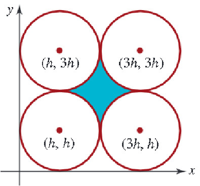{width=25%}

Considere los cuatro círculos que se ilustran en la Figura anterior. Exprese el área de la región sombreada entre ellos como función de h. (sabiendo que h es el radio de cada círculo). Seleccione cuáles de las siguientes afirmaciones son **verdaderas**:

<label><input type="checkbox" name="q17796553105229279" value="1" data-correct="true" > El área de la región sombreada central expresada en función de h es exactamente $A(h) = h^2(4 - \pi)$.</label>

<label><input type="checkbox" name="q17796553105229279" value="2" data-correct="true" > El área del cuadrado que conecta los centros de los cuatro círculos tangentes es exactamente igual a $4h^2$.</label>

<label><input type="checkbox" name="q17796553105229279" value="3" data-correct="true" > El área total correspondiente a las cuatro porciones de círculo interiores al cuadrado es de exactamente $\pi h^2$.</label>

<label><input type="checkbox" name="q17796553105229279" value="4" data-correct="false" > El área de la región sombreada central expresada en función de h es $A(h) = 4h^2(1 - \pi)$.</label>

<label><input type="checkbox" name="q17796553105229279" value="5" data-correct="false" > El área de la región sombreada central expresada en función de h es $A(h) = h^2(\pi - 4)$.</label>

<label><input type="checkbox" name="q17796553105229279" value="6" data-correct="false" > El área de la región sombreada central y el radio h son magnitudes inversamente proporcionales.</label>

<button type="button" class="learnr-submit-btn" onclick="checkLearnrQuestion('q17796553105229279')">Enviar Respuestas</button>

¡Excelente! El área sombreada central es $A(h) = h^2(4-\pi)$ y el área del cuadrado es $4h^2$.

Incorrecto. El área del cuadrado que une los centros es de lado $2h \Rightarrow A_c = (2h)^2 = 4h^2$. Resta los cuatro sectores circulares de radio $h$ ($4 \times \frac{1}{4}\pi h^2 = \pi h^2$) para hallar el área sombreada.

Intentar de nuevo

true

Un alambre de 32 cm de longitud se cortó en dos pedazos, y cada parte se dobló para formar un cuadrado. El área total encerrada es de 34 cm². Determine la longitud de cada pedazo de alambre. Identifique cuáles de las siguientes afirmaciones son **verdaderas**:

<label><input type="checkbox" name="q17796553105332943" value="1" data-correct="true" > La longitud de los dos pedazos de alambre en los que se corta el alambre es de exactamente $12\text{ cm}$ y $20\text{ cm}$.</label>

<label><input type="checkbox" name="q17796553105332943" value="2" data-correct="true" > El lado del cuadrado formado por el pedazo menor mide $3\text{ cm}$, y el lado del cuadrado del pedazo mayor mide $5\text{ cm}$.</label>

<label><input type="checkbox" name="q17796553105332943" value="3" data-correct="true" > La suma de las áreas de los dos cuadrados formados es de exactamente $3^2 + 5^2 = 34\text{ cm}^2$.</label>

<label><input type="checkbox" name="q17796553105332943" value="4" data-correct="false" > La longitud de los dos pedazos de alambre es de exactamente 16 cm y 16 cm.</label>

<label><input type="checkbox" name="q17796553105332943" value="5" data-correct="false" > La longitud de los dos pedazos de alambre es de exactamente 10 cm y 22 cm.</label>

<label><input type="checkbox" name="q17796553105332943" value="6" data-correct="false" > La longitud del pedazo de alambre mayor es de 24 cm.</label>

<button type="button" class="learnr-submit-btn" onclick="checkLearnrQuestion('q17796553105332943')">Enviar Respuestas</button>

¡Excelente! Los pedazos miden $12$ y $20$ cm, dando cuadrados de lados $3$ y $5$ cm.

Incorrecto. Sean $L_1$ y $L_2$ las longitudes de los pedazos: $L_1 + L_2 = 32$. Lados: $x = L_1/4$ e $y = L_2/4$. Área total: $\left(\frac{L_1}{4}\right)^2 + \left(\frac{32-L_1}{4}\right)^2 = 34$.

Intentar de nuevo

true

Para un gas ideal a baja presión, el volumen V a T grados Celsius está dado por: $V=V_{0}\Big(1+\dfrac{T}{273.15}\Big)$ donde $V_{0}$ es el volumen a cero grados Celsius. ¿A qué temperatura es $V=\dfrac{3}{4}V_{0}$ para un gas ideal a baja presión? Seleccione cuáles de las siguientes afirmaciones son **verdaderas**:

<label><input type="checkbox" name="q17796553105419101" value="1" data-correct="true" > La temperatura necesaria para reducir el volumen es de exactamente $-68.2875\text{ °C}$ (aproximadamente $-68.29\text{ °C}$).</label>

<label><input type="checkbox" name="q17796553105419101" value="2" data-correct="true" > La constante del coeficiente de expansión térmica del volumen del gas ideal es $\frac{1}{273.15} \approx 0.00366$.</label>

<label><input type="checkbox" name="q17796553105419101" value="3" data-correct="true" > La reducción del volumen del gas ideal indica que se encuentra en un estado de menor temperatura respecto a los cero grados Celsius.</label>

<label><input type="checkbox" name="q17796553105419101" value="4" data-correct="false" > La temperatura necesaria para reducir el volumen es de exactamente -65.50 °C.</label>

<label><input type="checkbox" name="q17796553105419101" value="5" data-correct="false" > La temperatura necesaria para reducir el volumen es de exactamente -70.00 °C.</label>

<label><input type="checkbox" name="q17796553105419101" value="6" data-correct="false" > La temperatura necesaria es de 50.0 °C, indicando que el gas debe calentarse.</label>

<button type="button" class="learnr-submit-btn" onclick="checkLearnrQuestion('q17796553105419101')">Enviar Respuestas</button>

¡Excelente! La temperatura calculada es de $-68.2875\text{ °C}$ (aproximadamente $-68.29\text{ °C}$).

Incorrecto. Plantea la ecuación: $\frac{3}{4}V_0 = V_0\left(1 + \frac{T}{273.15}\right) \Rightarrow 0.75 = 1 + \frac{T}{273.15} \Rightarrow -0.25 \times 273.15 = T$.

Intentar de nuevo

true

---

## Reporte Final de Calificación

Para ver el análisis de tu desempeño en esta prueba, haz clic en el siguiente botón. El sistema evaluará tus respuestas y te proporcionará recomendaciones personalizadas.

<button type="button" class="learnr-submit-btn" style="margin-bottom:1rem;" onclick="showScoreReport('sr17796553105602279', 69, '<strong>¡Espectacular!</strong> Tienes un dominio sobresaliente y sumamente robusto en el planteamiento y la resolución de problemas algebraicos complejos, mezclas, tasas de trabajo y geometría analítica en curvas. ¡Felicitaciones!', '<strong>¡Buen trabajo!</strong> Has aprobado la evaluación con éxito, pero aún hay ciertos conceptos que puedes pulir, especialmente en los problemas de geometría analítica (elipses y circunferencias tangentes) o en los modelados de física y optimización geométrica. Te sugerimos revisar estos puntos.', '<strong>Se sugiere más práctica.</strong> Has tenido varias respuestas incorrectas o preguntas sin responder. Te sugerimos repasar los métodos de planteamiento algebraico, las reglas de tres directa y compuesta, y los teoremas fundamentales en geometría antes de volver a intentarlo.')">🏆 Obtener Mi Reporte de Resultados</button>

