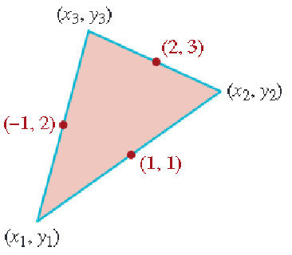

# Evaluación de Álgebra: Sistemas de Ecuaciones (Ev_SistemasEc1)

## Introducción

Bienvenido a la **Evaluación Interactiva de Álgebra: Sistemas de Ecuaciones (Ev_SistemasEc1)**.

Este cuestionario consta de **32 preguntas** exhaustivas divididas en tres grandes bloques para evaluar tu comprensión teórica, tu destreza en la resolución analítica y tu capacidad para aplicar sistemas de ecuaciones en diversos escenarios científicos y matemáticos.

> **Instrucciones Generales:**
> * Resuelve los problemas con papel y lápiz antes de contestar.
> * Las preguntas son de **selección múltiple con múltiples respuestas correctas (casillas de verificación)**. Debes seleccionar **todas** las afirmaciones que consideres correctas para obtener el puntaje completo en cada una.
> * Puedes intentar responder cada pregunta tantas veces como desees.
> * Al finalizar, haz clic en el botón de **"Obtener Mi Reporte de Resultados"** en la última sección para visualizar tu calificación y una retroalimentación formativa personalizada de estudio.
> * ¡Mucho éxito en tu evaluación!

---

## Bloque 1: Sistemas Lineales

En este bloque se abordan problemas geométricos y la resolución de sistemas de ecuaciones lineales de dimensiones $2 \times 2$ y $3 \times 3$, analizando su consistencia, soluciones únicas, infinitas o la ausencia de las mismas.

### Pregunta 1 (Problema Geométrico de los Tres Vértices)

✓ Seleccionar afirmaciones VERDADERAS

En la figura anterior se muestran los puntos medios de los lados de un triángulo, los cuales son $M_1(-1, 2)$ entre $P_1$ y $P_3$, $M_2(2, 3)$ entre $P_3$ y $P_2$, y $M_3(1, 1)$ entre $P_1$ y $P_2$. Determine los vértices del triángulo $P_1(x_1, y_1)$, $P_2(x_2, y_2)$ y $P_3(x_3, y_3)$ construyendo y resolviendo el sistema lineal $3 \times 3$. Identifica cuáles de las siguientes afirmaciones son **verdaderas**:

<label><input type="checkbox" name="q17798443703824219" value="1" data-correct="true" > El primer vértice del triángulo es $P_1(x_1, y_1) = (-2, 0)$.</label>

<label><input type="checkbox" name="q17798443703824219" value="2" data-correct="true" > El segundo vértice del triángulo es $P_2(x_2, y_2) = (4, 2)$.</label>

<label><input type="checkbox" name="q17798443703824219" value="3" data-correct="true" > El tercer vértice del triángulo es $P_3(x_3, y_3) = (0, 4)$.</label>

<label><input type="checkbox" name="q17798443703824219" value="4" data-correct="true" > La suma total de todas las coordenadas de los tres vértices es igual a $8$ (es decir, $x_1+y_1+x_2+y_2+x_3+y_3 = 8$).</label>

<label><input type="checkbox" name="q17798443703824219" value="5" data-correct="false" > El vértice $P_1$ está ubicado en el origen de coordenadas $(0,0)$.</label>

<label><input type="checkbox" name="q17798443703824219" value="6" data-correct="false" > El punto $P_3$ se encuentra en el tercer cuadrante del plano cartesiano.</label>

<label><input type="checkbox" name="q17798443703824219" value="7" data-correct="false" > Los puntos medios conocidos corresponden directamente a los vértices del triángulo.</label>

<button type="button" class="learnr-submit-btn" onclick="checkLearnrQuestion('q17798443703824219')">Enviar Respuesta</button>

¡Excelente! Has resuelto el problema geométrico de los tres vértices con total precisión analítica.

Incorrecto. Recuerda aplicar la fórmula del punto medio: $M = (\frac{x_a+x_b}{2}, \frac{y_a+y_b}{2})$ para cada par de vértices adyacentes, construyendo un sistema de $3 \times 3$ independiente para las $x$ y las $y$.

Intentar de nuevo

true

### Pregunta 2 (Sistema Lineal $2 \times 2$)

✓ Seleccionar afirmaciones VERDADERAS

Obtener la solución si existe para el sistema lineal: $$\left\{ \begin{array}{clrr} x & - & 4y+1=0 & (1) \\\\ 3x & + & 2y-1=0 & (2) \end{array} \right.$$ Seleccione las afirmaciones que son **verdaderas**:

<label><input type="checkbox" name="q17798443703949963" value="1" data-correct="true" > La solución única del sistema es $(x, y) = (\frac{1}{7}, \frac{2}{7})$.</label>

<label><input type="checkbox" name="q17798443703949963" value="2" data-correct="true" > El sistema es consistente y determinado.</label>

<label><input type="checkbox" name="q17798443703949963" value="3" data-correct="true" > Al representar las ecuaciones gráficamente, corresponden a dos rectas que se intersectan en un único punto del plano cartesiano.</label>

<label><input type="checkbox" name="q17798443703949963" value="4" data-correct="false" > La solución del sistema es $(x, y) = (1, 2)$.</label>

<label><input type="checkbox" name="q17798443703949963" value="5" data-correct="false" > El sistema es inconsistente y no tiene solución.</label>

<label><input type="checkbox" name="q17798443703949963" value="6" data-correct="false" > El sistema es consistente e indeterminado, con infinitas soluciones.</label>

<button type="button" class="learnr-submit-btn" onclick="checkLearnrQuestion('q17798443703949963')">Enviar Respuesta</button>

¡Excelente! Has obtenido la solución exacta y clasificado el sistema de forma correcta.

Incorrecto. Despeja $x$ en la primera ecuación ($x = 4y - 1$), sustituye en la segunda, y encuentra las fracciones simplificadas correspondientes.

Intentar de nuevo

true

### Pregunta 3 (Sistema Lineal $2 \times 2$ sin solución)

✓ Seleccionar afirmaciones VERDADERAS

Obtener la solución si existe para el sistema lineal: $$\left\{ \begin{array}{clrr} x & - & 2y=6 & (1) \\\\ -0.5x & + & y=1 & (2) \end{array} \right.$$ Identifique cuáles de las siguientes afirmaciones son **verdaderas**:

<label><input type="checkbox" name="q17798443704039347" value="1" data-correct="true" > El sistema no tiene solución (es inconsistente).</label>

<label><input type="checkbox" name="q17798443704039347" value="2" data-correct="true" > Las dos ecuaciones corresponden a rectas estrictamente paralelas en el plano cartesiano.</label>

<label><input type="checkbox" name="q17798443704039347" value="3" data-correct="true" > El determinante de la matriz de coeficientes del sistema es cero.</label>

<label><input type="checkbox" name="q17798443704039347" value="4" data-correct="false" > La solución única del sistema es $(x, y) = (6, 1)$.</label>

<label><input type="checkbox" name="q17798443704039347" value="5" data-correct="false" > El sistema tiene infinitas soluciones del tipo indeterminado.</label>

<label><input type="checkbox" name="q17798443704039347" value="6" data-correct="false" > Las dos rectas son coincidentes (corresponden a la misma recta).</label>

<button type="button" class="learnr-submit-btn" onclick="checkLearnrQuestion('q17798443704039347')">Enviar Respuesta</button>

¡Excelente! Has reconocido un sistema lineal inconsistente sin solución y sus propiedades geométricas.

Incorrecto. Multiplica la segunda ecuación por $-2$ y notarás que el sistema genera una contradicción matemática: $x - 2y = -2$ contra $x - 2y = 6$.

Intentar de nuevo

true

### Pregunta 4 (Sistema Lineal $2 \times 2$)

✓ Seleccionar afirmaciones VERDADERAS

Obtener la solución si existe para el sistema lineal: $$\left\{ \begin{array}{clrr} x & - & y=2 & (1) \\\\ x & + & y=1 & (2) \end{array} \right.$$ Seleccione cuáles de las siguientes afirmaciones son **verdaderas**:

<label><input type="checkbox" name="q17798443704131319" value="1" data-correct="true" > La solución única del sistema es $(x, y) = (1.5, -0.5)$ (o $(3/2, -1/2)$).</label>

<label><input type="checkbox" name="q17798443704131319" value="2" data-correct="true" > El sistema es consistente determinado.</label>

<label><input type="checkbox" name="q17798443704131319" value="3" data-correct="true" > La suma algebraica de las coordenadas de la solución es igual a $1$ (es decir, $x + y = 1$).</label>

<label><input type="checkbox" name="q17798443704131319" value="4" data-correct="false" > La solución única del sistema es $(x, y) = (2, 0)$.</label>

<label><input type="checkbox" name="q17798443704131319" value="5" data-correct="false" > El sistema es inconsistente y carece de solución.</label>

<label><input type="checkbox" name="q17798443704131319" value="6" data-correct="false" > El sistema es compatible e indeterminado con infinitas soluciones.</label>

<button type="button" class="learnr-submit-btn" onclick="checkLearnrQuestion('q17798443704131319')">Enviar Respuesta</button>

¡Excelente! Has resuelto este sistema elemental $2 \times 2$ correctamente.

Incorrecto. Puedes sumar directamente ambas ecuaciones para obtener $2x = 3 \Rightarrow x = 1.5$, y luego sustituir para hallar $y$.

Intentar de nuevo

true

### Pregunta 5 (Sistema Lineal $2 \times 2$ con infinitas soluciones)

✓ Seleccionar afirmaciones VERDADERAS

Obtener la solución si existe para el sistema lineal: $$\left\{ \begin{array}{clrr} -x & - & 2y=-4 & (1) \\\\ 5x & + & 10y=20 & (2) \end{array} \right.$$ Identifica cuáles de las siguientes afirmaciones son **verdaderas**:

<label><input type="checkbox" name="q17798443704224374" value="1" data-correct="true" > El sistema tiene infinitas soluciones expresadas de la forma $x = 4 - 2y$ para cualquier $y \in \mathbb{R}$.</label>

<label><input type="checkbox" name="q17798443704224374" value="2" data-correct="true" > El sistema es consistente e indeterminado (compatible indeterminado).</label>

<label><input type="checkbox" name="q17798443704224374" value="3" data-correct="true" > Las dos ecuaciones representan exactamente la misma recta geométrica en el plano.</label>

<label><input type="checkbox" name="q17798443704224374" value="4" data-correct="false" > El sistema no tiene solución en el conjunto de los reales.</label>

<label><input type="checkbox" name="q17798443704224374" value="5" data-correct="false" > La solución única del sistema es $(x, y) = (2, 1)$.</label>

<label><input type="checkbox" name="q17798443704224374" value="6" data-correct="false" > La solución única del sistema es $(x, y) = (4, 0)$.</label>

<button type="button" class="learnr-submit-btn" onclick="checkLearnrQuestion('q17798443704224374')">Enviar Respuesta</button>

¡Excelente! Has identificado con éxito las características de un sistema compatible indeterminado.

Incorrecto. Multiplica la primera ecuación por $-5$ y verás que es idéntica a la segunda ecuación. Esto significa que son linealmente dependientes.

Intentar de nuevo

true

### Pregunta 6 (Sistema Lineal $3 \times 3$)

✓ Seleccionar afirmaciones VERDADERAS

Obtener la solución si existe para el sistema lineal: $$\left\{ \begin{array}{clrrr} x & + & y & -z=0 & (1) \\\\ x & - & y & +z=2 & (2) \\\\ 2x & + & y & -4z=-8 & (3) \end{array} \right.$$ Seleccione las afirmaciones que son **verdaderas**:

<label><input type="checkbox" name="q17798443704348859" value="1" data-correct="true" > La solución única del sistema es $(x, y, z) = (1, 2, 3)$.</label>

<label><input type="checkbox" name="q17798443704348859" value="2" data-correct="true" > El sistema es consistente y determinado.</label>

<label><input type="checkbox" name="q17798443704348859" value="3" data-correct="true" > El determinante de la matriz de coeficientes del sistema es diferente de cero.</label>

<label><input type="checkbox" name="q17798443704348859" value="4" data-correct="false" > La solución del sistema es $(x, y, z) = (1, -2, -3)$.</label>

<label><input type="checkbox" name="q17798443704348859" value="5" data-correct="false" > El sistema es inconsistente y carece de soluciones reales.</label>

<label><input type="checkbox" name="q17798443704348859" value="6" data-correct="false" > El sistema tiene infinitas soluciones lineales.</label>

<button type="button" class="learnr-submit-btn" onclick="checkLearnrQuestion('q17798443704348859')">Enviar Respuesta</button>

¡Excelente! Has resuelto este sistema $3 \times 3$ aplicando operaciones elementales con total precisión.

Incorrecto. Suma las primeras dos ecuaciones para eliminar $y$ y $z$ simultáneamente, obteniendo $2x = 2 \Rightarrow x = 1$. Luego sustituye en las demás ecuaciones para despejar $y$ y $z$.

Intentar de nuevo

true

### Pregunta 7 (Sistema Lineal $3 \times 3$)

✓ Seleccionar afirmaciones VERDADERAS

Obtener la solución si existe para el sistema lineal: $$\left\{ \begin{array}{clrrr} x & + & y & +z=8 & (1) \\\\ x & - & 2y & +z=4 & (2) \\\\ x & + & y & -z=-4 & (3) \end{array} \right.$$ Identifique cuáles de las siguientes afirmaciones son **verdaderas**:

<label><input type="checkbox" name="q17798443704449018" value="1" data-correct="true" > La solución única del sistema es $(x, y, z) = (\frac{2}{3}, \frac{4}{3}, 6)$.</label>

<label><input type="checkbox" name="q17798443704449018" value="2" data-correct="true" > El determinante de la matriz de coeficientes del sistema es igual a $-6$.</label>

<label><input type="checkbox" name="q17798443704449018" value="3" data-correct="true" > El valor de la coordenada $z$ de la solución es un número entero ($z = 6$).</label>

<label><input type="checkbox" name="q17798443704449018" value="4" data-correct="false" > La solución única del sistema es $(x, y, z) = (2, 4, 6)$.</label>

<label><input type="checkbox" name="q17798443704449018" value="5" data-correct="false" > El sistema es inconsistente y no tiene solución.</label>

<label><input type="checkbox" name="q17798443704449018" value="6" data-correct="false" > El sistema admite infinitas soluciones reales.</label>

<button type="button" class="learnr-submit-btn" onclick="checkLearnrQuestion('q17798443704449018')">Enviar Respuesta</button>

¡Excelente! Has resuelto el sistema lineal de forma muy inteligente aprovechando las diferencias de ecuaciones.

Incorrecto. Resta la primera ecuación menos la tercera para obtener $2z = 12 \Rightarrow z = 6$. Resta la primera menos la segunda para obtener $3y = 4 \Rightarrow y = 4/3$. Luego despeja $x$.

Intentar de nuevo

true

### Pregunta 8 (Sistema Lineal $3 \times 3$)

✓ Seleccionar afirmaciones VERDADERAS

Obtener la solución si existe para el sistema lineal: $$\left\{ \begin{array}{clrrr} 2x & + & 6y & +z=-2 & (1) \\\\ 3x & - & 4y & -z=2 & (2) \\\\ 5x & - & 2y & -2z=0 & (3) \end{array} \right.$$ Seleccione cuáles de las siguientes afirmaciones son **verdaderas**:

<label><input type="checkbox" name="q17798443704546451" value="1" data-correct="true" > La solución única del sistema es $(x, y, z) = (0.25, -0.625, 1.25)$ (o $(1/4, -5/8, 5/4)$).</label>

<label><input type="checkbox" name="q17798443704546451" value="2" data-correct="true" > El sistema es consistente determinado.</label>

<label><input type="checkbox" name="q17798443704546451" value="3" data-correct="true" > La suma de las tres variables correspondientes a la solución es $x + y + z = 0.875$ (o $7/8$).</label>

<label><input type="checkbox" name="q17798443704546451" value="4" data-correct="false" > La solución única del sistema es $(x, y, z) = (1, -1, 2)$.</label>

<label><input type="checkbox" name="q17798443704546451" value="5" data-correct="false" > El sistema no tiene solución real.</label>

<label><input type="checkbox" name="q17798443704546451" value="6" data-correct="false" > La solución única del sistema es $(x, y, z) = (-0.25, 0.625, -1.25)$.</label>

<button type="button" class="learnr-submit-btn" onclick="checkLearnrQuestion('q17798443704546451')">Enviar Respuesta</button>

¡Excelente! Has calculado con total precisión las coordenadas de la solución racional del sistema.

Incorrecto. Suma la ecuación (1) y la (2) para obtener $5x + 2y = 0 \Rightarrow y = -2.5x$. Multiplica la ecuación (1) por 2 y súmala a la (3) para eliminar la variable $z$, y continúa resolviendo.

Intentar de nuevo

true

### Pregunta 9 (Sistema Lineal $3 \times 3$ sin solución)

✓ Seleccionar afirmaciones VERDADERAS

Obtener la solución si existe para el sistema lineal: $$\left\{ \begin{array}{clrrr} x & + & 7y & -4z=1 & (1) \\\\ 2x & + & 3y & +z=-3 & (2) \\\\ -x & - & -18y & +13z=2 & (3) \end{array} \right.$$ Identifique cuáles de las siguientes afirmaciones son **verdaderas**:

<label><input type="checkbox" name="q17798443704632482" value="1" data-correct="true" > El sistema no tiene solución (es inconsistente).</label>

<label><input type="checkbox" name="q17798443704632482" value="2" data-correct="true" > Existe una contradicción matemática al intentar realizar la eliminación, indicando que no hay un punto común de intersección de los tres planos en $\mathbb{R}^3$.</label>

<label><input type="checkbox" name="q17798443704632482" value="3" data-correct="false" > La solución única del sistema es $(x, y, z) = (1, -1, -2)$.</label>

<label><input type="checkbox" name="q17798443704632482" value="4" data-correct="false" > El sistema es compatible e indeterminado con infinitas soluciones.</label>

<label><input type="checkbox" name="q17798443704632482" value="5" data-correct="false" > La solución única del sistema es $(x, y, z) = (0, 0, 0)$.</label>

<button type="button" class="learnr-submit-btn" onclick="checkLearnrQuestion('q17798443704632482')">Enviar Respuesta</button>

¡Excelente! Has demostrado con rigurosidad la inconsistencia y falta de solución de este sistema lineal.

Incorrecto. Combina linealmente las ecuaciones (1) y (2) mediante $3 \times (1) - (2)$ para obtener $x + 18y - 13z = 6$. Compara esto con la tercera ecuación que requiere $x + 18y - 13z = -2$, lo cual genera una contradicción.

Intentar de nuevo

true

### Pregunta 10 (Sistema Lineal $3 \times 3$)

✓ Seleccionar afirmaciones VERDADERAS

Obtener la solución si existe para el sistema lineal: $$\left\{ \begin{array}{clrrr} 2x &  &  & -z=12 & (1) \\\\ x & + & y & =7 & (2) \\\\ 5x &  &  & +4z=-9 & (3) \end{array} \right.$$ Seleccione cuáles de las siguientes afirmaciones son **verdaderas**:

<label><input type="checkbox" name="q17798443704732724" value="1" data-correct="true" > La solución única del sistema es $(x, y, z) = (3, 4, -6)$.</label>

<label><input type="checkbox" name="q17798443704732724" value="2" data-correct="true" > El valor de la variable $y$ correspondiente a la solución es $4$.</label>

<label><input type="checkbox" name="q17798443704732724" value="3" data-correct="true" > El sistema es consistente y determinado.</label>

<label><input type="checkbox" name="q17798443704732724" value="4" data-correct="false" > La solución única del sistema es $(x, y, z) = (3, 4, 6)$.</label>

<label><input type="checkbox" name="q17798443704732724" value="5" data-correct="false" > El sistema es inconsistente y carece de soluciones.</label>

<label><input type="checkbox" name="q17798443704732724" value="6" data-correct="false" > El sistema admite infinitas soluciones lineales de la forma $z = 2x-12$.</label>

<button type="button" class="learnr-submit-btn" onclick="checkLearnrQuestion('q17798443704732724')">Enviar Respuesta</button>

¡Excelente! Has resuelto este sistema estructurado con variables ausentes de forma impecable.

Incorrecto. El sistema se puede reducir resolviendo primero el sistema $2 \times 2$ formado por la primera y tercera ecuación en las variables $x$ y $z$. Una vez obtenido $x = 3$, usa la segunda ecuación para despejar $y$.

Intentar de nuevo

true

### Pregunta 11 (Sistema Lineal $3 \times 3$ con infinitas soluciones)

✓ Seleccionar afirmaciones VERDADERAS

Obtener la solución si existe para el sistema lineal: $$\left\{ \begin{array}{clrrr} -x & + & 3y & +2z=2 & (1) \\\\ \frac{1}{2}x & - & \frac{3}{2}y & -z=-1 & (2) \\\\ -\frac{1}{3}x & + & y  & +\frac{2}{3}z=\frac{2}{3} & (3) \end{array} \right.$$ Identifique cuáles de las siguientes afirmaciones son **verdaderas**:

<label><input type="checkbox" name="q17798443704835378" value="1" data-correct="true" > El sistema tiene infinitas soluciones ya que las tres ecuaciones representan el mismo plano geométrico en $\mathbb{R}^3$.</label>

<label><input type="checkbox" name="q17798443704835378" value="2" data-correct="true" > El sistema es consistente e indeterminado.</label>

<label><input type="checkbox" name="q17798443704835378" value="3" data-correct="true" > Las tres ecuaciones son linealmente dependientes (multiplicando la primera ecuación por $-0.5$ se obtiene la segunda, y multiplicando la primera por $1/3$ se obtiene la tercera).</label>

<button type="button" class="learnr-submit-btn" onclick="checkLearnrQuestion('q17798443704835378')">Enviar Respuesta</button>

¡Excelente! Has comprendido y demostrado la colinealidad de los planos de forma perfecta.

Incorrecto. Analiza las relaciones escalares entre los coeficientes de las tres ecuaciones y verás que son proporcionales en todos sus términos, lo que significa que definen el mismo lugar geométrico.

Intentar de nuevo

true

### Pregunta 12 (Sistema Lineal $3 \times 3$)

✓ Seleccionar afirmaciones VERDADERAS

Obtener la solución si existe para el sistema lineal: $$\left\{ \begin{array}{clrrr} x & + & 6y & +z=9 & (1) \\\\ 3x & + & y & -2z=7 & (2) \\\\ -6x & + & 3y  & +7z=-2 & (3) \end{array} \right.$$ Seleccione cuáles de las siguientes afirmaciones son **verdaderas**:

<label><input type="checkbox" name="q17798443704972669" value="1" data-correct="true" > La solución única del sistema es $(x, y, z) = (5, 0, 4)$.</label>

<label><input type="checkbox" name="q17798443704972669" value="2" data-correct="true" > La coordenada $y$ de la solución es nula ($y = 0$).</label>

<label><input type="checkbox" name="q17798443704972669" value="3" data-correct="true" > El sistema es consistente y determinado.</label>

<label><input type="checkbox" name="q17798443704972669" value="4" data-correct="false" > La solución única del sistema es $(x, y, z) = (1, 1, 2)$.</label>

<label><input type="checkbox" name="q17798443704972669" value="5" data-correct="false" > El sistema no tiene solución real.</label>

<label><input type="checkbox" name="q17798443704972669" value="6" data-correct="false" > La solución única del sistema es $(x, y, z) = (5, 1, 3)$.</label>

<button type="button" class="learnr-submit-btn" onclick="checkLearnrQuestion('q17798443704972669')">Enviar Respuesta</button>

¡Excelente! Has resuelto el sistema lineal determinando el valor exacto de las variables.

Incorrecto. Despeja $x$ de la primera ecuación y sustitúyelo en la segunda y tercera para crear un sistema $2 \times 2$ en términos de $y$ y $z$. Descubrirás que $y = 0$ y $z = 4$.

Intentar de nuevo

true

### Pregunta 13 (Sistema Lineal $3 \times 3$ sin solución)

✓ Seleccionar afirmaciones VERDADERAS

Obtener la solución si existe para el sistema lineal: $$\left\{ \begin{array}{clrrr} x & + & y & -z=0 & (1) \\\\ 2x & + & 2y & -2z=1 & (2) \\\\ 5x & + & 5y  & -5z=2 & (3) \end{array} \right.$$ Identifique cuáles de las siguientes afirmaciones son **verdaderas**:

<label><input type="checkbox" name="q17798443705073110" value="1" data-correct="true" > El sistema es inconsistente y carece de soluciones.</label>

<label><input type="checkbox" name="q17798443705073110" value="2" data-correct="true" > Al multiplicar la primera ecuación por 2 y por 5, se obtienen miembros izquierdos idénticos pero con términos independientes diferentes, lo que genera una contradicción.</label>

<label><input type="checkbox" name="q17798443705073110" value="3" data-correct="false" > El sistema tiene infinitas soluciones representadas por el plano $x + y - z = 0$.</label>

<label><input type="checkbox" name="q17798443705073110" value="4" data-correct="false" > La solución única del sistema es el origen de coordenadas $(0, 0, 0)$.</label>

<label><input type="checkbox" name="q17798443705073110" value="5" data-correct="false" > El sistema es consistente determinado.</label>

<button type="button" class="learnr-submit-btn" onclick="checkLearnrQuestion('q17798443705073110')">Enviar Respuesta</button>

¡Excelente! Has razonado e identificado la inconsistencia de las ecuaciones de forma impecable.

Incorrecto. Observa que el miembro izquierdo de la segunda ecuación es $2(x+y-z)$, lo que exigiría que $2(0) = 1$, lo cual es una contradicción absurda.

Intentar de nuevo

true

### Pregunta 14 (Sistema Lineal $3 \times 3$)

✓ Seleccionar afirmaciones VERDADERAS

Obtener la solución si existe para el sistema lineal: $$\left\{ \begin{array}{clrrr} x & + & y & +z=4 & (1) \\\\ 2x & - & y & +2z=11 & (2) \\\\ 4x & + & 3y  & -6z=-18 & (3) \end{array} \right.$$ Seleccione cuáles de las siguientes afirmaciones son **verdaderas**:

<label><input type="checkbox" name="q17798443705169257" value="1" data-correct="true" > La solución única del sistema es $(x, y, z) = (1.5, -1, 3.5)$ (o en fracciones $(\frac{3}{2}, -1, \frac{7}{2})$).</label>

<label><input type="checkbox" name="q17798443705169257" value="2" data-correct="true" > El valor de la coordenada $y$ es exactamente $-1$.</label>

<label><input type="checkbox" name="q17798443705169257" value="3" data-correct="true" > El sistema es consistente y determinado.</label>

<label><input type="checkbox" name="q17798443705169257" value="4" data-correct="false" > La solución única del sistema es $(x, y, z) = (2, 1, 1)$.</label>

<label><input type="checkbox" name="q17798443705169257" value="5" data-correct="false" > El sistema es inconsistente y no tiene solución.</label>

<label><input type="checkbox" name="q17798443705169257" value="6" data-correct="false" > La solución única del sistema es $(x, y, z) = (1.5, 1, 3.5)$.</label>

<button type="button" class="learnr-submit-btn" onclick="checkLearnrQuestion('q17798443705169257')">Enviar Respuesta</button>

¡Excelente! Has resuelto este sistema de forma sumamente veloz aprovechando el método de eliminación.

Incorrecto. Realiza la combinación lineal $2 \times (1) - (2)$ para eliminar $x$ y $z$ a la vez, obteniendo directamente $3y = -3 \Rightarrow y = -1$. Luego sustituye $y$ en las demás ecuaciones para hallar $x$ y $z$.

Intentar de nuevo

true

---

## Bloque 2: Sistemas No Lineales

En esta sección se resuelven sistemas de ecuaciones donde intervienen variables al cuadrado, productos de variables o multiplicadores de Lagrange, analizando sus intersecciones complejas y múltiples soluciones.

### Pregunta 15 (Sistema No Lineal)

✓ Seleccionar afirmaciones VERDADERAS

Resuelva el sistema no lineal si existe solución: $$\left\{ \begin{array}{clrr} x & = & 5 & (1) \\\\ x & = & y^2 & (2) \end{array} \right.$$ Identifique cuáles de las siguientes afirmaciones son **verdaderas**:

<label><input type="checkbox" name="q17798443705254460" value="1" data-correct="true" > Las soluciones reales del sistema son $(5, \sqrt{5})$ y $(5, -\sqrt{5})$.</label>

<label><input type="checkbox" name="q17798443705254460" value="2" data-correct="true" > El sistema posee exactamente dos soluciones reales distintas.</label>

<label><input type="checkbox" name="q17798443705254460" value="3" data-correct="false" > La solución única es $(5, 25)$.</label>

<label><input type="checkbox" name="q17798443705254460" value="4" data-correct="false" > El sistema no tiene soluciones en el conjunto de los reales.</label>

<label><input type="checkbox" name="q17798443705254460" value="5" data-correct="false" > La solución única es $(5, 5)$.</label>

<button type="button" class="learnr-submit-btn" onclick="checkLearnrQuestion('q17798443705254460')">Enviar Respuesta</button>

¡Excelente! Has obtenido ambas soluciones reales del sistema no lineal.

Incorrecto. Al igualar obtienes $y^2 = 5$, lo cual genera dos soluciones reales para la coordenada $y$ mediante la raíz cuadrada (tanto positiva como negativa).

Intentar de nuevo

true

### Pregunta 16 (Sistema No Lineal)

✓ Seleccionar afirmaciones VERDADERAS

Resuelva el sistema no lineal si existe solución: $$\left\{ \begin{array}{clrr} y & = & 3 & (1) \\\\ (x+1)^2+y^2 & = & 10 & (2) \end{array} \right.$$ Seleccione las afirmaciones que son **verdaderas**:

<label><input type="checkbox" name="q17798443705369404" value="1" data-correct="true" > Las soluciones reales del sistema son $(0, 3)$ y $(-2, 3)$.</label>

<label><input type="checkbox" name="q17798443705369404" value="2" data-correct="true" > El sistema posee exactamente dos soluciones reales.</label>

<label><input type="checkbox" name="q17798443705369404" value="3" data-correct="false" > La solución única es $(0, 3)$.</label>

<label><input type="checkbox" name="q17798443705369404" value="4" data-correct="false" > El sistema no tiene solución en los reales.</label>

<label><input type="checkbox" name="q17798443705369404" value="5" data-correct="false" > Las soluciones reales del sistema son $(1, 3)$ y $(-3, 3)$.</label>

<button type="button" class="learnr-submit-btn" onclick="checkLearnrQuestion('q17798443705369404')">Enviar Respuesta</button>

¡Excelente! Has hallado con éxito las dos intersecciones del sistema.

Incorrecto. Sustituye $y=3$ en la segunda ecuación para obtener $(x+1)^2 + 9 = 10 \Rightarrow (x+1)^2 = 1$. Esto se cumple para $x+1 = 1$ y $x+1 = -1$.

Intentar de nuevo

true

### Pregunta 17 (Sistema No Lineal)

✓ Seleccionar afirmaciones VERDADERAS

Resuelva el sistema no lineal si existe solución: $$\left\{ \begin{array}{clrr} -x^2+y & = & -1 & (1) \\\\ x^2+y & = & 4 & (2) \end{array} \right.$$ Identifique cuáles de las siguientes afirmaciones son **verdaderas**:

<label><input type="checkbox" name="q17798443705472122" value="1" data-correct="true" > Las soluciones reales del sistema son $(\sqrt{2.5}, 1.5)$ y $(-\sqrt{2.5}, 1.5)$ (o $(\frac{\sqrt{10}}{2}, 1.5)$ y $(-\frac{\sqrt{10}}{2}, 1.5)$).</label>

<label><input type="checkbox" name="q17798443705472122" value="2" data-correct="true" > La coordenada $y$ de ambas soluciones reales es $1.5$ (o $\frac{3}{2}$).</label>

<label><input type="checkbox" name="q17798443705472122" value="3" data-correct="false" > La solución única del sistema es $(1.58, 1.5)$.</label>

<label><input type="checkbox" name="q17798443705472122" value="4" data-correct="false" > El sistema no posee soluciones en el conjunto real.</label>

<label><input type="checkbox" name="q17798443705472122" value="5" data-correct="false" > Las soluciones reales son $(\sqrt{3}, 1.5)$ y $(-\sqrt{3}, 1.5)$.</label>

<button type="button" class="learnr-submit-btn" onclick="checkLearnrQuestion('q17798443705472122')">Enviar Respuesta</button>

¡Excelente! Has resuelto la intersección de las dos parábolas cuadráticas correctamente.

Incorrecto. Suma ambas ecuaciones directamente para eliminar $x^2$, obteniendo $2y = 3 \Rightarrow y = 1.5$. Sustituye este valor para despejar $x^2 = 2.5$.

Intentar de nuevo

true

### Pregunta 18 (Sistema No Lineal sin solución real)

✓ Seleccionar afirmaciones VERDADERAS

Resuelva el sistema no lineal si existe solución: $$\left\{ \begin{array}{clrr} x+y & = & 5 & (1) \\\\ x^2+y^2 & = & 1 & (2) \end{array} \right.$$ Seleccione cuáles de las siguientes afirmaciones son **verdaderas**:

<label><input type="checkbox" name="q17798443705576735" value="1" data-correct="true" > El sistema no posee soluciones reales (las soluciones son números complejos ya que la recta $x+y=5$ no intersecta a la circunferencia unitaria $x^2+y^2=1$).</label>

<label><input type="checkbox" name="q17798443705576735" value="2" data-correct="true" > Al sustituir $y = 5 - x$ en la segunda ecuación se obtiene la ecuación cuadrática $2x^2 - 10x + 24 = 0$ (o $x^2-5x+12=0$), cuyo discriminante es negativo ($\Delta = -23$).</label>

<label><input type="checkbox" name="q17798443705576735" value="3" data-correct="false" > La solución única en los reales es $(2.5, 2.5)$.</label>

<label><input type="checkbox" name="q17798443705576735" value="4" data-correct="false" > Las soluciones reales son $(3, 2)$ y $(2, 3)$.</label>

<label><input type="checkbox" name="q17798443705576735" value="5" data-correct="false" > El sistema admite infinitas soluciones reales.</label>

<button type="button" class="learnr-submit-btn" onclick="checkLearnrQuestion('q17798443705576735')">Enviar Respuesta</button>

¡Excelente! Has demostrado teórica y geométricamente por qué este sistema no lineal no posee soluciones reales.

Incorrecto. Observa geométrica y algebraicamente que la distancia mínima de la recta $x+y=5$ al origen es $\frac{5}{\sqrt{2}} \approx 3.53$, la cual es mayor que el radio $1$ de la circunferencia, por lo que no se intersectan.

Intentar de nuevo

true

### Pregunta 19 (Sistema No Lineal con solución única)

✓ Seleccionar afirmaciones VERDADERAS

Resuelva el sistema no lineal si existe solución: $$\left\{ \begin{array}{clrr} x^2+y^2 & = & 1 & (1) \\\\ x^2-4x+y^2 & = & -3 & (2) \end{array} \right.$$ Identifique cuáles de las siguientes afirmaciones son **verdaderas**:

<label><input type="checkbox" name="q17798443705661865" value="1" data-correct="true" > El sistema posee una única solución real, la cual es $(1, 0)$.</label>

<label><input type="checkbox" name="q17798443705661865" value="2" data-correct="true" > El sistema representa la intersección de dos circunferencias que son tangentes exteriores en el punto $(1, 0)$.</label>

<label><input type="checkbox" name="q17798443705661865" value="3" data-correct="false" > El sistema no tiene soluciones en el conjunto de los números reales.</label>

<label><input type="checkbox" name="q17798443705661865" value="4" data-correct="false" > Las soluciones reales son $(1, 0)$ y $(-1, 0)$.</label>

<label><input type="checkbox" name="q17798443705661865" value="5" data-correct="false" > Las soluciones reales son $(1, 1)$ y $(1, -1)$.</label>

<button type="button" class="learnr-submit-btn" onclick="checkLearnrQuestion('q17798443705661865')">Enviar Respuesta</button>

¡Excelente! Has comprendido la tangencia geométrica de las circunferencias y obtenido la solución analítica única.

Incorrecto. Sustituye la primera ecuación $x^2+y^2 = 1$ en la segunda para obtener $1 - 4x = -3 \Rightarrow x = 1$. Al reemplazar $x = 1$ en la primera, obtienes $y^2 = 0 \Rightarrow y = 0$.

Intentar de nuevo

true

### Pregunta 20 (Sistema No Lineal)

✓ Seleccionar afirmaciones VERDADERAS

Resuelva el sistema no lineal si existe solución: $$\left\{ \begin{array}{clrr} xy & = & 3 & (1) \\\\ x+y & = & 4 & (2) \end{array} \right.$$ Seleccione cuáles de las siguientes afirmaciones son **verdaderas**:

<label><input type="checkbox" name="q17798443705763137" value="1" data-correct="true" > Las soluciones reales del sistema son $(1, 3)$ y $(3, 1)$.</label>

<label><input type="checkbox" name="q17798443705763137" value="2" data-correct="true" > La suma de las coordenadas de las soluciones es $4$ y su producto es $3$ (obedeciendo la relación de Cardano-Vieta para la ecuación cuadrática $u^2 - 4u + 3 = 0$).</label>

<label><input type="checkbox" name="q17798443705763137" value="3" data-correct="false" > El sistema posee infinitas soluciones reales.</label>

<label><input type="checkbox" name="q17798443705763137" value="4" data-correct="false" > La solución única del sistema es $(2, 2)$.</label>

<label><input type="checkbox" name="q17798443705763137" value="5" data-correct="false" > Las soluciones reales del sistema son $(1, -3)$ y $(-3, 1)$.</label>

<button type="button" class="learnr-submit-btn" onclick="checkLearnrQuestion('q17798443705763137')">Enviar Respuesta</button>

¡Excelente! Has resuelto este sistema simétrico no lineal con total acierto.

Incorrecto. Despeja $y = 4 - x$ de la segunda ecuación, sustituye en la primera para obtener la ecuación cuadrática $x(4-x) = 3 \Rightarrow x^2-4x+3=0$, y factoriza como $(x-1)(x-3)=0$.

Intentar de nuevo

true

### Pregunta 21 (Sistema No Lineal)

✓ Seleccionar afirmaciones VERDADERAS

Resuelva el sistema no lineal si existe solución: $$\left\{ \begin{array}{clrr} xy & = & 1 & (1) \\\\ x^2 & = & y^2+2 & (2) \end{array} \right.$$ Identifique cuáles de las siguientes afirmaciones son **verdaderas**:

<label><input type="checkbox" name="q17798443705863169" value="1" data-correct="true" > Las dos soluciones reales del sistema para $(x, y)$ son $(\sqrt{1+\sqrt{2}}, \sqrt{\sqrt{2}-1})$ y $(-\sqrt{1+\sqrt{2}}, -\sqrt{\sqrt{2}-1})$.</label>

<label><input type="checkbox" name="q17798443705863169" value="2" data-correct="true" > Las aproximaciones decimales de las dos soluciones reales son $(1.554, 0.644)$ y $(-1.554, -0.644)$.</label>

<label><input type="checkbox" name="q17798443705863169" value="3" data-correct="false" > Las soluciones reales del sistema son $(\sqrt{3}, \frac{\sqrt{3}}{3})$ y $(-\sqrt{3}, -\frac{\sqrt{3}}{3})$.</label>

<label><input type="checkbox" name="q17798443705863169" value="4" data-correct="false" > El sistema no posee ninguna solución en el campo real.</label>

<label><input type="checkbox" name="q17798443705863169" value="5" data-correct="false" > El sistema tiene exactamente cuatro soluciones reales distintas.</label>

<button type="button" class="learnr-submit-btn" onclick="checkLearnrQuestion('q17798443705863169')">Enviar Respuesta</button>

¡Excelente! Has dominado la resolución de la ecuación bicuadrática en este sistema no lineal de hipérbolas.

Incorrecto. Sustituye $y = 1/x$ en la segunda ecuación para formar una ecuación bicuadrática $x^4 - 2x^2 - 1 = 0$. La única solución real para $x^2$ es $1+\sqrt{2}$ (la otra es negativa).

Intentar de nuevo

true

### Pregunta 22 (Sistema No Lineal)

✓ Seleccionar afirmaciones VERDADERAS

Resuelva el sistema no lineal si existe solución: $$\left\{ \begin{array}{clrr} 16x^2-y^4 & = & 16y & (1) \\\\ y^2+y & = & x^2 & (2) \end{array} \right.$$ Seleccione cuáles de las siguientes afirmaciones son **verdaderas**:

<label><input type="checkbox" name="q17798443705953122" value="1" data-correct="true" > El sistema tiene exactamente cinco soluciones reales: $(0, 0)$, $(2\sqrt{5}, 4)$, $(-2\sqrt{5}, 4)$, $(2\sqrt{3}, -4)$ y $(-2\sqrt{3}, -4)$.</label>

<label><input type="checkbox" name="q17798443705953122" value="2" data-correct="true" > Si $y = 0$, la única solución real para $x$ es $x = 0$.</label>

<label><input type="checkbox" name="q17798443705953122" value="3" data-correct="true" > Si $y = 4$, las coordenadas reales de $x$ son $\pm 2\sqrt{5}$.</label>

<label><input type="checkbox" name="q17798443705953122" value="4" data-correct="true" > Si $y = -4$, las coordenadas reales de $x$ son $\pm 2\sqrt{3}$.</label>

<label><input type="checkbox" name="q17798443705953122" value="5" data-correct="false" > El sistema solo tiene tres soluciones reales distintas.</label>

<label><input type="checkbox" name="q17798443705953122" value="6" data-correct="false" > El sistema no tiene soluciones en el conjunto de los reales.</label>

<button type="button" class="learnr-submit-btn" onclick="checkLearnrQuestion('q17798443705953122')">Enviar Respuesta</button>

¡Excelente! Has resuelto de forma completa y rigurosa las cinco intersecciones reales de este sistema de cuarto grado.

Incorrecto. Sustituye $x^2 = y^2 + y$ en la primera ecuación para obtener $16(y^2+y) - y^4 = 16y \Rightarrow y^2(16-y^2) = 0$. Esto nos da los valores de $y \in \{0, 4, -4\}$. Despeja $x$ para cada caso.

Intentar de nuevo

true

### Pregunta 23 (Sistema No Lineal)

✓ Seleccionar afirmaciones VERDADERAS

Resuelva el sistema no lineal si existe solución: $$\left\{ \begin{array}{clrr} y^3+3y & = & 26 & (1) \\\\ y & = & x(x+1) & (2) \end{array} \right.$$ Identifique cuáles de las siguientes afirmaciones son **verdaderas**:

<label><input type="checkbox" name="q17798443706045842" value="1" data-correct="true" > La ecuación cúbica en la variable $y$ posee una única solución real real, que es aproximadamente $y \approx 2.627$.</label>

<label><input type="checkbox" name="q17798443706045842" value="2" data-correct="true" > Las soluciones reales del sistema para $(x, y)$ son aproximadamente $(1.196, 2.627)$ y $(-2.196, 2.627)$.</label>

<label><input type="checkbox" name="q17798443706045842" value="3" data-correct="false" > El sistema no posee ninguna solución en el conjunto de los reales.</label>

<label><input type="checkbox" name="q17798443706045842" value="4" data-correct="false" > Las únicas soluciones reales exactas del sistema son $(1, 2)$ y $(-2, 2)$.</label>

<label><input type="checkbox" name="q17798443706045842" value="5" data-correct="false" > La única solución real es el origen $(0,0)$.</label>

<button type="button" class="learnr-submit-btn" onclick="checkLearnrQuestion('q17798443706045842')">Enviar Respuesta</button>

¡Excelente! Has resuelto de forma aproximada el sistema cúbico-cuadrático correctamente.

Incorrecto. Resuelve primero la ecuación de tercer grado $y^3 + 3y - 26 = 0$ (la cual tiene una única raíz real $y \approx 2.627$), y luego plantea la ecuación de segundo grado $x^2 + x - y = 0$.

Intentar de nuevo

true

### Pregunta 24 (Sistema No Lineal - Multiplicadores de Lagrange)

✓ Seleccionar afirmaciones VERDADERAS

Obtener la solución del sistema no lineal (estructura típica de optimización por multiplicadores de Lagrange), si existe: $$\left\{ \begin{array}{clrrr} 2x & + & \lambda & =0 & (1) \\\\ 2y & + & \lambda & =0 & (2) \\\\ yx & - & 3  & =0 & (3) \end{array} \right.$$ Seleccione las afirmaciones que son **verdaderas**:

<label><input type="checkbox" name="q17798443706132298" value="1" data-correct="true" > Las dos soluciones reales para $(x, y, \lambda)$ son $(\sqrt{3}, \sqrt{3}, -2\sqrt{3})$ y $(-\sqrt{3}, -\sqrt{3}, 2\sqrt{3})$.</label>

<label><input type="checkbox" name="q17798443706132298" value="2" data-correct="true" > El sistema posee exactamente dos soluciones en el conjunto de los reales.</label>

<label><input type="checkbox" name="q17798443706132298" value="3" data-correct="true" > El valor absoluto del multiplicador $\lambda$ en las soluciones es igual a $2\sqrt{3}$ (es decir, $|\lambda| = 2\sqrt{3}$).</label>

<label><input type="checkbox" name="q17798443706132298" value="4" data-correct="false" > La solución única del sistema es $(3, 1, -2)$.</label>

<label><input type="checkbox" name="q17798443706132298" value="5" data-correct="false" > El sistema no tiene solución en los reales.</label>

<label><input type="checkbox" name="q17798443706132298" value="6" data-correct="false" > Las soluciones reales del sistema son $(3, 1, 2)$ y $(-3, -1, -2)$.</label>

<button type="button" class="learnr-submit-btn" onclick="checkLearnrQuestion('q17798443706132298')">Enviar Respuesta</button>

¡Excelente! Has resuelto de forma impecable el sistema de multiplicadores de Lagrange.

Incorrecto. De las primeras dos ecuaciones, se deduce que $\lambda = -2x = -2y \Rightarrow x = y$. Sustituyendo esto en la tercera ecuación, se obtiene $x^2 = 3 \Rightarrow x = \pm\sqrt{3}$.

Intentar de nuevo

true

### Pregunta 25 (Sistema No Lineal - Multiplicadores de Lagrange)

✓ Seleccionar afirmaciones VERDADERAS

Obtener la solución del sistema no lineal, si existe: $$\left\{ \begin{array}{clrrr} -2x & + & \lambda & =0 & (1) \\\\ y & - & y\lambda & =0 & (2) \\\\ y^2 & - & x  & =0 & (3) \end{array} \right.$$ Identifique cuáles de las siguientes afirmaciones son **verdaderas**:

<label><input type="checkbox" name="q17798443706233989" value="1" data-correct="true" > Las tres soluciones reales para $(x, y, \lambda)$ son $(0, 0, 0)$, $(0.5, \frac{\sqrt{2}}{2}, 1)$ y $(0.5, -\frac{\sqrt{2}}{2}, 1)$.</label>

<label><input type="checkbox" name="q17798443706233989" value="2" data-correct="true" > Si $y = 0$, las variables toman los valores $x = 0$ y $\lambda = 0$.</label>

<label><input type="checkbox" name="q17798443706233989" value="3" data-correct="true" > Si $\lambda = 1$, las variables toman los valores $x = 0.5$ y $y = \pm\frac{\sqrt{2}}{2}$.</label>

<label><input type="checkbox" name="q17798443706233989" value="4" data-correct="false" > El sistema solo tiene soluciones en los números complejos.</label>

<label><input type="checkbox" name="q17798443706233989" value="5" data-correct="false" > La solución única del sistema es $(1, 1, 2)$.</label>

<label><input type="checkbox" name="q17798443706233989" value="6" data-correct="false" > El sistema tiene exactamente cuatro soluciones reales distintas.</label>

<button type="button" class="learnr-submit-btn" onclick="checkLearnrQuestion('q17798443706233989')">Enviar Respuesta</button>

¡Excelente! Has analizado de manera matemática y rigurosa las ramas del sistema de optimización.

Incorrecto. Factoriza la segunda ecuación como $y(1-\lambda)=0$. Esto genera dos ramas de análisis: Rama 1 ($y = 0$) y Rama 2 ($\lambda = 1$). Resuelve cada rama de manera independiente.

Intentar de nuevo

true

### Pregunta 26 (Sistema No Lineal - Multiplicadores de Lagrange)

✓ Seleccionar afirmaciones VERDADERAS

Obtener la solución del sistema no lineal, si existe: $$\left\{ \begin{array}{clrrr} y^2 & - & 2x\lambda & =0 & (1) \\\\ 2xy & - & 2y\lambda & =0 & (2) \\\\ x^2 & + & y^2 & =1 & (3) \end{array} \right.$$ Seleccione cuáles de las siguientes afirmaciones son **verdaderas**:

<label><input type="checkbox" name="q17798443706331957" value="1" data-correct="true" > El sistema posee exactamente 6 soluciones reales para $(x, y, \lambda)$: $(\pm 1, 0, 0)$, $(\frac{\sqrt{3}}{3}, \frac{\sqrt{6}}{3}, \frac{\sqrt{3}}{3})$, $(\frac{\sqrt{3}}{3}, -\frac{\sqrt{6}}{3}, \frac{\sqrt{3}}{3})$, $(-\frac{\sqrt{3}}{3}, \frac{\sqrt{6}}{3}, -\frac{\sqrt{3}}{3})$ y $(-\frac{\sqrt{3}}{3}, -\frac{\sqrt{6}}{3}, -\frac{\sqrt{3}}{3})$.</label>

<label><input type="checkbox" name="q17798443706331957" value="2" data-correct="true" > Si $y = 0$, los puntos en la circunferencia unitaria son $(\pm 1, 0)$ con $\lambda = 0$.</label>

<label><input type="checkbox" name="q17798443706331957" value="3" data-correct="true" > Si $y \neq 0$, se infiere de la segunda ecuación que $\lambda = x$, lo que a su vez exige que $y^2 = 2x^2$ en la primera ecuación.</label>

<label><input type="checkbox" name="q17798443706331957" value="4" data-correct="false" > El sistema carece de soluciones reales.</label>

<label><input type="checkbox" name="q17798443706331957" value="5" data-correct="false" > El sistema tiene únicamente dos soluciones reales distintas.</label>

<button type="button" class="learnr-submit-btn" onclick="checkLearnrQuestion('q17798443706331957')">Enviar Respuesta</button>

¡Excelente! Has resuelto de forma brillante todas las intersecciones de este sistema de optimización restringida en el círculo unitario.

Incorrecto. De la segunda ecuación factoriza $2y(x-\lambda)=0 \Rightarrow y=0$ ó $\lambda=x$. Analiza ambos casos sustituyendo en las ecuaciones restantes para construir las soluciones en la circunferencia.

Intentar de nuevo

true

---

## Bloque 3: Aplicaciones

En esta sección se evalúan las aplicaciones prácticas de los sistemas de ecuaciones: la descomposición de fracciones algebraicas complejas, el balanceo químico de masas y el ajuste de coeficientes para funciones y geometría espacial.

### Pregunta 27 (Fracciones Parciales: Primer Caso)

✓ Seleccionar afirmaciones VERDADERAS

$$
\dfrac{2x+1}{(x-1)(x+3)} = \dfrac{A}{x-1} + \dfrac{B}{x+3}
$$

Para la descomposición algebraica del lado izquierdo en fracciones parciales propias simples del lado derecho, se construye el sistema lineal $2 \times 2$: $$\left\{ \begin{array}{clrr} A & + & B & =2 & (1) \\\\ 3A & - & B & =1 & (2) \end{array} \right.$$ Identifique cuáles de las siguientes afirmaciones son **verdaderas**:

<label><input type="checkbox" name="q17798443706427816" value="1" data-correct="true" > El valor del coeficiente $A$ es $0.75$ (o $3/4$).</label>

<label><input type="checkbox" name="q17798443706427816" value="2" data-correct="true" > El valor del coeficiente $B$ es $1.25$ (o $5/4$).</label>

<label><input type="checkbox" name="q17798443706427816" value="3" data-correct="true" > La suma de las dos fracciones parciales obtenidas es efectivamente igual a la expresión original.</label>

<label><input type="checkbox" name="q17798443706427816" value="4" data-correct="false" > Los coeficientes del sistema son $A = 1$ y $B = 1$.</label>

<label><input type="checkbox" name="q17798443706427816" value="5" data-correct="false" > Los coeficientes del sistema son $A = -0.75$ y $B = -1.25$.</label>

<label><input type="checkbox" name="q17798443706427816" value="6" data-correct="false" > El sistema lineal $2 \times 2$ resultante es inconsistente y carece de solución.</label>

<button type="button" class="learnr-submit-btn" onclick="checkLearnrQuestion('q17798443706427816')">Enviar Respuesta</button>

¡Excelente! Has resuelto la descomposición del primer caso de fracciones parciales propias correctamente.

Incorrecto. Suma las dos ecuaciones del sistema directamente para obtener $4A = 3 \Rightarrow A = 0.75$. Luego despeja $B$.

Intentar de nuevo

true

### Pregunta 28 (Fracciones Parciales: Segundo Caso)

✓ Seleccionar afirmaciones VERDADERAS

$$
\dfrac{4x^{2}-x+1}{(x-1)(x+3)(x-6)} = \dfrac{A}{x-1} + \dfrac{B}{x+3} + \dfrac{C}{x-6}
$$

Al realizar la suma de fracciones del lado derecho e igualar los polinomios del numerador, se obtiene el sistema lineal $3 \times 3$: $$\left\{ \begin{array}{clrrr} A & + & B & + & C & =4 & (1) \\\\ -3A & - & 7B & + & 2C & =-1 & (2) \\\\ -18A & + & 6B & - & 3C & =1 & (3) \end{array} \right.$$ Seleccione cuáles de las siguientes afirmaciones son **verdaderas**:

<label><input type="checkbox" name="q17798443706521582" value="1" data-correct="true" > El coeficiente $A$ tiene el valor exacto de $-0.2$ (o $-1/5$).</label>

<label><input type="checkbox" name="q17798443706521582" value="2" data-correct="true" > El coeficiente $B$ tiene el valor exacto de $\frac{10}{9}$ (o aproximadamente $1.111$).</label>

<label><input type="checkbox" name="q17798443706521582" value="3" data-correct="true" > El coeficiente $C$ tiene el valor exacto de $\frac{139}{45}$ (o aproximadamente $3.089$).</label>

<label><input type="checkbox" name="q17798443706521582" value="4" data-correct="true" > La suma de los tres coeficientes es exactamente $A + B + C = 4$.</label>

<label><input type="checkbox" name="q17798443706521582" value="5" data-correct="false" > El coeficiente $A$ es nulo ($A = 0$).</label>

<label><input type="checkbox" name="q17798443706521582" value="6" data-correct="false" > Los coeficientes resultantes del sistema son todos números enteros.</label>

<button type="button" class="learnr-submit-btn" onclick="checkLearnrQuestion('q17798443706521582')">Enviar Respuesta</button>

¡Excelente! Has obtenido los coeficientes racionales exactos para la descomposición del segundo caso de fracciones parciales.

Incorrecto. Puedes aplicar la Regla de Cramer o eliminación Gaussiana al sistema de $3 \times 3$. Revisa tus operaciones fraccionarias con cuidado.

Intentar de nuevo

true

### Pregunta 29 (Enunciados de Fracciones Parciales Propias)

✓ Seleccionar afirmaciones VERDADERAS

Adaptando los enunciados del taller sobre fracciones parciales propias, determine cuáles de las siguientes afirmaciones son totalmente **verdaderas**:

<label><input type="checkbox" name="q17798443706626089" value="1" data-correct="true" > Para la fracción $\dfrac{1}{x(x+2)}$, la descomposición da como resultado $A = 0.5$ y $B = -0.5$ (es decir, $\frac{0.5}{x} - \frac{0.5}{x+2}$).</label>

<label><input type="checkbox" name="q17798443706626089" value="2" data-correct="true" > Para la fracción $\dfrac{-9x+27}{x^{2}-4x-5}$, tras factorizar el denominador como $(x-5)(x+1)$, la descomposición da como resultado $A = -3$ (para el término $x-5$) y $B = -6$ (para el término $x+1$).</label>

<label><input type="checkbox" name="q17798443706626089" value="3" data-correct="true" > Para la fracción $\dfrac{2x^{2}-x}{(x+1)(x+2)(x+3)}$, los coeficientes correspondientes son $A = 1.5$, $B = -10$ y $C = 10.5$.</label>

<label><input type="checkbox" name="q17798443706626089" value="4" data-correct="true" > Una fracción o expresión racional se dice propia si y solo si el grado del polinomio en el numerador es estrictamente menor que el grado del polinomio en el denominador (y no ponen factores comunes).</label>

<label><input type="checkbox" name="q17798443706626089" value="5" data-correct="false" > La fracción $\dfrac{x^4+3x}{x^2+2x+1}$ es una fracción propia ya que sus polinomios son de diferente grado.</label>

<label><input type="checkbox" name="q17798443706626089" value="6" data-correct="false" > Para la fracción $\dfrac{1}{x(x+2)}$, la descomposición da coeficientes idénticos y positivos $A=1$ y $B=1$.</label>

<button type="button" class="learnr-submit-btn" onclick="checkLearnrQuestion('q17798443706626089')">Enviar Respuesta</button>

¡Excelente! Has comprendido a fondo los conceptos y resuelto las descomposiciones del taller interactivo.

Incorrecto. Factoriza cada denominador, aplica el método de los coeficientes indeterminados o el método de evaluación (Heaviside Cover-up) para verificar cada caso.

Intentar de nuevo

true

### Pregunta 30 (Balanceo de Ecuaciones Químicas)

✓ Seleccionar afirmaciones VERDADERAS

$$
xC_{2}H_{6} + yO_{2} \rightarrow zCO_{2} + wH_{2}O
$$

Utilizando el ejemplo de balanceo químico (donde se busca los enteros positivos mínimos $x, y, z, w$ mediante un sistema lineal homogéneo): $$\left\{ \begin{array}{clrrr} 2x & + & 0y - & 1z + & 0w  =0 & (1) \\\\ 6x & + & 0y + & 0z - & 2w  =0 & (2) \\\\ 0x & + & 2y - & 2z - & 1w  =0 & (3)  \end{array} \right.$$ determine cuáles de las siguientes soluciones de balanceo propuestas son **verdaderas**:

<label><input type="checkbox" name="q17798443706713705" value="1" data-correct="true" > Para $Na + H_{2}O \rightarrow NaOH + H_{2}$, la ecuación balanceada es $2Na + 2H_{2}O \rightarrow 2NaOH + H_{2}$ (coeficientes balanceados: $2, 2, 2, 1$).</label>

<label><input type="checkbox" name="q17798443706713705" value="2" data-correct="true" > Para $KClO_{3} \rightarrow KCl + O_{2}$, la ecuación balanceada es $2KClO_{3} \rightarrow 2KCl + 3O_{2}$ (coeficientes balanceados: $2, 2, 3$).</label>

<label><input type="checkbox" name="q17798443706713705" value="3" data-correct="true" > Para $Fe_{3}O_{4} + C \rightarrow Fe + CO$, la ecuación balanceada es $Fe_{3}O_{4} + 4C \rightarrow 3Fe + 4CO$ (coeficientes balanceados: $1, 4, 3, 4$).</label>

<label><input type="checkbox" name="q17798443706713705" value="4" data-correct="true" > Para $C_{5}H_{8} + O_{2} \rightarrow CO_{2} + H_{2}O$, la ecuación balanceada es $C_{5}H_{8} + 7O_{2} \rightarrow 5CO_{2} + 4H_{2}O$ (coeficientes balanceados: $1, 7, 5, 4$).</label>

<label><input type="checkbox" name="q17798443706713705" value="5" data-correct="false" > Para $Na + H_{2}O \rightarrow NaOH + H_{2}$, la ecuación balanceada es $Na + H_{2}O \rightarrow NaOH + H_{2}$ (coeficientes balanceados: $1, 1, 1, 1$).</label>

<label><input type="checkbox" name="q17798443706713705" value="6" data-correct="false" > Para $C_{5}H_{8} + O_{2} \rightarrow CO_{2} + H_{2}O$, los coeficientes balanceados mínimos son $2, 14, 10, 8$.</label>

<button type="button" class="learnr-submit-btn" onclick="checkLearnrQuestion('q17798443706713705')">Enviar Respuesta</button>

¡Excelente! Has balanceado todas las reacciones químicas aplicando de forma perfecta el análisis de sistemas de ecuaciones lineales.

Incorrecto. Plantea un sistema de conservación de átomos para cada elemento químico (ej. Sodio, Oxígeno, Hidrógeno), encuentra las soluciones homogéneas en variables libres, y selecciona los enteros positivos mínimos.

Intentar de nuevo

true

### Pregunta 31 (Ajuste de Función Cuadrática)

✓ Seleccionar afirmaciones VERDADERAS

Encuentre una función cuadrática $f(x)=ax^{2}+bx+c$ cuya gráfica pasa por los puntos $(1,8)$, $(-1,-4)$, y $(3,4)$. Seleccione las afirmaciones que son **verdaderas**:

<label><input type="checkbox" name="q17798443706865636" value="1" data-correct="true" > La función cuadrática buscada es $f(x) = -2x^2 + 6x + 4$.</label>

<label><input type="checkbox" name="q17798443706865636" value="2" data-correct="true" > El coeficiente principal es $a = -2$, indicando que la parábola abre hacia abajo.</label>

<label><input type="checkbox" name="q17798443706865636" value="3" data-correct="true" > El término independiente es $c = 4$, que corresponde a la intersección de la gráfica con el eje $Y$ en $(0, 4)$.</label>

<label><input type="checkbox" name="q17798443706865636" value="4" data-correct="true" > El vértice de esta parábola se encuentra exactamente en $x = 1.5$.</label>

<label><input type="checkbox" name="q17798443706865636" value="5" data-correct="false" > La función cuadrática es $f(x) = 2x^2 - 6x - 4$.</label>

<label><input type="checkbox" name="q17798443706865636" value="6" data-correct="false" > La parábola pasa por el origen de coordenadas $(0,0)$.</label>

<button type="button" class="learnr-submit-btn" onclick="checkLearnrQuestion('q17798443706865636')">Enviar Respuesta</button>

¡Excelente! Has determinado la ecuación de la parábola única que pasa por los tres puntos provistos.

Incorrecto. Plantea el sistema evaluando los puntos: $f(1)=a+b+c=8$, $f(-1)=a-b+c=-4$, $f(3)=9a+3b+c=4$. Resuélvelo para encontrar los valores de $a$, $b$ y $c$.

Intentar de nuevo

true

### Pregunta 32 (Ajuste de Coeficientes de un Plano)

✓ Seleccionar afirmaciones VERDADERAS

Encuentre los coeficientes $a$, $b$, y $c$ de modo que los puntos tridimensionales $(1,1,-1)$, $(-2,-3,3)$, y $(1,2,-1.5)$ sean soluciones de la ecuación: $$ax+by+cz=1$$ Identifique cuáles de las siguientes afirmaciones son **verdaderas**:

<label><input type="checkbox" name="q17798443706971931" value="1" data-correct="true" > Los coeficientes buscados son $a = 4$, $b = 3$ y $c = 6$ (es decir, la ecuación es $4x + 3y + 6z = 1$).</label>

<label><input type="checkbox" name="q17798443706971931" value="2" data-correct="true" > La suma de los tres coeficientes encontrados es $a + b + c = 13$.</label>

<label><input type="checkbox" name="q17798443706971931" value="3" data-correct="true" > Al evaluar el punto $(1, 1, -1)$ en la ecuación resultante se obtiene $4(1) + 3(1) + 6(-1) = 1$, lo cual confirma la exactitud de los coeficientes.</label>

<label><input type="checkbox" name="q17798443706971931" value="4" data-correct="false" > Los coeficientes son $a = -4$, $b = -3$ y $c = -6$.</label>

<label><input type="checkbox" name="q17798443706971931" value="5" data-correct="false" > El sistema lineal $3 \times 3$ resultante es inconsistente y carece de soluciones.</label>

<label><input type="checkbox" name="q17798443706971931" value="6" data-correct="false" > Los coeficientes buscados son todos números racionales no enteros.</label>

<button type="button" class="learnr-submit-btn" onclick="checkLearnrQuestion('q17798443706971931')">Enviar Respuesta</button>

¡Excelente! Has resuelto de forma perfecta el sistema de ajuste tridimensional de coeficientes.

Incorrecto. Evalúa cada punto en la ecuación original para crear tres ecuaciones lineales en términos de las incógnitas $a$, $b$ y $c$: $a+b-c=1$, $-2a-3b+3c=1$, $a+2b-1.5c=1$. Resuelve el sistema para hallar los coeficientes.

Intentar de nuevo

true

---

## Reporte Final de Calificación

Para ver el análisis de tu desempeño en esta prueba, haz clic en el siguiente botón. El sistema evaluará tus respuestas y te proporcionará recomendaciones personalizadas.

<button type="button" class="learnr-submit-btn" style="margin-bottom:1rem;" onclick="showScoreReport('sr17798443707196142', 32, '<strong>¡Espectacular!</strong> Tienes un dominio sobresaliente y sumamente robusto en la resolución y clasificación de sistemas de ecuaciones lineales y no lineales, descomposición en fracciones parciales propias, balanceo de reacciones químicas y modelado de curvas. ¡Sigue así, estás más que preparado para desafíos matemáticos avanzados!', '<strong>¡Buen trabajo!</strong> Has aprobado la evaluación con éxito, pero aún hay ciertos conceptos que puedes pulir, especialmente en los sistemas no lineales de segundo y tercer grado (incluyendo multiplicadores de Lagrange) o la descomposición en fracciones parciales. Te recomendamos revisar estos puntos y realizar más ejercicios prácticos para alcanzar la excelencia.', '<strong>Se sugiere más práctica.</strong> Has tenido varias respuestas incorrectas o preguntas sin responder. Te sugerimos repasar los métodos analíticos de resolución lineal (eliminación Gaussiana, sustitución y Regla de Cramer), las propiedades de las funciones cuadráticas y la factorización de polinomios antes de volver a intentarlo. ¡No te rindas, con estudio y práctica constante dominarás la materia!')">🏆 Obtener Mi Reporte de Resultados</button>

