# Evaluación Interactiva: Trigonometría (Ev_Trigo_v1)

## Introducción

Bienvenido a la **Evaluación Interactiva: Trigonometría (Ev_Trigo_v1)**.

Este cuestionario interactivo consta de **40 preguntas** autoevaluables en formato de **afirmaciones verdaderas y falsas (50% y 50%)**.

> **Instrucciones Generales:**
> * Trabaja cada problema con lápiz y papel antes de responder.
> * Cada pregunta tiene exactamente **6 opciones (3 afirmaciones verdaderas y 3 afirmaciones falsas)**. Debes seleccionar **únicamente las 3 afirmaciones verdaderas** para obtener el puntaje completo.
> * Puedes reintentar las preguntas las veces que lo requieras.
> * Al completar tu prueba, dirígete a la última sección para obtener tu **Reporte Final de Calificación**.
> * ¡Mucho éxito en tu evaluación!

---

## Bloque 1: Identidades, Ecuaciones y Conceptos Básicos

En esta sección se abordan la demostración de identidades trigonométricas, el despeje de ecuaciones, las notaciones de conversión de grados decimales a DMS, y relaciones en el sector circular e isósceles.

### Pregunta 1

Demuestre identidades trigonométricas. Seleccione las afirmaciones que son **verdaderas**:

<label><input type="checkbox" name="q17796553085314665" value="1" data-correct="true" > La identidad $cot(x) + \frac{sen(x)}{1+cos(x)} = csc(x)$ es válida en todo su dominio real.</label>

<label><input type="checkbox" name="q17796553085314665" value="2" data-correct="true" > El miembro izquierdo de la identidad anterior se reduce a $\frac{cos(x)(1+cos(x)) + sen^2(x)}{sen(x)(1+cos(x))} = \frac{1}{sen(x)}$ al sumar las fracciones.</label>

<label><input type="checkbox" name="q17796553085314665" value="3" data-correct="true" > La identidad $csc(x) + cot(x) = \frac{sen(x)}{1-cos(x)}$ es válida al racionalizar el numerador.</label>

<label><input type="checkbox" name="q17796553085314665" value="4" data-correct="false" > La expresión $sen^4(x) - cos^4(x)$ equivale a $sen^2(x) + 1$.</label>

<label><input type="checkbox" name="q17796553085314665" value="5" data-correct="false" > La identidad $tan(x) + cot(x) = sec(x)csc(x)$ no es válida para ningún ángulo real.</label>

<label><input type="checkbox" name="q17796553085314665" value="6" data-correct="false" > La expresión $tan(x) + cot(x)$ equivale exactamente a $cot(x)sec(x)$ en todos los reales.</label>

<button type="button" class="learnr-submit-btn" onclick="checkLearnrQuestion('q17796553085314665')">Enviar Respuestas</button>

¡Excelente! Has identificado correctamente las identidades trigonométricas válidas y sus simplificaciones.

Incorrecto. Se demuestra sumando fracciones: $cot(x) + \frac{sen(x)}{1+cos(x)} = \frac{cos(x)}{sen(x)} + \frac{sen(x)}{1+cos(x)} = \frac{cos(x)+cos^2(x)+sen^2(x)}{sen(x)(1+cos(x))} = \frac{1+cos(x)}{sen(x)(1+cos(x))} = csc(x)$.

Intentar de nuevo

true

### Pregunta 2

Demuestre las fórmulas de ángulo medio, doble y suma/diferencia. Identifique cuáles afirmaciones son **verdaderas**:

<label><input type="checkbox" name="q17796553085447913" value="1" data-correct="true" > La fórmula de ángulo medio para la tangente es $tan^2\left(\frac{x}{2}\right) = \frac{1-cos(x)}{1+cos(x)}$.</label>

<label><input type="checkbox" name="q17796553085447913" value="2" data-correct="true" > La fórmula de ángulo doble para la tangente es $tan(2x) = \frac{2tan(x)}{1-tan^2(x)}$.</label>

<label><input type="checkbox" name="q17796553085447913" value="3" data-correct="true" > El producto de funciones trigonométricas se puede reescribir como $sen(a)sen(b) = \frac{1}{2}(cos(a-b)-cos(a+b))$.</label>

<label><input type="checkbox" name="q17796553085447913" value="4" data-correct="false" > La fórmula para el producto de cosenos es $cos(a)cos(b) = \frac{1}{2}(sen(a-b)+sen(a+b))$.</label>

<label><input type="checkbox" name="q17796553085447913" value="5" data-correct="false" > El valor exacto de $tan^2(\pi/8)$ es exactamente $\sqrt{2}$.</label>

<label><input type="checkbox" name="q17796553085447913" value="6" data-correct="false" > La identidad $tan(2x) = \frac{2tan(x)}{1-tan^2(x)}$ es válida para cualquier valor real, incluso cuando $tan(x) = \pm 1$.</label>

<button type="button" class="learnr-submit-btn" onclick="checkLearnrQuestion('q17796553085447913')">Enviar Respuestas</button>

¡Excelente! Has comprendido y validado las identidades de ángulo medio, doble y producto-suma.

Incorrecto. Recuerda las identidades de producto a suma: $sen(a)sen(b) = \frac{1}{2}(cos(a-b)-cos(a+b))$. La fórmula de la tangente doble no está definida cuando $tan(x) = \pm 1$ debido a división por cero.

Intentar de nuevo

true

### Pregunta 3

Encuentre un conjunto solución particular para el intervalo $0^\circ \le x \le 90^\circ$. Determine cuáles afirmaciones son **verdaderas**:

<label><input type="checkbox" name="q17796553085542265" value="1" data-correct="true" > La ecuación $2sen(x) - \sqrt{3} = 0$ tiene como solución particular en este intervalo $x = 60^\circ$.</label>

<label><input type="checkbox" name="q17796553085542265" value="2" data-correct="true" > La ecuación $4cos^2(x) - 3 = 0$ tiene como solución particular en este intervalo $x = 30^\circ$.</label>

<label><input type="checkbox" name="q17796553085542265" value="3" data-correct="true" > La ecuación $sen^2(x) - sen(x) = 0$ posee exactamente dos soluciones en este intervalo: $x = 0^\circ$ y $x = 90^\circ$.</label>

<label><input type="checkbox" name="q17796553085542265" value="4" data-correct="false" > La ecuación $2cos(x) + \sqrt{2} = 0$ tiene una solución válida en el primer cuadrante.</label>

<label><input type="checkbox" name="q17796553085542265" value="5" data-correct="false" > La solución única en el primer cuadrante de $\sqrt{3}sen(x) = cos(x)$ es $x = 60^\circ$.</label>

<label><input type="checkbox" name="q17796553085542265" value="6" data-correct="false" > La ecuación $cos(2x) = -1$ tiene como solución en el primer cuadrante $x = 45^\circ$.</label>

<button type="button" class="learnr-submit-btn" onclick="checkLearnrQuestion('q17796553085542265')">Enviar Respuestas</button>

¡Excelente! Has resuelto correctamente todas las ecuaciones trigonométricas particulares.

Incorrecto. Resuelva cada ecuación en el primer cuadrante: $2sen(x)=\sqrt{3} \Rightarrow sen(x)=\sqrt{3}/2 \Rightarrow x=60^\circ$. Para $4cos^2(x)=3 \Rightarrow cos(x)=\sqrt{3}/2 \Rightarrow x=30^\circ$.

Intentar de nuevo

true

### Pregunta 4

Exprese los ángulos dados en notación decimal. Seleccione las afirmaciones que son **verdaderas**:

<label><input type="checkbox" name="q17796553085627985" value="1" data-correct="true" > El ángulo $10^\circ 39' 17''$ expresado en notación decimal es aproximadamente $10.6547^\circ$.</label>

<label><input type="checkbox" name="q17796553085627985" value="2" data-correct="true" > El ángulo $143^\circ 7' 2''$ convertido a notación decimal es aproximadamente $143.1172^\circ$.</label>

<label><input type="checkbox" name="q17796553085627985" value="3" data-correct="true" > El ángulo $10^\circ 25'$ expresado en grados decimales equivale a aproximadamente $10.4167^\circ$.</label>

<label><input type="checkbox" name="q17796553085627985" value="4" data-correct="false" > El ángulo $10^\circ 39' 17''$ equivale a exactamente $10.3917^\circ$ en grados decimales.</label>

<label><input type="checkbox" name="q17796553085627985" value="5" data-correct="false" > La conversión de $10^\circ 25'$ en grados decimales es exactamente $10.25^\circ$.</label>

<label><input type="checkbox" name="q17796553085627985" value="6" data-correct="false" > El ángulo $143^\circ 7' 2''$ equivale a exactamente $143.72^\circ$.</label>

<button type="button" class="learnr-submit-btn" onclick="checkLearnrQuestion('q17796553085627985')">Enviar Respuestas</button>

¡Excelente! Has convertido ángulos DMS a su forma decimal con total precisión.

Incorrecto. Para convertir a grados decimales, sume: $\text{Grados} + \frac{\text{Minutos}}{60} + \frac{\text{Segundos}}{3600}$. Así: $10^\circ 39' 17'' = 10 + 39/60 + 17/3600 \approx 10.6547^\circ$.

Intentar de nuevo

true

### Pregunta 5

Exprese el ángulo decimal en grados, minutos y segundos (DMS). Identifique cuáles afirmaciones son **verdaderas**:

<label><input type="checkbox" name="q17796553085704412" value="1" data-correct="true" > El ángulo $210.78^\circ$ convertido a la notación DMS equivale exactamente a $210^\circ 46' 48''$.</label>

<label><input type="checkbox" name="q17796553085704412" value="2" data-correct="true" > El ángulo $15.45^\circ$ convertido a la notación DMS equivale exactamente a $15^\circ 27' 0''$.</label>

<label><input type="checkbox" name="q17796553085704412" value="3" data-correct="true" > El ángulo $30.81^\circ$ convertido a la notación DMS equivale exactamente a $30^\circ 48' 36''$.</label>

<label><input type="checkbox" name="q17796553085704412" value="4" data-correct="false" > El ángulo $210.78^\circ$ expresado en notación DMS es exactamente $210^\circ 78' 0''$.</label>

<label><input type="checkbox" name="q17796553085704412" value="5" data-correct="false" > La conversión de $15.45^\circ$ es igual a exactamente $15^\circ 45' 0''$.</label>

<label><input type="checkbox" name="q17796553085704412" value="6" data-correct="false" > El ángulo $30.81^\circ$ expresado en notación DMS equivale a $30^\circ 81' 0''$.</label>

<button type="button" class="learnr-submit-btn" onclick="checkLearnrQuestion('q17796553085704412')">Enviar Respuestas</button>

¡Excelente! Has convertido los grados decimales a notación DMS perfectamente.

Incorrecto. Multiplique la parte decimal por 60 para hallar los minutos y el residuo decimal de este por 60 para los segundos. Así: $210.78^\circ \Rightarrow 0.78 \times 60 = 46.8' \Rightarrow 0.8 \times 60 = 48'' \Rightarrow 210^\circ 46' 48''$.

Intentar de nuevo

true

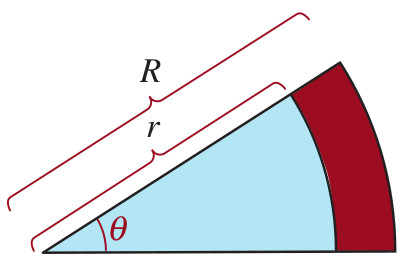{width=25%}

### Pregunta 6

Calcule el área de la banda circular de la figura anterior. Seleccione las afirmaciones que son **verdaderas**:

<label><input type="checkbox" name="q17796553085785832" value="1" data-correct="true" > El área de la banda circular se calcula como la diferencia de dos sectores circulares: $A = \frac{1}{2}(r_2^2 - r_1^2)\theta$, donde $\theta$ está en radianes.</label>

<label><input type="checkbox" name="q17796553085785832" value="2" data-correct="true" > Si los radios de la banda son $r_1 = 10\text{ m}$ y $r_2 = 15\text{ m}$ y el ángulo central es $120^\circ$ (es decir, $\theta = \frac{2\pi}{3}\text{ rad}$), el área de la banda es exactamente $\frac{125\pi}{3}\text{ m}^2$.</label>

<label><input type="checkbox" name="q17796553085785832" value="3" data-correct="true" > La longitud del arco exterior de la banda circular para $r_2 = 15\text{ m}$ y $\theta = 120^\circ$ es exactamente $10\pi\text{ m}$.</label>

<label><input type="checkbox" name="q17796553085785832" value="4" data-correct="false" > El área de la banda circular se calcula de forma directa como $A = \pi(r_2^2 - r_1^2)$ sin importar el ángulo central.</label>

<label><input type="checkbox" name="q17796553085785832" value="5" data-correct="false" > Para los radios $10\text{ m}$ y $15\text{ m}$ con $\theta = 120^\circ$, el área de la banda es exactamente $125\pi\text{ m}^2$.</label>

<label><input type="checkbox" name="q17796553085785832" value="6" data-correct="false" > La longitud del arco interior para $r_1 = 10\text{ m}$ y un ángulo central de $120^\circ$ es de exactamente $20\pi\text{ m}$.</label>

<button type="button" class="learnr-submit-btn" onclick="checkLearnrQuestion('q17796553085785832')">Enviar Respuestas</button>

¡Excelente! Has deducido correctamente el área de la banda circular y la longitud de arco.

Incorrecto. El ángulo en radianes es $\theta = 120^\circ \times \frac{\pi}{180^\circ} = \frac{2\pi}{3}\text{ rad}$. El área es $A = \frac{1}{2}(15^2 - 10^2)\times \frac{2\pi}{3} = \frac{1}{2}(125)\times \frac{2\pi}{3} = \frac{125\pi}{3}\text{ m}^2$.

Intentar de nuevo

true

### Pregunta 7

Use identidades apropiadas para obtener los valores restantes. Dados $sen(\theta) = \frac{2}{\sqrt{13}}$ y $cos(\theta) = \frac{3}{\sqrt{13}}$, identifique cuáles afirmaciones son **verdaderas**:

<label><input type="checkbox" name="q17796553085862729" value="1" data-correct="true" > La tangente del ángulo es exactamente $tan(\theta) = \frac{2}{3}$.</label>

<label><input type="checkbox" name="q17796553085862729" value="2" data-correct="true" > La cosecante del ángulo es exactamente $csc(\theta) = \frac{\sqrt{13}}{2}$.</label>

<label><input type="checkbox" name="q17796553085862729" value="3" data-correct="true" > La secante del ángulo es exactamente $sec(\theta) = \frac{\sqrt{13}}{3}$.</label>

<label><input type="checkbox" name="q17796553085862729" value="4" data-correct="false" > La cotangente del ángulo es exactamente $cot(\theta) = \frac{2}{3}$.</label>

<label><input type="checkbox" name="q17796553085862729" value="5" data-correct="false" > El valor de la secante de este ángulo es exactamente $sec(\theta) = \frac{3}{\sqrt{13}}$.</label>

<label><input type="checkbox" name="q17796553085862729" value="6" data-correct="false" > El ángulo $\theta$ se encuentra en el segundo cuadrante del plano cartesiano.</label>

<button type="button" class="learnr-submit-btn" onclick="checkLearnrQuestion('q17796553085862729')">Enviar Respuestas</button>

¡Excelente! Has calculado de forma impecable las funciones trigonométricas restantes.

Incorrecto. Se calcula como $tan(\theta) = \frac{sen(\theta)}{cos(\theta)} = \frac{2/\sqrt{13}}{3/\sqrt{13}} = \frac{2}{3}$. Sus recíprocos son $csc(\theta) = \frac{\sqrt{13}}{2}$, $sec(\theta) = \frac{\sqrt{13}}{3}$, y $cot(\theta) = \frac{3}{2}$.

Intentar de nuevo

true

### Pregunta 8

Obtenga el valor exacto de la expresión trigonométrica sin calculadora. Seleccione cuáles afirmaciones son **verdaderas**:

<label><input type="checkbox" name="q17796553085945014" value="1" data-correct="true" > El valor de la expresión $cos^2\left(\frac{\pi}{3}\right)$ es exactamente $\frac{1}{4}$.</label>

<label><input type="checkbox" name="q17796553085945014" value="2" data-correct="true" > El valor de la expresión $tan^2\left(\frac{\pi}{6}\right)$ es exactamente $\frac{1}{3}$.</label>

<label><input type="checkbox" name="q17796553085945014" value="3" data-correct="true" > La expresión $3sen\left(\frac{\pi}{4}\right) - 5cos\left(\frac{\pi}{4}\right)$ se simplifica exactamente a $-\sqrt{2}$.</label>

<label><input type="checkbox" name="q17796553085945014" value="4" data-correct="false" > El valor exacto de $tan^2\left(\frac{\pi}{6}\right)$ es exactamente $\frac{1}{2}$.</label>

<label><input type="checkbox" name="q17796553085945014" value="5" data-correct="false" > La expresión $sen\left(\frac{\pi}{4}\right)cot\left(\frac{\pi}{4}\right)$ equivale a $\sqrt{2}$.</label>

<label><input type="checkbox" name="q17796553085945014" value="6" data-correct="false" > El valor de $cos^2\left(\frac{\pi}{3}\right)$ es exactamente $\frac{3}{4}$.</label>

<button type="button" class="learnr-submit-btn" onclick="checkLearnrQuestion('q17796553085945014')">Enviar Respuestas</button>

¡Excelente! Has obtenido los valores trigonométricos exactos con total soltura algebraica.

Incorrecto. Evalúe: $cos(\pi/3) = 1/2 \Rightarrow cos^2(\pi/3) = 1/4$. $tan(\pi/6) = 1/\sqrt{3} \Rightarrow tan^2(\pi/6) = 1/3$. $3sen(\pi/4) - 5cos(\pi/4) = 3(\sqrt{2}/2) - 5(\sqrt{2}/2) = -2(\sqrt{2}/2) = -\sqrt{2}$.

Intentar de nuevo

true

### Pregunta 9

Obtenga los valores aproximados redondeando a 4 posiciones decimales. Identifique cuáles afirmaciones son **verdaderas**:

<label><input type="checkbox" name="q17796553086014322" value="1" data-correct="true" > Para $\theta = 17^\circ$, el valor aproximado del seno es $sen(17^\circ) \approx 0.2924$.</label>

<label><input type="checkbox" name="q17796553086014322" value="2" data-correct="true" > Para $\theta = 17^\circ$, el valor aproximado del coseno es $cos(17^\circ) \approx 0.9563$.</label>

<label><input type="checkbox" name="q17796553086014322" value="3" data-correct="true" > Para $\theta = 14.3^\circ$, el valor aproximado de la tangente es $tan(14.3^\circ) \approx 0.2549$.</label>

<label><input type="checkbox" name="q17796553086014322" value="4" data-correct="false" > Para $\theta = 17^\circ$, el valor aproximado de la tangente es exactamente $1.0000$.</label>

<label><input type="checkbox" name="q17796553086014322" value="5" data-correct="false" > Para $\theta = 14.3^\circ$, el valor aproximado del coseno es $cos(14.3^\circ) \approx 0.5000$.</label>

<label><input type="checkbox" name="q17796553086014322" value="6" data-correct="false" > El valor aproximado de la cosecante para $\theta = 17^\circ$ es de exactamente $0.2924$.</label>

<button type="button" class="learnr-submit-btn" onclick="checkLearnrQuestion('q17796553086014322')">Enviar Respuestas</button>

¡Excelente! Has obtenido los redondeos trigonométricos decimales correctamente.

Incorrecto. Usando la calculadora en modo de grados (DEG): $sen(17^\circ) \approx 0.292371 \rightarrow 0.2924$, $cos(17^\circ) \approx 0.956304 \rightarrow 0.9563$, $tan(14.3^\circ) \approx 0.254887 \rightarrow 0.2549$.

Intentar de nuevo

true

### Pregunta 10

Determine los valores restantes. Sabiendo que $sen(\theta) = \frac{1}{4}$ y $\theta$ está en el cuadrante II, seleccione cuáles afirmaciones son **verdaderas**:

<label><input type="checkbox" name="q17796553086092469" value="1" data-correct="true" > El valor exacto del coseno es $cos(\theta) = -\frac{\sqrt{15}}{4}$.</label>

<label><input type="checkbox" name="q17796553086092469" value="2" data-correct="true" > El valor exacto de la tangente es $tan(\theta) = -\frac{1}{\sqrt{15}}$.</label>

<label><input type="checkbox" name="q17796553086092469" value="3" data-correct="true" > La cosecante del ángulo es exactamente $csc(\theta) = 4$.</label>

<label><input type="checkbox" name="q17796553086092469" value="4" data-correct="false" > El valor del coseno en el cuadrante II es estrictamente positivo: $cos(\theta) = \frac{\sqrt{15}}{4}$.</label>

<label><input type="checkbox" name="q17796553086092469" value="5" data-correct="false" > La tangente del ángulo es positiva en el cuadrante II y vale $tan(\theta) = \sqrt{15}$.</label>

<label><input type="checkbox" name="q17796553086092469" value="6" data-correct="false" > La cosecante del ángulo en el cuadrante II es negativa y vale $csc(\theta) = -4$.</label>

<button type="button" class="learnr-submit-btn" onclick="checkLearnrQuestion('q17796553086092469')">Enviar Respuestas</button>

¡Excelente! Has deducido correctamente los signos y valores exactos en el cuadrante II.

Incorrecto. En el cuadrante II, el coseno y la tangente son negativos, mientras que el seno y la cosecante son positivos. $cos^2(\theta) = 1 - (1/4)^2 = 15/16 \Rightarrow cos(\theta) = -\frac{\sqrt{15}}{4}$, $tan(\theta) = -\frac{1}{\sqrt{15}}$, $csc(\theta) = 4$.

Intentar de nuevo

true

### Pregunta 11

Formule la expresión matemática como una expresión trigonométrica libre de radicales. Identifique cuáles afirmaciones son **verdaderas**:

<label><input type="checkbox" name="q17796553086177463" value="1" data-correct="true" > Al realizar la sustitución $x = acos(\theta)$ en $\sqrt{a^2-x^2}$ con $a>0$, la expresión se reduce a $asen(\theta)$.</label>

<label><input type="checkbox" name="q17796553086177463" value="2" data-correct="true" > Al realizar la sustitución $x = atan(\theta)$ en $\sqrt{a^2+x^2}$ con $a>0$, la expresión se reduce a $asec(\theta)$.</label>

<label><input type="checkbox" name="q17796553086177463" value="3" data-correct="true" > Al realizar la sustitución $x = \frac{4}{5}sen(\theta)$ en $\sqrt{16-25x^2}$, la expresión se reduce a $4cos(\theta)$.</label>

<label><input type="checkbox" name="q17796553086177463" value="4" data-correct="false" > Al realizar la sustitución $x = asec(\theta)$ en $\sqrt{x^2-a^2}$ con $a>0$, la expresión se reduce a $acos(\theta)$.</label>

<label><input type="checkbox" name="q17796553086177463" value="5" data-correct="false" > Al realizar la sustitución $x = \frac{4}{5}sen(\theta)$ en $\sqrt{16-25x^2}$, la expresión se simplifica a $16cos(\theta)$.</label>

<label><input type="checkbox" name="q17796553086177463" value="6" data-correct="false" > La sustitución $x = atan(\theta)$ en $\sqrt{a^2+x^2}$ simplifica la expresión a $acot(\theta)$.</label>

<button type="button" class="learnr-submit-btn" onclick="checkLearnrQuestion('q17796553086177463')">Enviar Respuestas</button>

¡Excelente! Has simplificado de forma perfecta las expresiones mediante sustituciones trigonométricas.

Incorrecto. Revise las identidades pitagóricas: $\sqrt{a^2 - a^2cos^2(\theta)} = a\sqrt{1-cos^2(\theta)} = asen(\theta)$. Para la suma: $\sqrt{a^2+a^2tan^2(\theta)} = asec(\theta)$. En el tercer caso: $\sqrt{16 - 25(16/25)sen^2(\theta)} = \sqrt{16(1-sen^2(\theta))} = 4cos(\theta)$.

Intentar de nuevo

true

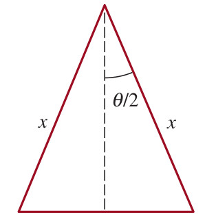{width=25%}

### Pregunta 12

Demuestre que el área del triángulo isósceles con lados iguales de longitud $x$ y ángulo $\theta$ está dada por la expresión. Seleccione cuáles afirmaciones son **verdaderas**:

<label><input type="checkbox" name="q17796553086245467" value="1" data-correct="true" > El área del triángulo isósceles está descrita por la función exacta $A = \frac{1}{2}x^2sen(\theta)$.</label>

<label><input type="checkbox" name="q17796553086245467" value="2" data-correct="true" > Si dividimos el triángulo en dos partes simétricas mediante la bisectriz de $\theta$, la altura del triángulo es $h = xcos\left(\frac{\theta}{2}\right)$.</label>

<label><input type="checkbox" name="q17796553086245467" value="3" data-correct="true" > La longitud de la base completa del triángulo en términos de los catetos es $b = 2xsen\left(\frac{\theta}{2}\right)$.</label>

<label><input type="checkbox" name="q17796553086245467" value="4" data-correct="false" > La altura del triángulo isósceles en términos del ángulo bisecado es $h = xsen\left(\frac{\theta}{2}\right)$.</label>

<label><input type="checkbox" name="q17796553086245467" value="5" data-correct="false" > El área de este triángulo se describe mediante la fórmula $A = \frac{1}{2}x^2cos(\theta)$.</label>

<label><input type="checkbox" name="q17796553086245467" value="6" data-correct="false" > Si los lados miden $x = 10$ y el ángulo formado es de $\theta = 30^\circ$, el área es exactamente $50$.</label>

<button type="button" class="learnr-submit-btn" onclick="checkLearnrQuestion('q17796553086245467')">Enviar Respuestas</button>

¡Excelente! Has demostrado con rigurosidad la fórmula del área del triángulo isósceles.

Incorrecto. Se tiene: altura $h = xcos(\theta/2)$, base $b = 2xsen(\theta/2)$. El área es $A = \frac{1}{2}bh = \frac{1}{2}(2xsen(\theta/2))(xcos(\theta/2)) = x^2sen(\theta/2)cos(\theta/2) = \frac{1}{2}x^2sen(\theta)$ usando el seno del ángulo doble.

Intentar de nuevo

true

## Bloque 2: Aplicaciones Prácticas y Triángulos Rectángulos

En esta sección se resuelven problemas prácticos de triángulos rectángulos aplicados al cálculo de alturas de montañas con teodolitos, ángulos óptimos de lanzamientos, e inclinaciones con visuales y puentes levadizos.

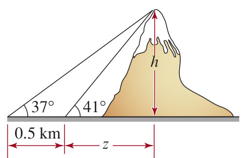{width=50%}

### Pregunta 13

Determine la altura de la montaña de la figura (teodolito). Identifique cuáles afirmaciones son **verdaderas**:

<label><input type="checkbox" name="q17796553086376334" value="1" data-correct="true" > La altura exacta de la montaña redondeada a dos decimales es de $2.83\text{ km}$ ($2831.62\text{ m}$).</label>

<label><input type="checkbox" name="q17796553086376334" value="2" data-correct="true" > El sistema lineal del problema se modela mediante las relaciones de tangentes: $h = d \tan(41^\circ)$ y $h = (d + 0.5) \tan(37^\circ)$.</label>

<label><input type="checkbox" name="q17796553086376334" value="3" data-correct="true" > La distancia horizontal $d$ desde el primer punto de medición a la base es aproximadamente $3.26\text{ km}$.</label>

<label><input type="checkbox" name="q17796553086376334" value="4" data-correct="false" > La altura de la montaña calculada es exactamente $1.50\text{ km}$.</label>

<label><input type="checkbox" name="q17796553086376334" value="5" data-correct="false" > La base del triángulo rectángulo total mide exactamente $2.00\text{ km}$.</label>

<label><input type="checkbox" name="q17796553086376334" value="6" data-correct="false" > La relación de tangentes para este problema es de tipo inverso, por lo que a mayor distancia el ángulo aumenta.</label>

<button type="button" class="learnr-submit-btn" onclick="checkLearnrQuestion('q17796553086376334')">Enviar Respuestas</button>

¡Excelente! Has obtenido la altura de la montaña y resuelto el teodolito perfectamente.

Incorrecto. Se plantea: $h = d\tan(41^\circ)$ y $h = (d+0.5)\tan(37^\circ)$. Igualando da: $d\tan(41^\circ) = d\tan(37^\circ) + 0.5\tan(37^\circ) \Rightarrow d \approx 3.257\text{ km}$. Luego, $h = 3.257 \times \tan(41^\circ) \approx 2.832\text{ km}$.

Intentar de nuevo

true

### Pregunta 14

Calcule el ángulo de salida de la bala con base en la ecuación provista. Seleccione cuáles afirmaciones son **verdaderas**:

<label><input type="checkbox" name="q17796553086452017" value="1" data-correct="true" > El ángulo de salida $\theta$ para alcanzar el blanco puede ser aproximadamente $19.9^\circ$ o bien $70.1^\circ$.</label>

<label><input type="checkbox" name="q17796553086452017" value="2" data-correct="true" > La ecuación simplificada del alcance del proyectil es $sen(2\theta) = 0.64$.</label>

<label><input type="checkbox" name="q17796553086452017" value="3" data-correct="true" > Si el ángulo de lanzamiento fuera exactamente de $45^\circ$ (el óptimo), el alcance máximo del proyectil con la misma velocidad sería de $1250\text{ pies}$.</label>

<label><input type="checkbox" name="q17796553086452017" value="4" data-correct="false" > El ángulo de lanzamiento necesario es exactamente $30.0^\circ$.</label>

<label><input type="checkbox" name="q17796553086452017" value="5" data-correct="false" > La velocidad inicial del proyectil de $200\text{ pies/s}$ equivale a una energía cinética que genera un único ángulo de tiro.</label>

<label><input type="checkbox" name="q17796553086452017" value="6" data-correct="false" > La ecuación del movimiento de la bala carece de solución real si la gravedad $g$ fuera de $9.8\text{ pies/seg}^2$.</label>

<button type="button" class="learnr-submit-btn" onclick="checkLearnrQuestion('q17796553086452017')">Enviar Respuestas</button>

¡Excelente! Has resuelto la ecuación trigonométrica de tiro parabólico e identificado los dos ángulos complementarios.

Incorrecto. Reemplace los valores: $800 = \frac{200^2 sen(2\theta)}{32} \Rightarrow 800 = \frac{40000 sen(2\theta)}{32} \Rightarrow 800 = 1250 sen(2\theta) \Rightarrow sen(2\theta) = 0.64$. Entonces, $2\theta \approx 39.79^\circ$ o $140.21^\circ$, lo que da $\theta \approx 19.9^\circ$ o $70.1^\circ$.

Intentar de nuevo

true

### Pregunta 15

Calcule el ángulo óptimo de lanzamiento para el lanzamiento de martillo. Identifique cuáles afirmaciones son **verdaderas**:

<label><input type="checkbox" name="q17796553086542792" value="1" data-correct="true" > El ángulo óptimo de lanzamiento $\theta$ medido desde la horizontal es de aproximadamente $42^\circ$ (o exactamente $41.97^\circ$).</label>

<label><input type="checkbox" name="q17796553086542792" value="2" data-correct="true" > El valor del coseno del ángulo doble calculado es $cos(2\theta) \approx 0.1052$.</label>

<label><input type="checkbox" name="q17796553086542792" value="3" data-correct="true" > El ángulo doble óptimo de lanzamiento medido en radianes es aproximadamente $1.465\text{ rad}$ ($83.96^\circ$).</label>

<label><input type="checkbox" name="q17796553086542792" value="4" data-correct="false" > El ángulo óptimo $\theta$ calculado es de exactamente $45^\circ$.</label>

<label><input type="checkbox" name="q17796553086542792" value="5" data-correct="false" > El ángulo óptimo calculado es de exactamente $30^\circ$.</label>

<label><input type="checkbox" name="q17796553086542792" value="6" data-correct="false" > Dado que el término $gh$ es positivo, el coseno de $2\theta$ siempre debe ser negativo para maximizar la trayectoria.</label>

<button type="button" class="learnr-submit-btn" onclick="checkLearnrQuestion('q17796553086542792')">Enviar Respuestas</button>

¡Excelente! Has obtenido el ángulo de lanzamiento óptimo con total destreza numérica.

Incorrecto. Calcule: $v_0^2 = 13.7^2 = 187.69$ y $gh = 9.81 \times 2.25 = 22.0725$. Así, $cos(2\theta) = \frac{22.0725}{187.69 + 22.0725} \approx 0.1052$. Entonces, $2\theta \approx 83.96^\circ \Rightarrow \theta \approx 41.98^\circ$.

Intentar de nuevo

true

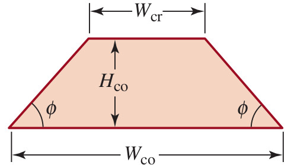{width=25%}

### Pregunta 16

Determine el ángulo $\phi$ de la base del trapezoide para el cono de ceniza. Seleccione cuáles afirmaciones son **verdaderas**:

<label><input type="checkbox" name="q17796553086624663" value="1" data-correct="true" > El ángulo $\phi$ de la base del trapezoide es de aproximadamente $31^\circ$ (o exactamente $30.96^\circ$).</label>

<label><input type="checkbox" name="q17796553086624663" value="2" data-correct="true" > La longitud de la base horizontal de los triángulos rectángulos de los lados es exactamente $0.30$.</label>

<label><input type="checkbox" name="q17796553086624663" value="3" data-correct="true" > La relación de la pendiente de la base del trapezoide se modela como $tan(\phi) = 0.60$.</label>

<label><input type="checkbox" name="q17796553086624663" value="4" data-correct="false" > El ángulo $\phi$ de la base del trapezoide es de exactamente $45^\circ$.</label>

<label><input type="checkbox" name="q17796553086624663" value="5" data-correct="false" > El ancho del cráter calculado es exactamente $0.50$ si el cono es isósceles.</label>

<label><input type="checkbox" name="q17796553086624663" value="6" data-correct="false" > La altura del cono calculada es exactamente de $0.25$ unidades.</label>

<button type="button" class="learnr-submit-btn" onclick="checkLearnrQuestion('q17796553086624663')">Enviar Respuestas</button>

¡Excelente! Has deducido correctamente el ángulo de inclinación volcánica con base en el trapezoide isósceles.

Incorrecto. Se tiene: $W_{co} = 1.00 \Rightarrow H_{co} = 0.18$ y $W_{cr} = 0.40$. La base horizontal del triángulo lateral es $\Delta x = \frac{W_{co} - W_{cr}}{2} = \frac{1.00 - 0.40}{2} = 0.30$. La altura es $H_{co} = 0.18$. Así: $tan(\phi) = \frac{0.18}{0.30} = 0.60 \Rightarrow \phi \approx 30.96^\circ$.

Intentar de nuevo

true

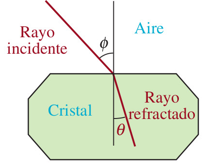{width=25%}

### Pregunta 17

Determine los ángulos $\phi$ y $\theta$ para el rayo de luz. Identifique cuáles afirmaciones son **verdaderas**:

<label><input type="checkbox" name="q17796553086705186" value="1" data-correct="true" > El ángulo de incidencia es exactamente $\phi \approx 88^\circ$ ($88.04^\circ$).</label>

<label><input type="checkbox" name="q17796553086705186" value="2" data-correct="true" > El ángulo de refracción es exactamente $\theta \approx 44^\circ$ ($44.02^\circ$).</label>

<label><input type="checkbox" name="q17796553086705186" value="3" data-correct="true" > El coseno del ángulo de refracción calculado es exactamente $cos(\theta) = 0.7185$.</label>

<label><input type="checkbox" name="q17796553086705186" value="4" data-correct="false" > El ángulo de incidencia es exactamente el triple de la refracción.</label>

<label><input type="checkbox" name="q17796553086705186" value="5" data-correct="false" > El ángulo de refracción calculado es de exactamente $30^\circ$.</label>

<label><input type="checkbox" name="q17796553086705186" value="6" data-correct="false" > El ángulo de incidencia obtenido para el rayo es de exactamente $60^\circ$.</label>

<button type="button" class="learnr-submit-btn" onclick="checkLearnrQuestion('q17796553086705186')">Enviar Respuestas</button>

¡Excelente! Has resuelto la ley de Snell aplicando identidades trigonométricas de ángulo doble de forma impecable.

Incorrecto. Snell: $\frac{sen(\phi)}{sen(\theta)} = 1.437$. Como $\phi = 2\theta$, tenemos $\frac{sen(2\theta)}{sen(\theta)} = \frac{2sen(\theta)cos(\theta)}{sen(\theta)} = 2cos(\theta) = 1.437 \Rightarrow cos(\theta) = 0.7185$. Así: $\theta \approx 44.02^\circ$ y $\phi = 2\theta \approx 88.04^\circ$.

Intentar de nuevo

true

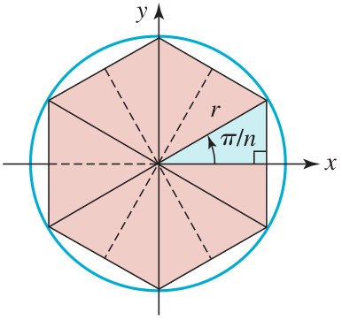{width=25%}

### Pregunta 18

Demuestre la fórmula de área $A(n)$ y evalúe sus límites. Seleccione cuáles afirmaciones son **verdaderas**:

<label><input type="checkbox" name="q17796553086787945" value="1" data-correct="true" > El límite del área del polígono regular inscrito cuando $n \rightarrow \infty$ es exactamente $\pi r^2$ (el área del círculo).</label>

<label><input type="checkbox" name="q17796553086787945" value="2" data-correct="true" > Para un círculo unitario ($r = 1$), las áreas calculadas son $A_{100} \approx 3.1398$ y $A_{1000} \approx 3.1416$.</label>

<label><input type="checkbox" name="q17796553086787945" value="3" data-correct="true" > El área de un triángulo elemental de los $n$ que componen el polígono es $\frac{1}{2}r^2 sen\left(\frac{2\pi}{n}\right)$.</label>

<label><input type="checkbox" name="q17796553086787945" value="4" data-correct="false" > El límite de la función del área cuando los lados tienden a infinito es de exactamente $2\pi r$.</label>

<label><input type="checkbox" name="q17796553086787945" value="5" data-correct="false" > El área del polígono de 100 lados para un círculo unitario es exactamente de $3.0000$.</label>

<label><input type="checkbox" name="q17796553086787945" value="6" data-correct="false" > El ángulo central correspondiente a cada una de las rebanadas triangulares del polígono es de exactamente $\frac{\pi}{n}$ radianes.</label>

<button type="button" class="learnr-submit-btn" onclick="checkLearnrQuestion('q17796553086787945')">Enviar Respuestas</button>

¡Excelente! Has comprendido y validado la aproximación al área del círculo mediante polígonos regulares inscritos.

Incorrecto. Cada polígono se compone de $n$ triángulos isósceles con lados $r$ y ángulo central $\frac{2\pi}{n}$. El área de cada uno es $\frac{1}{2}r^2 sen(2\pi/n)$, por lo que la del polígono es $A(n) = \frac{n}{2}r^2 sen(2\pi/n)$. Cuando $n \rightarrow \infty$, $n sen(2\pi/n) \rightarrow 2\pi$, dando $\pi r^2$.

Intentar de nuevo

true

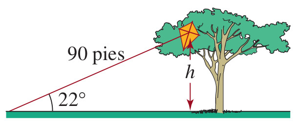{width=25%}

### Pregunta 19

Estime la altura del árbol (distancia de la cometa al suelo). Identifique cuáles afirmaciones son **verdaderas**:

<label><input type="checkbox" name="q17796553086862355" value="1" data-correct="true" > La altura estimada del árbol es de aproximadamente $33.71\text{ pies}$ de altura.</label>

<label><input type="checkbox" name="q17796553086862355" value="2" data-correct="true" > La relación trigonométrica para calcular la altura es directa mediante el seno: $h = 90sen(22^\circ)$.</label>

<label><input type="checkbox" name="q17796553086862355" value="3" data-correct="true" > El valor del seno de $22^\circ$ es aproximadamente $0.3746$.</label>

<label><input type="checkbox" name="q17796553086862355" value="4" data-correct="false" > La altura del árbol calculada es de exactamente $45.00\text{ pies}$.</label>

<label><input type="checkbox" name="q17796553086862355" value="5" data-correct="false" > Para resolver este problema se requiere aplicar una relación de tipo coseno.</label>

<label><input type="checkbox" name="q17796553086862355" value="6" data-correct="false" > Si el ángulo formado con el suelo fuera de $30^\circ$ manteniendo el mismo hilo, la altura del árbol sería de $60.00\text{ pies}$.</label>

<button type="button" class="learnr-submit-btn" onclick="checkLearnrQuestion('q17796553086862355')">Enviar Respuestas</button>

¡Excelente! Has calculado correctamente la altura del árbol aplicando trigonometría elemental.

Incorrecto. Se trata de un triángulo rectángulo simple donde el hilo es la hipotenusa: $sen(22^\circ) = \frac{h}{90} \Rightarrow h = 90 sen(22^\circ) \approx 90 \times 0.374606 = 33.71\text{ pies}$.

Intentar de nuevo

true

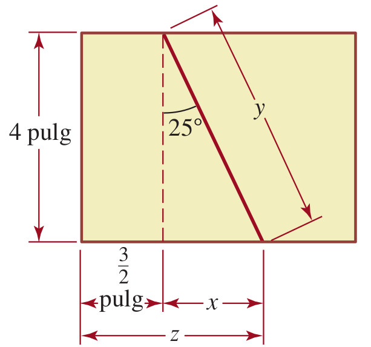{width=25%}

### Pregunta 20

Calcule el corte diagonal y el lado restante en la tabla de madera. Seleccione cuáles afirmaciones son **verdaderas**:

<label><input type="checkbox" name="q17796553086945205" value="1" data-correct="true" > La longitud del corte diagonal es de aproximadamente $4.41\text{ pulgadas}$.</label>

<label><input type="checkbox" name="q17796553086945205" value="2" data-correct="true" > La longitud del lado restante de la tabla disminuye debido al corte y mide exactamente $1.5 - 4tan(25^\circ) \approx -0.37\text{ pulgadas}$ (el corte se solapa con el borde).</label>

<label><input type="checkbox" name="q17796553086945205" value="3" data-correct="true" > La relación de la diagonal del corte con el ancho de la tabla se modela como $L = \frac{4}{cos(25^\circ)}$.</label>

<label><input type="checkbox" name="q17796553086945205" value="4" data-correct="false" > La longitud del corte diagonal diagonal es exactamente de $5.00\text{ pulgadas}$.</label>

<label><input type="checkbox" name="q17796553086945205" value="5" data-correct="false" > El corte de la sierra sobre la madera tiene un ángulo complementario con la horizontal de exactamente $25^\circ$.</label>

<label><input type="checkbox" name="q17796553086945205" value="6" data-correct="false" > La longitud del lado restante resultante es de exactamente $2.50\text{ pulgadas}$.</label>

<button type="button" class="learnr-submit-btn" onclick="checkLearnrQuestion('q17796553086945205')">Enviar Respuestas</button>

¡Excelente! Has calculado con total éxito las dimensiones del corte del carpintero.

Incorrecto. Diagonal: $cos(25^\circ) = \frac{4}{L} \Rightarrow L = \frac{4}{cos(25^\circ)} \approx 4.413\text{ in}$. Lado restante: la base del triángulo cortado es $4tan(25^\circ) \approx 1.865\text{ in}$. Como iniciaba a $1.5\text{ in}$, la coordenada restante es $1.5 - 1.865 = -0.365\text{ in}$.

Intentar de nuevo

true

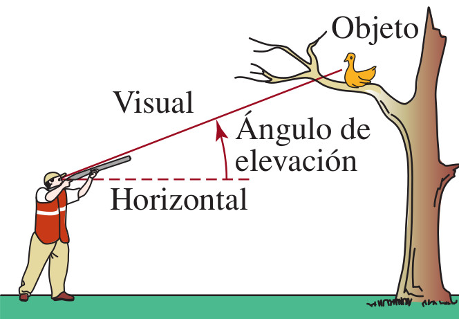{width=20%} 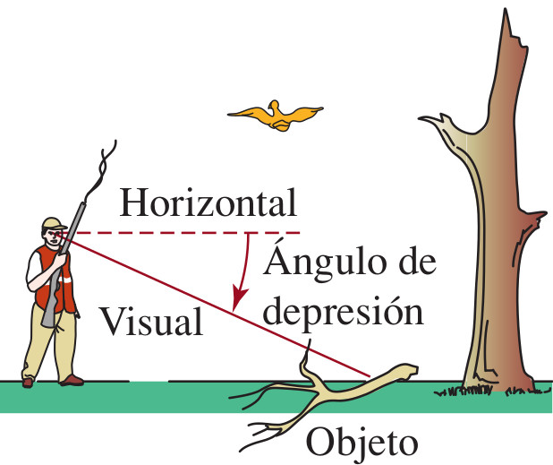{width=20%}

### Pregunta 21

Resuelva los conceptos fundamentales de elevación y depresión. Identifique cuáles afirmaciones son **verdaderas**:

<label><input type="checkbox" name="q17796553087013216" value="1" data-correct="true" > El ángulo de elevación se define como el ángulo formado entre la línea de visión horizontal y la línea de visión hacia arriba de un objeto.</label>

<label><input type="checkbox" name="q17796553087013216" value="2" data-correct="true" > El ángulo de depresión se define como el ángulo formado entre la línea de visión horizontal y la línea de visión hacia abajo de un objeto.</label>

<label><input type="checkbox" name="q17796553087013216" value="3" data-correct="true" > El ángulo de elevación de un observador A hacia un objeto B es geométricamente igual al ángulo de depresión desde el objeto B hacia el observador A.</label>

<label><input type="checkbox" name="q17796553087013216" value="4" data-correct="false" > El ángulo de elevación se mide respecto de una línea vertical perpendicular al suelo.</label>

<label><input type="checkbox" name="q17796553087013216" value="5" data-correct="false" > El ángulo de depresión siempre es un ángulo mayor a los $90^\circ$ en el plano cartesiano.</label>

<label><input type="checkbox" name="q17796553087013216" value="6" data-correct="false" > Ambos ángulos se miden tomando como referencia la línea de visión vertical.</label>

<button type="button" class="learnr-submit-btn" onclick="checkLearnrQuestion('q17796553087013216')">Enviar Respuestas</button>

¡Excelente! Has definido perfectamente los conceptos geométricos de ángulos de elevación y depresión.

Incorrecto. Ambos ángulos se miden estrictamente tomando como referencia la línea de visión horizontal. Por alternos internos entre paralelas, el ángulo de elevación desde A a B es igual al de depresión desde B a A.

Intentar de nuevo

true

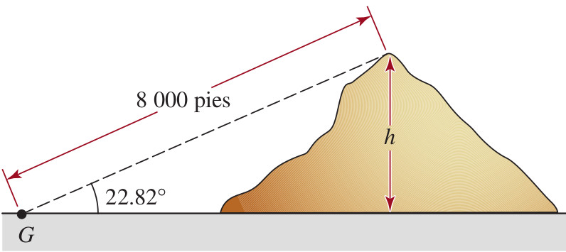{width=30%}

### Pregunta 22

Calcule la altura de la montaña con la información provista en la figura. Seleccione cuáles afirmaciones son **verdaderas**:

<label><input type="checkbox" name="q17796553087096126" value="1" data-correct="true" > La altura de la montaña para un ángulo de elevación de $24^\circ$ y una visual de $10000\text{ pies}$ es aproximadamente $4067.37\text{ pies}$.</label>

<label><input type="checkbox" name="q17796553087096126" value="2" data-correct="true" > La relación trigonométrica para hallar la altura en términos de la hipotenusa visual es $h = 10000sen(24^\circ)$.</label>

<label><input type="checkbox" name="q17796553087096126" value="3" data-correct="true" > La distancia horizontal desde el observador hasta el pie de la montaña es aproximadamente $9135.45\text{ pies}$.</label>

<label><input type="checkbox" name="q17796553087096126" value="4" data-correct="false" > La altura de la montaña calculada es de exactamente $5000.00\text{ pies}$.</label>

<label><input type="checkbox" name="q17796553087096126" value="5" data-correct="false" > La relación trigonométrica necesaria para hallar la altura es el coseno del ángulo de elevación.</label>

<label><input type="checkbox" name="q17796553087096126" value="6" data-correct="false" > La distancia horizontal es más pequeña que la altura de la montaña según el ángulo de elevación.</label>

<button type="button" class="learnr-submit-btn" onclick="checkLearnrQuestion('q17796553087096126')">Enviar Respuestas</button>

¡Excelente! Has resuelto la altura de la montaña conocida la línea visual con total soltura.

Incorrecto. Se trata de un triángulo rectángulo simple donde la hipotenusa mide $10000\text{ pies}$: $h = 10000 sen(24^\circ) \approx 4067.37\text{ pies}$. La base horizontal mide $10000 cos(24^\circ) \approx 9135.45\text{ pies}$.

Intentar de nuevo

true

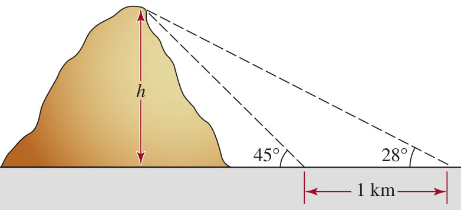{width=30%}

### Pregunta 23

Calcule la altura de la montaña conocidos dos ángulos de elevación en la base. Identifique cuáles afirmaciones son **verdaderas**:

<label><input type="checkbox" name="q17796553087177845" value="1" data-correct="true" > La altura de la montaña $h$ sabiendo que los ángulos son $20^\circ$ y $25^\circ$ y la separación es de $2000\text{ pies}$ es aproximadamente $3524.31\text{ pies}$.</label>

<label><input type="checkbox" name="q17796553087177845" value="2" data-correct="true" > La fórmula general para este problema de doble elevación es $h = \frac{d \tan(\alpha)\tan(\beta)}{\tan(\beta)-\tan(\alpha)}$, donde $\beta > \alpha$.</label>

<label><input type="checkbox" name="q17796553087177845" value="3" data-correct="true" > La distancia horizontal desde la segunda estación de medición hasta la cumbre es aproximadamente $7557.85\text{ pies}$.</label>

<label><input type="checkbox" name="q17796553087177845" value="4" data-correct="false" > La altura de la montaña calculada es de exactamente $4500.00\text{ pies}$.</label>

<label><input type="checkbox" name="q17796553087177845" value="5" data-correct="false" > Las distancias de las visuales no influyen en el cálculo ya que la altura es constante.</label>

<label><input type="checkbox" name="q17796553087177845" value="6" data-correct="false" > El problema se resuelve de forma directa utilizando una sola razón de tipo seno.</label>

<button type="button" class="learnr-submit-btn" onclick="checkLearnrQuestion('q17796553087177845')">Enviar Respuestas</button>

¡Excelente! Has deducido y resuelto de forma perfecta la doble medición del ángulo de elevación.

Incorrecto. Se plantea: $h = (x+2000)\tan(20^\circ)$ y $h = x\tan(25^\circ)$. Igualando: $x\tan(25^\circ) = x\tan(20^\circ) + 2000\tan(20^\circ) \Rightarrow x \approx 7557.85\text{ pies}$. Luego $h = 7557.85 \times \tan(25^\circ) \approx 3524.31\text{ pies}$.

Intentar de nuevo

true

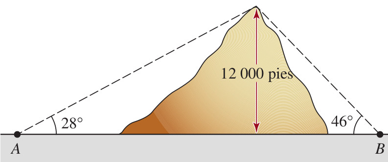{width=30%}

### Pregunta 24

Calcule la distancia entre los pueblos A y B situados a lados opuestos de la montaña. Seleccione cuáles afirmaciones son **verdaderas**:

<label><input type="checkbox" name="q17796553087257278" value="1" data-correct="true" > La distancia total entre los dos pueblos es de aproximadamente $30465.17\text{ pies}$ de longitud.</label>

<label><input type="checkbox" name="q17796553087257278" value="2" data-correct="true" > La distancia desde el pueblo A hasta la proyección de la cumbre es aproximadamente $17137.78\text{ pies}$ usando $35^\circ$.</label>

<label><input type="checkbox" name="q17796553087257278" value="3" data-correct="true" > La distancia desde el pueblo B hasta la proyección de la cumbre es aproximadamente $13327.39\text{ pies}$ usando $42^\circ$.</label>

<label><input type="checkbox" name="q17796553087257278" value="4" data-correct="false" > La distancia total calculada entre ambos pueblos es exactamente de $24000.00\text{ pies}$.</label>

<label><input type="checkbox" name="q17796553087257278" value="5" data-correct="false" > La cumbre de la montaña se encuentra exactamente en la mitad de la distancia entre ambos pueblos.</label>

<label><input type="checkbox" name="q17796553087257278" value="6" data-correct="false" > Para solucionar este problema se requiere aplicar la ley de cosenos sobre el triángulo oblicuángulo.</label>

<button type="button" class="learnr-submit-btn" onclick="checkLearnrQuestion('q17796553087257278')">Enviar Respuestas</button>

¡Excelente! Has calculado con total precisión las distancias horizontales separadas por la montaña.

Incorrecto. Divida el problema en dos triángulos rectángulos con altura común $h = 12000\text{ pies}$. Distancia A: $d_A = \frac{12000}{tan(35^\circ)} \approx 17137.78\text{ pies}$. Distancia B: $d_B = \frac{12000}{tan(42^\circ)} \approx 13327.39\text{ pies}$. Total $= d_A + d_B \approx 30465.17\text{ pies}$.

Intentar de nuevo

true

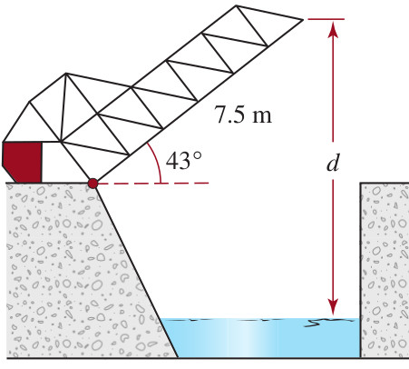{width=30%}

### Pregunta 25

Calcule la distancia $d$ entre el punto más alto del puente abierto y el agua. Identifique cuáles afirmaciones son **verdaderas**:

<label><input type="checkbox" name="q17796553087329493" value="1" data-correct="true" > La distancia total $d$ desde el extremo superior del puente abierto hasta el nivel del agua es de aproximadamente $8.93\text{ metros}$.</label>

<label><input type="checkbox" name="q17796553087329493" value="2" data-correct="true" > El nivel del agua se encuentra a aproximadamente $3.82\text{ metros}$ por debajo de la calzada cerrada del puente.</label>

<label><input type="checkbox" name="q17796553087329493" value="3" data-correct="true" > La altura adicional que gana el puente al abrirse por completo a un ángulo de $43^\circ$ es de aproximadamente $5.11\text{ metros}$.</label>

<label><input type="checkbox" name="q17796553087329493" value="4" data-correct="false" > La distancia total $d$ calculada es de exactamente $7.50\text{ metros}$.</label>

<label><input type="checkbox" name="q17796553087329493" value="5" data-correct="false" > La calzada del puente cerrado coincide exactamente con el nivel de la superficie del agua.</label>

<label><input type="checkbox" name="q17796553087329493" value="6" data-correct="false" > El puente abierto forma un triángulo equilátero respecto del nivel de la superficie del agua.</label>

<button type="button" class="learnr-submit-btn" onclick="checkLearnrQuestion('q17796553087329493')">Enviar Respuestas</button>

¡Excelente! Has sumado correctamente la altura ganada y la distancia del cauce del río.

Incorrecto. Calzada al agua: $h_{agua} = 7.5 \tan(27^\circ) \approx 3.82\text{ m}$. Altura ganada: $h_{ganada} = 7.5 sen(43^\circ) \approx 5.11\text{ m}$. Total $d = 3.82 + 5.11 \approx 8.93\text{ m}$.

Intentar de nuevo

true

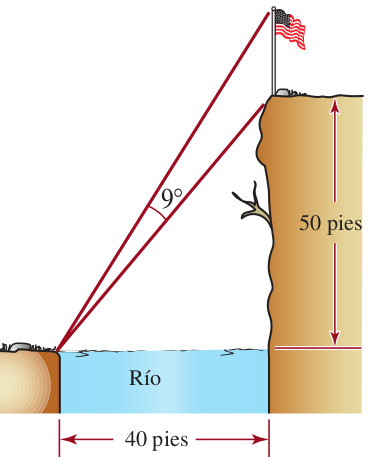{width=30%}

### Pregunta 26

Determine la altura exacta del asta de la bandera sobre el acantilado. Seleccione cuáles afirmaciones son **verdaderas**:

<label><input type="checkbox" name="q17796553087418132" value="1" data-correct="true" > La altura del asta de la bandera es de aproximadamente $20.24\text{ pies}$ de longitud.</label>

<label><input type="checkbox" name="q17796553087418132" value="2" data-correct="true" > El ángulo de elevación a la base del asta desde la orilla opuesta es aproximadamente $51.34^\circ$.</label>

<label><input type="checkbox" name="q17796553087418132" value="3" data-correct="true" > La altura total desde el suelo de la orilla opuesta hasta la punta del asta es de aproximadamente $70.24\text{ pies}$.</label>

<label><input type="checkbox" name="q17796553087418132" value="4" data-correct="false" > La altura del asta de la bandera calculada es de exactamente $10.00\text{ pies}$.</label>

<label><input type="checkbox" name="q17796553087418132" value="5" data-correct="false" > El acantilado y el río forman un triángulo rectángulo con un ángulo central de exactamente $45^\circ$.</label>

<label><input type="checkbox" name="q17796553087418132" value="6" data-correct="false" > La altura de la bandera obtenida es de exactamente $15.50\text{ pies}$.</label>

<button type="button" class="learnr-submit-btn" onclick="checkLearnrQuestion('q17796553087418132')">Enviar Respuestas</button>

¡Excelente! Has determinado la altura del asta utilizando la combinación de tangentes.

Incorrecto. Ángulo base: $tan(\theta_1) = 50/40 = 1.25 \Rightarrow \theta_1 \approx 51.34^\circ$. Ángulo punta: $\theta_2 = 51.34^\circ + 9^\circ = 60.34^\circ$. Altura total: $H = 40tan(60.34^\circ) \approx 70.24\text{ pies}$. Asta: $H - 50 = 20.24\text{ pies}$.

Intentar de nuevo

true

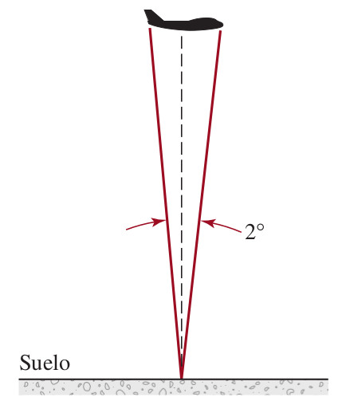{width=25%}

### Pregunta 27

Calcule la altura a la que vuela el avión Boeing 747. Identifique cuáles afirmaciones son **verdaderas**:

<label><input type="checkbox" name="q17796553087507012" value="1" data-correct="true" > La altura de vuelo del avión es de aproximadamente $6617.20\text{ pies}$ sobre el suelo.</label>

<label><input type="checkbox" name="q17796553087507012" value="2" data-correct="true" > El modelo trigonométrico para la mitad del avión es $tan(1^\circ) = \frac{115.5}{h}$.</label>

<label><input type="checkbox" name="q17796553087507012" value="3" data-correct="true" > La mitad de la longitud total del avión es exactamente de $115.5\text{ pies}$.</label>

<label><input type="checkbox" name="q17796553087507012" value="4" data-correct="false" > La altura de vuelo del avión calculada es de exactamente $5000.00\text{ pies}$.</label>

<label><input type="checkbox" name="q17796553087507012" value="5" data-correct="false" > El avión vuela a una altura que equivale exactamente a su longitud multiplicada por 10.</label>

<label><input type="checkbox" name="q17796553087507012" value="6" data-correct="false" > Para solucionar este problema se requiere aplicar una relación de tipo cosecante.</label>

<button type="button" class="learnr-submit-btn" onclick="checkLearnrQuestion('q17796553087507012')">Enviar Respuestas</button>

¡Excelente! Has resuelto la altura de vuelo del avión dividiendo el ángulo visual.

Incorrecto. Divida el avión en dos mitades de $115.5\text{ pies}$ con ángulo de $1^\circ$ cada una: $tan(1^\circ) = \frac{115.5}{h} \Rightarrow h = \frac{115.5}{tan(1^\circ)} \approx 6617.20\text{ pies}$.

Intentar de nuevo

true

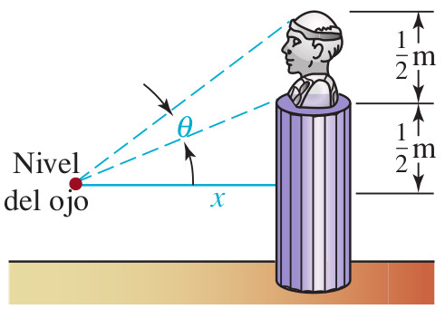{width=25%}

### Pregunta 28

Exprese el ángulo visual $\theta$ en función de la distancia $x$ al pedestal. Seleccione cuáles afirmaciones son **verdaderas**:

<label><input type="checkbox" name="q17796553087582572" value="1" data-correct="true" > El ángulo visual $\theta$ se expresa como la diferencia de arcotangentes: $\theta(x) = arctan\left(\frac{p+s}{x}\right) - arctan\left(\frac{p}{x}\right)$, donde $p$ es el pedestal y $s$ la estatua.</label>

<label><input type="checkbox" name="q17796553087582572" value="2" data-correct="true" > Si la altura del pedestal es $p=10$ y la de la estatua es $s=15$, para $x=20$ el ángulo $\theta$ es aproximadamente $18.43^\circ$ ($0.32\text{ rad}$).</label>

<label><input type="checkbox" name="q17796553087582572" value="3" data-correct="true" > El ángulo visual tiende a cero tanto cuando el observador se aleja infinitamente ($x \rightarrow \infty$) como cuando se pega al pedestal ($x \rightarrow 0$).</label>

<label><input type="checkbox" name="q17796553087582572" value="4" data-correct="false" > El ángulo visual $\theta(x)$ se expresa de forma directa como $\theta(x) = arctan\left(\frac{s}{x}\right)$.</label>

<label><input type="checkbox" name="q17796553087582572" value="5" data-correct="false" > El ángulo visual de la estatua es una función lineal creciente respecto a la distancia horizontal.</label>

<label><input type="checkbox" name="q17796553087582572" value="6" data-correct="false" > El ángulo visual máximo se obtiene pegándose completamente a la pared del pedestal ($x=0$).</label>

<button type="button" class="learnr-submit-btn" onclick="checkLearnrQuestion('q17796553087582572')">Enviar Respuestas</button>

¡Excelente! Has formulado e interpretado correctamente la función del ángulo visual de la estatua.

Incorrecto. Se calcula restando el ángulo total al extremo de la estatua menos el ángulo a la base: $\theta_2 = arctan\left(\frac{p+s}{x}\right)$ y $\theta_1 = arctan\left(\frac{p}{x}\right)$, dando $\theta = \theta_2 - \theta_1$. Para $x \rightarrow 0$ y $x \rightarrow \infty$, $\theta \rightarrow 0$.

Intentar de nuevo

true

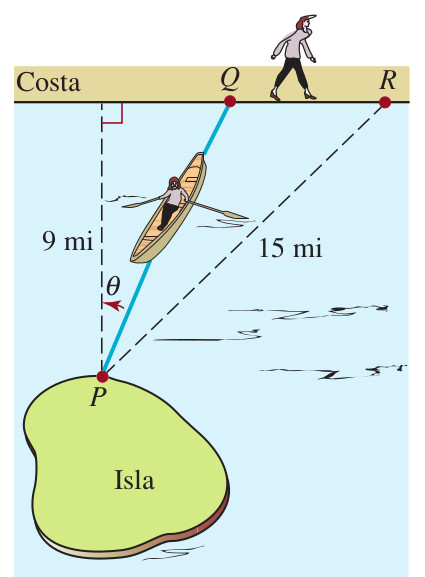{width=25%}

### Pregunta 29

Determine el tiempo total de viaje en función del ángulo $\theta$. Identifique cuáles afirmaciones son **verdaderas**:

<label><input type="checkbox" name="q17796553087678983" value="1" data-correct="true" > El tiempo total de viaje expresado en función de $\theta$ es $T(\theta) = 3csc(\theta) + 2.4 - 1.8cot(\theta)$ horas.</label>

<label><input type="checkbox" name="q17796553087678983" value="2" data-correct="true" > La distancia total de la costa recta desde la proyección de P hasta R es de exactamente $12\text{ millas}$ ya que $\sqrt{15^2 - 9^2} = 12$.</label>

<label><input type="checkbox" name="q17796553087678983" value="3" data-correct="true" > El tiempo que la mujer pasa remando en el agua es exactamente $3csc(\theta)$ horas.</label>

<label><input type="checkbox" name="q17796553087678983" value="4" data-correct="false" > El tiempo total de viaje se expresa mediante la fórmula directa $T(\theta) = \frac{9}{3} + \frac{15}{5} = 6\text{ horas}$.</label>

<label><input type="checkbox" name="q17796553087678983" value="5" data-correct="false" > La distancia que la mujer camina en la playa en función del ángulo es exactly $12 - 9sen(\theta)$ millas.</label>

<label><input type="checkbox" name="q17796553087678983" value="6" data-correct="false" > El tiempo mínimo de viaje se logra siempre remando directamente hacia el punto R.</label>

<button type="button" class="learnr-submit-btn" onclick="checkLearnrQuestion('q17796553087678983')">Enviar Respuestas</button>

¡Excelente! Has formulado correctamente la función del tiempo del trayecto combinado.

Incorrecto. Remando: hipotenusa $d_{agua} = 9csc(\theta)$, tiempo $t_{agua} = 3csc(\theta)$. Caminando: base del agua $9cot(\theta)$, camina $12 - 9cot(\theta)$, tiempo $t_{tierra} = \frac{12-9cot(\theta)}{5} = 2.4 - 1.8cot(\theta)$. Total $T(\theta) = 3csc(\theta) + 2.4 - 1.8cot(\theta)$ horas.

Intentar de nuevo

true

## Bloque 3: Ley de Senos, Cosenos y Modelamiento Trigonométrico

En esta sección se abordan problemas resueltos mediante la ley de senos y cosenos para cañones, navegación de barcos, y modelamiento trigonométrico de pastizales y transporte de tubos por pasillos.

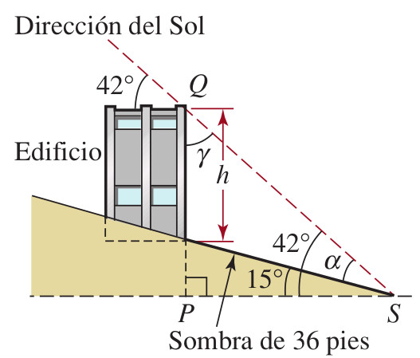{width=25%}

### Pregunta 30

Calcule la altura del edificio al lado de la colina. Seleccione cuáles afirmaciones son **verdaderas**:

<label><input type="checkbox" name="q17796553087756146" value="1" data-correct="true" > La altura del edificio es de aproximadamente $22.02\text{ pies}$ de altura.</label>

<label><input type="checkbox" name="q17796553087756146" value="2" data-correct="true" > El ángulo opuesto a la sombra en el triángulo formado es de exactamente $27^\circ$ ($42^circ - 15^\circ$).</label>

<label><input type="checkbox" name="q17796553087756146" value="3" data-correct="true" > El ángulo opuesto a la altura del edificio en el triángulo es exactamente $48^\circ$ ($90^\circ - 42^\circ$).</label>

<label><input type="checkbox" name="q17796553087756146" value="4" data-correct="false" > La altura del edificio calculada es de exactamente $36.00\text{ pies}$.</label>

<label><input type="checkbox" name="q17796553087756146" value="5" data-correct="false" > Para resolver este problema se requiere aplicar de forma directa la ley de cosenos.</label>

<label><input type="checkbox" name="q17796553087756146" value="6" data-correct="false" > La altura del edificio obtenida es de exactamente $15.50\text{ pies}$.</label>

<button type="button" class="learnr-submit-btn" onclick="checkLearnrQuestion('q17796553087756146')">Enviar Respuestas</button>

¡Excelente! Has resuelto la ley de senos para hallar la altura del edificio correctamente.

Incorrecto. Por ley de senos en el triángulo oblicuángulo: $\frac{h}{sen(27^\circ)} = \frac{36}{sen(48^\circ)} \Rightarrow h = \frac{36 sen(27^\circ)}{sen(48^\circ)} \approx 22.02\text{ pies}$.

Intentar de nuevo

true

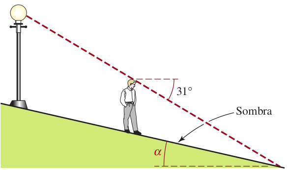{width=40%}

### Pregunta 31

Calcule el ángulo de inclinación $\alpha$ de la acera. Identifique cuáles afirmaciones son **verdaderas**:

<label><input type="checkbox" name="q17796553087857950" value="1" data-correct="true" > El ángulo de inclinación $\alpha$ que forma la acera con la horizontal es de aproximadamente $10.02^\circ$.</label>

<label><input type="checkbox" name="q17796553087857950" value="2" data-correct="true" > El ángulo interno del triángulo en la punta superior del hombre es de exactamente $59^\circ$ ($90^\circ - 31^\circ$).</label>

<label><input type="checkbox" name="q17796553087857950" value="3" data-correct="true" > El ángulo de inclinación de la acera influye en el cálculo y se resuelve aplicando la ley de senos sobre la sombra.</label>

<label><input type="checkbox" name="q17796553087857950" value="4" data-correct="false" > El ángulo $\alpha$ calculado es de exactamente $30^\circ$.</label>

<label><input type="checkbox" name="q17796553087857950" value="5" data-correct="false" > La inclinación de la acera obtenida es de exactamente $45^\circ$.</label>

<label><input type="checkbox" name="q17796553087857950" value="6" data-correct="false" > La altura del hombre no influye en la longitud de su sombra si la acera es inclinada.</label>

<button type="button" class="learnr-submit-btn" onclick="checkLearnrQuestion('q17796553087857950')">Enviar Respuestas</button>

¡Excelente! Has resuelto el ángulo de inclinación de la acera con la ley de senos con éxito.

Incorrecto. Se tiene: hombre $5.75\text{ pies}$, sombra $25\text{ pies}$, ángulo superior $59^\circ$. Por ley de senos: $\frac{sen(59^\circ)}{25} = \frac{sen(\beta)}{5.75} \Rightarrow sen(\beta) \approx 0.1971 \Rightarrow \beta \approx 11.37^\circ$. Así, el ángulo de la acera es $\alpha = 31^\circ - 11.37^\circ \approx 10.02^\circ$.

Intentar de nuevo

true

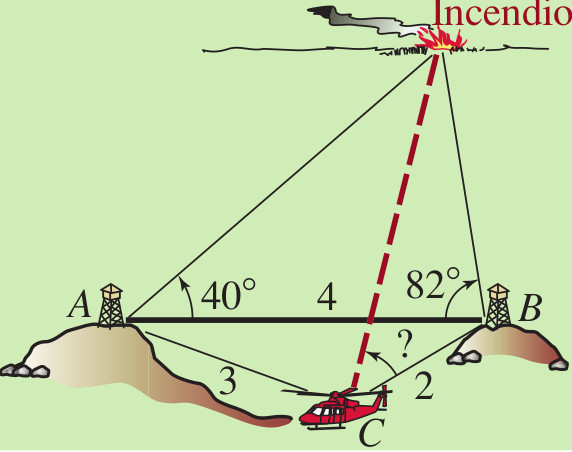{width=25%}

### Pregunta 32

Determine el ángulo medido a partir de CB al que debe volar el helicóptero. Seleccione cuáles afirmaciones son **verdaderas**:

<label><input type="checkbox" name="q17796553087937153" value="1" data-correct="true" > El ángulo de vuelo requerido a partir de CB es de aproximadamente $103^\circ$ ($103.35^\circ$).</label>

<label><input type="checkbox" name="q17796553087937153" value="2" data-correct="true" > El ángulo interno del triángulo ABC en el vértice B es exactamente $46.57^\circ$ usando la ley de cosenos.</label>

<label><input type="checkbox" name="q17796553087937153" value="3" data-correct="true" > El ángulo interno en el vértice B del triángulo formado con el incendio es de $82^\circ$.</label>

<label><input type="checkbox" name="q17796553087937153" value="4" data-correct="false" > El ángulo de vuelo requerido calculado es de exactamente $90^\circ$.</label>

<label><input type="checkbox" name="q17796553087937153" value="5" data-correct="false" > El helicóptero debe volar en línea recta paralela a la línea de base AB.</label>

<label><input type="checkbox" name="q17796553087937153" value="6" data-correct="false" > El ángulo de vuelo a partir de CB es exactamente el complementario de $40^\circ$.</label>

<button type="button" class="learnr-submit-btn" onclick="checkLearnrQuestion('q17796553087937153')">Enviar Respuestas</button>

¡Excelente! Has obtenido el rumbo de vuelo aplicando la combinación exacta de leyes de senos y cosenos.

Incorrecto. En ABC: $3^2 = 4^2 + 2^2 - 2(4)(2)cos(B) \Rightarrow 9 = 20 - 16cos(B) \Rightarrow cos(B) = 11/16 \Rightarrow B \approx 46.57^\circ$. El ángulo de vuelo a partir de CB es $150^\circ - B \approx 103.35^\circ$ por la geometría de paralelas y visuales.

Intentar de nuevo

true

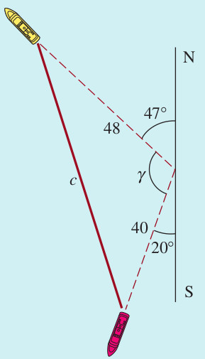{width=25%}

### Pregunta 33

Determine la separación de los dos barcos a las 11:00 a.m. Identifique cuáles afirmaciones son **verdaderas**:

<label><input type="checkbox" name="q17796553088016573" value="1" data-correct="true" > La separación entre ambos barcos al cabo de 4 horas es de aproximadamente $73.5\text{ millas náuticas}$ (redondeado a $74\text{ mi nár}$).</label>

<label><input type="checkbox" name="q17796553088016573" value="2" data-correct="true" > La distancia recorrida por el barco más rápido en las 4 horas es exactamente $48\text{ millas náuticas}$.</label>

<label><input type="checkbox" name="q17796553088016573" value="3" data-correct="true" > El ángulo formado entre las trayectorias de ambos barcos es de exactamente $113^\circ$.</label>

<label><input type="checkbox" name="q17796553088016573" value="4" data-correct="false" > La separación entre ambos barcos al cabo de 4 horas es de exactamente $50\text{ millas náuticas}$.</label>

<label><input type="checkbox" name="q17796553088016573" value="5" data-correct="false" > La distancia recorrida por el barco más lento es exactamente de $30\text{ millas náuticas}$ en el tiempo indicado.</label>

<label><input type="checkbox" name="q17796553088016573" value="6" data-correct="false" > Las trayectorias de ambos barcos forman un ángulo recto exacto de $90^\circ$.</label>

<button type="button" class="learnr-submit-btn" onclick="checkLearnrQuestion('q17796553088016573')">Enviar Respuestas</button>

¡Excelente! Has calculado la separación de los barcos mediante la ley de cosenos y rumbos de navegación.

Incorrecto. Tiempo: 4 horas (7 a 11 a.m.). Distancias: $d_1 = 4 \times 12 = 48\text{ mi nár}$, $d_2 = 4 \times 10 = 40\text{ mi nár}$. Ángulo: $180^\circ - 47^\circ - 20^\circ = 113^\circ$. Separación: $d = \sqrt{48^2 + 40^2 - 2(48)(40)cos(113^\circ)} \approx 73.53\text{ mi nár}$.

Intentar de nuevo

true

{width=25%}

### Pregunta 34

Calcule la distancia $d$ entre la cima de una pared del cañón a la otra. Seleccione cuáles afirmaciones son **verdaderas**:

<label><input type="checkbox" name="q17796553088099569" value="1" data-correct="true" > La distancia $d$ entre las cimas de ambas paredes es de aproximadamente $130.65\text{ pies}$ de longitud.</label>

<label><input type="checkbox" name="q17796553088099569" value="2" data-correct="true" > El modelo para calcular la separación se plantea mediante la ley de cosenos: $d = \sqrt{62^2 + 86^2 - 2(62)(86)cos(123^\circ)}$.</label>

<label><input type="checkbox" name="q17796553088099569" value="3" data-correct="true" > El valor del término de interacción $-2(62)(86)cos(123^\circ)$ es positivo y vale aproximadamente $5808.31$ debido al signo del coseno.</label>

<label><input type="checkbox" name="q17796553088099569" value="4" data-correct="false" > La distancia $d$ calculada es de exactamente $100.00\text{ pies}$.</label>

<label><input type="checkbox" name="q17796553088099569" value="5" data-correct="false" > Para resolver este problema se requiere aplicar una relación de tipo seno en triángulo rectángulo.</label>

<label><input type="checkbox" name="q17796553088099569" value="6" data-correct="false" > La distancia obtenida es de exactamente $150.00\text{ pies}$.</label>

<button type="button" class="learnr-submit-btn" onclick="checkLearnrQuestion('q17796553088099569')">Enviar Respuestas</button>

¡Excelente! Has obtenido la separación entre las cimas de las paredes del cañón de forma exacta.

Incorrecto. Se resuelve aplicando la ley de cosenos directa en el triángulo con lados $62$ y $86$ y ángulo de $123^\circ$: $d = \sqrt{62^2 + 86^2 - 2(62)(86)cos(123^\circ)} = \sqrt{3844 + 7396 - 10664(-0.544639)} = \sqrt{11240 + 5808.31} \approx 130.65\text{ pies}$.

Intentar de nuevo

true

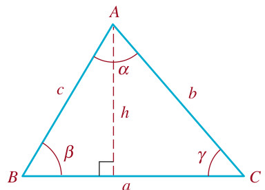{width=25%}

### Pregunta 35

Use la ley de senos para resolver el triángulo. Identifique cuáles afirmaciones son **verdaderas**:

<label><input type="checkbox" name="q17796553088172132" value="1" data-correct="true" > Para el caso $\alpha=80^\circ$, $\beta=20^\circ$, $b=7$, el valor del lado $a$ es exactamente $\frac{7sen(80^\circ)}{sen(20^\circ)} \approx 20.16$.</label>

<label><input type="checkbox" name="q17796553088172132" value="2" data-correct="true" > El tercer ángulo del triángulo para el primer caso es exactamente $\gamma = 80^\circ$, lo que lo convierte en un triángulo isósceles con lados $a=c$.</label>

<label><input type="checkbox" name="q17796553088172132" value="3" data-correct="true" > Para el caso $\alpha=30^\circ$, $\gamma=75^\circ$, $a=5$, el valor del lado $c$ es exactamente $5sen(75^\circ)/sen(30^\circ) \approx 9.66$.</label>

<label><input type="checkbox" name="q17796553088172132" value="4" data-correct="false" > Para el primer caso, el valor del lado $a$ es exactamente $14.00$ unidades.</label>

<label><input type="checkbox" name="q17796553088172132" value="5" data-correct="false" > El tercer ángulo del triángulo para el primer caso es de exactamente $90^\circ$.</label>

<label><input type="checkbox" name="q17796553088172132" value="6" data-correct="false" > La ley de senos es aplicable únicamente sobre triángulos rectángulos.</label>

<button type="button" class="learnr-submit-btn" onclick="checkLearnrQuestion('q17796553088172132')">Enviar Respuestas</button>

¡Excelente! Has resuelto de forma impecable el triángulo aplicando la ley de senos.

Incorrecto. Primer caso: $\gamma = 180^\circ - 80^\circ - 20^\circ = 80^\circ$. Por ley de senos: $\frac{a}{sen(80^\circ)} = \frac{7}{sen(20^\circ)} \Rightarrow a = \frac{7sen(80^\circ)}{sen(20^\circ)} \approx 20.16$. Dado que $\alpha = \gamma$, el triángulo es isósceles y $c = a \approx 20.16$.

Intentar de nuevo

true

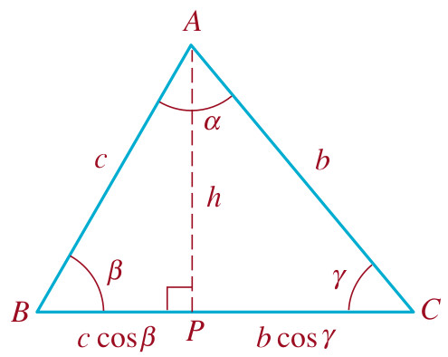{width=25%}

### Pregunta 36

Use la ley de cosenos para resolver el triángulo. Seleccione cuáles afirmaciones son **verdaderas**:

<label><input type="checkbox" name="q17796553088255333" value="1" data-correct="true" > Para el caso $b=11$, $c=8$ y $\alpha=162^\circ$, el valor del lado $a$ es aproximadamente $18.78$ unidades.</label>

<label><input type="checkbox" name="q17796553088255333" value="2" data-correct="true" > Para el caso $b=3$, $c=9$ y $\alpha=22^\circ$, el valor del lado $a$ es aproximadamente $6.32$ unidades.</label>

<label><input type="checkbox" name="q17796553088255333" value="3" data-correct="true" > Para el caso $a=4$, $c=7$ y $\beta=130^\circ$, el valor del lado $b$ es aproximadamente $10.05$ unidades.</label>

<label><input type="checkbox" name="q17796553088255333" value="4" data-correct="false" > Para el caso $b=11$, $c=8$ y $\alpha=162^\circ$, el valor del lado $a$ es exactamente $15.00$ unidades.</label>

<label><input type="checkbox" name="q17796553088255333" value="5" data-correct="false" > Para el caso $b=3$, $c=9$ y $\alpha=22^\circ$, el valor de $a$ es de exactamente $3.00$ unidades.</label>

<label><input type="checkbox" name="q17796553088255333" value="6" data-correct="false" > La ley de cosenos requiere que la suma de los dos lados conocidos sea menor que el lado opuesto.</label>

<button type="button" class="learnr-submit-btn" onclick="checkLearnrQuestion('q17796553088255333')">Enviar Respuestas</button>

¡Excelente! Has obtenido la resolución exacta de los triángulos oblicuángulos mediante la ley de cosenos.

Incorrecto. Primer caso: $a = \sqrt{11^2 + 8^2 - 2(11)(8)cos(162^\circ)} = \sqrt{121+64-176(-0.95105)} \approx 18.78$. Segundo caso: $a = \sqrt{3^2 + 9^2 - 2(3)(9)cos(22^\circ)} \approx 6.32$. Tercer caso: $b = \sqrt{4^2 + 7^2 - 2(4)(7)cos(130^\circ)} \approx 10.05$.

Intentar de nuevo

true

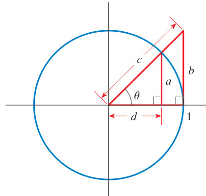{width=30%}

### Pregunta 37

Exprese la longitud $a$, $b$, $c$ y $d$ de la figura anterior. Identifique cuáles afirmaciones son **verdaderas**:

<label><input type="checkbox" name="q17796553088325025" value="1" data-correct="true" > La longitud $a$ del cateto opuesto del triángulo rectángulo inscrito es exactamente $a = sen(\theta)$.</label>

<label><input type="checkbox" name="q17796553088325025" value="2" data-correct="true" > La longitud $b$ del cateto adyacente del triángulo rectángulo inscrito es exactamente $b = cos(\theta)$.</label>

<label><input type="checkbox" name="q17796553088325025" value="3" data-correct="true" > La longitud $c$ de la línea tangente al círculo desde el punto en el eje horizontal es exactamente $c = tan(\theta)$.</label>

<label><input type="checkbox" name="q17796553088325025" value="4" data-correct="false" > La longitud $a$ del cateto opuesto es exactamente $a = cos(\theta)$.</label>

<label><input type="checkbox" name="q17796553088325025" value="5" data-correct="false" > La longitud $c$ de la tangente se describe como $c = csc(\theta)$.</label>

<label><input type="checkbox" name="q17796553088325025" value="6" data-correct="false" > La longitud $d$ de la secante es exactamente $d = sen(\theta)$.</label>

<button type="button" class="learnr-submit-btn" onclick="checkLearnrQuestion('q17796553088325025')">Enviar Respuestas</button>

¡Excelente! Has deducido correctamente todas las longitudes en el círculo unitario.

Incorrecto. En el círculo unitario ($R=1$): el triángulo inscrito tiene hipotenusa $1$, por lo que opuesto $a = sen(\theta)$ y adyacente $b = cos(\theta)$. La línea tangente externa vertical mide $c = tan(\theta)$ y la hipotenusa de ese triángulo mayor mide $d = sec(\theta)$.

Intentar de nuevo

true

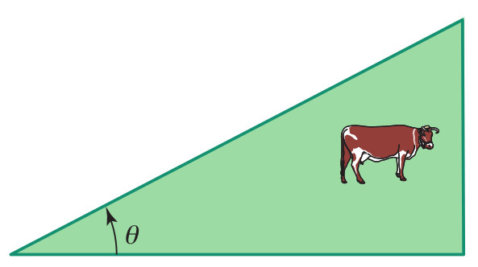{width=50%}

### Pregunta 38

Demuestre la fórmula de área $A(\theta)$ del pastizal triangular. Seleccione cuáles afirmaciones son **verdaderas**:

<label><input type="checkbox" name="q17796553088416499" value="1" data-correct="true" > El área del pastizal triangular en función del ángulo $\theta$ es $A(\theta) = \frac{1}{2}cot(\theta)\left(\frac{2000}{1+cot(\theta)+csc(\theta)}\right)^2$.</label>

<label><input type="checkbox" name="q17796553088416499" value="2" data-correct="true" > El perímetro del triángulo formado por los $2000\text{ pies}$ de cerca se modela como $h + hcot(\theta) + hcsc(\theta) = 2000$.</label>

<label><input type="checkbox" name="q17796553088416499" value="3" data-correct="true" > La altura $h$ del triángulo en términos del perímetro cercado es $h = \frac{2000}{1+cot(\theta)+csc(\theta)}$.</label>

<label><input type="checkbox" name="q17796553088416499" value="4" data-correct="false" > El área del pastizal triangular se simplifica a la función lineal $A(\theta) = 1000sen(\theta)$.</label>

<label><input type="checkbox" name="q17796553088416499" value="5" data-correct="false" > La altura del triángulo isósceles formado es siempre de exactamente $500\text{ pies}$.</label>

<label><input type="checkbox" name="q17796553088416499" value="6" data-correct="false" > La ley de senos no aplica en este problema ya que el perímetro de la cerca es constante.</label>

<button type="button" class="learnr-submit-btn" onclick="checkLearnrQuestion('q17796553088416499')">Enviar Respuestas</button>

¡Excelente! Has demostrado con total rigurosidad la función de área del pastizal del campesino.

Incorrecto. Lados del triángulo rectángulo: altura $h$, base $hcot(\theta)$, hipotenusa $hcsc(\theta)$. Perímetro: $h + hcot(\theta) + hcsc(\theta) = 2000 \Rightarrow h = \frac{2000}{1+cot(\theta)+csc(\theta)}$. El área es $A = \frac{1}{2} \cdot \text{base} \cdot \text{altura} = \frac{1}{2}(hcot(\theta))h = \frac{1}{2}cot(\theta)h^2$.

Intentar de nuevo

true

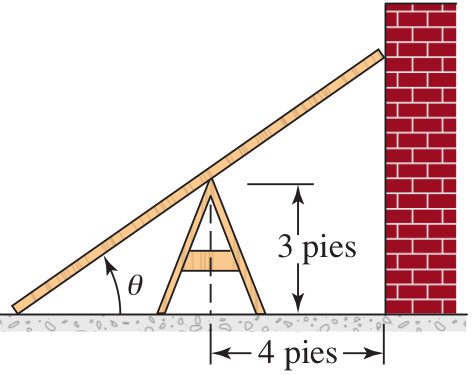{width=45%}

### Pregunta 39

Exprese la longitud de la tabla en función de $\theta$. Identifique cuáles afirmaciones son **verdaderas**:

<label><input type="checkbox" name="q17796553088502696" value="1" data-correct="true" > La longitud total $L$ de la tabla en términos del ángulo $\theta$ y las distancias es $L(\theta) = hcsc(\theta) + dsec(\theta)$.</label>

<label><input type="checkbox" name="q17796553088502696" value="2" data-correct="true" > El segmento de la tabla desde el caballete hasta el muro mide exactamente $dsec(\theta)$, donde $d$ es la distancia al muro.</label>

<label><input type="checkbox" name="q17796553088502696" value="3" data-correct="true" > El segmento de la tabla desde el caballete hasta el suelo mide exactamente $hcsc(\theta)$, donde $h$ es la altura del caballete.</label>

<label><input type="checkbox" name="q17796553088502696" value="4" data-correct="false" > La longitud total de la tabla es constante e independiente del ángulo e igual a $L = \sqrt{h^2+d^2}$.</label>

<label><input type="checkbox" name="q17796553088502696" value="5" data-correct="false" > El segmento de la tabla hasta el muro se modela como $dsen(\theta)$.</label>

<label><input type="checkbox" name="q17796553088502696" value="6" data-correct="false" > El segmento de la tabla hasta el suelo se modela como $hcos(\theta)$.</label>

<button type="button" class="learnr-submit-btn" onclick="checkLearnrQuestion('q17796553088502696')">Enviar Respuestas</button>

¡Excelente! Has expresado la longitud de la tabla en función del ángulo central perfectamente.

Incorrecto. Caballete a suelo: altura $h$ es opuesto al ángulo $\theta$, por lo que hipotenusa es $hcsc(\theta)$. Caballete a muro: distancia $d$ es adyacente a $\theta$, por lo que hipotenusa es $dsec(\theta)$. Sumando ambos da $L = hcsc(\theta) + dsec(\theta)$.

Intentar de nuevo

true

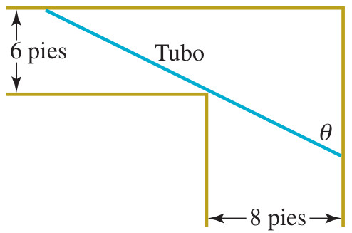{width=45%}

### Pregunta 40

Exprese la longitud máxima del tubo metálico para pasar la esquina. Seleccione cuáles afirmaciones son **verdaderas**:

<label><input type="checkbox" name="q17796553088595092" value="1" data-correct="true" > La longitud máxima $L$ del tubo expresada en función de $\theta$ es $L(\theta) = 8csc(\theta) + 6sec(\theta)$.</label>

<label><input type="checkbox" name="q17796553088595092" value="2" data-correct="true" > El segmento del tubo en el corredor de $8\text{ pies}$ de ancho se modela como $8csc(\theta)$ al rozar la esquina.</label>

<label><input type="checkbox" name="q17796553088595092" value="3" data-correct="true" > El segmento del tubo en el corredor de $6\text{ pies}$ de ancho se modela como $6sec(\theta)$ al rozar la esquina.</label>

<label><input type="checkbox" name="q17796553088595092" value="4" data-correct="false" > La longitud máxima del tubo es una constante e igual a $L = \sqrt{8^2 + 6^2} = 10\text{ pies}$.</label>

<label><input type="checkbox" name="q17796553088595092" value="5" data-correct="false" > El segmento del tubo en el pasillo de $8\text{ pies}$ se modela como $8sen(\theta)$.</label>

<label><input type="checkbox" name="q17796553088595092" value="6" data-correct="false" > El segmento del tubo en el pasillo de $6\text{ pies}$ se modela como $6cos(\theta)$.</label>

<button type="button" class="learnr-submit-btn" onclick="checkLearnrQuestion('q17796553088595092')">Enviar Respuestas</button>

¡Excelente! Has modelado correctamente la longitud del tubo para la esquina en ángulo recto.

Incorrecto. Al pasar la esquina rozándola, el tubo forma dos segmentos: en el pasillo de 8 pies es la hipotenusa con opuesto 8, es decir, $8csc(\theta)$. En el pasillo de 6 pies es la hipotenusa con adyacente 6, es decir, $6sec(\theta)$. Total $L = 8csc(\theta) + 6sec(\theta)$.

Intentar de nuevo

true

## Calificación

Para ver el análisis de tu desempeño en esta prueba, haz clic en el siguiente botón. El sistema evaluará tus respuestas y te proporcionará recomendaciones personalizadas.

<button type="button" class="learnr-submit-btn" style="margin-bottom:1rem;" onclick="showScoreReport('sr17796553088778352', 40, '¡Felicitaciones! Has demostrado un dominio sobresaliente y una comprensión profunda de todos los conceptos y aplicaciones trigonométricas. ¡Sigue así!', 'Has aprobado la evaluación interactiva de trigonometría. Tienes bases sólidas, pero te sugerimos revisar los temas de las preguntas incorrectas o sin responder para perfeccionar tus destrezas analíticas.', 'Tu calificación actual está por debajo del puntaje de aprobación. Te recomendamos repasar los temas, volver a estudiar los diagramas del círculo trigonométrico, las leyes de senos y cosenos, y reintentar el cuestionario.')">Calcular Mis Resultados</button>

