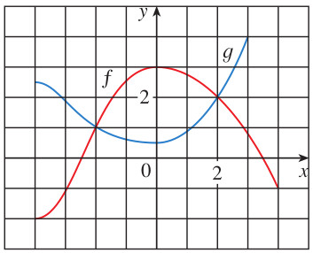
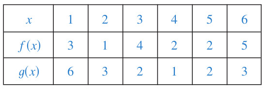
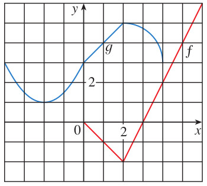

# Evaluación de Funciones: Exponenciales y Logarítmicas (Ev_conceptoFuncionExp_v1)

## Introducción

Bienvenido a la **Evaluación Interactiva de Álgebra y Precálculo: Concepto de Funciones, Exponenciales y Logaritmos (Ev_conceptoFuncionExp_v1)**.

Este cuestionario consta de **29 preguntas** exhaustivas divididas en tres bloques temáticos para evaluar tu comprensión en lectura de funciones, composiciones, modelado de leyes exponenciales y logarítmicas, resolución de ecuaciones complejas y resolución de sistemas no lineales.

> **Instrucciones Generales:**
> * Resuelve los problemas con papel y lápiz antes de contestar.
> * Las preguntas son de **selección múltiple con múltiples respuestas correctas (casillas de verificación)**. Debes seleccionar **todas** las afirmaciones que consideres correctas para obtener el puntaje completo en cada una.
> * Puedes intentar responder cada pregunta tantas veces como desees.
> * Al finalizar, haz clic en el botón de **"Obtener Mi Reporte de Resultados"** en la última sección para visualizar tu calificación y una retroalimentación formativa personalizada de estudio.
> * ¡Mucho éxito en tu evaluación!

---

## Bloque 1: Lectura Gráfica y Composición de Funciones

En este bloque se analiza la lectura directa de funciones en gráficos continuos, el cálculo de composiciones de funciones en formato de tablas de valores numéricos discretos y composiciones a partir de gráficos formados por trazos lineales y cuadráticos.

### Pregunta 1 (Lectura de f y g en el mismo plano)

✓ Seleccionar afirmaciones VERDADERAS

Se muestran las gráficas de $f$ y $g$ en la figura anterior. Analice detalladamente su comportamiento, dominios, rangos, intersecciones e intervalos de crecimiento para identificar cuáles de las siguientes afirmaciones son **verdaderas**:

<label><input type="checkbox" name="q17796617354553407" value="1" data-correct="true" > El valor de la función $f$ en $x = -4$ es $f(-4) = -2$, y el valor de $g$ en $x = 3$ es $g(3) = 4$.</label>

<label><input type="checkbox" name="q17796617354553407" value="2" data-correct="true" > Las gráficas de $f(x)$ y $g(x)$ se intersectan para los valores de $x = -2$ y $x = 2$, es decir, se cumple que $f(x) = g(x)$ en esos puntos.</label>

<label><input type="checkbox" name="q17796617354553407" value="3" data-correct="true" > Las soluciones estimadas de la ecuación $f(x) = -1$ corresponden a los valores $x = -3$ y $x = 4$.</label>

<label><input type="checkbox" name="q17796617354553407" value="4" data-correct="true" > La función $f(x)$ es estrictamente decreciente en el intervalo cerrado $[0, 4]$.</label>

<label><input type="checkbox" name="q17796617354553407" value="5" data-correct="true" > El dominio de la función $f$ es el intervalo $[-4, 4]$ y su rango es el intervalo $[-2, 3]$.</label>

<label><input type="checkbox" name="q17796617354553407" value="6" data-correct="false" > El dominio de la función $f$ es $[-2, 3]$ y su rango es $[-4, 4]$.</label>

<label><input type="checkbox" name="q17796617354553407" value="7" data-correct="false" > El valor de la función $g$ en $x = 3$ es $g(3) = -2$, y el de $f$ en $x = -4$ es $f(-4) = 4$.</label>

<label><input type="checkbox" name="q17796617354553407" value="8" data-correct="false" > Las gráficas de las funciones se intersectan únicamente en el origen de coordenadas $(0, 0)$.</label>

<button type="button" class="learnr-submit-btn" onclick="checkLearnrQuestion('q17796617354553407')">Enviar Respuesta</button>

¡Excelente! Has realizado una lectura y análisis de las gráficas de ambas funciones con total precisión.

Incorrecto. Observe con atención los puntos notables en la gráfica: busque las intersecciones entre las dos curvas para $f(x)=g(x)$, los valores sobre el eje $x$ donde la curva de $f$ cruza la recta horizontal $y=-1$, y el recorrido vertical máximo y mínimo de la gráfica de $f$.

Intentar de nuevo

true

### Pregunta 2 (Composición en formato tabla)

✓ Seleccionar afirmaciones VERDADERAS

Utilizando la tabla de valores proporcionada en la figura para las funciones $f$ y $g$, calcule las imágenes de las funciones compuestas indicadas paso a paso. Identifique cuáles de las siguientes afirmaciones son **verdaderas**:

<label><input type="checkbox" name="q17796617354817212" value="1" data-correct="true" > El valor de la función compuesta $f(g(1))$ es exactamente igual a $5$.</label>

<label><input type="checkbox" name="q17796617354817212" value="2" data-correct="true" > El valor de $g(f(1))$ es igual a $2$ y el valor de $f(f(1))$ es igual a $4$.</label>

<label><input type="checkbox" name="q17796617354817212" value="3" data-correct="true" > Las composiciones $g(g(1))$ y $g(f(3))$ dan como resultados exactos $3$ y $1$, respectivamente.</label>

<label><input type="checkbox" name="q17796617354817212" value="4" data-correct="true" > La función compuesta $f(g(6))$ produce un resultado final igual a $4$.</label>

<label><input type="checkbox" name="q17796617354817212" value="5" data-correct="false" > El valor de la función compuesta $f(g(1))$ es $6$ puesto que la imagen interna $g(1)$ vale $6$.</label>

<label><input type="checkbox" name="q17796617354817212" value="6" data-correct="false" > La función compuesta $g(f(3))$ produce un resultado final igual a $4$ puesto que $f(3)$ vale $4$.</label>

<label><input type="checkbox" name="q17796617354817212" value="7" data-correct="false" > El valor de $f(g(6))$ es igual a $1$.</label>

<button type="button" class="learnr-submit-btn" onclick="checkLearnrQuestion('q17796617354817212')">Enviar Respuesta</button>

¡Excelente! Has evaluado todas las composiciones a partir de la tabla de valores de forma impecable.

Incorrecto. Recuerde resolver las composiciones de adentro hacia afuera. Por ejemplo, para $f(g(1))$: primero obtenga $g(1)$ en la tabla, y el valor resultante úselo como entrada en la función $f$.

Intentar de nuevo

true

### Pregunta 3 (Composición gráfica - enunciado109)

✓ Seleccionar afirmaciones VERDADERAS

A partir de las gráficas de las funciones $f$ (en rojo, definida en el dominio $[0, 6]$ como $f(x)=-x$ para $x \in [0, 2]$ y $f(x)=2x-6$ para $x \in [2, 6]$) y $g$ (en azul, definida como la parábola $g(x)=x^2+4x+5$ para $x \in [-4, -1]$ y el segmento de recta para $x \in [-1, 2)$) representadas en la figura anterior, evalúe las composiciones indicadas e identifique cuáles de las siguientes afirmaciones son **verdaderas**:

<label><input type="checkbox" name="q17796617355002898" value="1" data-correct="true" > El valor de la composición $f(g(1))$ es exactamente $2$, ya que la función interna es $g(1) = 4$ y la externa es $f(4) = 2$.</label>

<label><input type="checkbox" name="q17796617355002898" value="2" data-correct="true" > La composición $g(f(1))$ es igual a $2$, ya que la función interna es $f(1) = -1$ y la externa evaluada es $g(-1) = 2$.</label>

<label><input type="checkbox" name="q17796617355002898" value="3" data-correct="true" > El valor de la composición $f(f(1))$ no está definido en el conjunto de los números reales, debido a que $f(1) = -1$, lo cual se encuentra fuera del dominio de la función externa $f$, que está restringido al intervalo $[0, 6]$.</label>

<label><input type="checkbox" name="q17796617355002898" value="4" data-correct="true" > El valor de la composición $g(g(1))$ es igual a $3$, puesto que la función interna vale $g(1) = 4$ y, según el punto marcado en la gráfica, se tiene que $g(4) = 3$.</label>

<label><input type="checkbox" name="q17796617355002898" value="5" data-correct="true" > El valor de la composición $g(f(3))$ es exactamente $3$, ya que la función interna es $f(3) = 0$ y en la gráfica se lee que la imagen es $g(0) = 3$.</label>

<label><input type="checkbox" name="q17796617355002898" value="6" data-correct="true" > El valor de la composición $f(g(6))$ es igual a $6$, ya que según la gráfica la función interna es $g(6) = 6$ y la externa es $f(6) = 6$.</label>

<label><input type="checkbox" name="q17796617355002898" value="7" data-correct="false" > La composición $f(g(1))$ da como resultado final $4$.</label>

<label><input type="checkbox" name="q17796617355002898" value="8" data-correct="false" > La composición $g(f(1))$ da como resultado final $-1$.</label>

<button type="button" class="learnr-submit-btn" onclick="checkLearnrQuestion('q17796617355002898')">Enviar Respuesta</button>

¡Excelente! Has resuelto con maestría y rigurosidad analítica las composiciones de funciones a partir del gráfico de trazos.

Incorrecto. Revise el dominio de cada función y lea los puntos exactos. Recuerde que $f(x)$ solo está definida para $x \geq 0$. Para el cálculo de $f(f(1))$, note que $f(1)=-1$ no pertenece al dominio de $f$, por lo tanto, la composición no está definida en los reales.

Intentar de nuevo

true

---

## Bloque 2: Propiedades, Leyes, Simplificación y Ecuaciones

En este bloque se evalúa el uso de las leyes de los exponentes y los logaritmos, su simplificación, la conversión de expresiones de formato exponencial a logarítmico y viceversa, la expansión de logaritmos y la resolución analítica de ecuaciones.

### Pregunta 4 (Deducir función exponencial $f(x)=b^x$)

✓ Seleccionar afirmaciones VERDADERAS

Deduzca una función exponencial de la forma $f(x)=b^{x}$ con $b > 0$, de tal manera que la gráfica de $f$ pase por cada uno de los puntos dados. Identifique cuáles de las siguientes deducciones son **verdaderas**:

<label><input type="checkbox" name="q17796617355114791" value="1" data-correct="true" > Para el punto $(3, 26)$, la función es $f(x) = (\sqrt[3]{26})^x$, lo que corresponde a una base $b = \sqrt[3]{26} \approx 2.9625$.</label>

<label><input type="checkbox" name="q17796617355114791" value="2" data-correct="true" > Para el punto $(-1, 5)$, la función es $f(x) = (0.2)^x$ (o $f(x) = 5^{-x}$), lo que corresponde a una base $b = 0.2$ (o $b = \frac{1}{5}$).</label>

<label><input type="checkbox" name="q17796617355114791" value="3" data-correct="true" > Para el punto $(1, e^{2})$, la función es $f(x) = (e^2)^x = e^{2x}$, lo que corresponde a una base $b = e^2 \approx 7.3891$.</label>

<label><input type="checkbox" name="q17796617355114791" value="4" data-correct="true" > Para el punto $(2, e)$, la función es $f(x) = (\sqrt{e})^x = e^{x/2}$, lo que corresponde a una base $b = \sqrt{e} \approx 1.6487$.</label>

<label><input type="checkbox" name="q17796617355114791" value="5" data-correct="false" > Para el punto $(3, 26)$, la base es $b = \frac{26}{3}$.</label>

<label><input type="checkbox" name="q17796617355114791" value="6" data-correct="false" > Para el punto $(-1, 5)$, la base es $b = -5$.</label>

<label><input type="checkbox" name="q17796617355114791" value="7" data-correct="false" > Para el punto $(2, e)$, la base es $b = e^2$.</label>

<button type="button" class="learnr-submit-btn" onclick="checkLearnrQuestion('q17796617355114791')">Enviar Respuesta</button>

¡Excelente! Has deducido correctamente las bases correspondientes para cada uno de los puntos geométricos dados.

Incorrecto. Recuerde sustituir el punto dado $(x_0, y_0)$ en la ecuación fundamental $y_0 = b^{x_0}$ y despejar la base $b$. Recuerde que la base de una función exponencial clásica siempre debe ser un número real positivo ($b &gt; 0$).

Intentar de nuevo

true

### Pregunta 5 (Resolver desigualdades exponenciales)

✓ Seleccionar afirmaciones VERDADERAS

Use las propiedades de las funciones exponenciales crecientes y decrecientes para resolver las desigualdades dadas. Identifique cuáles de las siguientes soluciones son totalmente **verdaderas**:

<label><input type="checkbox" name="q17796617355204922" value="1" data-correct="true" > La solución para la desigualdad $2^x > 16$ es el intervalo $(4, \infty)$, es decir, se cumple para todo $x > 4$.</label>

<label><input type="checkbox" name="q17796617355204922" value="2" data-correct="true" > La solución para la desigualdad $(0.5)^x \geq 8$ (que equivale a $2^{-x} \geq 2^3$) es el intervalo $(-\infty, -3]$, es decir, se cumple para todo $x \leq -3$.</label>

<label><input type="checkbox" name="q17796617355204922" value="3" data-correct="true" > La solución para la desigualdad $e^x \leq 1$ (que equivale a $e^x \leq e^0$) es el intervalo $(-\infty, 0]$, es decir, se cumple para todo $x \leq 0$.</label>

<label><input type="checkbox" name="q17796617355204922" value="4" data-correct="true" > La solución para la desigualdad $e^{x-2} < 1$ (que equivale a $e^{x-2} < e^0 \Rightarrow x-2 < 0$) es el intervalo $(-\infty, 2)$, es decir, se cumple para todo $x < 2$.</label>

<label><input type="checkbox" name="q17796617355204922" value="5" data-correct="false" > La solución para la desigualdad $2^x > 16$ es el intervalo $x > 8$.</label>

<label><input type="checkbox" name="q17796617355204922" value="6" data-correct="false" > La solución para la desigualdad $(0.5)^x \geq 8$ es el intervalo $x \geq 3$.</label>

<label><input type="checkbox" name="q17796617355204922" value="7" data-correct="false" > La solución para la desigualdad $e^{x-2} < 1$ es el intervalo $x > 2$.</label>

<button type="button" class="learnr-submit-btn" onclick="checkLearnrQuestion('q17796617355204922')">Enviar Respuesta</button>

¡Excelente! Has resuelto de forma perfecta las desigualdades exponenciales analizando la monotonía de la base.

Incorrecto. Recuerde que si la base es mayor que 1 (como $2$ o $e$), la función es creciente y la desigualdad se preserva al comparar los exponentes ($b^u &gt; b^v \Rightarrow u &gt; v$). Si la base es menor que 1 (como $0.5$), la función es decreciente y el sentido de la desigualdad se invierte ($b^u \geq b^v \Rightarrow u \leq v$).

Intentar de nuevo

true

### Pregunta 6 (Relaciones exponenciales con $2^t=a$ y $6^t=b$)

✓ Seleccionar afirmaciones VERDADERAS

Suponga que $2^t=a$ y que $6^t=b$. Conteste las siguientes expresiones usando de forma estricta las leyes de los exponentes y determine cuáles de las siguientes afirmaciones son **verdaderas**:

<label><input type="checkbox" name="q17796617355286857" value="1" data-correct="true" > La expresión para $12^t$ equivale al producto $a \cdot b$.</label>

<label><input type="checkbox" name="q17796617355286857" value="2" data-correct="true" > La expresión para $3^t$ (obtenida como $\frac{6^t}{2^t}$) equivale a la fracción $\frac{b}{a}$.</label>

<label><input type="checkbox" name="q17796617355286857" value="3" data-correct="true" > La expresión para $6^{-t}$ equivale a la fracción inversa $\frac{1}{b}$.</label>

<label><input type="checkbox" name="q17796617355286857" value="4" data-correct="true" > La expresión para $6^{3t}$ equivale al cubo $b^3$.</label>

<label><input type="checkbox" name="q17796617355286857" value="5" data-correct="true" > La expresión simplificada para $2^{-3t}2^{7t}$ equivale a la potencia $a^4$.</label>

<label><input type="checkbox" name="q17796617355286857" value="6" data-correct="true" > La expresión para $18^t$ (obtenida como $3^t \cdot 6^t = \frac{b}{a} \cdot b$) equivale a la expresión $\frac{b^2}{a}$.</label>

<label><input type="checkbox" name="q17796617355286857" value="7" data-correct="false" > La expresión para $12^t$ equivale a la suma $a + b$.</label>

<label><input type="checkbox" name="q17796617355286857" value="8" data-correct="false" > La expresión para $3^t$ equivale a la resta $b - a$.</label>

<label><input type="checkbox" name="q17796617355286857" value="9" data-correct="false" > La expresión para $18^t$ es igual a $b^3$.</label>

<button type="button" class="learnr-submit-btn" onclick="checkLearnrQuestion('q17796617355286857')">Enviar Respuesta</button>

¡Excelente! Has aplicado correctamente las leyes de los exponentes para relacionar las expresiones algebraicas.

Incorrecto. Recuerde aplicar propiedades clave de exponentes como la potencia de un producto $(xy)^t = x^t y^t$, cociente de potencias de igual exponente $\frac{x^t}{y^t} = (\frac{x}{y})^t$, y producto de potencias con bases iguales $x^u x^v = x^{u+v}$.

Intentar de nuevo

true

### Pregunta 7 (Cálculo de logaritmo con bases genéricas)

✓ Seleccionar afirmaciones VERDADERAS

Si se conocen los valores de los logaritmos en una base genérica $\log_b 2 = 0.4307$ y $\log_b 3 = 0.6826$, encuentre el valor de la expresión $\log_b \sqrt[3]{18}$. Identifique cuáles de las siguientes afirmaciones son **verdaderas**:

<label><input type="checkbox" name="q17796617355384005" value="1" data-correct="true" > La expansión utilizando leyes de logaritmos es igual a $\frac{1}{3}\log_b 2 + \frac{2}{3}\log_b 3$.</label>

<label><input type="checkbox" name="q17796617355384005" value="2" data-correct="true" > El valor numérico aproximado al aplicar las propiedades a partir de los datos dados es igual a $0.5986$.</label>

<label><input type="checkbox" name="q17796617355384005" value="3" data-correct="true" > Al simplificar la expresión por propiedades de radicales se obtiene que $\log_b \sqrt[3]{18} = \log_b(18^{1/3}) = \frac{1}{3}\log_b(18)$.</label>

<label><input type="checkbox" name="q17796617355384005" value="4" data-correct="true" > La expresión se descompone usando la factorización prima $18 = 2 \cdot 3^2$.</label>

<label><input type="checkbox" name="q17796617355384005" value="5" data-correct="false" > El valor numérico aproximado de la expresión es $0.3711$.</label>

<label><input type="checkbox" name="q17796617355384005" value="6" data-correct="false" > El valor numérico se calcula sumando directamente los valores conocidos: $\log_b 2 + \log_b 3 = 1.1133$.</label>

<button type="button" class="learnr-submit-btn" onclick="checkLearnrQuestion('q17796617355384005')">Enviar Respuesta</button>

¡Excelente! Has calculado el logaritmo en base genérica con total precisión matemática.

Incorrecto. Descomponga el radicando $18 = 2 \cdot 3^2$, aplique la propiedad del exponente radical para obtener $\frac{1}{3}\log_b(2 \cdot 3^2)$, luego expanda el logaritmo del producto como la suma de los logaritmos, y por último evalúe los valores numéricos decimales.

Intentar de nuevo

true

### Pregunta 8 (Simplificar y escribir como un solo logaritmo)

✓ Seleccionar afirmaciones VERDADERAS

Simplifique la siguiente expresión logarítmica y escríbala como un único logaritmo simplificado: $$\frac{1}{2}\ln(36)+2\ln(4)-\ln(4)$$ Identifique cuáles de las siguientes afirmaciones son **verdaderas**:

<label><input type="checkbox" name="q17796617355478016" value="1" data-correct="true" > La expresión simplificada como un único logaritmo es $\ln(24)$.</label>

<label><input type="checkbox" name="q17796617355478016" value="2" data-correct="true" > La expresión inicial se reduce paso a paso como: $\ln(\sqrt{36}) + 2\ln(4) - \ln(4) = \ln(6) + \ln(4) = \ln(6 \cdot 4) = \ln(24)$.</label>

<label><input type="checkbox" name="q17796617355478016" value="3" data-correct="true" > El valor numérico aproximado de la expresión simplificada es $3.1781$.</label>

<label><input type="checkbox" name="q17796617355478016" value="4" data-correct="false" > La expresión simplificada final equivale a la expresión $\ln(144)$.</label>

<label><input type="checkbox" name="q17796617355478016" value="5" data-correct="false" > La expresión final simplificada se reduce simplemente a $\ln(6)$.</label>

<label><input type="checkbox" name="q17796617355478016" value="6" data-correct="false" > El valor numérico aproximado de la expresión es $2.0794$.</label>

<button type="button" class="learnr-submit-btn" onclick="checkLearnrQuestion('q17796617355478016')">Enviar Respuesta</button>

¡Excelente! Has simplificado la suma de logaritmos aplicando de manera idónea sus leyes fundamentales.

Incorrecto. Recuerde que $\frac{1}{2}\ln(36) = \ln(36^{1/2}) = \ln(6)$ y que $2\ln(4) - \ln(4) = \ln(4)$. Al sumar ambos términos resultantes, aplique la propiedad del producto de logaritmos: $\ln(u) + \ln(v) = \ln(u \cdot v)$.

Intentar de nuevo

true

### Pregunta 9 (Reformular de exponencial a logarítmica)

✓ Seleccionar afirmaciones VERDADERAS

Reformule la expresión exponencial dada en su forma logarítmica equivalente: $$(a+b)^{2}=a^2+2ab+b^2$$ Identifique cuáles de las siguientes afirmaciones son **verdaderas**:

<label><input type="checkbox" name="q17796617355576187" value="1" data-correct="true" > La expresión logarítmica equivalente es $\log_{a+b}(a^2+2ab+b^2) = 2$.</label>

<label><input type="checkbox" name="q17796617355576187" value="2" data-correct="true" > En esta reformulación, el binomio $(a+b)$ actúa como la base del logaritmo, el trinomio $(a^2+2ab+b^2)$ es el argumento y el exponente $2$ es el resultado del logaritmo.</label>

<label><input type="checkbox" name="q17796617355576187" value="3" data-correct="false" > La expresión logarítmica equivalente es $\log_{2}(a^2+2ab+b^2) = a+b$.</label>

<label><input type="checkbox" name="q17796617355576187" value="4" data-correct="false" > La expresión logarítmica equivalente es $\log_{a+b}(2) = a^2+2ab+b^2$.</label>

<button type="button" class="learnr-submit-btn" onclick="checkLearnrQuestion('q17796617355576187')">Enviar Respuesta</button>

¡Excelente! Has reformulado correctamente la expresión a su forma logarítmica equivalente.

Incorrecto. La equivalencia fundamental establece que $A^B = C$ si y solo si $\log_A(C) = B$. Aplique esta definición identificando la base $A = (a+b)$, el exponente $B = 2$, y el resultado $C = a^2+2ab+b^2$.

Intentar de nuevo

true

### Pregunta 10 (Reformular de logarítmica a exponencial)

✓ Seleccionar afirmaciones VERDADERAS

Reformule la expresión logarítmica dada en su forma exponencial equivalente: $$\log_{\sqrt{3}}81=8$$ Identifique cuáles de las siguientes afirmaciones son **verdaderas**:

<label><input type="checkbox" name="q17796617355667608" value="1" data-correct="true" > La expresión exponencial equivalente es $(\sqrt{3})^8 = 81$.</label>

<label><input type="checkbox" name="q17796617355667608" value="2" data-correct="true" > Puesto que $\sqrt{3} = 3^{1/2}$, se verifica que $(3^{1/2})^8 = 3^4 = 81$, lo cual demuestra consistencia matemática.</label>

<label><input type="checkbox" name="q17796617355667608" value="3" data-correct="false" > La expresión exponencial equivalente es $8^{\sqrt{3}} = 81$.</label>

<label><input type="checkbox" name="q17796617355667608" value="4" data-correct="false" > La expresión exponencial equivalente es $81^8 = \sqrt{3}$.</label>

<button type="button" class="learnr-submit-btn" onclick="checkLearnrQuestion('q17796617355667608')">Enviar Respuesta</button>

¡Excelente! Has reformulado la expresión logarítmica a su forma exponencial de manera consistente.

Incorrecto. La equivalencia fundamental establece que $\log_b(u) = v$ si y solo si $b^v = u$. Identifique la base $b = \sqrt{3}$, el argumento $u = 81$ y el resultado $v = 8$.

Intentar de nuevo

true

### Pregunta 11 (Valor exacto de $\log_{10}(0.0000001)$)

✓ Seleccionar afirmaciones VERDADERAS

Determine el valor numérico exacto de la expresión logarítmica: $$\log_{10}(0.0000001)$$ Seleccione las afirmaciones que son **verdaderas**:

<label><input type="checkbox" name="q17796617355743468" value="1" data-correct="true" > El valor exacto de este logaritmo es $-7$.</label>

<label><input type="checkbox" name="q17796617355743468" value="2" data-correct="true" > El argumento decimal se puede escribir en notación científica como la potencia de base diez $10^{-7}$, y dado que la base del logaritmo es $10$, el resultado es el exponente $-7$.</label>

<label><input type="checkbox" name="q17796617355743468" value="3" data-correct="false" > El valor exacto de este logaritmo es $7$.</label>

<label><input type="checkbox" name="q17796617355743468" value="4" data-correct="false" > El valor exacto de este logaritmo es $-6$.</label>

<button type="button" class="learnr-submit-btn" onclick="checkLearnrQuestion('q17796617355743468')">Enviar Respuesta</button>

¡Excelente! Has determinado el valor exacto del logaritmo decimal con total exactitud.

Incorrecto. Cuente la cantidad de posiciones decimales hacia la derecha para escribir $0.0000001$ como $10^{-7}$. Luego aplique la identidad $\log_b(b^u) = u$.

Intentar de nuevo

true

### Pregunta 12 (Valor exacto de $25^{\log_5 8}$)

✓ Seleccionar afirmaciones VERDADERAS

Determine el valor numérico exacto de la expresión exponencial con logaritmo: $$25^{\log_{5}8}$$ Identifique cuáles de las siguientes afirmaciones son **verdaderas**:

<label><input type="checkbox" name="q17796617355836289" value="1" data-correct="true" > El valor exacto de la expresión es $64$.</label>

<label><input type="checkbox" name="q17796617355836289" value="2" data-correct="true" > Al escribir la base externa como $25 = 5^2$ y aplicar las leyes de exponentes, la expresión se reduce a $(5^{\log_5 8})^2 = 8^2 = 64$.</label>

<label><input type="checkbox" name="q17796617355836289" value="3" data-correct="false" > El valor exacto de la expresión es $16$.</label>

<label><input type="checkbox" name="q17796617355836289" value="4" data-correct="false" > El valor exacto de la expresión es $32$.</label>

<button type="button" class="learnr-submit-btn" onclick="checkLearnrQuestion('q17796617355836289')">Enviar Respuesta</button>

¡Excelente! Has resuelto de forma impecable el logaritmo en el exponente.

Incorrecto. Note que las bases $25$ y $5$ están relacionadas. Escriba $25$ como $5^2$ y recuerde que $(b^u)^v = b^{uv}$ y que $b^{\log_b(x)} = x$.

Intentar de nuevo

true

### Pregunta 13 (Valor exacto de $e^{-\ln(7)}$)

✓ Seleccionar afirmaciones VERDADERAS

Determine el valor numérico exacto de la expresión exponencial: $$e^{-\ln(7)}$$ Identifique cuáles de las siguientes afirmaciones son **verdaderas**:

<label><input type="checkbox" name="q17796617355936341" value="1" data-correct="true" > La expresión se reduce al valor exacto fraccionario de $\frac{1}{7}$.</label>

<label><input type="checkbox" name="q17796617355936341" value="2" data-correct="true" > Aplicando las leyes de los logaritmos, el exponente $-\ln(7)$ se escribe como $\ln(7^{-1})$, y por la propiedad fundamental $e^{\ln(u)} = u$, se obtiene $7^{-1} = \frac{1}{7}$.</label>

<label><input type="checkbox" name="q17796617355936341" value="3" data-correct="true" > El valor numérico aproximado de la expresión es $0.1429$.</label>

<label><input type="checkbox" name="q17796617355936341" value="4" data-correct="false" > El valor exacto de la expresión es $-7$.</label>

<label><input type="checkbox" name="q17796617355936341" value="5" data-correct="false" > El valor exacto de la expresión es $7$.</label>

<button type="button" class="learnr-submit-btn" onclick="checkLearnrQuestion('q17796617355936341')">Enviar Respuesta</button>

¡Excelente! Has simplificado el exponente de base natural con perfecta soltura.

Incorrecto. Mueva el coeficiente $-1$ multiplicando al logaritmo natural hacia el exponente del argumento: $-\ln(7) = \ln(7^{-1})$. Luego aplique la propiedad de cancelación exponencial-logarítmica.

Intentar de nuevo

true

### Pregunta 14 (Leyes de logaritmos - Caso 1)

✓ Seleccionar afirmaciones VERDADERAS

Aplique las leyes de los logaritmos de modo que la expresión resultante para $\ln(y)$ no contenga productos, cocientes ni potencias, a partir de: $$y=\frac{x^{10}\sqrt{x^2+4}}{\sqrt[3]{8x^3+2}}$$ Identifique cuáles de las siguientes afirmaciones son **verdaderas**:

<label><input type="checkbox" name="q17796617356037525" value="1" data-correct="true" > La expansión correcta es $\ln(y) = 10\ln(x) + \frac{1}{2}\ln(x^2+4) - \frac{1}{3}\ln(8x^3+2)$.</label>

<label><input type="checkbox" name="q17796617356037525" value="2" data-correct="true" > El término con potencia en el numerador se expande de forma aditiva como $10\ln(x)$ y el radical de raíz cuadrada como $\frac{1}{2}\ln(x^2+4)$.</label>

<label><input type="checkbox" name="q17796617356037525" value="3" data-correct="true" > El término en el denominador con raíz cúbica se expande de forma sustractiva como $-\frac{1}{3}\ln(8x^3+2)$.</label>

<label><input type="checkbox" name="q17796617356037525" value="4" data-correct="false" > La expansión correcta contiene el término aditivo $+\frac{1}{3}\ln(8x^3+2)$.</label>

<label><input type="checkbox" name="q17796617356037525" value="5" data-correct="false" > La potencia de $x$ se expande incorrectamente como $\ln(10x)$.</label>

<button type="button" class="learnr-submit-btn" onclick="checkLearnrQuestion('q17796617356037525')">Enviar Respuesta</button>

¡Excelente! Has expandido el logaritmo compuesto de forma totalmente exitosa y correcta.

Incorrecto. Recuerde que el logaritmo de un cociente se resta $\ln(\frac{A}{B}) = \ln(A) - \ln(B)$, el logaritmo de un producto se suma $\ln(AB) = \ln(A) + \ln(B)$, y los exponentes (incluyendo fraccionarios por raíces) pasan a multiplicar: $\ln(u^r) = r\ln(u)$.

Intentar de nuevo

true

### Pregunta 15 (Leyes de logaritmos - Caso 2)

✓ Seleccionar afirmaciones VERDADERAS

Aplique las leyes de los logaritmos de modo que la expresión resultante para $\ln(y)$ no contenga productos, cocientes ni potencias, a partir de: $$y=\frac{(x^{3}-3)^{5}(x^{4}+3x^2+1)^{8}}{4x+3}$$ Identifique cuáles de las siguientes afirmaciones son **verdaderas**:

<label><input type="checkbox" name="q17796617356122764" value="1" data-correct="true" > La expansión correcta es $\ln(y) = 5\ln(x^3-3) + 8\ln(x^4+3x^2+1) - \ln(4x+3)$.</label>

<label><input type="checkbox" name="q17796617356122764" value="2" data-correct="true" > El factor polinómico del numerador $(x^3-3)^5$ se convierte en $5\ln(x^3-3)$ y se suma debido a que está en el numerador.</label>

<label><input type="checkbox" name="q17796617356122764" value="3" data-correct="true" > El factor polinómico del numerador $(x^4+3x^2+1)^8$ se convierte en $8\ln(x^4+3x^2+1)$ y se suma.</label>

<label><input type="checkbox" name="q17796617356122764" value="4" data-correct="true" > El divisor polinómico $(4x+3)$ en el denominador se resta como $-\ln(4x+3)$.</label>

<label><input type="checkbox" name="q17796617356122764" value="5" data-correct="false" > El término del denominador se expande incorrectamente como $-\ln(4x) - \ln(3)$.</label>

<button type="button" class="learnr-submit-btn" onclick="checkLearnrQuestion('q17796617356122764')">Enviar Respuesta</button>

¡Excelente! Has realizado la expansión algebraica del logaritmo con total precisión.

Incorrecto. Aplique con rigurosidad las leyes de expansión para el producto del numerador y la resta del denominador, asegurándose de colocar los exponentes como coeficientes de cada logaritmo individual y mantener intacto el interior de los polinomios no factorizables.

Intentar de nuevo

true

### Pregunta 16 (Leyes de logaritmos - Caso 3)

✓ Seleccionar afirmaciones VERDADERAS

Aplique las leyes de los logaritmos de modo que la expresión resultante para $\ln(y)$ no contenga productos, cocientes ni potencias, a partir de: $$y=64x^{6}\sqrt{x+1}\sqrt[3]{x^{2}+2}$$ Identifique cuáles de las siguientes afirmaciones son **verdaderas**:

<label><input type="checkbox" name="q17796617356216112" value="1" data-correct="true" > La expansión correcta es $\ln(y) = \ln(64) + 6\ln(x) + \frac{1}{2}\ln(x+1) + \frac{1}{3}\ln(x^2+2)$.</label>

<label><input type="checkbox" name="q17796617356216112" value="2" data-correct="true" > El término constante $\ln(64)$ se puede expandir equivalentemente como $6\ln(2)$, dado que $64 = 2^6$.</label>

<label><input type="checkbox" name="q17796617356216112" value="3" data-correct="true" > Todos los términos de la expresión se suman debido a que el argumento original es un producto continuo de factores.</label>

<label><input type="checkbox" name="q17796617356216112" value="4" data-correct="false" > El término de la raíz cuadrada $\sqrt{x+1}$ se resta de la expresión.</label>

<label><input type="checkbox" name="q17796617356216112" value="5" data-correct="false" > La potencia $x^6$ se convierte de forma errónea en $\ln(6x)$.</label>

<button type="button" class="learnr-submit-btn" onclick="checkLearnrQuestion('q17796617356216112')">Enviar Respuesta</button>

¡Excelente! Has completado la expansión del producto continuo con total destreza en leyes logarítmicas.

Incorrecto. Puesto que el argumento contiene únicamente productos de factores, la expansión de $\ln(y)$ constará de la suma de los logaritmos de cada factor. Los exponentes de $x$, del radical de raíz cuadrada ($1/2$) y del radical de raíz cúbica ($1/3$) deben pasar a multiplicar al inicio de sus respectivos términos.

Intentar de nuevo

true

### Pregunta 17 (Resuelva para $k$: $e^{10k}=7$)

✓ Seleccionar afirmaciones VERDADERAS

Resuelva la ecuación exponencial dada y determine el valor exacto y aproximado para la variable $k$: $$e^{10k}=7$$ Identifique cuáles de las siguientes afirmaciones son **verdaderas**:

<label><input type="checkbox" name="q17796617356335222" value="1" data-correct="true" > La solución exacta de la ecuación es $k = \frac{\ln(7)}{10}$.</label>

<label><input type="checkbox" name="q17796617356335222" value="2" data-correct="true" > El valor numérico aproximado de la variable es $k \approx 0.1946$.</label>

<label><input type="checkbox" name="q17796617356335222" value="3" data-correct="true" > La solución se obtiene aplicando la función logaritmo natural a ambos lados de la ecuación, lo que anula la base exponencial natural $e$.</label>

<label><input type="checkbox" name="q17796617356335222" value="4" data-correct="false" > La solución exacta de la ecuación es $k = \frac{7}{10}$.</label>

<label><input type="checkbox" name="q17796617356335222" value="5" data-correct="false" > La solución de la ecuación es $k = 10\ln(7)$.</label>

<button type="button" class="learnr-submit-btn" onclick="checkLearnrQuestion('q17796617356335222')">Enviar Respuesta</button>

¡Excelente! Has resuelto la ecuación exponencial básica y calculado los valores exactos y decimales de forma idónea.

Incorrecto. Aplique logaritmo natural a ambos lados para cancelar la base $e$: $\ln(e^{10k}) = \ln(7) \Rightarrow 10k = \ln(7)$. Por último, divida por 10 para despejar $k$.

Intentar de nuevo

true

### Pregunta 18 (Resuelva para $x$: $2^{x-3}=8^{x+1}$)

✓ Seleccionar afirmaciones VERDADERAS

Resuelva la ecuación exponencial y determine el conjunto solución para la variable $x$: $$2^{x-3}=8^{x+1}$$ Identifique cuáles de las siguientes afirmaciones son **verdaderas**:

<label><input type="checkbox" name="q17796617356439668" value="1" data-correct="true" > La solución única de la ecuación es $x = -3$.</label>

<label><input type="checkbox" name="q17796617356439668" value="2" data-correct="true" > Al expresar el número $8$ como una potencia de base dos ($8 = 2^3$), la ecuación se reduce a la igualdad de exponentes: $x - 3 = 3(x + 1)$.</label>

<label><input type="checkbox" name="q17796617356439668" value="3" data-correct="true" > Al evaluar $x = -3$ en la ecuación original se obtiene la identidad numérica $2^{-6} = 8^{-2}$ (que equivale al valor exacto de $\frac{1}{64}$).</label>

<label><input type="checkbox" name="q17796617356439668" value="4" data-correct="false" > La solución única de la ecuación es $x = 3$.</label>

<label><input type="checkbox" name="q17796617356439668" value="5" data-correct="false" > La ecuación es inconsistente y carece de soluciones reales.</label>

<button type="button" class="learnr-submit-btn" onclick="checkLearnrQuestion('q17796617356439668')">Enviar Respuesta</button>

¡Excelente! Has resuelto con perfecta exactitud e igualación de bases la ecuación exponencial.

Incorrecto. Iguale las bases escribiendo $8$ como $2^3$. Esto resulta en la ecuación $2^{x-3} = (2^3)^{x+1} = 2^{3x+3}$. Al igualar los exponentes se obtiene una ecuación lineal básica $x - 3 = 3x + 3$. Despeje $x$.

Intentar de nuevo

true

### Pregunta 19 (Resuelva para $x$: $7^{2x+2}=343$)

✓ Seleccionar afirmaciones VERDADERAS

Resuelva la ecuación exponencial y determine el conjunto solución para la variable $x$: $$7^{2x+2}=343$$ Identifique cuáles de las siguientes afirmaciones son **verdaderas**:

<label><input type="checkbox" name="q17796617356528667" value="1" data-correct="true" > La solución exacta de la ecuación es $x = 0.5$ (o equivalentemente la fracción $x = \frac{1}{2}$).</label>

<label><input type="checkbox" name="q17796617356528667" value="2" data-correct="true" > Puesto que el número $343$ se puede expresar en base siete como $7^3$, la ecuación equivale a resolver la igualdad lineal de exponentes: $2x + 2 = 3$.</label>

<label><input type="checkbox" name="q17796617356528667" value="3" data-correct="true" > Al evaluar la solución hallada en la ecuación original, se cumple la identidad $7^{3} = 343$, verificando su consistencia.</label>

<label><input type="checkbox" name="q17796617356528667" value="4" data-correct="false" > La solución única de la ecuación es $x = 1.5$.</label>

<label><input type="checkbox" name="q17796617356528667" value="5" data-correct="false" > La ecuación no tiene solución en el conjunto de los números reales.</label>

<button type="button" class="learnr-submit-btn" onclick="checkLearnrQuestion('q17796617356528667')">Enviar Respuesta</button>

¡Excelente! Has resuelto de forma exitosa la ecuación exponencial de bases múltiplos.

Incorrecto. Iguale las bases reescribiendo $343$ como $7^3$. De esta forma se tiene la igualdad de exponentes $2x + 2 = 3$. Resuelva para $x$ restando 2 y dividiendo entre 2.

Intentar de nuevo

true

### Pregunta 20 (Resuelva para $x$: $\ln(2)+\ln(4x-1)=\ln(2x+5)$)

✓ Seleccionar afirmaciones VERDADERAS

Resuelva analíticamente la ecuación logarítmica y determine el conjunto solución para la variable $x$: $$\ln(2)+\ln(4x-1)=\ln(2x+5)$$ Identifique cuáles de las siguientes afirmaciones son **verdaderas**:

<label><input type="checkbox" name="q17796617356621424" value="1" data-correct="true" > La solución única de la ecuación es $x = \frac{7}{6}$ (o en formato aproximado $x \approx 1.1667$).</label>

<label><input type="checkbox" name="q17796617356621424" value="2" data-correct="true" > Aplicando las leyes de los logaritmos, la suma del lado izquierdo se simplifica como el logaritmo de un producto: $\ln(8x - 2) = \ln(2x + 5)$.</label>

<label><input type="checkbox" name="q17796617356621424" value="3" data-correct="true" > El valor hallado $x = \frac{7}{6}$ es admisible debido a que hace que los argumentos de todos los logaritmos de la ecuación original sean estrictamente positivos ($4(\frac{7}{6})-1 = \frac{11}{3} > 0$ y $2(\frac{7}{6})+5 = \frac{22}{3} > 0$).</label>

<label><input type="checkbox" name="q17796617356621424" value="4" data-correct="false" > La solución de la ecuación es $x = 1$.</label>

<label><input type="checkbox" name="q17796617356621424" value="5" data-correct="false" > La ecuación carece de soluciones porque los logaritmos del lado izquierdo no se pueden simplificar.</label>

<button type="button" class="learnr-submit-btn" onclick="checkLearnrQuestion('q17796617356621424')">Enviar Respuesta</button>

¡Excelente! Has resuelto de forma óptima la ecuación de logaritmos analizando las condiciones de dominio.

Incorrecto. Combine la suma de los logaritmos de la izquierda como el logaritmo del producto: $\ln(2(4x-1)) = \ln(8x - 2)$. Al igualar con el argumento de la derecha, se tiene la ecuación lineal $8x - 2 = 2x + 5$. Despeje $x$ y verifique que cumpla con el dominio de los logaritmos originales.

Intentar de nuevo

true

### Pregunta 21 (Resuelva para $x$: $e^{2x}=3^{x-4}$)

✓ Seleccionar afirmaciones VERDADERAS

Resuelva la ecuación exponencial y determine el conjunto solución analítico y numérico para la variable $x$: $$e^{2x}=3^{x-4}$$ Identifique cuáles de las siguientes afirmaciones son **verdaderas**:

<label><input type="checkbox" name="q17796617356716147" value="1" data-correct="true" > La solución exacta de la ecuación es $x = \frac{4\ln(3)}{\ln(3)-2}$ (o equivalentemente $x = \frac{-4\ln(3)}{2-\ln(3)}$).</label>

<label><input type="checkbox" name="q17796617356716147" value="2" data-correct="true" > El valor numérico aproximado de la solución es $x \approx -4.8752$.</label>

<label><input type="checkbox" name="q17796617356716147" value="3" data-correct="true" > La solución se obtiene aplicando logaritmo natural a ambos lados y agrupando de forma algebraica todos los términos con $x$ en un único lado de la ecuación.</label>

<label><input type="checkbox" name="q17796617356716147" value="4" data-correct="false" > La solución exacta es $x = \frac{4}{\ln(3)-2}$.</label>

<label><input type="checkbox" name="q17796617356716147" value="5" data-correct="false" > El valor numérico aproximado de la solución es $x \approx 4.8752$.</label>

<button type="button" class="learnr-submit-btn" onclick="checkLearnrQuestion('q17796617356716147')">Enviar Respuesta</button>

¡Excelente! Has despejado el exponente de bases diferentes con excelente precisión en variables logarítmicas.

Incorrecto. Aplique logaritmo natural a ambos lados: $2x = (x-4)\ln(3) = x\ln(3) - 4\ln(3)$. Agrupe los términos con $x$ del lado izquierdo: $x(2 - \ln(3)) = -4\ln(3)$, y despeje la variable $x$ dividiendo entre el coeficiente.

Intentar de nuevo

true

### Pregunta 22 (Resuelva para $x$: $5^x-5^{-x}=2$)

✓ Seleccionar afirmaciones VERDADERAS

Resuelva analíticamente la ecuación exponencial de tipo cuadrático y determine la solución para la variable $x$: $$5^{x}-5^{-x}=2$$ Identifique cuáles de las siguientes afirmaciones son **verdaderas**:

<label><input type="checkbox" name="q17796617356791267" value="1" data-correct="true" > Al realizar la sustitución de variable auxiliar $u = 5^x$ (con $u > 0$), la ecuación original se transforma en la ecuación cuadrática $u^2 - 2u - 1 = 0$.</label>

<label><input type="checkbox" name="q17796617356791267" value="2" data-correct="true" > La única raíz positiva admisible para la variable auxiliar es $u = 1 + \sqrt{2}$, dado que la raíz $1 - \sqrt{2}$ es negativa y la función exponencial $5^x$ solo toma valores positivos.</label>

<label><input type="checkbox" name="q17796617356791267" value="3" data-correct="true" > La solución analítica exacta de la ecuación original para la variable $x$ es $x = \log_5(1 + \sqrt{2}) = \frac{\ln(1 + \sqrt{2})}{\ln(5)}.$</label>

<label><input type="checkbox" name="q17796617356791267" value="4" data-correct="true" > El valor numérico aproximado de la solución es $x \approx 0.5476$.</label>

<label><input type="checkbox" name="q17796617356791267" value="5" data-correct="false" > La solución exacta para $x$ es $x = \log_5(1 - \sqrt{2})$.</label>

<label><input type="checkbox" name="q17796617356791267" value="6" data-correct="false" > La ecuación es inconsistente y carece de soluciones reales.</label>

<button type="button" class="learnr-submit-btn" onclick="checkLearnrQuestion('q17796617356791267')">Enviar Respuesta</button>

¡Excelente! Has resuelto con maestría y rigurosidad de dominio la ecuación exponencial cuadrática.

Incorrecto. Multiplique toda la ecuación original por $5^x$ para obtener $(5^x)^2 - 1 = 2(5^x)$, la cual es cuadrática en términos de $5^x$. Aplique la fórmula general de segundo grado, descarte la raíz negativa por el dominio de la función exponencial, e iguale $5^x$ a la raíz positiva usando logaritmos.

Intentar de nuevo

true

---

## Bloque 3: Aplicaciones y Sistemas No Lineales

En este bloque se estudian aplicaciones de las funciones exponenciales y logarítmicas en el modelado científico del crecimiento de cultivos de bacterias, decaimiento de elementos radioactivos y la escala química del potencial de hidrógeno ($pH$) en el cuerpo humano, además del análisis analítico de sistemas de ecuaciones no lineales.

### Pregunta 23 (Crecimiento bacteriano de E. coli)

✓ Seleccionar afirmaciones VERDADERAS

Se sabe que el tiempo de duplicación de bacterias E. coli que residen en el intestino grueso de las personas saludables es de solo $20$ minutos. A partir del modelo de crecimiento exponencial $P(t)=P_0 e^{kt}$ con $k>0$, calcule el comportamiento del cultivo después de $6$ horas. Identifique cuáles de las siguientes afirmaciones son **verdaderas**:

<label><input type="checkbox" name="q17796617356908814" value="1" data-correct="true" > La constante de crecimiento poblacional por hora es exactamente $k = 3\ln(2) = \ln(8) \approx 2.0794$ (si el tiempo $t$ se mide en horas).</label>

<label><input type="checkbox" name="q17796617356908814" value="2" data-correct="true" > La población de bacterias se duplica cada 20 minutos, lo que equivale a experimentar exactamente 18 ciclos completos de duplicación en un lapso de 6 horas.</label>

<label><input type="checkbox" name="q17796617356908814" value="3" data-correct="true" > La población final de bacterias al transcurrir 6 horas es $P(6) = 262,144 \cdot P_0$, es decir, la cantidad inicial se multiplica por $262,144$.</label>

<label><input type="checkbox" name="q17796617356908814" value="4" data-correct="true" > La constante de crecimiento por minuto de la población es exactamente $k = \frac{\ln(2)}{20} \approx 0.0347$ (si el tiempo $t$ se mide en minutos).</label>

<label><input type="checkbox" name="q17796617356908814" value="5" data-correct="false" > Al cabo de 6 horas, la cantidad final de bacterias es de tan solo $12 \cdot P_0$.</label>

<label><input type="checkbox" name="q17796617356908814" value="6" data-correct="false" > La constante de crecimiento $k$ es un valor negativo debido al decaimiento continuo del cultivo.</label>

<button type="button" class="learnr-submit-btn" onclick="checkLearnrQuestion('q17796617356908814')">Enviar Respuesta</button>

¡Excelente! Has calculado y modelado correctamente el crecimiento exponencial acelerado de la población bacteriana.

Incorrecto. Note que 6 horas contienen 360 minutos, por lo que la población experimenta $360 / 20 = 18$ duplicaciones, dando $2^{18} = 262,144$ veces la población inicial. Calcule las constantes $k$ a partir de $e^{k \cdot 20} = 2$ para minutos y $e^{k \cdot (1/3)} = 2$ para horas.

Intentar de nuevo

true

### Pregunta 24 (Decaimiento de Radio)

✓ Seleccionar afirmaciones VERDADERAS

Suponga que inicialmente se tiene una muestra de $20$ gramos de radio. A los $t$ años transcurridos, la cantidad de radio restante se modela de forma continua a partir de la función exponencial decreciente: $A(t)=20e^{-0.000418t}$. Calcule la cantidad de gramos que quedan después de 100 años y el porcentaje que ha decaído. Identifique cuáles de las siguientes afirmaciones son **verdaderas**:

<label><input type="checkbox" name="q17796617356992857" value="1" data-correct="true" > La cantidad de radio remanente en la muestra pasados los 100 años es de aproximadamente $19.18$ gramos.</label>

<label><input type="checkbox" name="q17796617356992857" value="2" data-correct="true" > El porcentaje de los 20 gramos originales que ha decaído en el transcurso de los 100 años es de aproximadamente $4.09\%$.</label>

<label><input type="checkbox" name="q17796617356992857" value="3" data-correct="true" > El modelo matemático muestra que la tasa de desintegración anual del radio es de aproximadamente $0.0418\%$.</label>

<label><input type="checkbox" name="q17796617356992857" value="4" data-correct="true" > El porcentaje de radio que aún permanece intacto (sin decaer) en la muestra tras los 100 años es de aproximadamente $95.91\%$.</label>

<label><input type="checkbox" name="q17796617356992857" value="5" data-correct="false" > Después de transcurrir los 100 años, queda exactamente la mitad del radio original (10 gramos).</label>

<label><input type="checkbox" name="q17796617356992857" value="6" data-correct="false" > Ha decaído más del $50\%$ del radio original en los primeros 100 años.</label>

<button type="button" class="learnr-submit-btn" onclick="checkLearnrQuestion('q17796617356992857')">Enviar Respuesta</button>

¡Excelente! Has resuelto de forma perfecta los cálculos de decaimiento radioactivo y masa remanente.

Incorrecto. Evalúe $t = 100$ en la función de decaimiento dada para hallar $A(100) = 20e^{-0.0418}$. Para obtener la masa decaída reste este valor de los 20 gramos iniciales, y obtenga el porcentaje correspondiente dividiendo por 20.

Intentar de nuevo

true

### Pregunta 25 (pH de la sangre humana)

✓ Seleccionar afirmaciones VERDADERAS

En química y medicina, el potencial de hidrógeno ($pH$) de una solución acuosa se define a partir de la escala logarítmica estándar: $pH=-\log_{10}[H^+]$, donde $[H^+]$ es la concentración de iones de hidrógeno medida en moles por litro. Sabiendo que los niveles vitales y normales de una persona deben ser sumamente estrictos y caer en el intervalo $7.2 < pH < 7.6$, calcule el $pH$ de la sangre de una persona saludable si su concentración es de $[H^+] = 3.98 \times 10^{-8}$ moles por litro. Identifique cuáles de las siguientes afirmaciones son **verdaderas**:

<label><input type="checkbox" name="q17796617357105736" value="1" data-correct="true" > La concentración de iones de hidrógeno $[H^+] = 3.98 \times 10^{-8}$ moles por litro resulta en un nivel de $pH \approx 7.40$.</label>

<label><input type="checkbox" name="q17796617357105736" value="2" data-correct="true" > Dado que el $pH \approx 7.40$, la sangre de este individuo se encuentra dentro de los límites normales y saludables de supervivencia ($7.2 < pH < 7.6$).</label>

<label><input type="checkbox" name="q17796617357105736" value="3" data-correct="true" > Químicamente, un valor de $pH$ de $7.40$ clasifica a la sangre humana de esta persona como una solución ligeramente básica (alcalina).</label>

<label><input type="checkbox" name="q17796617357105736" value="4" data-correct="true" > La fórmula química estándar del potencial de hidrógeno incluye un signo negativo delante de la función logarítmica ($pH = -\log_{10}[H^+]$), el cual es fundamental para transformar concentraciones muy pequeñas en valores de pH positivos convencionales.</label>

<label><input type="checkbox" name="q17796617357105736" value="5" data-correct="false" > El $pH$ de la sangre resultante es igual a $-7.40$, lo cual denota una acidez sumamente corrosiva e incompatible con la vida.</label>

<label><input type="checkbox" name="q17796617357105736" value="6" data-correct="false" > El $pH$ de la sangre es igual a $3.98$, cayendo fuera del rango saludable.</label>

<button type="button" class="learnr-submit-btn" onclick="checkLearnrQuestion('q17796617357105736')">Enviar Respuesta</button>

¡Excelente! Has calculado el pH a partir de la concentración iónica y clasificado el estado de salud de forma totalmente correcta.

Incorrecto. Aplique con rigurosidad la propiedad logarítmica: $-\log_{10}(3.98 \times 10^{-8}) = -(\log_{10}(3.98) + \log_{10}(10^{-8})) = -(\log_{10}(3.98) - 8)$. Evalúe el valor decimal de $\log_{10}(3.98) \approx 0.60$ para obtener el $pH$ positivo.

Intentar de nuevo

true

### Pregunta 26 (Cantidad inicial de bacterias en un cultivo)

✓ Seleccionar afirmaciones VERDADERAS

Un modelo de crecimiento continuo de bacterias en un cultivo en laboratorio al cabo de $t$ horas está dado por la función exponencial: $P(t)=P_{0}e^{kt}$. Si después de transcurridas $3$ horas se observa que hay un total de $400$ bacterias, y luego de transcurridas $10$ horas desde el inicio se contabiliza un total de $2000$ bacterias, calcule la cantidad inicial de bacterias en el cultivo. Identifique cuáles de las siguientes afirmaciones son **verdaderas**:

<label><input type="checkbox" name="q17796617357209359" value="1" data-correct="true" > La población inicial de bacterias en el cultivo es de aproximadamente $200$ bacterias (o de forma exacta $201$ bacterias redondeando al entero más cercano a partir de $400 \cdot 5^{-3/7} \approx 200.47$).</label>

<label><input type="checkbox" name="q17796617357209359" value="2" data-correct="true" > La constante de crecimiento exponencial de la población es exactamente $k = \frac{\ln(5)}{7} \approx 0.2299$ por hora.</label>

<label><input type="checkbox" name="q17796617357209359" value="3" data-correct="true" > El factor de multiplicación de la población en un intervalo de 7 horas (de $t=3$ a $t=10$) es exactamente igual a $5$ (es decir, $\frac{2000}{400} = 5$).</label>

<label><input type="checkbox" name="q17796617357209359" value="4" data-correct="true" > La cantidad de población inicial se puede modelar mediante la expresión analítica $P_0 = 400 \cdot 5^{-3/7}$.</label>

<label><input type="checkbox" name="q17796617357209359" value="5" data-correct="false" > La población inicial del cultivo al inicio del experimento era de exactamente $400$ bacterias.</label>

<label><input type="checkbox" name="q17796617357209359" value="6" data-correct="false" > La constante de crecimiento exponencial $k$ de la población es negativa porque las bacterias están muriendo continuamente.</label>

<button type="button" class="learnr-submit-btn" onclick="checkLearnrQuestion('q17796617357209359')">Enviar Respuesta</button>

¡Excelente! Has resuelto de forma magistral el sistema exponencial continuo para hallar los parámetros del modelo de crecimiento de bacterias.

Incorrecto. Plantee las dos ecuaciones $P_0 e^{3k} = 400$ y $P_0 e^{10k} = 2000$. Divida la segunda entre la primera para hallar $e^{7k} = 5 \Rightarrow 7k = \ln(5) \Rightarrow k = \frac{\ln(5)}{7}$. Sustituya $k$ en la primera ecuación para despejar la población inicial $P_0 = 400 e^{-3k}$.

Intentar de nuevo

true

### Pregunta 27 (Sistema lineal de logaritmos)

✓ Seleccionar afirmaciones VERDADERAS

Obtener la solución del sistema de ecuaciones con logaritmos: $$\left\{ \begin{array}{clrr} 3\log_{10}x & - & \log_{10}y=2 & (1) \\\\ 5\log_{10}x & + & 2\log_{10}y=1 & (2) \end{array} \right.$$ Seleccione las afirmaciones que son **verdaderas**:

<label><input type="checkbox" name="q17796617357296846" value="1" data-correct="true" > La solución exacta del sistema para las variables originales es la pareja de valores $(x, y) = (10^{5/11}, 10^{-7/11})$.</label>

<label><input type="checkbox" name="q17796617357296846" value="2" data-correct="true" > Al introducir variables auxiliares $u = \log_{10} x$ y $v = \log_{10} y$, el sistema no lineal se linealiza de forma exacta a un sistema de dimensiones $2 \times 2$ con solución única.</label>

<label><input type="checkbox" name="q17796617357296846" value="3" data-correct="true" > La solución del sistema lineal para las variables auxiliares es exactamente $u = \frac{5}{11}$ y $v = -\frac{7}{11}$.</label>

<label><input type="checkbox" name="q17796617357296846" value="4" data-correct="true" > El valor numérico aproximado de la solución del sistema es $(x, y) \approx (2.8480, 0.2311)$.</label>

<label><input type="checkbox" name="q17796617357296846" value="5" data-correct="false" > El sistema es inconsistente y carece de soluciones reales.</label>

<label><input type="checkbox" name="q17796617357296846" value="6" data-correct="false" > La solución única del sistema es la pareja $(x, y) = (10, 1)$.</label>

<button type="button" class="learnr-submit-btn" onclick="checkLearnrQuestion('q17796617357296846')">Enviar Respuesta</button>

¡Excelente! Has resuelto de forma perfecta el sistema con cambio de variable logarítmica.

Incorrecto. Defina variables auxiliares $u = \log_{10}x$ y $v = \log_{10}y$ para obtener el sistema lineal $2 \times 2$: $3u - v = 2$ y $5u + 2v = 1$. Resuelva el sistema para hallar las fracciones de $u$ y $v$, y finalmente deshaga el cambio usando la base exponencial decimal $x = 10^u$ y $y = 10^v$.

Intentar de nuevo

true

### Pregunta 28 (Sistema no lineal con logaritmos)

✓ Seleccionar afirmaciones VERDADERAS

Obtener la solución si existe para el sistema de ecuaciones no lineales: $$\left\{ \begin{array}{clrr} y & = & \log_{10}x & (1) \\\\ y^{2} & = & 5 + 4\log_{10}x & (2) \end{array} \right.$$ Identifique cuáles de las siguientes afirmaciones son **verdaderas**:

<label><input type="checkbox" name="q17796617357403946" value="1" data-correct="true" > El sistema tiene exactamente dos soluciones reales distintas dadas por los puntos coordenados $(100000, 5)$ y $(0.1, -1)$.</label>

<label><input type="checkbox" name="q17796617357403946" value="2" data-correct="true" > Al sustituir la primera ecuación en la segunda, se obtiene la ecuación cuadrática en términos de la variable $y$ dada por: $y^2 - 4y - 5 = 0$.</label>

<label><input type="checkbox" name="q17796617357403946" value="3" data-correct="true" > Las soluciones para la variable auxiliar son los enteros $y = 5$ y $y = -1$.</label>

<label><input type="checkbox" name="q17796617357403946" value="4" data-correct="true" > Ambos valores hallados para la variable $x$ ($x = 100000$ y $x = 0.1$) son números reales estrictamente positivos, por lo que satisfacen la condición de dominio del logaritmo de base diez.</label>

<label><input type="checkbox" name="q17796617357403946" value="5" data-correct="false" > El sistema tiene una solución única dada por $(100000, 5)$ debido a que la base del logaritmo prohíbe valores de salida negativos de la variable $y$.</label>

<label><input type="checkbox" name="q17796617357403946" value="6" data-correct="false" > El sistema no lineal es inconsistente y carece de soluciones reales.</label>

<button type="button" class="learnr-submit-btn" onclick="checkLearnrQuestion('q17796617357403946')">Enviar Respuesta</button>

¡Excelente! Has determinado todas las soluciones reales del sistema no lineal con logaritmos analizando minuciosamente sus condiciones de contorno.

Incorrecto. Sustituya $y$ de la ecuación (1) en la ecuación (2) para obtener $y^2 = 5 + 4y$, la cual es cuadrática. Factorícela como $(y-5)(y+1) = 0$ para obtener las soluciones de $y$. Finalmente, use la definición exponencial $x = 10^y$ para calcular ambos valores admisibles de $x$.

Intentar de nuevo

true

### Pregunta 29 (Sistema exponencial-logarítmico)

✓ Seleccionar afirmaciones VERDADERAS

Obtener la solución si existe para el sistema de ecuaciones exponencial-logarítmico: $$\left\{ \begin{array}{clrr} y & = & 2^{x^2} & (1) \\\\ \sqrt{5}x & = & \log_{2}y & (2) \end{array} \right.$$ Seleccione cuáles de las siguientes afirmaciones son **verdaderas**:

<label><input type="checkbox" name="q17796617357504058" value="1" data-correct="true" > El sistema posee exactamente dos soluciones reales distintas dadas por los puntos coordenados $(0, 1)$ y $(\sqrt{5}, 32)$.</label>

<label><input type="checkbox" name="q17796617357504058" value="2" data-correct="true" > Al sustituir la primera ecuación en la segunda (o equivalentemente, al escribir la ecuación logarítmica como la exponencial $y = 2^{\sqrt{5}x}$ e igualar), se obtiene la ecuación cuadrática $x^2 - \sqrt{5}x = 0$.</label>

<label><input type="checkbox" name="q17796617357504058" value="3" data-correct="true" > Las soluciones reales para la variable independiente son exactamente $x = 0$ y $x = \sqrt{5}$.</label>

<label><input type="checkbox" name="q17796617357504058" value="4" data-correct="true" > Al evaluar la solución de la variable $x = \sqrt{5}$ en la ecuación exponencial, se obtiene un valor de la variable dependiente de $y = 2^5 = 32$.</label>

<label><input type="checkbox" name="q17796617357504058" value="5" data-correct="false" > El sistema tiene una solución única correspondiente al origen de coordenadas $(0, 0)$.</label>

<label><input type="checkbox" name="q17796617357504058" value="6" data-correct="false" > El sistema exponencial carece de soluciones en los números reales porque la base dos no puede igualarse al radical.</label>

<button type="button" class="learnr-submit-btn" onclick="checkLearnrQuestion('q17796617357504058')">Enviar Respuesta</button>

¡Excelente! Has resuelto de forma brillante el sistema exponencial-logarítmico combinando perfectamente las identidades de base dos.

Incorrecto. Sustituya $y = 2^{x^2}$ en la ecuación (2): $\sqrt{5}x = \log_2(2^{x^2}) = x^2$, lo que resulta en la ecuación cuadrática simple $x^2 - \sqrt{5}x = 0$. Factorice como $x(x - \sqrt{5}) = 0$ para obtener las soluciones de $x$, y sustitúyalas en la ecuación original para hallar los valores de $y$.

Intentar de nuevo

true

---

## Reporte Final de Calificación

Para ver el análisis de tu desempeño en esta prueba, haz clic en el siguiente botón. El sistema evaluará tus respuestas y te proporcionará recomendaciones personalizadas.

<button type="button" class="learnr-submit-btn" style="margin-bottom:1rem;" onclick="showScoreReport('sr17796617357719888', 29, '<strong>¡Espectacular!</strong> Tienes un dominio sobresaliente y sumamente sólido en los conceptos de funciones, leyes de exponentes y logaritmos, su simplificación, el modelado exponencial de crecimiento bacteriano y decaimiento radioactivo, y la resolución de sistemas no lineales complejos. ¡Sigue así, estás más que preparado para los cursos avanzados de cálculo!', '<strong>¡Buen trabajo!</strong> Has aprobado la evaluación con éxito, pero aún hay ciertos conceptos que puedes pulir, especialmente en el análisis y modelación de sistemas no lineales exponencial-logarítmicos o el despeje analítico de bases diferentes. Te recomendamos revisar estos puntos y realizar más ejercicios prácticos para alcanzar la excelencia.', '<strong>Se sugiere más práctica.</strong> Has tenido varias respuestas incorrectas o preguntas sin responder. Te sugerimos repasar las leyes fundamentales de logaritmos y exponentes, practicar la expansión algebraica de logaritmos naturales, y revisar los métodos de resolución cuadrática de ecuaciones antes de volver a intentarlo. ¡No te rindas, con estudio y práctica constante dominarás la materia!')">🏆 Obtener Mi Reporte de Resultados</button>

