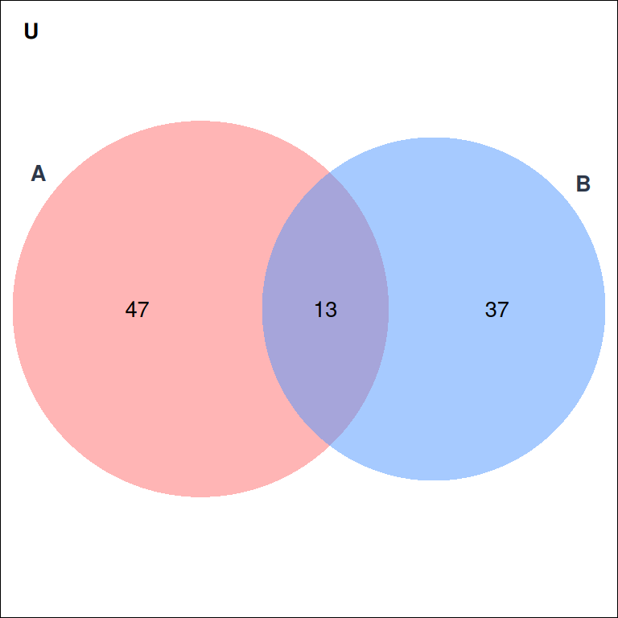
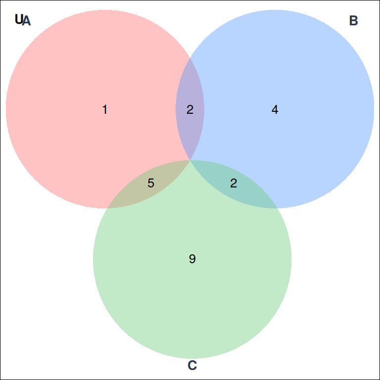
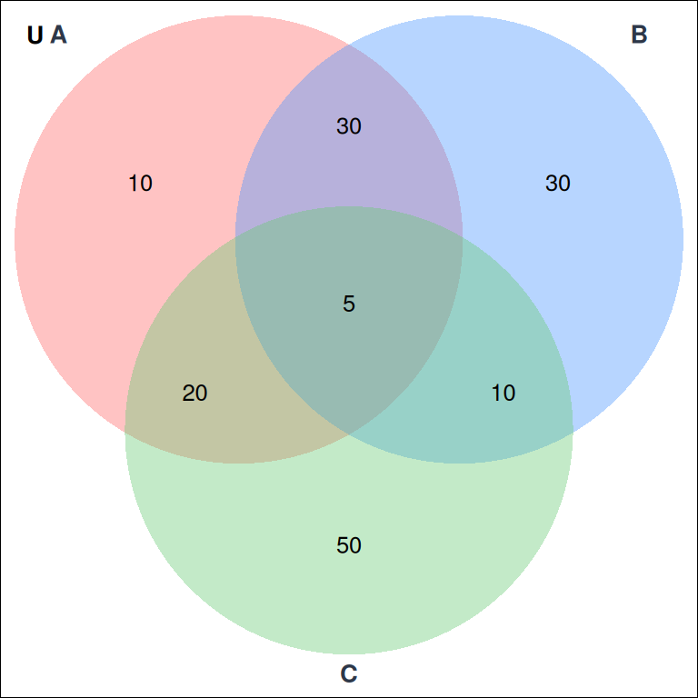
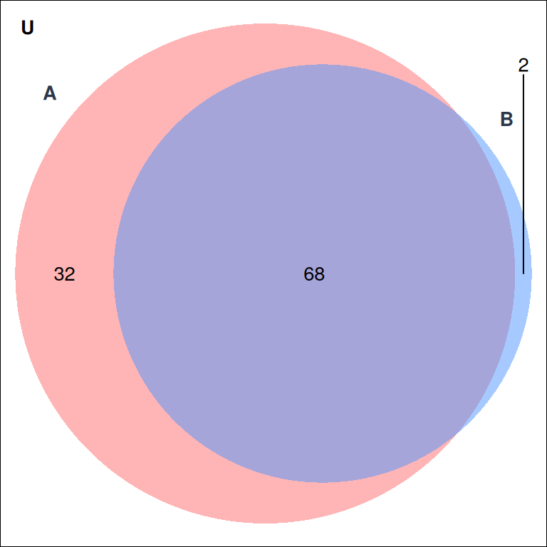
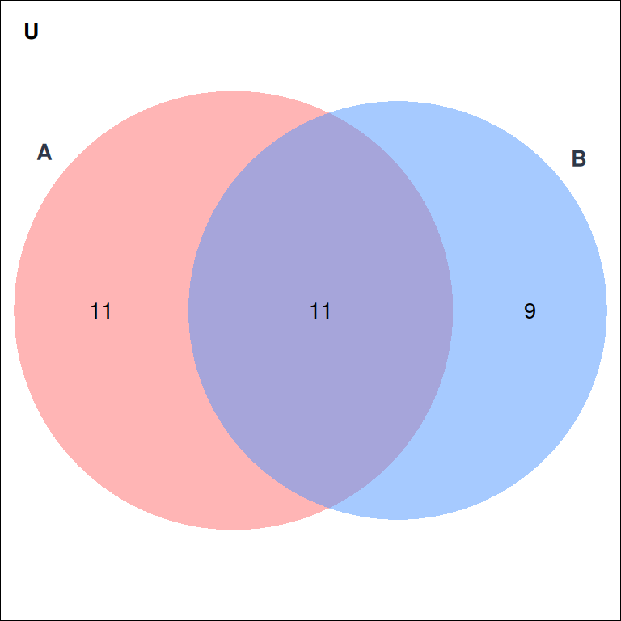
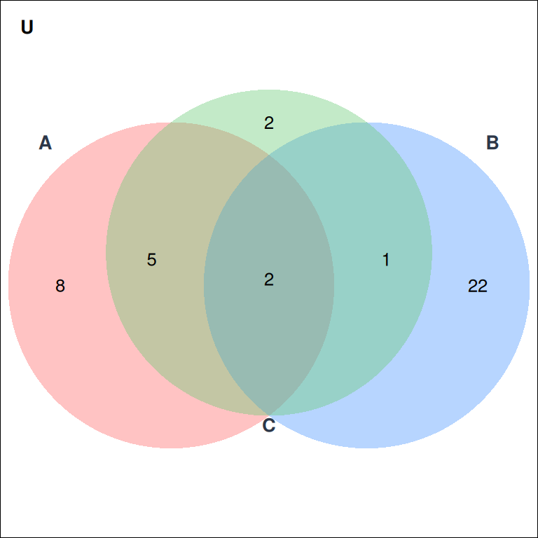
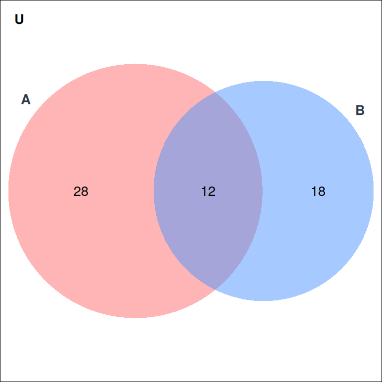
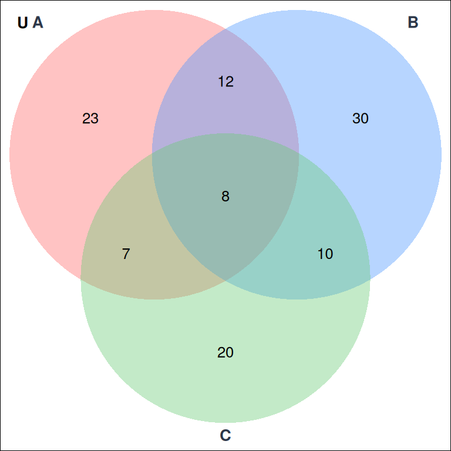

## Conjuntos

# Simulacro Evaluación Uno

(\#fig:conjunto1)Figura

Usando el diagrama de la Figura 1 (donde los números representan el cardinal de cada región o parte del conjunto). Seleccione sólo las afirmaciones correctas:

<label><input type="checkbox" name="q17798443542368764" value="1" data-correct="true" > $\text{Card}(A) = 60$</label>

<label><input type="checkbox" name="q17798443542368764" value="2" data-correct="true" > $\text{Card}(B) = 50$</label>

<label><input type="checkbox" name="q17798443542368764" value="3" data-correct="false" > $\text{Card}(B - A^{c}) = 17$</label>

<label><input type="checkbox" name="q17798443542368764" value="4" data-correct="false" > $\text{Card}(A - B) = 27$</label>

<label><input type="checkbox" name="q17798443542368764" value="5" data-correct="false" > $\text{Card}(B^{c} - A) = 13$</label>

<label><input type="checkbox" name="q17798443542368764" value="6" data-correct="true" > $\text{Card}(B - A) = 37$</label>

<label><input type="checkbox" name="q17798443542368764" value="7" data-correct="false" > $\text{Card}(A \cap B) = 1$</label>

<label><input type="checkbox" name="q17798443542368764" value="8" data-correct="false" > $\text{Card}(A \cup B) = 11$</label>

<label><input type="checkbox" name="q17798443542368764" value="9" data-correct="false" > $\text{Card}(A \cup B \cup C) = 121$</label>

<label><input type="checkbox" name="q17798443542368764" value="10" data-correct="false" > $\text{Card}(A \cap B \cap C) = 21$</label>

<button type="button" class="learnr-submit-btn" onclick="checkLearnrQuestion('q17798443542368764')">Enviar Respuesta</button>

Correcto!

Incorrecto

Intentelo nuevamente

true

(\#fig:conjunto2)Figura

Usando el diagrama de la Figura 2 (donde los números representan el cardinal de cada región o parte del conjunto). Seleccione sólo las afirmaciones correctas:

<label><input type="checkbox" name="q17798443544022260" value="1" data-correct="true" > $\text{Card}(A - B) = 6$</label>

<label><input type="checkbox" name="q17798443544022260" value="2" data-correct="true" > $\text{Card}(B) = 8$</label>

<label><input type="checkbox" name="q17798443544022260" value="3" data-correct="true" > $\text{Card}(A \cap B) = 2$</label>

<label><input type="checkbox" name="q17798443544022260" value="4" data-correct="true" > $\text{Card}(A \cup B) = 14$</label>

<label><input type="checkbox" name="q17798443544022260" value="5" data-correct="false" > $\text{Card}(A \cup B \cup C) = 121$</label>

<label><input type="checkbox" name="q17798443544022260" value="6" data-correct="false" > $\text{Card}(A \cap B \cap C) = 21$</label>

<button type="button" class="learnr-submit-btn" onclick="checkLearnrQuestion('q17798443544022260')">Enviar Respuesta</button>

Correcto!

Incorrecto

Intentelo nuevamente

true

  
  

(\#fig:conjunto3)Figura

Usando el diagrama de la Figura 3 (donde los números representan el cardinal de cada región o parte del conjunto). Seleccione sólo las afirmaciones correctas:

<label><input type="checkbox" name="q17798443545805234" value="1" data-correct="true" > $\text{Card}(A - B) = 30$</label>

<label><input type="checkbox" name="q17798443545805234" value="2" data-correct="false" > $\text{Card}(B) = 15$</label>

<label><input type="checkbox" name="q17798443545805234" value="3" data-correct="true" > $\text{Card}(A \cap B) = 35$</label>

<label><input type="checkbox" name="q17798443545805234" value="4" data-correct="false" > $\text{Card}(A \cup B) = 11$</label>

<label><input type="checkbox" name="q17798443545805234" value="5" data-correct="false" > $\text{Card}(A \cup B \cup C) = 121$</label>

<label><input type="checkbox" name="q17798443545805234" value="6" data-correct="true" > $\text{Card}(A \cap B \cap C) = 5$</label>

<button type="button" class="learnr-submit-btn" onclick="checkLearnrQuestion('q17798443545805234')">Enviar Respuesta</button>

Correcto!

Incorrecto

Intentelo nuevamente

true

(\#fig:conjunto4)Figura

Usando el diagrama de la Figura 4 (donde los números representan el cardinal de cada región o parte del conjunto). Seleccione sólo las afirmaciones correctas:

<label><input type="checkbox" name="q17798443547505511" value="1" data-correct="true" > $\text{Card}(A - B) = 32$</label>

<label><input type="checkbox" name="q17798443547505511" value="2" data-correct="true" > $\text{Card}(B) = 70$</label>

<label><input type="checkbox" name="q17798443547505511" value="3" data-correct="true" > $\text{Card}(A \cap B) = 68$</label>

<label><input type="checkbox" name="q17798443547505511" value="4" data-correct="true" > $\text{Card}(A \cup B) = 102$</label>

<label><input type="checkbox" name="q17798443547505511" value="5" data-correct="false" > $\text{Card}(A \cup B \cup C) = 121$</label>

<label><input type="checkbox" name="q17798443547505511" value="6" data-correct="false" > $\text{Card}(A \cap B \cap C) = 21$</label>

<button type="button" class="learnr-submit-btn" onclick="checkLearnrQuestion('q17798443547505511')">Enviar Respuesta</button>

Correcto!

Incorrecto

Intentelo nuevamente

true

  
  

(\#fig:conjunto5)Figura

Usando el diagrama de la Figura 5 (donde los números representan el cardinal de cada región o parte del conjunto). Seleccione sólo las afirmaciones correctas:

<label><input type="checkbox" name="q17798443549318100" value="1" data-correct="true" > $\text{Card}(A - B) = 30$</label>

<label><input type="checkbox" name="q17798443549318100" value="2" data-correct="true" > $\text{Card}(A) = 65$</label>

<label><input type="checkbox" name="q17798443549318100" value="3" data-correct="true" > $\text{Card}(A \cap B) = 35$</label>

<label><input type="checkbox" name="q17798443549318100" value="4" data-correct="true" > $\text{Card}(A \cup B) = 105$</label>

<label><input type="checkbox" name="q17798443549318100" value="5" data-correct="true" > $\text{Card}(A \cup B \cup C) = 155$</label>

<label><input type="checkbox" name="q17798443549318100" value="6" data-correct="true" > $\text{Card}(A \cap B \cap C) = 5$</label>

<button type="button" class="learnr-submit-btn" onclick="checkLearnrQuestion('q17798443549318100')">Enviar Respuesta</button>

Correcto!

Incorrecto

Intentelo nuevamente

true

(\#fig:conjunto6)Figura

Usando el diagrama de la Figura 6 (donde los números representan el cardinal de cada región o parte del conjunto). Seleccione sólo las afirmaciones correctas:

<label><input type="checkbox" name="q17798443550763332" value="1" data-correct="true" > $\text{Card}(A - B) = 11$</label>

<label><input type="checkbox" name="q17798443550763332" value="2" data-correct="true" > $\text{Card}(B) = 20$</label>

<label><input type="checkbox" name="q17798443550763332" value="3" data-correct="true" > $\text{Card}(A \cap B) = 11$</label>

<label><input type="checkbox" name="q17798443550763332" value="4" data-correct="true" > $\text{Card}(A \cup B) = 31$</label>

<label><input type="checkbox" name="q17798443550763332" value="5" data-correct="false" > $\text{Card}(A \cup B \cup C) = 121$</label>

<label><input type="checkbox" name="q17798443550763332" value="6" data-correct="false" > $\text{Card}(A \cap B \cap C) = 21$</label>

<button type="button" class="learnr-submit-btn" onclick="checkLearnrQuestion('q17798443550763332')">Enviar Respuesta</button>

Correcto!

Incorrecto

Intentelo nuevamente

true

(\#fig:conjunto7)Figura

Usando el diagrama de la Figura 7 (donde los números representan el cardinal de cada región o parte del conjunto). Seleccione sólo las afirmaciones correctas:

<label><input type="checkbox" name="q17798443552376966" value="1" data-correct="true" > $\text{Card}(A - B) = 13$</label>

<label><input type="checkbox" name="q17798443552376966" value="2" data-correct="true" > $\text{Card}(B) = 25$</label>

<label><input type="checkbox" name="q17798443552376966" value="3" data-correct="false" > $\text{Card}(A \cap B) = 1$</label>

<label><input type="checkbox" name="q17798443552376966" value="4" data-correct="true" > $\text{Card}(A \cup B) = 38$</label>

<label><input type="checkbox" name="q17798443552376966" value="5" data-correct="false" > $\text{Card}(A \cup B \cup C) = 121$</label>

<label><input type="checkbox" name="q17798443552376966" value="6" data-correct="false" > $\text{Card}(A \cap B \cap C) = 21$</label>

<button type="button" class="learnr-submit-btn" onclick="checkLearnrQuestion('q17798443552376966')">Enviar Respuesta</button>

Correcto!

Incorrecto

Intentelo nuevamente

true

(\#fig:conjunto8)Figura

Usando el diagrama de la Figura 8 (donde los números representan el cardinal de cada región o parte del conjunto). Seleccione sólo las afirmaciones correctas:

<label><input type="checkbox" name="q17798443553997042" value="1" data-correct="true" > $\text{Card}(A - B) = 28$</label>

<label><input type="checkbox" name="q17798443553997042" value="2" data-correct="true" > $\text{Card}(B - A) = 18$</label>

<label><input type="checkbox" name="q17798443553997042" value="3" data-correct="true" > $\text{Card}(A \cap B^{c}) = 28$</label>

<label><input type="checkbox" name="q17798443553997042" value="4" data-correct="true" > $\text{Card}(A^{c} \cap B) = 18$</label>

<label><input type="checkbox" name="q17798443553997042" value="5" data-correct="true" > $\text{Card}(A \cap B) = 12$</label>

<label><input type="checkbox" name="q17798443553997042" value="6" data-correct="true" > Si el cardinal del conjunto universal es $\text{Card}(U) = 80$, entonces $\text{Card}((A \cup B)^{c}) = 22$</label>

<label><input type="checkbox" name="q17798443553997042" value="7" data-correct="false" > $\text{Card}(A \cup B) = 70$</label>

<label><input type="checkbox" name="q17798443553997042" value="8" data-correct="false" > $\text{Card}(B - A) = 12$</label>

<button type="button" class="learnr-submit-btn" onclick="checkLearnrQuestion('q17798443553997042')">Enviar Respuesta</button>

Correcto!

Incorrecto

Intentelo nuevamente

true

(\#fig:conjunto9)Figura

Usando el diagrama de la Figura 9 (donde los números representan el cardinal de cada región o parte del conjunto). Seleccione sólo las afirmaciones correctas:

<label><input type="checkbox" name="q17798443555935526" value="1" data-correct="true" > $\text{Card}(A - (B \cup C)) = 23$</label>

<label><input type="checkbox" name="q17798443555935526" value="2" data-correct="true" > $\text{Card}((A \cap B) - C) = 12$</label>

<label><input type="checkbox" name="q17798443555935526" value="3" data-correct="true" > $\text{Card}((B \cap C) - A) = 10$</label>

<label><input type="checkbox" name="q17798443555935526" value="4" data-correct="true" > $\text{Card}(A \cup B \cup C) = 110$</label>

<label><input type="checkbox" name="q17798443555935526" value="5" data-correct="true" > Si el cardinal del conjunto universal es $\text{Card}(U) = 130$, entonces $\text{Card}((A \cup B \cup C)^{c}) = 20$</label>

<label><input type="checkbox" name="q17798443555935526" value="6" data-correct="true" > $\text{Card}(A \cap B \cap C) = 8$</label>

<label><input type="checkbox" name="q17798443555935526" value="7" data-correct="false" > $\text{Card}(C - (A \cup B)) = 45$</label>

<label><input type="checkbox" name="q17798443555935526" value="8" data-correct="false" > $\text{Card}((A \cap C) - B) = 15$</label>

<button type="button" class="learnr-submit-btn" onclick="checkLearnrQuestion('q17798443555935526')">Enviar Respuesta</button>

Correcto!

Incorrecto

Intentelo nuevamente

true

## Números Reales

Seleccione sólo las afirmaciones verdaderas

<label><input type="checkbox" name="q17798443556034702" value="1" data-correct="true" > $2>-1$</label>

<label><input type="checkbox" name="q17798443556034702" value="2" data-correct="false" > $-3.5>0$</label>

<label><input type="checkbox" name="q17798443556034702" value="3" data-correct="true" > $2>-10$</label>

<label><input type="checkbox" name="q17798443556034702" value="4" data-correct="true" > $5>0.7$</label>

<label><input type="checkbox" name="q17798443556034702" value="5" data-correct="true" > $-5 < -2$</label>

<label><input type="checkbox" name="q17798443556034702" value="6" data-correct="true" > $0 > -1$</label>

<label><input type="checkbox" name="q17798443556034702" value="7" data-correct="false" > $1/2 > 3/4$</label>

<button type="button" class="learnr-submit-btn" onclick="checkLearnrQuestion('q17798443556034702')">Enviar Respuesta</button>

Correcto!

Incorrecto

Intentelo nuevamente

true

Seleccione sólo las afirmaciones verdaderas

<label><input type="checkbox" name="q17798443556142713" value="1" data-correct="true" > $\dfrac{5}{4} > 1$</label>

<label><input type="checkbox" name="q17798443556142713" value="2" data-correct="false" > $\dfrac{5}{3} > 3$</label>

<label><input type="checkbox" name="q17798443556142713" value="3" data-correct="true" > $\dfrac{2}{4} < 1$</label>

<label><input type="checkbox" name="q17798443556142713" value="4" data-correct="true" > $\dfrac{4}{4} = 1$</label>

<label><input type="checkbox" name="q17798443556142713" value="5" data-correct="true" > $\dfrac{3}{2} > 1$</label>

<label><input type="checkbox" name="q17798443556142713" value="6" data-correct="true" > $\dfrac{7}{8} < 1$</label>

<label><input type="checkbox" name="q17798443556142713" value="7" data-correct="false" > $\dfrac{5}{5} = 0$</label>

<button type="button" class="learnr-submit-btn" onclick="checkLearnrQuestion('q17798443556142713')">Enviar Respuesta</button>

Correcto!

Incorrecto

Intentelo nuevamente

true

Seleccione sólo las afirmaciones verdaderas sobre los resultados de las operaciones

<label><input type="checkbox" name="q17798443556245045" value="1" data-correct="true" > El resultado de $3+4(5)$ es mayor que el de $16-2(5)$</label>

<label><input type="checkbox" name="q17798443556245045" value="2" data-correct="false" > El resultado de $7-4/2$ es menor que el de $3-4(8)$</label>

<label><input type="checkbox" name="q17798443556245045" value="3" data-correct="true" > El resultado de $3+4(5)$ es positivo</label>

<label><input type="checkbox" name="q17798443556245045" value="4" data-correct="true" > El resultado de $3-4(8)$ es negativo</label>

<label><input type="checkbox" name="q17798443556245045" value="5" data-correct="false" > El resultado de $16-2(5)$ es mayor que $10$</label>

<label><input type="checkbox" name="q17798443556245045" value="6" data-correct="true" > El resultado de $7-4/2$ es un número entero</label>

<button type="button" class="learnr-submit-btn" onclick="checkLearnrQuestion('q17798443556245045')">Enviar Respuesta</button>

Correcto!

Incorrecto

Intentelo nuevamente

true

Suponga que $x = -5$. Seleccione sólo las afirmaciones correctas :

<label><input type="checkbox" name="q17798443556387203" value="1" data-correct="false" > $x$ es un número positivo</label>

<label><input type="checkbox" name="q17798443556387203" value="2" data-correct="true" > $x$ es un número entero negativo</label>

<label><input type="checkbox" name="q17798443556387203" value="3" data-correct="true" > $x$ es un número racional</label>

<label><input type="checkbox" name="q17798443556387203" value="4" data-correct="false" > $x$ es un número natural</label>

<label><input type="checkbox" name="q17798443556387203" value="5" data-correct="true" > $x$ es un número real</label>

<label><input type="checkbox" name="q17798443556387203" value="6" data-correct="false" > $x > 0$</label>

<label><input type="checkbox" name="q17798443556387203" value="7" data-correct="true" > $x < -4$</label>

<button type="button" class="learnr-submit-btn" onclick="checkLearnrQuestion('q17798443556387203')">Enviar Respuesta</button>

Correcto!

Incorrecto

Intentelo nuevamente

true

Seleccione sólo las afirmaciones verdaderas sobre los valores absolutos

<label><input type="checkbox" name="q17798443556502286" value="1" data-correct="true" > $|3-4(8)| > |3-4(5)|$</label>

<label><input type="checkbox" name="q17798443556502286" value="2" data-correct="true" > $|16-2(5)| = 6$</label>

<label><input type="checkbox" name="q17798443556502286" value="3" data-correct="true" > $|7-4/2| < |16-2(5)|$</label>

<label><input type="checkbox" name="q17798443556502286" value="4" data-correct="false" > $|3-4(5)| < 10$</label>

<label><input type="checkbox" name="q17798443556502286" value="5" data-correct="false" > $|3-4(8)| = 28$</label>

<label><input type="checkbox" name="q17798443556502286" value="6" data-correct="true" > $|7-4/2| = 5$</label>

<button type="button" class="learnr-submit-btn" onclick="checkLearnrQuestion('q17798443556502286')">Enviar Respuesta</button>

Correcto!

Incorrecto

Intentelo nuevamente

true

Suponga que $x = 4$. Seleccione sólo las afirmaciones correctas :

<label><input type="checkbox" name="q17798443556654623" value="1" data-correct="true" > $x$ es un número positivo</label>

<label><input type="checkbox" name="q17798443556654623" value="2" data-correct="false" > $x$ es un número entero negativo</label>

<label><input type="checkbox" name="q17798443556654623" value="3" data-correct="true" > $x$ es un número racional</label>

<label><input type="checkbox" name="q17798443556654623" value="4" data-correct="true" > $x$ es un número natural</label>

<label><input type="checkbox" name="q17798443556654623" value="5" data-correct="true" > $x$ es un número real</label>

<label><input type="checkbox" name="q17798443556654623" value="6" data-correct="false" > $x < 0$</label>

<label><input type="checkbox" name="q17798443556654623" value="7" data-correct="true" > $x = 2^2$</label>

<button type="button" class="learnr-submit-btn" onclick="checkLearnrQuestion('q17798443556654623')">Enviar Respuesta</button>

Correcto!

Incorrecto

Intentelo nuevamente

true

Seleccione sólo las afirmaciones verdaderas

<label><input type="checkbox" name="q17798443556773377" value="1" data-correct="true" > $-33 < -10$</label>

<label><input type="checkbox" name="q17798443556773377" value="2" data-correct="true" > $-1/2 < -0.11$</label>

<label><input type="checkbox" name="q17798443556773377" value="3" data-correct="true" > $0.03 > 0$</label>

<label><input type="checkbox" name="q17798443556773377" value="4" data-correct="false" > $25 < 10$</label>

<label><input type="checkbox" name="q17798443556773377" value="5" data-correct="true" > $-10$ es un número entero</label>

<label><input type="checkbox" name="q17798443556773377" value="6" data-correct="false" > $33$ es menor que $25$</label>

<button type="button" class="learnr-submit-btn" onclick="checkLearnrQuestion('q17798443556773377')">Enviar Respuesta</button>

Correcto!

Incorrecto

Intentelo nuevamente

true

Seleccione sólo las afirmaciones verdaderas sobre los conjuntos numéricos

<label><input type="checkbox" name="q17798443556895127" value="1" data-correct="true" > Todo número natural es un número entero</label>

<label><input type="checkbox" name="q17798443556895127" value="2" data-correct="true" > Todo número racional es un número real</label>

<label><input type="checkbox" name="q17798443556895127" value="3" data-correct="true" > Los números complejos contienen a los reales</label>

<label><input type="checkbox" name="q17798443556895127" value="4" data-correct="true" > El conjunto de los enteros contiene a los naturales con el cero</label>

<label><input type="checkbox" name="q17798443556895127" value="5" data-correct="false" > Los números naturales contienen al cero</label>

<label><input type="checkbox" name="q17798443556895127" value="6" data-correct="false" > Los números reales no contienen a los racionales</label>

<button type="button" class="learnr-submit-btn" onclick="checkLearnrQuestion('q17798443556895127')">Enviar Respuesta</button>

Correcto!

Incorrecto

Intentelo nuevamente

true

Seleccione sólo las afirmaciones verdaderas

<label><input type="checkbox" name="q17798443557002393" value="1" data-correct="true" > $-22/2 < -11/2$</label>

<label><input type="checkbox" name="q17798443557002393" value="2" data-correct="true" > $-7/2 = -3.5$</label>

<label><input type="checkbox" name="q17798443557002393" value="3" data-correct="true" > $6/2 > -1/2$</label>

<label><input type="checkbox" name="q17798443557002393" value="4" data-correct="false" > $10/2 = 4$</label>

<label><input type="checkbox" name="q17798443557002393" value="5" data-correct="true" > $26/2$ es un número entero positivo</label>

<label><input type="checkbox" name="q17798443557002393" value="6" data-correct="false" > $30/2 < 10$</label>

<button type="button" class="learnr-submit-btn" onclick="checkLearnrQuestion('q17798443557002393')">Enviar Respuesta</button>

Correcto!

Incorrecto

Intentelo nuevamente

true

Suponga que $x<0$ y $y>0$. Seleccione sólo las afirmaciones correctas

<label><input type="checkbox" name="q17798443557153514" value="1" data-correct="true" > $xy$ es un número negativo</label>

<label><input type="checkbox" name="q17798443557153514" value="2" data-correct="true" > $(y-x)y$ es un número positivo</label>

<label><input type="checkbox" name="q17798443557153514" value="3" data-correct="false" > $x^2y$ es un número negativo</label>

<label><input type="checkbox" name="q17798443557153514" value="4" data-correct="true" > $xy^2$ es un número negativo</label>

<label><input type="checkbox" name="q17798443557153514" value="5" data-correct="true" > $y-x$ es un número positivo</label>

<label><input type="checkbox" name="q17798443557153514" value="6" data-correct="true" > $\dfrac{x}{y}$ es un número negativo</label>

<label><input type="checkbox" name="q17798443557153514" value="7" data-correct="true" > $\dfrac{x}{y}+x$ es un número negativo</label>

<label><input type="checkbox" name="q17798443557153514" value="8" data-correct="true" > $\dfrac{y-x}{xy}$ es un número negativo</label>

<label><input type="checkbox" name="q17798443557153514" value="9" data-correct="true" > $\dfrac{y-x}{x^2y}$ es un número positivo</label>

<button type="button" class="learnr-submit-btn" onclick="checkLearnrQuestion('q17798443557153514')">Enviar Respuesta</button>

Correcto!

Incorrecto

Intentelo nuevamente

true

## Desigualdades

<a href="https://johnjairoshiny.shinyapps.io/DESIGUALDADV3/" target="_blank" style="display:inline-block;padding:12px 24px;background:#2563eb;color:#fff;text-decoration:none;border-radius:8px;font-weight:600;">▶️ Abrir aplicación: Desigualdades Interactivas</a>

Suponga la inecuación $$\dfrac{2x+1}{8}<\dfrac{3x-4}{3} .$$ Seleccione sólo las afirmaciones correctas para la inecuación :

<label><input type="checkbox" name="q17798443557374764" value="1" data-correct="false" > $x=-2$ es solución de la inecuación</label>

<label><input type="checkbox" name="q17798443557374764" value="2" data-correct="true" > $x=3$ es solución de la inecuación</label>

<label><input type="checkbox" name="q17798443557374764" value="3" data-correct="true" > $x=0$ no es solución de la inecuación</label>

<label><input type="checkbox" name="q17798443557374764" value="4" data-correct="true" > $x=1.8$ no es solución de la inecuación</label>

<label><input type="checkbox" name="q17798443557374764" value="5" data-correct="true" > $x=4$ es solución de la inecuación</label>

<label><input type="checkbox" name="q17798443557374764" value="6" data-correct="true" > $x=7$ es solución de la inecuación</label>

<label><input type="checkbox" name="q17798443557374764" value="7" data-correct="true" > $\dfrac{5}{4}$ no es solución de la inecuación</label>

<label><input type="checkbox" name="q17798443557374764" value="8" data-correct="false" > $\dfrac{3}{2}$ es solución de la inecuación</label>

<label><input type="checkbox" name="q17798443557374764" value="9" data-correct="true" > Los $x \in \ \left( \dfrac{35}{18},+\infty \right)$ son solución de la inecuación </label>

<label><input type="checkbox" name="q17798443557374764" value="10" data-correct="true" > Los $x \in \ \left(-\infty,\dfrac{35}{18} \right)$ no son solución de la inecuación </label>

<button type="button" class="learnr-submit-btn" onclick="checkLearnrQuestion('q17798443557374764')">Enviar Respuesta</button>

Correcto!

Incorrecto

Intentelo nuevamente

true

Suponga la inecuación $$5x-4<12. $$ Seleccione sólo las afirmaciones correctas para la inecuación :

<label><input type="checkbox" name="q17798443557484414" value="1" data-correct="true" > $x=-2$ es solución de la inecuación</label>

<label><input type="checkbox" name="q17798443557484414" value="2" data-correct="true" > $x=3$ es solución de la inecuación</label>

<label><input type="checkbox" name="q17798443557484414" value="3" data-correct="true" > $x=0$ es solución de la inecuación</label>

<label><input type="checkbox" name="q17798443557484414" value="4" data-correct="true" > $x=1.8$ es solución de la inecuación</label>

<label><input type="checkbox" name="q17798443557484414" value="5" data-correct="true" > $x=4$ no es solución de la inecuación</label>

<label><input type="checkbox" name="q17798443557484414" value="6" data-correct="true" > $x=7$ no es solución de la inecuación</label>

<label><input type="checkbox" name="q17798443557484414" value="7" data-correct="true" > $\dfrac{5}{4}$ es solución de la inecuación</label>

<label><input type="checkbox" name="q17798443557484414" value="8" data-correct="true" > Los $x \in \ \left(-\infty,\dfrac{16}{5} \right)$ son solución de la inecuación </label>

<label><input type="checkbox" name="q17798443557484414" value="9" data-correct="true" > Los $x \in \ \left( \dfrac{16}{5},+\infty \right)$ no son solución de la inecuación </label>

<label><input type="checkbox" name="q17798443557484414" value="10" data-correct="true" > $\dfrac{3}{2}$ es solución de la inecuación</label>

<button type="button" class="learnr-submit-btn" onclick="checkLearnrQuestion('q17798443557484414')">Enviar Respuesta</button>

Correcto!

Incorrecto

Intentelo nuevamente

true

Suponga que el conjunto solución de una inecuación  es: 

$$x \in \ \left(-\infty,-2 \right). $$ 

Seleccione sólo las afirmaciones correctas:

<label><input type="checkbox" name="q17798443557614541" value="1" data-correct="true" > $x < -2$ es representación del conjunto solución</label>

<label><input type="checkbox" name="q17798443557614541" value="2" data-correct="true" > $-2x>4$ es representación del conjunto solución</label>

<label><input type="checkbox" name="q17798443557614541" value="3" data-correct="true" > $8< -4x$ es representación del conjunto solución</label>

<label><input type="checkbox" name="q17798443557614541" value="4" data-correct="true" > $-2 > x$ es representación del conjunto solución</label>

<label><input type="checkbox" name="q17798443557614541" value="5" data-correct="true" > $-x < 2$ no es representación del conjunto solución</label>

<label><input type="checkbox" name="q17798443557614541" value="6" data-correct="true" > $3x < -6$ es representación del conjunto solución</label>

<label><input type="checkbox" name="q17798443557614541" value="7" data-correct="true" > $\dfrac{5}{4}$ no está en el conjunto solución</label>

<label><input type="checkbox" name="q17798443557614541" value="8" data-correct="true" > Los $x \in \ \left(-\infty,\dfrac{-16}{8} \right)$ están contenidos en el conjunto solución</label>

<label><input type="checkbox" name="q17798443557614541" value="9" data-correct="true" > $\dfrac{3}{2}$ no está en el conjunto solución</label>

<button type="button" class="learnr-submit-btn" onclick="checkLearnrQuestion('q17798443557614541')">Enviar Respuesta</button>

Correcto!

Incorrecto

Intentelo nuevamente

true

Suponga la inecuación $$3x-8<5x+5. $$ Seleccione sólo las afirmaciones correctas para la inecuación :

<label><input type="checkbox" name="q17798443557725107" value="1" data-correct="true" > $x=-2$ es solución de la inecuación</label>

<label><input type="checkbox" name="q17798443557725107" value="2" data-correct="true" > $x=3$ es solución de la inecuación</label>

<label><input type="checkbox" name="q17798443557725107" value="3" data-correct="true" > $x=0$ es solución de la inecuación</label>

<label><input type="checkbox" name="q17798443557725107" value="4" data-correct="false" > $x=-18$ es solución de la inecuación</label>

<label><input type="checkbox" name="q17798443557725107" value="5" data-correct="false" > $x=4$ no es solución de la inecuación</label>

<label><input type="checkbox" name="q17798443557725107" value="6" data-correct="false" > $x=7$ no es solución de la inecuación</label>

<label><input type="checkbox" name="q17798443557725107" value="7" data-correct="true" > $\dfrac{5}{4}$ es solución de la inecuación</label>

<label><input type="checkbox" name="q17798443557725107" value="8" data-correct="false" > Los $x \in \ \left(-\infty,\dfrac{16}{5} \right)$ son solución de la inecuación </label>

<label><input type="checkbox" name="q17798443557725107" value="9" data-correct="true" > Los $x \in \ \left( \dfrac{16}{5},+\infty \right)$ son solución de la inecuación </label>

<label><input type="checkbox" name="q17798443557725107" value="10" data-correct="true" > Los $x \in \ \left( \dfrac{-13}{2},+\infty \right)$ son solución de la inecuación </label>

<label><input type="checkbox" name="q17798443557725107" value="11" data-correct="true" > $\dfrac{3}{2}$ es solución de la inecuación</label>

<button type="button" class="learnr-submit-btn" onclick="checkLearnrQuestion('q17798443557725107')">Enviar Respuesta</button>

Correcto!

Incorrecto

Intentelo nuevamente

true

Suponga la inecuación $$-1<1-2x<3. $$ Seleccione sólo las afirmaciones correctas para la inecuación :

<label><input type="checkbox" name="q17798443557879550" value="1" data-correct="false" > $x=-2$ es solución de la inecuación</label>

<label><input type="checkbox" name="q17798443557879550" value="2" data-correct="false" > $x=3$ es solución de la inecuación</label>

<label><input type="checkbox" name="q17798443557879550" value="3" data-correct="true" > $x=0$ es solución de la inecuación</label>

<label><input type="checkbox" name="q17798443557879550" value="4" data-correct="false" > $x=-1$ es solución de la inecuación</label>

<label><input type="checkbox" name="q17798443557879550" value="5" data-correct="false" > $x=4$ es solución de la inecuación</label>

<label><input type="checkbox" name="q17798443557879550" value="6" data-correct="false" > $x=7$ es solución de la inecuación</label>

<label><input type="checkbox" name="q17798443557879550" value="7" data-correct="true" > $\dfrac{5}{6}$ es solución de la inecuación</label>

<label><input type="checkbox" name="q17798443557879550" value="8" data-correct="true" > Los $x \in \ \left(-1,1 \right)$ son solución de la inecuación</label>

<label><input type="checkbox" name="q17798443557879550" value="9" data-correct="true" > Los $x \in \ \left( 1,+\infty \right)$ no son solución de la inecuación </label>

<label><input type="checkbox" name="q17798443557879550" value="10" data-correct="true" > Los $x \in \ \left( -\infty , -1\right)$ no son solución de la inecuación </label>

<label><input type="checkbox" name="q17798443557879550" value="11" data-correct="true" > $\dfrac{3}{2}$ no es solución de la inecuación</label>

<button type="button" class="learnr-submit-btn" onclick="checkLearnrQuestion('q17798443557879550')">Enviar Respuesta</button>

Correcto!

Incorrecto

Intentelo nuevamente

true

Suponga la inecuación $$-7<2x+1<19. $$ Seleccione sólo las afirmaciones correctas para la inecuación :

<label><input type="checkbox" name="q17798443557983167" value="1" data-correct="false" > $x=-12$ es solución de la inecuación</label>

<label><input type="checkbox" name="q17798443557983167" value="2" data-correct="false" > $x=9$ es solución de la inecuación</label>

<label><input type="checkbox" name="q17798443557983167" value="3" data-correct="false" > $x=-4$ es solución de la inecuación</label>

<label><input type="checkbox" name="q17798443557983167" value="4" data-correct="false" > $x=-14$ es solución de la inecuación</label>

<label><input type="checkbox" name="q17798443557983167" value="5" data-correct="false" > $x=14$ es solución de la inecuación</label>

<label><input type="checkbox" name="q17798443557983167" value="6" data-correct="false" > $x=27$ es solución de la inecuación</label>

<label><input type="checkbox" name="q17798443557983167" value="7" data-correct="true" > $\dfrac{5}{6}$ es solución de la inecuación</label>

<label><input type="checkbox" name="q17798443557983167" value="8" data-correct="false" > Los $x \in \ \left[-4,9 \right)$ son solución de la inecuación</label>

<label><input type="checkbox" name="q17798443557983167" value="9" data-correct="true" > Los $x \in \ \left( 9,+\infty \right)$ no son solución de la inecuación </label>

<label><input type="checkbox" name="q17798443557983167" value="10" data-correct="true" > Los $x \in \ \left( -\infty , -4\right)$ no son solución de la inecuación </label>

<label><input type="checkbox" name="q17798443557983167" value="11" data-correct="false" > $\dfrac{3}{2}$ no es solución de la inecuación</label>

<button type="button" class="learnr-submit-btn" onclick="checkLearnrQuestion('q17798443557983167')">Enviar Respuesta</button>

Correcto!

Incorrecto

Intentelo nuevamente

true

Suponga la inecuación $$8x+4<16+5x. $$ Seleccione sólo las afirmaciones correctas para la inecuación :

<label><input type="checkbox" name="q17798443558105255" value="1" data-correct="true" > $x=-1.2$ es solución de la inecuación</label>

<label><input type="checkbox" name="q17798443558105255" value="2" data-correct="false" > $x=9$ es solución de la inecuación</label>

<label><input type="checkbox" name="q17798443558105255" value="3" data-correct="true" > $x=-4$ es solución de la inecuación</label>

<label><input type="checkbox" name="q17798443558105255" value="4" data-correct="true" > $x=-14$ es solución de la inecuación</label>

<label><input type="checkbox" name="q17798443558105255" value="5" data-correct="false" > $x=14$ es solución de la inecuación</label>

<label><input type="checkbox" name="q17798443558105255" value="6" data-correct="false" > $x=27$ es solución de la inecuación</label>

<label><input type="checkbox" name="q17798443558105255" value="7" data-correct="true" > $\dfrac{5}{6}$ es solución de la inecuación</label>

<label><input type="checkbox" name="q17798443558105255" value="8" data-correct="true" > Los $x \in \ \left[4,9 \right)$ no son solución de la inecuación</label>

<label><input type="checkbox" name="q17798443558105255" value="9" data-correct="true" > Los $x \in \ \left[4,+\infty \right)$ no son solución de la inecuación </label>

<label><input type="checkbox" name="q17798443558105255" value="10" data-correct="true" > Los $x \in \ \left( -\infty , 4\right)$ son solución de la inecuación </label>

<label><input type="checkbox" name="q17798443558105255" value="11" data-correct="true" > $\dfrac{3}{2}$ es solución de la inecuación</label>

<button type="button" class="learnr-submit-btn" onclick="checkLearnrQuestion('q17798443558105255')">Enviar Respuesta</button>

Correcto!

Incorrecto

Intentelo nuevamente

true

## Mi Progreso y Calificación

<button type="button" class="learnr-submit-btn" style="margin-bottom:1rem;" onclick="showScoreReport('sr17798443558373050', 26, '<strong>¡Espectacular!</strong> Tienes un dominio sobresaliente de conjuntos, números reales y desigualdades. Comprendes con claridad los diagramas de Venn, la clasificación numérica y la resolución de inecuaciones. ¡Estás listo para el examen real!', '<strong>¡Buen trabajo!</strong> Tienes una base sólida, pero necesitas reforzar algunos conceptos. Revisa con atención los diagramas de Venn, las operaciones entre conjuntos y el manejo de intervalos en desigualdades. Practica un poco más antes del examen.', '<strong>Necesitas reforzar los fundamentos.</strong> Te recomendamos repasar las operaciones con conjuntos, la clasificación de los números reales y las técnicas básicas de resolución de desigualdades. Consulta los materiales de apoyo y vuelve a intentarlo.')">Calcular Mis Resultados</button>

